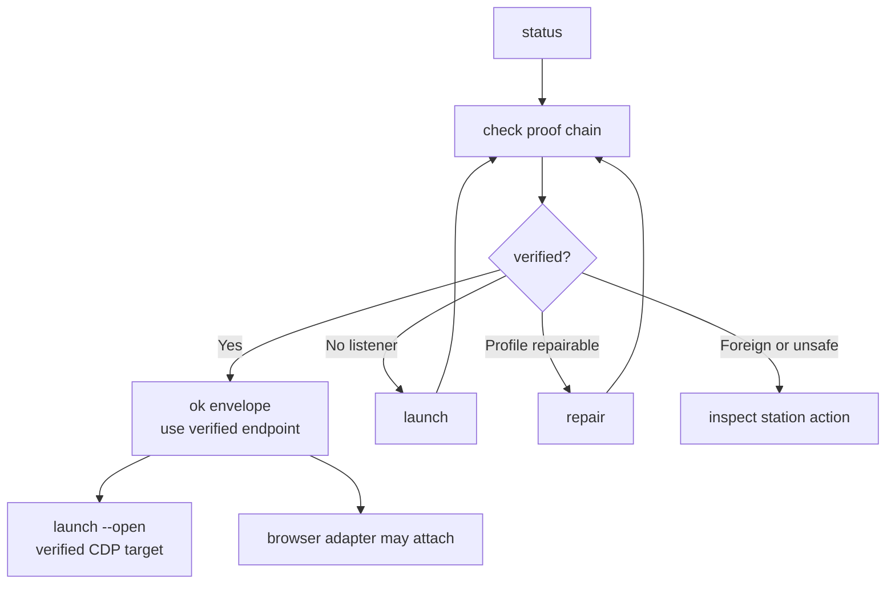

# warm-chrome

`warm-chrome` proves browser-entry readiness before any browser adapter acts.
It verifies a real headed Google Chrome on a dedicated persistent profile,
numeric-loopback CDP, browser-level websocket, listener/profile/port
consistency, and endpoint authority.

Failure is a canonical station with a repair path. Command envelopes are
evidence, not browser-control permission.

## What It Does

- Proves the current Warm Chrome endpoint through `check`.
- Renders human posture through `status`.
- Starts Chrome through `launch` only after no-spawn guards pass.
- Creates and verifies a new tab through the proof-returned Browser websocket
  with `launch --open`, then re-proves the Browser.
- Repairs dedicated-profile proof state through `repair`.
- Provisions the generated Agent Chrome artwork into a dedicated local avatar
  slot; treats browser-rendered visual proof as the acceptance authority.
- Emits facade-backed JSON envelopes for agents.
- Keeps station ids, reason unions, flags, and result contracts in code.

## Start Here

Run the source-linked package bin when linked:

```bash
warm-chrome status
warm-chrome check --json
```

Run the direct source runner in repo-local environments:

```bash
bun run runtime/warm-chrome/src/cli.ts status
bun run runtime/warm-chrome/src/cli.ts check --json
```

Inspect help:

```bash
bun run runtime/warm-chrome/src/cli.ts --help
bun run runtime/warm-chrome/src/cli.ts launch --help
```

Read shared language before interpreting station terms:

- [CONTEXT.md](./CONTEXT.md)

For package maintenance, see [AGENTS.md](./AGENTS.md). For architecture and
module ownership, see [ARCHITECTURE.md](./ARCHITECTURE.md).

## Loop Shape



The ok envelope is the only endpoint authority. Consumers take its verified
endpoint and browser-level websocket URL verbatim; they do not derive either
from the `9222` convention.

## CLI Commands

| Command | Output | Posture | Mutation |
| --- | --- | --- | --- |
| `check` | JSON default, plain available | Agent proof chain | read-only |
| `status` | plain default, JSON available | Human alias of `check` | read-only |
| `launch` | JSON/plain | Spawn plus verify; optional verified open | may write browser state |
| `repair` | JSON/plain | Profile proof repair plus verify | may write profile proof state |

`repair --profile-only` is the browser-free exception. It requires an explicit
profile path, runs without the browser-entry proof chain or a CDP listener, and
returns no endpoint authority. It checks `SingletonLock` liveness and refuses
while a live Chrome holds the profile. It writes only policy-clean profile state
after filesystem, ownership, saved-login, and symlink checks. That state names
the visible profile `Agent Chrome` and disables Chrome credential capture. Any
unproven or unsafe condition fails closed with a typed refusal and manual step.

`launch` selects Chrome's `Default` profile directory explicitly. The product
default is
`~/Library/Application Support/Agent Chrome/Chrome User Data`. Profile-only
provisioning persists the visible `Agent Chrome` name. `launch --open` creates
one `chrome://newtab/` target through the verbatim browser-level websocket,
verifies the returned target id, then re-proves the same endpoint and profile.

`app/agent-chrome.swift` is the agent launcher source. `agent-chrome-install`
builds, verifies, and installs two labelled actions as one transaction:
`~/Applications/Agent Chrome.app` and
`~/Applications/Everyday Chrome.app`. The Agent action is self-contained with
an embedded compiled Warm Chrome helper, profile-avatar helper, and generated
artwork. The Everyday action is human-only: it asks Launch Services for regular
Google Chrome without profile, CDP, or adapter arguments. Neither app
has a repository or Bun runtime dependency. Owned rollback copies live under
`~/Library/Application Support/Agent Chrome/Installer Backups/` with a
non-`.app` suffix so Launch Services cannot discover an obsolete production
bundle. Before cold browser entry, Agent Chrome converges the generated image
as a dedicated local GAIA avatar while the profile is stopped. A browser-level
Google sign-in preserves the account photo and continues without replacing it.
On 2026-08-14, Chrome `151.0.7922.137` rendered the generated image in the exact
Agent Chrome toolbar and profile menu as observed validation evidence. Chrome
then cleared the backing GAIA filename while retaining
the rendered session image, so the launcher reapplies it before each cold start
and accepts matching branding metadata during healthy live reuse. File checks
remain preparation evidence only. The launcher then
activates only the proof-returned Browser pid and verifies that pid became the
macOS foreground application. A cold start uses macOS Launch Services instead
of making Agent Chrome the parent and responsible process for the long-running
Google Chrome instance.

Both labelled actions still launch Google's signed Chrome bundle. The Agent
Chrome wrapper does not change the Browser process bundle identifier. Everyday
Chrome is therefore a reliable human shortcut and crossover check, not global
Finder, Dock, or external-link isolation. A distinct Chrome-family bundle is a
separate product experiment.

`agent-chrome-profile-migrate` previews or performs the fixed preserving move
from legacy `~/.agent-warm-profile`. It requires the Browser stopped, refuses an
existing destination, stages and verifies metadata, atomically promotes the
copy, and retains the legacy profile unchanged for rollback. It never accepts
an Everyday Chrome path. Browser Connect still consumes Warm Chrome proof and
injects only the verified endpoint into declared adapter routes.

No-arg `warm-chrome` shows help. `warm-chrome help [command]` renders the same
help as `--help`.

```bash
# Agent proof
bun run runtime/warm-chrome/src/cli.ts check --json

# Human posture
bun run runtime/warm-chrome/src/cli.ts status

# Lifecycle
bun run runtime/warm-chrome/src/cli.ts launch --json
bun run runtime/warm-chrome/src/cli.ts launch --open --json
bun run runtime/warm-chrome/src/cli.ts repair --json
bun run runtime/warm-chrome/src/cli.ts repair --profile-only --profile /absolute/dedicated-profile --json

# Preview and apply the preserving profile migration
bun run runtime/warm-chrome/app/migrate-profile.ts --check --json
bun run runtime/warm-chrome/app/migrate-profile.ts --apply --json

# Preview and install the paired labelled launch actions
bun run runtime/warm-chrome/app/install.ts --check --json
bun run runtime/warm-chrome/app/install.ts --apply --json

# Preview or apply the generated profile avatar while Agent Chrome is stopped
bun run runtime/warm-chrome/app/profile-avatar.ts --check --profile "$HOME/Library/Application Support/Agent Chrome/Chrome User Data" --avatar "$PWD/runtime/warm-chrome/app/assets/agent-chrome-icon.png" --json
bun run runtime/warm-chrome/app/profile-avatar.ts --apply --profile "$HOME/Library/Application Support/Agent Chrome/Chrome User Data" --avatar "$PWD/runtime/warm-chrome/app/assets/agent-chrome-icon.png" --json

# Discovery
bun run runtime/warm-chrome/src/cli.ts help check
bun run runtime/warm-chrome/src/cli.ts help repair
```

Browser-entry failures exit `20` and carry the `no_adapter_fallback`
continuation constraint. Baseline exits stay facade-owned: `0` verified, `1`
runtime failure, `2` invalid usage.

## Inputs

- `--port`: CDP port. Mutually exclusive with `--endpoint`.
- `--endpoint`: numeric loopback endpoint, `http://127.0.0.1:<port>`.
- `--profile`: dedicated profile. `check` and `status` verify it. `launch`
  may create or chmod it. `repair` may create, chmod, or rewrite proof state
  inside it.
- `--chrome`: `launch` only; accepted binary path is
  `/Applications/Google Chrome.app/Contents/MacOS/Google Chrome`.
- `--open`: `launch` only; create and verify a new tab through the
  proof-returned Browser websocket, then re-prove it. The native app separately
  proves exact-pid foreground activation.
- Global diagnostics: `--run-id`, `--quiet`, `--verbose`, `--debug`.

Environment fallbacks: `WARM_CHROME_CDP_PORT`, `WARM_CHROME_PROFILE_DIR`,
`WARM_CHROME_RUN_ID`, and `CHROME_BIN` (`launch` only).

Flags win over environment. `--endpoint` accepts only numeric loopback
`http://127.0.0.1:<port>`.

## Files

Per-module owners live in [ARCHITECTURE.md](./ARCHITECTURE.md) Module Map.
Package docs: [AGENTS.md](./AGENTS.md) maintenance routing,
[CONTEXT.md](./CONTEXT.md) vocabulary, [TASKS.md](./TASKS.md) active work,
and [TASKS.archive.md](./TASKS.archive.md) closed task detail.

Warm Chrome owns Browser proof and verified target creation. Browser Connect
consumes that proof when connecting external adapters; the native launcher does
not connect an adapter. The legacy browser-use delegator is deleted (migration
cleanup U5/KTD6).

## Authority

- Charter:
  `docs/decisions/2026-07-03-warm-chrome-runtime-package-definition.md`
- Runtime contract:
  `docs/adr/0009-browser-use-fixed-cdp-convention-and-runtime-proof.md`
- Plan:
  `docs/plans/2026-07-03-001-feat-warm-chrome-runtime-package-plan.md`
- Research:
  `skills/browser-use/docs/research/2026-07-03-warm-chrome-cdp-gotchas-and-port-policy.md`
- In-process consumer: `runtime/browser-connect`

## Safety Rules

- Treat `check` and `status` as read-only proof.
- Trust only the ok envelope for endpoint authority.
- Route on station action, not on `data.reason`.
- Do not switch adapters after exit `20`.
- Do not terminate a listener unless proof verified it as Warm Chrome.
- Keep foreign-listener diagnostics to pid and process basename.
- Preview lifecycle posture with `check` before `launch` or `repair`.
- Keep `Agent Chrome.app` self-contained but policy-thin: embedded Warm Chrome
  owns proof and target creation; native code owns exact-pid activation only.
- Cold-launch installed Agent Chrome instances through the embedded Launch
  Services helper; never require Agent Chrome App Management permission.
- Preview migration and installation before applying either writer.
- Apply profile-avatar candidates only to the exact dedicated path while
  stopped; preserve a browser-level Google account photo; require cold-start
  visual proof before claiming the toolbar avatar changed.
- When the exact profile is already running, accept reuse only when its profile
  metadata still proves Agent Chrome branding; never rewrite the live profile.
- Never judge Agent Chrome identity through bundle id `com.google.Chrome`
  alone. Everyday Chrome shares it. Bind UI evidence to the proof-returned pid,
  exact profile, and a known target.
- Preserve the legacy profile for rollback and refuse every Everyday Chrome
  path.
- Route browser entry through `runtime/browser-connect` and the Verified
  Handoff Envelope; keep proof behavior in this package.

## Develop

Run package tests:

```bash
skills/test-runner/src/test-runner.sh run -- runtime/warm-chrome/tests/
```

Run typecheck:

```bash
bun --filter @side-quest/warm-chrome typecheck
```

After command or station changes, prove discovery metadata, rendered help,
parser behavior, runtime semantics, station evidence, and parity output.
