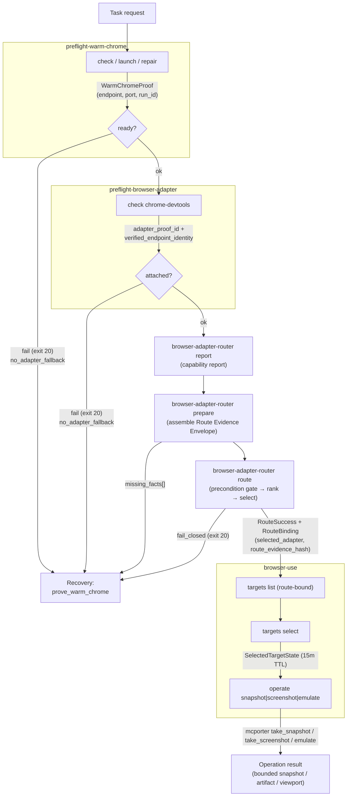
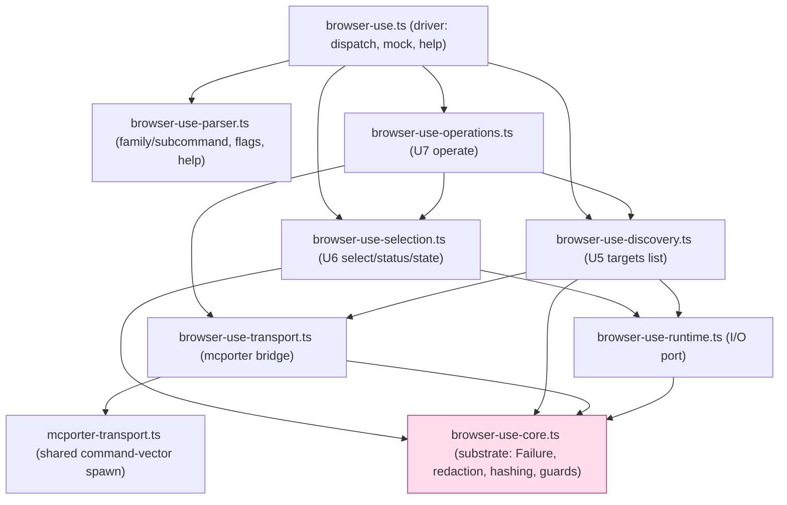
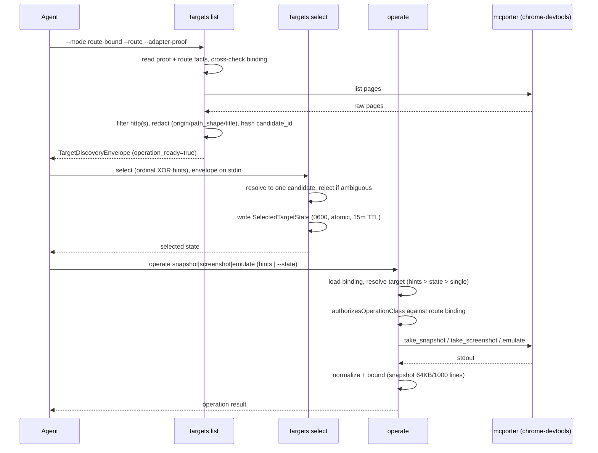

# browser-use — Product Baseline

> **Historical (2026-07-16):** this snapshot predates the browser-use →
> browser-connect migration. The Warm Chrome proof / Adapter Proof / Adapter
> Router chain it describes was deleted (PRs #237/#239); session entry is now
> the Verified Handoff Envelope from `browser-connect connect --json`. Current
> truth: `skills/browser-use/SKILL.md` and `runtime/browser-connect/`.
> Decision log: `docs/decisions/2026-07-16-001-browser-use-migration-cleanup-decision-log.md`.

Reverse-engineered snapshot dated 2026-06-10. Descriptive, not prescriptive: records what the code and docs say today, not what the product should become.

**What this is.** `browser-use` is agent-driven browser automation through a real "Warm Chrome" instance, with evidence-first adapter routing, target discovery/selection, and page operations. A task flows through four CLI subsystems — Warm Chrome proof, Adapter Proof, Adapter Router, then the `browser-use` operate front door — each gating the next on freshly proven evidence before any browser action runs. The shipped operator surface is snapshot (DOM), screenshot (pixels), and viewport emulation, scoped to a single selected page and bound to a verified loopback Chrome DevTools Protocol (CDP) endpoint.

---

## Product scope

**Problem solved**

- Let an agent drive a real, logged-in Google Chrome without stomping the user's everyday profile or falling back to a throwaway browser.
- Make every browser action provably bound to a verified endpoint, a proven adapter, and one selected page — fail closed rather than guess.
- Keep page identity privacy-safe in JSON/logs (no raw URLs, query strings, page ids, session ids, WebSocket URLs).

**In scope (MVP, shipped)**

- Warm Chrome lifecycle: check, repair, launch, status over loopback CDP (port 9222 convention), macOS only.
- Adapter Proof for `chrome-devtools` via mcporter transport.
- Evidence-first Adapter Router: `prepare`, `route`, `report` (pure evaluation, no probing).
- Target discovery (recovery + route-bound modes), target selection with run-scoped state, and operations: `snapshot`, `screenshot`, `emulate`.
- 8-module acyclic CLI core (split from a 4,449-line monolith).

**Explicitly deferred / out of scope**

- `RecoveryCatalogue` shared module (diagnostic-code→action→section→severity lookup): promised in decision log, not implemented.
- `agent-browser` and `playwright-cdp` adapters: registered in the Router registry but not provable/mapped/selectable; only `chrome-devtools` is provable today.
- Prepare orchestration: `prepare` does not run preflight/report/proof internally; MVP requires pre-supplied envelopes.
- V2 operation coverage: click, type, selector actions, network/console inspection, performance operations.
- V2 native MCP transport: operations use the mcporter CLI only; native MCP dispatch deferred until parity proven.
- Tape format (record-replay): researched but owned by a separate `browser-domain-memory` skill, not this product.
- Same-domain multi-identity: concurrent agents on one domain share cookies (no per-run BrowserContext isolation); out of scope.
- Windows/Linux: macOS (`darwin`) only; non-macOS exits with code 1, recoverability `none`.

---

## What's built (capability inventory)

Maturity tags: **shipped** (code + tests present), **partial** (works but a declared facet is missing), **planned-not-shipped** (named in contract/docs, no executor), **stale** (a reader's claim that the code now contradicts).

### Warm Chrome preflight (`preflight-warm-chrome`)

Proves real Google Chrome is running on a dedicated persistent profile via loopback CDP, enforces strict Warm Chrome invariants, and emits proof envelopes with continuation guidance.

Ownership note (switchover closed 2026-07-04): `preflight-warm-chrome` is now a
thin delegator (`skills/browser-use/src/preflight-warm-chrome.ts`) to
`@side-quest/warm-chrome`'s `main()`. The capabilities below ship in the package
(`runtime/warm-chrome`); per-line detail lives with the package (its
`ARCHITECTURE.md` Module Map + station tests), so this table names package
owners rather than browser-use line numbers.

| Capability | Maturity | Evidence |
|---|---|---|
| `check` (read-only verify: CDP version, listener, profile ownership, targets) | shipped | `runtime/warm-chrome/src/proof.ts` (`runWarmChromeCheckProof`) |
| `repair` (chmod 0o700 + rewrite `DevToolsActivePort`, owner-only) | shipped | `runtime/warm-chrome/src/repair.ts` |
| `launch` (spawn real Chrome detached, 15s/30×500ms poll, reject competing instances) | shipped | `runtime/warm-chrome/src/launch.ts` |
| `status` (alias to `check --plain`, stable field order) | shipped | `runtime/warm-chrome/src/command-contract.ts` |
| CDP convention enforcement (loopback only, default port 9222) | shipped | `runtime/warm-chrome/src/proof.ts` |
| Profile invariants (reject default profile, `/tmp`, mismatch; resolve symlinks) | shipped | `runtime/warm-chrome/src/proof.ts`, `src/runtime.ts` |
| Binary validation (real Chrome only; reject CfT/Chromium/chrome-mac/Helper) | shipped | `runtime/warm-chrome/src/proof.ts` (`classifyListenerBinary`) |
| Listener inspection (`lsof` PID + `ps` command) | shipped | `runtime/warm-chrome/src/runtime.ts` (`findListenerWithSystemTools`) |
| JSON envelope (`contract_id` + runtime_actions + continuation) | shipped | `runtime/warm-chrome/src/proof.ts`, `src/cli.ts` |
| Continuation constraint `no_adapter_fallback` on hard failure | shipped | `runtime/warm-chrome/src/model.ts`, `src/branch-station-catalog.ts` |
| Exit codes 0 / 1 / 2 / 20 (ready / runtime / usage / browser_entry_handoff) | shipped | `runtime/warm-chrome/src/model.ts` |
| LogTape JSONL diagnostics with path/URL redaction | shipped | `runtime/warm-chrome/src/cli.ts` (`warmChromeDiagnosticRedactor`) |
| Platform enforcement (macOS only) | deferred | dropped in the package (KTD7, macOS-only assumption); restore as a station before Linux/CI use |

### Adapter Proof + Adapter Map (`preflight-browser-adapter`, `browser-adapter-map`)

Two verification layers: proof attests `chrome-devtools` is attached to the verified Warm Chrome endpoint; map validates the per-adapter recovery reference doc.

| Capability | Maturity | Evidence |
|---|---|---|
| Adapter Proof (verify binding, emit deterministic `adapter_proof_id` + `verified_endpoint_identity`) | shipped | `skills/browser-use/src/preflight-browser-adapter.ts:271`, `:245` |
| mcporter integration layer (shared command-vector transport) | shipped | `skills/browser-use/src/mcporter-transport.ts:52` |
| Config-source inspection (mcporter + 5 native sources, JSON/TOML) | shipped | `skills/browser-use/src/preflight-browser-adapter.ts:834`, `:939` |
| Adapter binding model (browser_url / devtools_active_port / auto_connect) | shipped | `skills/browser-use/src/preflight-browser-adapter.ts:141`, `:1163` |
| 13-code diagnostic taxonomy | shipped | `skills/browser-use/src/command-contract.ts:72` |
| Page-count weak signal (`list_pages`; zero → `adapter_signal_weak`, proof still ok) | shipped | `skills/browser-use/src/preflight-browser-adapter.ts:1354` |
| Adapter Map validation (required sections; reject copied recovery keys) | shipped | `skills/browser-use/src/browser-adapter-map.ts:32`, `:200` |
| Warm Chrome entry handoff (bubble failure + preserve `no_adapter_fallback`) | shipped | `skills/browser-use/src/preflight-browser-adapter.ts:614`, `:1675` |
| Chrome-for-Testing / auto-launch risk detection | planned-not-shipped | codes `adapter_chrome_for_testing_risk`, `adapter_auto_launch_risk` exist in taxonomy but are never emitted |
| Binding-ambiguity detection | planned-not-shipped | code `adapter_binding_ambiguous` defined, never thrown |
| Adapter capability self-report consumption | planned-not-shipped | `BROWSER_ADAPTER_ROUTER_CAPABILITIES` listed (`command-contract.ts:551`) but no Proof code consumes/verifies capabilities (owned by Router) |

### Adapter Router (`browser-adapter-router`)

Evidence-first router: ranks and selects proven adapters from a caller-assembled Route Evidence Envelope. Pure evaluation — never infers or probes adapters.

| Capability | Maturity | Evidence |
|---|---|---|
| Route evaluation (precondition gate → candidate ranking → select/fail) | shipped | `skills/browser-use/src/browser-adapter-router-engine.ts:277` (`evaluateRoute`) |
| Capability matching (support state + per-cap confidence ≥75 floor, fails closed on partial/stale/unknown) | shipped | `skills/browser-use/src/browser-adapter-router-engine.ts:164`; `browser-adapter-router-report-validation.ts:118` |
| Report discovery + validation (manifest constants vs validated self-report) | shipped | `skills/browser-use/src/browser-adapter-router-discovery.ts:40`; `browser-adapter-router-manifests.ts` |
| Prepare assembler (pure on-ramp; aggregates `missing_facts[]` by dependency order) | shipped | `skills/browser-use/src/browser-adapter-router-prepare.ts:99` |
| Route Evidence Envelope shape + parse/validate (reject unknown bundle/cap/adapter/mode) | shipped | `skills/browser-use/src/browser-adapter-router-model.ts:60`; `browser-adapter-router-validation.ts:40` |
| Proof binding + run correlation (operation routes require binding; cross-run fails closed) | shipped | `skills/browser-use/src/browser-adapter-router-engine.ts:554`, `:715` |
| Precondition gate (freshness, run_id, proof binding, warm_chrome_ready, auth, target_origin) | shipped | `skills/browser-use/src/browser-adapter-router-engine.ts:747` |
| Route policy modes auto / prefer / force | shipped | `skills/browser-use/src/browser-adapter-router-engine.ts:310` |
| Research recovery (bounded; research_signal capped below route threshold) | shipped | `skills/browser-use/src/browser-adapter-router-engine.ts:688`; `browser-adapter-router-recovery.ts:155` |
| Continuation + recoverability mapping (exhaustive switch on codes) | shipped | `skills/browser-use/src/browser-adapter-router-recovery.ts:33` |
| Content hash for route evidence (deterministic SHA256) | shipped | `skills/browser-use/src/browser-adapter-router-engine.ts:577` |
| Freshness + expiry derivation (future-date gate; no wall-clock in eval) | shipped | `skills/browser-use/src/browser-adapter-router-engine.ts:112`, `:589` |
| Bundle resolution (task names → capability lists) | shipped | `skills/browser-use/src/browser-adapter-router-engine.ts:45` |
| CLI: `route`, `report`, `prepare` | shipped | `skills/browser-use/src/browser-adapter-router.ts:287`–`:486` (`executePrepare`/`executeRoute`/`executeReport`) |
| CLI: `status` (human projection of envelope) | planned-not-shipped | parser recognizes `status` and picks output mode (`browser-adapter-router.ts:1152`, `:1268`) but no `executeStatus` handler exists — only the three above dispatch |

> **Doc-vs-code note (status).** The router reader called `status` "named in contracts but not implemented." Code confirms: the parser routes the token, but no executor implements it. Treat `status` as planned-not-shipped, not partial.

### CLI core — `browser-use` (8-module acyclic split)

Targets discovery/selection and operations as a modular, evidence-driven workflow gated by route + adapter-proof binding.

| Capability | Maturity | Evidence |
|---|---|---|
| Module split: monolith → 8 acyclic modules (core, parser, runtime, transport, discovery, selection, operations, driver) | shipped | `docs/decisions/2026-06-10-002-browser-use-module-split-decision-log.md`; `docs/plans/2026-06-10-001-refactor-browser-use-module-split-plan.md` |
| Target discovery (recovery + route-bound; navigable http(s) filter; privacy redaction) | shipped | `skills/browser-use/src/browser-use-discovery.ts:118` (`runTargetsList`), `:544` |
| Target selection (hints XOR ordinal; run-scoped state, 0600, atomic, 15m TTL; `status` projection) | shipped | `skills/browser-use/src/browser-use-selection.ts:153`, `:292`; state TTL `:91` |
| Operations `snapshot` / `screenshot` / `emulate` (resolve target → validate capability → mcporter call) | shipped | `skills/browser-use/src/browser-use-operations.ts:154` (`runOperate`) |
| Operation dispatch + result processing (`take_snapshot`/`take_screenshot`/`emulate`; normalize results) | shipped | `skills/browser-use/src/browser-use-operations.ts:818`–`:846`, result switch `:1120` |
| Snapshot bounding (64KB / 1000 lines, applied) | shipped | `skills/browser-use/src/browser-use-operations.ts:1158` (`normalizeSnapshot`), bound loop `:1205` |
| Privacy redaction gate (R32: drop query/fragment/raw IDs; shape path segments; truncate title 80; filter non-http schemes) | shipped | `skills/browser-use/src/browser-use-core.ts:142`, `:110`, `:121` |
| Deterministic ID hashing (target envelope + candidate) | shipped | `skills/browser-use/src/browser-use-core.ts:235`, `:252` |
| Adapter-proof + route-binding cross-checks (fail closed on adapter/proof/run/endpoint mismatch) | shipped | `skills/browser-use/src/browser-use-discovery.ts:361`, `:422`; selection `:370` |
| CLI parser (family/subcommand, declared-flag validation, help/version) | shipped | `skills/browser-use/src/browser-use-parser.ts:69` |
| 63-code diagnostic taxonomy + action continuations | shipped | `skills/browser-use/src/command-contract.ts:1062`, `:1121`, `:1187`, `:1244` |
| Dry-run mock envelopes (`--dry-run` + `BROWSER_USE_MOCK_OUTCOME`) | shipped | `skills/browser-use/src/browser-use.ts:297`, `:332` |
| Stdin envelope piping (`targets select` reads piped discovery output) | shipped | `skills/browser-use/src/browser-use-runtime.ts:71`; selection `:177` |
| V2 transport selection for non-`chrome-devtools` adapters | planned-not-shipped | `discoverPages` gates to `BROWSER_ADAPTER_PROOF_ADAPTERS` only (`browser-use-discovery.ts:552`) |

> **Doc-vs-code note (operations).** The cli-core reader listed three "not yet live" gaps: operation dispatch logic, result processing, and snapshot bounding (64KB/1000 lines) "lives outside this slice." Code contradicts all three — `take_snapshot`/`take_screenshot`/`emulate` are dispatched via mcporter, results are normalized (`browser-use-operations.ts:1120`), and bounding is applied (`:1205`). Those gaps are **stale**; the reader's bundle view was truncated. Operations are shipped end to end through the mcporter transport. (Remaining true gap: native non-`chrome-devtools` transport selection is still deferred.)

---

## Architecture

### (a) System flow — entry to operate

Seams (handoffs):

- **Warm Chrome binding** — `preflight-warm-chrome` is the proof front door (delegating to `@side-quest/warm-chrome`); Router and adapters consume `endpoint`/`port`. `no_adapter_fallback` forbids cold/wrong-adapter fallback after hard failure.
- **Adapter proof** — Router's selected adapter + Warm Chrome proof → attachment verification → operation authorization. Proof emits `adapter_proof_id` (SHA256 over `warm_chrome_run_id` + adapter + `verified_endpoint_identity`).
- **Router selection** — evidence (from `prepare` or direct flags) → ranked selection → `RouteSuccess` with binding tuple.
- **Operation front door** — route/proof/target binding established → mcporter transport hidden behind operation semantics.

### (b) CLI-core module layering (8-module acyclic split)

- `browser-use-core.ts` is the keystone substrate — every module imports it; nothing imports sideways (discovery ≠ selection ≠ operations).
- `browser-use-runtime.ts` is the I/O port — all side effects (file read/write, command exec, stdin, mkdir) flow through it so assemblers stay pure.
- `mcporter-transport.ts` is shared by Adapter Proof and operations.

### (c) Discovery → selection → operate workflow

Target resolution precedence (operate + exported `resolveOperationTarget`): hints → `--state`/`BROWSER_USE_TARGET_STATE_DIR` → single candidate fallback; fail closed if ambiguous.

---

## Domain glossary

Canonical vocabulary, merged and deduped across all readers.

- **Warm Chrome** — real Google Chrome (`/Applications/Google Chrome.app`) on a dedicated non-default persistent profile (`~/.agent-warm-profile`), launched with `--remote-debugging-port=9222`, persisting login across sessions; rejects Chrome for Testing, Chromium, chrome-mac, Helper processes.
- **CDP (Chrome DevTools Protocol)** — loopback HTTP endpoint `127.0.0.1:9222`: `/json/version`, `/json/list`, `ws://.../devtools/browser/*`. Stable across Warm Chrome runs.
- **Loopback endpoint** — `http://127.0.0.1:port` or `http://localhost:port` (ws:// for websocket proof); non-loopback rejected.
- **Dedicated persistent profile** — `user-data-dir` that is not `/tmp`, not the default Chrome profile, not throwaway temp.
- **DevToolsActivePort** — two-line file in `profile_dir` (port + websocket path), written only by repair/launch.
- **Listener** — local process bound to the TCP port, inspected via `lsof` (PID) and `ps` (command string).
- **Launch reuse** — endpoint already answers `/json/version`, so spawn is skipped.
- **Profile mismatch** — provided `--profile` disagrees with the listener's `--user-data-dir`.
- **browser_entry_handoff** — failure domain for issues blocking browser entry (endpoint down, wrong binary, permissions, profile mismatch); exit code 20.
- **no_adapter_fallback constraint** — forbids `adapter_fallback` and `cold_browser_fallback` after a hard Warm Chrome / Adapter Proof failure.
- **Cold Chrome fallback** — explicitly forbidden; operation blocks until approved repair or new proof succeeds.
- **WarmChromeProof** — success envelope: action, contract id, schema_version, browser, user_agent, port, endpoint, profile, permissions, owner, targets, repair_actions, launch_performed.
- **Browser Adapter** — internal mechanism (`chrome-devtools`, `agent-browser`, future `playwright-cdp`) implementing Browser Operations after Router selection and Proof verification.
- **Browser Operation** — skill-facing semantic action (`snapshot`/`screenshot`/`emulate`) that hides adapter method names and transport.
- **Adapter Proof** — readiness attestation that an adapter is attached to the verified loopback Warm Chrome endpoint; schema v2 carries `adapter_proof_id` and `verified_endpoint_identity`.
- **adapter_proof_id** — deterministic SHA256 over `warm_chrome_run_id` + adapter + `verified_endpoint_identity`; stable binding identity for the Router.
- **Verified Endpoint Identity** — normalized `host:port` (loopback only); scheme stripped, compared against configured adapter binding port.
- **Binding (adapter)** — how config points to the endpoint: `browser_url`, `devtools_active_port`, `auto_connect_user_data_dir`. Status: `matches_verified_endpoint` (success), `stale` (wrong port), `mismatch` (non-loopback/https), `unknown` (parse failed), `missing` (file absent).
- **Config Source Label** — MCP config identity: `mcporter` (proofable/authoritative), `repo_mcp`, `native_mcp_claude_code`, `native_mcp_claude_desktop`, `native_mcp_codex`, `native_mcp_unknown`.
- **mcporter Command Vector** — JSON array of non-empty strings prefixing chrome-devtools MCP invocation; resolved from `BROWSER_USE_MCPORTER_COMMAND_JSON` (no shell eval); defaults to `["mcporter"]`. Shared by Adapter Proof and operations.
- **Weak Adapter Signal** — warning when `list_pages` returns zero pages but proof still succeeds; code `adapter_signal_weak`.
- **Browser Adapter Map** — per-adapter recovery reference doc (e.g. `browser-adapter-chrome-devtools.md`) with required sections Owners, Rules, Recovery Map, Verify; must not copy Adapter Proof recovery keys.
- **Adapter Lifecycle Gate** — known → reportable (capability report) → provable (proof CLI + tests) → mapped (recovery map) → selectable (Router routes to it).
- **RecoveryCatalogue** — promised shared diagnostic-code→action→section→severity lookup across Proof, Map, Router; not yet shipped.
- **Route Evidence Envelope** — caller-assembled JSON: `run_id`, policy (mode/adapter/fallback), task (bundle/capabilities/ranking/media_proof), preconditions (proof binding/auth/freshness/target_origin), and capability reports. Consumed by `evaluateRoute`.
- **Evidence-first routing** — Router ranks only proven candidates from supplied reports; missing/unverified evidence becomes a recovery action, never inference or probing.
- **Precondition gate** — runs before capability ranking; validates freshness, run correlation, proof-binding consistency, `warm_chrome_ready`, optional auth and target_origin; fails closed on any mismatch.
- **Capability report provenance** — adapter_version, source_url, checked_at (ISO date), verification_method, stale_after_days; per-capability evidence carries verification_method + optional source_url.
- **Attachment model** — proof an adapter can attach: `verified_warm_chrome` (compatible); `separate_browser_context`, `storage_state_import`, `unknown` (incompatible → not routable).
- **Capability support states** — `full` (proven), `partial` (degraded, fails closed in V1), `none` (unsupported), `unknown` (no report), `stale` (freshness window exceeded).
- **Route confidence** — minimum per-capability confidence across required capabilities for the selected adapter; must be ≥75 (`BROWSER_ADAPTER_ROUTER_MIN_ROUTE_CONFIDENCE`); absent for non-operation routes.
- **Bundle resolution** — task-facing names (`snapshot_page_action`, `visual_proof_capture`, `runtime_debug_inspection`, `performance_profile`, `runbook_step_execution`) resolve to concrete capability lists, merged with explicit `required_capabilities`.
- **Route Validity / Route binding tuple** — canonical binding `(run_id, selected_adapter_id, warm_chrome_run_id, adapter_proof_id, verified_endpoint_identity, route_evidence_hash, authorized_capabilities, emitted_at, expires_at)`, proving route/proof/target/operation belong together; surfaced on operation-capable route success.
- **Bounded Browser Outcome** — selected adapter + proof binding valid for one run; reroute on bundle/target/adapter/proof/capability/precondition change or expiry.
- **Research recovery** — bounded advisor metadata (adapter_id, capability, query, sources, retry_posture, max_retries, terminal_condition, `research_signal`) carried in a `diagnostic_trail` pointer (ADR 0013), with `research_signal` capped below route threshold so docs-only evidence never routes.
- **Diagnostic trail reference** — pointer to Router-owned diagnostic surface (run_id, kind=diagnostic_capability) carrying bounded research detail outside the facade envelope payload.
- **Operation class authorization** — `snapshot`/`screenshot`/`emulate` require their mapped capabilities in the route's `authorized_capabilities`; operation-capable routes must carry proof binding.
- **Target Discovery mode** — `recovery` (evidence-gathering, `operation_ready=false`, feeds `prepare --target-discovery`) vs `route-bound` (operation-ready, feeds select/operate).
- **Browser Target Candidate** — display-safe projection of an open page: ordinal, `candidate_id` hash, redacted origin/path_shape/title; fingerprinted by origin+path+title+browser-use-id.
- **Browser Target Hint** — semantic selection criteria (origin, URL substring, title substring), supplied per-operation or at selection time.
- **Selected-target state** — run-scoped JSON file (owner-only 0600, atomic write), holding binding + selected candidate + 15m TTL, keyed by run id + state dir.
- **Redaction gate (R32)** — drops query/fragment/raw IDs; shapes path segments (UUID→`:uuid`, numeric→`:num`, mixed→`:id`); truncates titles to 80 chars; filters non-navigable schemes (ws://, devtools://).
- **resolveOperationTarget** — precedence resolver (hints > selected-state > single candidate) used by operate and exported for external callers.
- **Privacy redaction (proof boundary)** — URLs stripped of query/fragment; paths hashed/redacted by shape; adapter page ids, session ids, WebSocket URLs, cookies, headers kept out of JSON/logs.

---

## Gaps & open threads

Grouped by subsystem. Stale items are gaps a reader claimed that the current code contradicts.

### Cross-cutting / product

- **RecoveryCatalogue not implemented** — promised shared recovery vocabulary across Proof/Map/Router; blocks unified diagnostic-code→action lookup.
- **Multi-adapter lifecycle stalls at `chrome-devtools`** — `agent-browser` and `playwright-cdp` registered but not provable/mapped/selectable; no `agent-browser` proof handler shipped.
- **Prepare orchestration deferred** — `prepare` validates supplied envelopes only; does not run preflight/report/proof internally.
- **V2 operation coverage deferred** — click, type, selector actions, network/console inspection, performance operations not in MVP.
- **V2 native MCP transport deferred** — mcporter CLI only; native dispatch blocked behind seven parity items (command-vector, diagnostic, loopback, no-shell-eval, privacy, selection-determinism, parity tests).
- **Tape/record-replay** — designed but owned by separate `browser-domain-memory` skill, not this product.
- **Same-domain concurrency** — agents share cookies (no per-run BrowserContext isolation); same-domain multi-identity out of scope.

### Warm Chrome preflight

- **~~PRE-EXISTING RED TEST~~ — RESOLVED 2026-06-10** — `"docs teach continuation precedence without guard-action ordering"` (`skills/browser-use/src/preflight-warm-chrome.test.ts:176`). Root cause: commit `e401f43` condensed `SKILL.md` and dropped two phrasings the doc-contract test guards. Fixed by restoring the continuation-precedence + no-fallback teachings (commit `1c34943`); suite now green (492 tests, 0 failed).
- **lsof/ps faults not graceful** — ENOENT/EACCES/EPERM collapse to `listener_uninspectable` (exit 20), not retryable; no degradation on missing tools.
- **macOS only** — Windows/Linux exit 1.
- **Chrome Helper superstring guard** — prefix matching against `…/Google Chrome Helper`; fragile if path structure changes.
- **Default-port collision warning gap** — `assertNoHealthyDefaultWarmChrome` only runs when `--port != 9222`; no warning if default port holds Warm Chrome while user launches on a non-default port.
- **Symlink TOCTOU** — `realpath()` resolves at check time; if target is deleted before use, later repair may fail.
- **Quote/escape parsing** — handles double/single quotes but not escape sequences beyond backslash.

### Adapter Proof + Map

- **Native Chrome DevTools MCP transport deferred** (`mcporter-transport.ts:22`) — see seven parity items above.
- **Chrome-for-Testing / auto-launch risk never detected** — codes exist in taxonomy, never emitted.
- **Binding ambiguity never detected** — `adapter_binding_ambiguous` defined, never thrown.
- **Recovery Map keys not machine-validated** — `checkRecoveryMapCoverage` only reports extra/copied keys; section-actually-recovers-code asserted by human prose, not code.
- **Stale config warnings not aggregated** — multiple stale sources produce duplicate warnings.
- **Page-list parsing loose** — `parseChromeDevToolsPagesText` returns empty objects; page count correct, parsed pages carry no metadata.
- **Schema locked to v2** — `BROWSER_ADAPTER_PROOF_SCHEMA_VERSION='2'` hardcoded; proof never emits v1.
- **mcporter config output parsing permissive** — expects JSON, no schema validation; silent extraction failure if mcporter output shape changes.
- **Proof-ID determinism unverified** — deterministic by design, no test asserting identical input → identical output across runs/runtimes.

### Adapter Router

- **`status` command planned-not-shipped** — parser recognizes it; no executor (only `prepare`/`route`/`report` dispatch). Both the router reader and code agree.
- **Target Discovery surface modeled but not integrated into Router CLI** — `TargetDiscoveryMode`/`TargetDiscoveryBinding`/`BrowserTargetCandidate`/`TargetDiscoveryEnvelope` shapes exist in `browser-adapter-router-model.ts`; executor lives in the `browser-use` CLI (U5/U6/U7), not the Router.
- **Media-proof metadata placeholders** — `disclose_to_user`/`owner`/`retention` hardcoded; lifecycle/cleanup of `run_scoped_path` unspecified.
- **`allow_degraded` always false** — partial-support acceptance not routed in V1.
- **FU3 `parent_run_id` not landed** — explicit evidence-reuse correlation accepted but core `RoutePreconditionEvidence` lacks the field (readers note FU4 smoke artifacts use it, core does not).
- **Self-report discovery env-only** — `BROWSER_USE_ROUTER_SELF_REPORT_JSON`; no registry-declared command vector / MCP discovery in V1.
- **Manifests research-grade, no refresh workflow** — `MANIFEST_CHECKED_AT=2026-06-02`, `MANIFEST_STALE_AFTER_DAYS=30`; refresh trigger unspecified.
- **Cross-adapter report merging undefined** — last-write-wins per adapter; no duplicate/version selection.
- **`RouteBinding.expires_at` not re-evaluated** — expiry is metadata; enforcement delegated downstream.
- **Error redaction is output-only** — strips `op://` paths and sensitive flags but does not sanitize adapter output / proof identity values that may carry secrets.

### CLI core

- **STALE: "operations not fully live"** — reader claimed dispatch logic, result processing, and snapshot bounding land separately. Code contradicts: `take_snapshot`/`take_screenshot`/`emulate` dispatched via mcporter, results normalized (`browser-use-operations.ts:1120`), bounding applied (`:1205`). Reader's bundled view was truncated.
- **Non-`chrome-devtools` transport deferred** — `discoverPages` gates to `BROWSER_ADAPTER_PROOF_ADAPTERS` only; V2 transport selection (`browser-use-discovery.ts:552`).
- **Implicit-run-id state read** — if `--run-id` unset, status/operate may load any stale state file, not just current-run state (noted at `browser-use-operations.ts:325`).
- **Some assembler bodies unread by reader** — `resolveOperationTarget` full body, `readViewportEmulation`/`ViewportEmulation`, and artifact-path-safety validation were past the reader's read offset; declared in contracts, presumed shipped (operations execute end to end per the dispatch/result verification above).

---

## Sources

- Synthesized 2026-06-10 from a 5-agent swarm reading `skills/browser-use/docs/` (intent: ADRs, decision logs, plans) and `skills/browser-use/src/` (shipped reality: `preflight-warm-chrome.ts`, `preflight-browser-adapter.ts`, `browser-adapter-map.ts`, `browser-adapter-router*.ts`, `browser-use*.ts`, `mcporter-transport.ts`, `command-contract.ts`).
- Five subsystem readers: `docs-intent`, `warm-chrome`, `adapter-proof`, `router`, `cli-core`.
- Synthesizer spot-checked three doc-vs-code contradictions against source before writing: router `status` executor (confirmed missing), `browser-use` operation dispatch + snapshot bounding (confirmed shipped, reader gap stale), pre-existing red test at `preflight-warm-chrome.test.ts:176` (confirmed unskipped).
