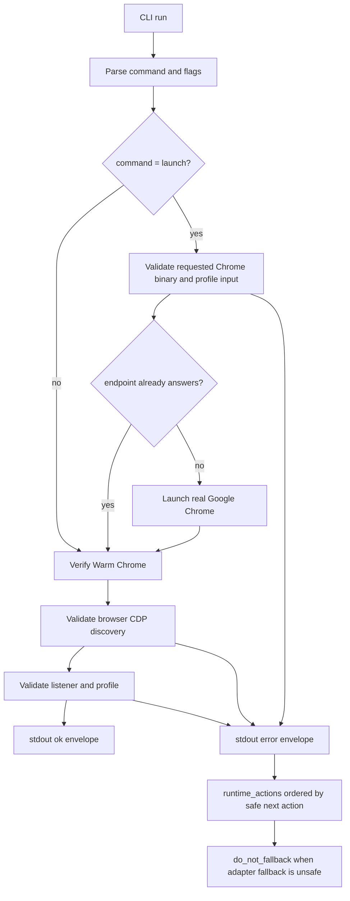

# fix: Harden browser-use preflight agent feedback

## Summary

Patch the Warm Chrome preflight CLI so a fresh agent gets one safe continuation path from each run. The work fixes the current red audit tests, removes conflicting retry signals, and documents the contract boundary between static affordances and per-run recovery actions.

This plan also closes the remaining open work on issue #135 ("Ship Warm Chrome Preflight for browser-use"). The preflight CLI, success envelope, repair, and adapter-routing docs already ship and are green; #135's open acceptance criteria are exactly the audit fixes here plus the auth-versus-browser-entry boundary clarification in R12.

---

## Problem Frame

The `browser-use` skill already gives agents the right high-level safety rules: run preflight first, parse stdout JSON, treat stderr as diagnostics, and stop on `needs_browser_entry`. The audit found the executable contract still has four escape hatches: launch can accept unsafe browser inputs when a healthy endpoint masks them, CDP discovery can certify a non-browser websocket path, Chrome command parsing can mistake a following flag for a profile path, and JSON hints can say both "retry" and "not retryable".

Those are agent-continuation risks. A fresh agent should not need to infer which field matters, which adapter to try next, or whether a browser-entry repair is safe. The CLI result should say that directly, using the existing command facade envelope rather than inventing a parallel schema inside `browser-use`.

---

## Requirements

### Safety Fixes

- R1. `launch` validates explicit `--chrome` and `CHROME_BIN` values before endpoint reuse can return success.
- R2. `check` accepts only browser-level CDP websocket discovery paths for `/json/version`.
- R3. Chrome process parsing treats present-but-empty `--user-data-dir` values as `missing_profile`, including separate flag form.
- R4. Existing safe cases stay safe: real Google Chrome, loopback endpoint, dedicated profile, quoted profile paths, and endpoint reuse with default Chrome still pass.

### Agent Feedback

- R5. JSON error envelopes do not emit contradictory retry signals. `retryable` and `recoverability` agree with the generic facade semantics.
- R6. Per-run `runtime_actions` are ordered by agent usefulness: primary safe action first, then guard actions such as `do_not_fallback`.
- R7. Static `actionAffordances.failure` remains capability vocabulary only. Agents consume per-run `runtime_actions` for the current decision.
- R8. Browser-entry failures continue to carry an explicit no-fallback signal.
- R9. Plain stderr output keeps the same human shape while naming the primary recovery action.

### Documentation

- R10. `SKILL.md` and `references/warm-chrome.md` explain the continuation contract in one place: stdout JSON first, per-run actions over static affordances, no adapter fallback after preflight failure.
- R11. Docs avoid a second hand-maintained recovery table. Deterministic action membership stays in `scripts/command-contract.ts` and runtime code.
- R12. Docs state that downstream auth, MFA, and portal-login failures are not Warm Chrome browser-entry failures, so an agent that hits a login wall after preflight passes does not re-run preflight or switch adapters to escape it. (Closes #135 acceptance criterion: "Auth/MFA/portal login failures are not treated as browser-entry failures.")

---

## Scope Boundaries

### In Scope

- Warm Chrome preflight CLI behavior.
- Warm Chrome preflight tests.
- `browser-use` skill and Warm Chrome reference docs.
- Command contract wording where it affects agent interpretation.

### Deferred to Follow-Up Work

- Generic `next_action` or `agent_policy` fields in `@side-quest/cli-command-facade`.
- Cross-repo facade package changes in `side-quest-engineering`.
- New browser adapters or adapter fallback behavior.
- Browser-domain-memory implementation.
- PR, staging, or commit work.

### Out of Scope

- Repo-wide agent hint policy.
- Issue-to-PR v2.
- Non-Warm-Chrome browser-use behavior.

---

## Key Technical Decisions

- **Validate declared launch inputs before idempotent reuse.** A healthy endpoint proves the current browser is usable, but it does not prove the operator-supplied `--chrome` or `CHROME_BIN` value is safe. Validate the requested launch surface before returning success from `launch`.
- **Treat `/json/version` websocket path as browser identity proof.** Loopback host and port are necessary but not sufficient. The discovery websocket must identify the browser target, not a page target or another DevTools endpoint.
- **Parse process flags as flags, not string slices.** Preserve quoted values and paths containing argument-looking text, but never treat another `--flag` token as the value for `--user-data-dir`.
- **Use the existing facade envelope.** The current facade error schema allows `error.hint` and `runtime_actions`, not arbitrary top-level `next_action` or `agent_policy` fields. Make the first per-run runtime action the canonical next action for now.
- **Reserve `recoverability: retry` for true same-input retry.** Listener inspection is an action, not a blind retry. Warm Chrome listener anomalies should keep `retryable: false` and use `runtime_actions` to tell the agent what to inspect before rerunning.
- **Keep policy ownership narrow.** `browser-use` owns Warm Chrome readiness and adapter routing. The static command contract names possible actions; runtime code selects the current action set.

---

## High-Level Technical Design

The implementation keeps the facade envelope shape stable. Agent-facing specificity comes from action ordering, aligned retry fields, and docs that explain precedence.

---

## Implementation Units

### U1. Launch Input Validation Before Reuse

- **Goal:** Ensure unsafe `--chrome` and `CHROME_BIN` inputs fail even when the CDP endpoint is already healthy.
- **Requirements:** R1, R4, R8
- **Files:**
  - `skills/browser-use/scripts/preflight-warm-chrome.ts`
  - `skills/browser-use/scripts/preflight-warm-chrome.test.ts`
- **Approach:** Move launch-only validation ahead of the endpoint reuse early return. Keep the idempotent reuse behavior for safe default Chrome and matching profile input. Preserve the rule that `--chrome` is valid only for `launch`.
- **Execution note:** Start from the existing red tests for unsafe `--chrome` and `CHROME_BIN` on healthy endpoint.
- **Test Scenarios:**
  - Unsafe `--chrome` with a healthy endpoint exits `20`, spawns nothing, and reports `not_real_google_chrome`.
  - Unsafe `CHROME_BIN` with a healthy endpoint exits `20`, spawns nothing, and reports `not_real_google_chrome`.
  - Default Chrome with a healthy endpoint still returns success with `launch_performed=false`.
  - `--chrome` outside `launch` remains a usage error.
  - Unsafe `CHROME_BIN` before spawn after restart remains covered.
- **Verification:** Focused preflight test file passes the launch group.

### U2. Browser-Level CDP Websocket Validation

- **Goal:** Prevent `/json/version` from certifying a page or non-browser websocket as Warm Chrome readiness proof.
- **Requirements:** R2, R4, R8
- **Files:**
  - `skills/browser-use/scripts/preflight-warm-chrome.ts`
  - `skills/browser-use/scripts/preflight-warm-chrome.test.ts`
- **Approach:** Extend websocket validation to require the browser discovery path shape. Keep the current loopback protocol, host, and port checks. Return `invalid_cdp_version` for a valid loopback websocket that is not a browser discovery URL.
- **Execution note:** Use the existing red test for `/devtools/page/...`, then add one guard for another non-browser path if the helper shape makes that cheap.
- **Test Scenarios:**
  - `ws://127.0.0.1:<port>/devtools/browser/<id>` passes.
  - `ws://127.0.0.1:<port>/devtools/page/<id>` exits `20` with `invalid_cdp_version`.
  - Non-loopback websocket still exits with `non_loopback_websocket`.
  - Malformed websocket URL still exits with `invalid_cdp_version`.
  - Missing `webSocketDebuggerUrl` still exits with `invalid_cdp_version`.
- **Verification:** Focused preflight test file passes websocket validation cases.

### U3. `--user-data-dir` Empty Value Parsing

- **Goal:** Classify missing Chrome profile arguments correctly without breaking quoted profile paths.
- **Requirements:** R3, R4
- **Files:**
  - `skills/browser-use/scripts/preflight-warm-chrome.ts`
  - `skills/browser-use/scripts/preflight-warm-chrome.test.ts`
- **Approach:** Rework process command flag extraction so a following `--flag` token is not consumed as a value. Preserve support for `--user-data-dir=<path>`, `--user-data-dir <path>`, quoted values, escaped characters, and paths containing `--` inside quotes.
- **Execution note:** Keep the helper local to process-command parsing unless a broader tokenizer already exists in the file and can absorb the behavior cleanly.
- **Test Scenarios:**
  - `--user-data-dir=` exits with `missing_profile`.
  - `--user-data-dir --no-first-run` exits with `missing_profile`.
  - `--user-data-dir <profile>` still passes.
  - `--user-data-dir="<profile -- marker>"` still passes.
  - Listener without any `--user-data-dir` still exits with `missing_profile`.
- **Verification:** Focused preflight test file passes profile parsing cases.

### U4. Retry and Runtime Action Signal Alignment

- **Goal:** Remove conflicting continuation signals from JSON error envelopes.
- **Requirements:** R5, R6, R8, R9
- **Files:**
  - `skills/browser-use/scripts/preflight-warm-chrome.ts`
  - `skills/browser-use/scripts/preflight-warm-chrome.test.ts`
- **Approach:** Audit every `recoverability: "retry"` case and keep it only when rerunning the same input is actually safe. For listener inspection cases, keep `retryable=false` and choose a recoverability that means "act first, then rerun." Make `runtime_actions[0]` the primary action the agent should consider next. Preserve `do_not_fallback` on browser-entry failures.
- **Test Scenarios:**
  - `listener_missing` emits no `retryable=true` unless same-input retry is intended.
  - `invalid_cdp_version` emits `retryable=false` and a primary inspect action.
  - `non_loopback_websocket` emits `retryable=false` and a primary inspect or input-correction action matching the failure.
  - Usage errors emit `change_input` without `needs_browser_entry`.
  - Runtime failures emit `inspect_diagnostics` without browser-entry repair actions.
  - Plain output names the same primary recovery action as the first JSON runtime action.
- **Verification:** Focused preflight test file passes feedback-envelope cases.

### U5. Static Contract and Runtime Action Precedence Docs

- **Goal:** Make a fresh agent consume the right contract surface without inferring from static affordances, and stop it from mistaking a downstream login wall for a browser-entry failure.
- **Requirements:** R6, R7, R8, R10, R11, R12
- **Files:**
  - `skills/browser-use/SKILL.md`
  - `skills/browser-use/references/warm-chrome.md`
  - `skills/browser-use/scripts/command-contract.ts`
  - `skills/browser-use/scripts/preflight-warm-chrome.test.ts`
- **Approach:** Add short guidance that `runtime_actions` from the current run outrank static `actionAffordances`. Document that the first runtime action is the primary safe next action, and guard actions such as `do_not_fallback` constrain what must not happen. Keep the static contract as vocabulary and capability discovery. Avoid duplicating the full action list in prose. Add one short boundary note (R12): the preflight proves Chrome readiness only; auth, MFA, and portal-login failures occur downstream after preflight passes and must not be treated as `needs_browser_entry` or trigger a preflight re-run or adapter switch. The preflight already has no auth concept, so this is a precedence/boundary clarification in docs, not new preflight code.
- **Test Scenarios:**
  - Static contract still lists all known failure actions for discovery.
  - JSON failure for a browser-entry case orders the primary action before guard action.
  - JSON failure for usage does not include static browser-entry actions.
  - Docs contain one concise precedence rule and no copied recovery table.
  - Docs state the auth/MFA/login-versus-browser-entry boundary once, in `references/warm-chrome.md`, without adding a parallel auth table.
  - Skill frontmatter remains YAML-parseable after edits.
- **Verification:** Focused preflight test file covers action ordering; doc scan confirms no parallel recovery table and that the auth-versus-browser-entry boundary is stated.

### U6. Regression Verification and Handoff Notes

- **Goal:** Prove the patch lands cleanly and leaves future agent work obvious.
- **Requirements:** R1, R2, R3, R4, R5, R6, R9, R10, R12
- **Files:**
  - `skills/browser-use/scripts/preflight-warm-chrome.test.ts`
  - `skills/browser-use/scripts/preflight-warm-chrome.ts`
  - `skills/browser-use/SKILL.md`
  - `skills/browser-use/references/warm-chrome.md`
- **Approach:** Run the focused test file, script-local type check, and Biome lint check after implementation. Keep unrelated dirty state untouched. If generic facade schema limits block a desired feedback field, record that as a deferred facade follow-up rather than adding an ad-hoc browser-use envelope shape.
- **Test Scenarios:**
  - The focused test file returns all passing.
  - Type check returns zero errors for `skills/browser-use/scripts`.
  - Biome lint check returns zero issues for `skills/browser-use/scripts`.
  - No unrelated `prototypes/` files are modified.
  - Existing passing tests for symlinked default-profile no-mutation safety remain green.
- **Verification:** Focused runner outputs show the four red audit tests are green and no new contract regressions landed.

---

## Acceptance Examples

- AE1. Given a healthy endpoint and `launch --chrome /Applications/Google Chrome Canary.app/...`, when preflight runs, then it exits `20`, does not spawn Chrome, and reports the unsafe binary.
- AE2. Given `/json/version` returns `ws://127.0.0.1:9444/devtools/page/test-page`, when `check` runs, then it exits `20` and does not emit `browser_ready`.
- AE3. Given the listener command contains `--user-data-dir --no-first-run`, when `check` runs, then it exits `20` with `missing_profile`, not `profile_missing`.
- AE4. Given an inspect-listener failure, when JSON output is requested, then `retryable` does not invite blind same-input retry and `runtime_actions[0]` names the safe inspection action.
- AE5. Given a browser-entry failure, when a fresh agent reads stdout JSON, then it sees a current-run action path plus `do_not_fallback` and does not switch adapters.
- AE6. Given preflight has passed and a downstream portal then shows a login or MFA wall, when a fresh agent consults the docs, then it treats the login wall as an application-level step, not a Warm Chrome browser-entry failure, and does not re-run preflight or switch adapters to escape it.

---

## System-Wide Impact

- **Agent reliability:** Fresh agents get less ambiguous continuation guidance and fewer chances to certify an unsafe browser state.
- **Facade compatibility:** The patch stays inside the existing command facade envelope. Literal `next_action` and `agent_policy` fields remain a generic facade design problem, not a browser-use one-off.
- **Docs maintenance:** Runtime code remains the owner of per-error action selection. Docs explain precedence and stop conditions only.
- **Existing browser setup:** No new launch, repair, or adapter behavior beyond rejecting unsafe inputs earlier.

---

## Risks & Dependencies

- **Retry semantics drift:** The generic facade docs treat `retryable=true` as same-input retry. Warm Chrome currently uses some "retry" wording to mean inspect or repair first. The patch must align behavior with the generic meaning, not just rename fields.
- **Envelope schema limits:** The local linked facade package rejects unknown error fields. Adding `next_action` or `agent_policy` literally requires a facade-owned schema change outside this repo.
- **Parser regression:** Chrome command parsing is easy to overfit. Keep quoted path and argument-looking path tests green while fixing empty values.
- **Contract duplication:** Repeating full action membership in docs would create parallel policy. Keep deterministic action lists in code and write docs as precedence rules.
- **Dirty worktree:** `skills/browser-use/scripts/preflight-warm-chrome.test.ts` is already modified and `prototypes/` is untracked. Implementation must preserve unrelated user work.

---

## Sources

- Issue: `https://github.com/nathanvale/claude-code-config/issues/135` (this plan closes its open acceptance criteria).
- `skills/browser-use/SKILL.md`
- `skills/browser-use/references/warm-chrome.md`
- `skills/browser-use/scripts/command-contract.ts`
- `skills/browser-use/scripts/preflight-warm-chrome.ts`
- `skills/browser-use/scripts/preflight-warm-chrome.test.ts`
- `skills/cli-author/references/cli-command-facade.md`
