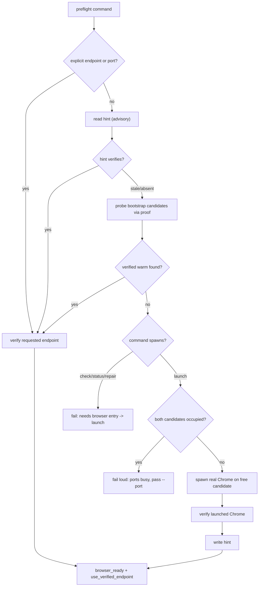

# fix: Resolve Warm Chrome port through discovery, not disagreeing defaults

## Closure

- Superseded by ADR 0009 fixed CDP convention plus runtime proof.
- Issue #149 closed by PR #152 through `9222` / `~/.agent-warm-profile` alignment and Warm Chrome Preflight hardening.
- Do not implement resolver, persisted hint, allocation, lease, or binding machinery from this plan.
- Keep as incident history and guardrail source only.
- Current adapter-readiness path: Browser Adapter Proof for `chrome-devtools`.

## Summary

Make `browser-use` find the running warm Chrome instead of guessing a CDP port. A resolver replaces the three disagreeing port defaults (`preflight DEFAULT_PORT`, `launch-agent-chrome.sh PORT`, docs) with one precedence chain: explicit input, then a verified port hint, then the fixed warm-CDP port `9222` probed through the existing Warm Chrome proof. `launch` scans for an existing healthy warm Chrome before spawning and refuses to mint a redundant competitor.

This fixes issue #149 by collapsing the defaults into resolver-owned candidates and adding a scan-before-spawn guard. It is deliberately **stateless beyond a lightweight hint**: no persisted ownership record, no mutation lock, no port-allocation range. Durable per-session port ownership is real future work but belongs to the browser-domain-memory lifecycle epic, not this single-operator fix.

### 2026-06-02 Branch Slice

Current branch delivered the first runtime-proof slice, not the full resolver/hint plan:

- Browser Adapter Proof CLI scaffolded with cli-author contract.
- Warm Chrome preflight composed before adapter proof.
- `chrome-devtools` proof implemented through `bunx mcporter`.
- Live smoke green against fixed CDP port `9222`.
- `agent-browser` and `playwright-cdp` Browser Adapter Proof implementations remain follow-up work; they are not accepted CLI values in this slice.
- Broader resolver, hint write/read, launch reuse, and shell wrapper alignment remain follow-up work.

---

## Problem Frame

Warm Chrome already has a strong per-command safety proof: real Google Chrome, loopback CDP, dedicated persistent profile, owner-only permissions, browser-level websocket discovery. The missing layer is that nothing makes the tool *find* the warm instance — the operator must already know the port.

Issue #149's live incident: operator ran `check` against a guessed port (matched nothing), `check` failed `endpoint_unreachable`, operator followed `launch` with an invented profile, and a **redundant empty Chrome** spawned while the real warm instance sat healthy on the warm port. Root cause: three disagreeing port defaults and no resolver that prefers a discovered, proven warm endpoint.

The fix is resolution, not ownership: probe the fixed warm-CDP port through the existing proof path, prefer the verified endpoint, and make `launch` reuse it instead of spawning. The disagreeing defaults collapse into one resolver-owned bootstrap port (`9222`) rather than competing constants.

### Why no durable binding (scope decision)

An earlier draft of this plan added a persisted `Warm Chrome Binding` file plus a mutation lock, stale-recovery, and a two-tier allocation range. A deepening review (adversarial + scope) showed that machinery solves a *persistence* problem #149 never reported, and that for read-only commands a stale binding is strictly worse than no binding (it adds a failure mode discovery would have avoided). The running Chrome's own CDP listener is already the authority for "which port is warm," and `verifyWarmChrome` already cross-checks it. So this plan keeps only a lightweight **endpoint hint** (a cache to skip a probe, never an authority) and drops the lock, stale-recovery, atomic-rename, and allocation range. ADR 0008 is superseded by ADR 0009's fixed convention plus runtime proof decision.

---

## Requirements

### Resolution Behavior

- R1. Explicit `--endpoint` or `--port` is the highest-precedence operator input for the current run only.
- R2. With no explicit endpoint or port, commands resolve from the persisted hint, then env hints, then bootstrap candidates.
- R3. Discovery accepts only verified Warm Chrome candidates, reusing the existing proof checks instead of a second weaker verifier.
- R4. `check` and `status` never spawn Chrome and never write the hint while resolving.
- R5. The hint is advisory: a present-but-unverifiable hint falls through to discovery for every command, never a hard failure.
- R6. `repair` uses an explicit endpoint or a verified resolved endpoint; with no healthy target it fails and points to `launch`.
- R7. Explicit `--profile` is a current-run expectation; if it conflicts with the verified warm profile, the command fails with profile mismatch.
- R8. Explicit wrong-port recovery is `launch`-only; `check`, `status`, and `repair` stay strict about their requested endpoint.

### Launch Behavior

- R9. `launch` reuses an existing healthy Warm Chrome on the resolved or discovered endpoint instead of spawning.
- R10. `launch` refuses to spawn onto a requested port occupied by a non-Warm-Chrome listener.
- R11. `launch` refuses to spawn a redundant competitor when a healthy Warm Chrome already exists on a bootstrap candidate.
- R12. Successful wrong-port `launch` recovery with no profile conflict returns `browser_ready` with `launch_performed=false`.
- R13. Wrong-port `launch` recovery **with** a conflicting explicit `--profile` fails with profile mismatch and spawns nothing.
- R14. When no warm Chrome exists and both bootstrap candidate ports are occupied by non-Warm-Chrome, `launch` **fails loud** (names the occupied ports, points at explicit `--port`) and spawns nothing. No allocation range.
- R15. First cold `launch` (no listener on the preferred candidate, no competitor elsewhere) spawns real Google Chrome on the preferred free candidate, verifies, then writes the hint.
- R16. `launch` adopts an existing healthy Warm Chrome discovered on a bootstrap candidate after proof, returning `launch_performed=false`.
- R17. Existing Chrome profile directories are adopted only by proving a live Warm Chrome; they are never moved or copied.

### Endpoint Hint

- R18. The hint stores only locator fields (port, profile path) sufficient to skip a probe; never proof snapshots, websocket URLs, PID, or target counts.
- R19. Only `launch` writes the hint, only after Warm Chrome proof passes; failed spawn or failed proof writes nothing.
- R20. A corrupt or unreadable hint file is treated as absent and falls through to discovery; it is replaced only by a successful `launch`.
- R21. The hint never overrides explicit input or a verified discovery result; it is a probe shortcut, not authority.
- R22. The hint lives outside the Chrome profile at `$XDG_STATE_HOME/browser-use/warm-chrome-hint.json`, falling back to `$HOME/.local/state/browser-use/warm-chrome-hint.json`.

### Single Source of Truth

- R23. The disagreeing port defaults collapse into one resolver-owned bootstrap port (`9222`).
- R24. `launch-agent-chrome.sh` becomes a thin compatibility wrapper that delegates to the preflight launch command and stops owning a separate port/profile default.
- R25. The exact candidate list and default profile path are code-owned, not restated as authority in hand-maintained docs.
- R26. `BROWSER_USE_CDP_PORT` and `BROWSER_USE_PROFILE_DIR` remain bootstrap hints only when no verified endpoint resolves.
- R27. First cold `launch` may use a code-owned default dedicated profile path (application-support semantics, not cache) when no explicit or env profile exists. This requires relaxing the current hard `--profile`-required guard for the resolver-provided case.
- R28. Success data includes `resolution_source` provenance (`explicit`, `hint`, `env`, `discovered`, `cold_launch`) when the facade success envelope accepts the field; it is provenance, never readiness proof.

---

## Scope Boundaries

### In Scope

- Warm Chrome preflight CLI port/endpoint resolution.
- Scan-before-spawn launch reuse and competitor refusal.
- A lightweight advisory endpoint hint (read-as-cache, launch-written).
- Shell helper alignment to stop owning a second default.
- Warm Chrome docs and command-contract wording.
- Focused tests for resolver precedence, discovery, launch reuse, and fail-loud.

### Deferred to Follow-Up Work

- Durable browser ownership record, mutation lock, and stale-recovery. ADR 0009 rejects this for the current slice.
- `agent-browser` Browser Adapter Proof implementation.
- `playwright-cdp` Browser Adapter Proof implementation.
- Resolver/hint implementation from this plan: advisory hint, discovery precedence, and `resolution_source` provenance.
- Launch reuse and competitor refusal from this plan, including wrong-port launch recovery without spawning a redundant browser.
- `launch-agent-chrome.sh` compatibility wrapper alignment.
- Port-allocation range when both bootstrap candidates are occupied.
- Concurrent-launch serialization.
- Multi-profile fleet support and a `--force-new-binding` second-instance workflow.
- Shell dotfile export of `BROWSER_USE_CDP_PORT`.
- Generic facade schema changes for richer resolution metadata.

### Out of Scope

- Switching browser adapters.
- Browser-domain-memory capture or replay.
- Attaching to the everyday Chrome profile.
- Killing Chrome processes or moving/copying profile directories.

---

## Key Technical Decisions

- **Resolution, not ownership.** The running Chrome's CDP listener is the authority for which port is warm. The resolver discovers and proves it; it does not persist an authoritative binding. The hint is a probe shortcut only.
- **Hint is advisory, never fail-closed.** A present-but-stale hint falls through to discovery for every command, including read-only ones. This avoids the stale-binding paradox where a hint would make `check` fail and route to `launch` when a healthy Chrome exists on the other candidate.
- **Fail loud on port occupation.** When no warm Chrome exists and `9222` is occupied by non-Warm-Chrome, `launch` fails with a clear message rather than allocating a range port. On a single-user machine, the agent port busy is exceptional and worth surfacing; range allocation would strand a warm Chrome on a port discovery can't find later (the very reason a durable binding would then be needed).
- **Reuse the existing proof path for discovery.** Discovery probes candidate ports, but a candidate becomes authoritative only after `verifyWarmChrome` proves real Chrome, loopback CDP, browser-level websocket, and a safe dedicated profile. Call it as a probe: `repair: false`, catch `PreflightRuntimeError`, treat a throw as "not this candidate." Do not build a second listener-only verifier.
- **Relax the hard `--profile` guard for resolver-provided profiles.** Current code throws `usageError("--profile is required for launch")` unconditionally. Cold launch with a code-owned default profile (R27) requires conditionalizing that guard: profile required unless the resolver (hint or code-owned default) supplies one.
- **Explicit profile is expectation, not rebind.** If `--profile` conflicts with the verified warm profile, fail with profile mismatch instead of spawning a competitor or silently returning a different profile. This must evaluate against the *discovered/verified* warm profile, not only a hint, so it holds on the first (no-hint) run — the literal #149 reproduction.
- **Default profile is application-support, not cache.** The code-owned default dedicated profile path uses durable application-support semantics, never a cache root. Docs must not promote the exact path into a second source of truth.
- **Keep facade compatibility.** Continue emitting the existing success envelope and `use_verified_endpoint` runtime action. `resolution_source` rides `data` (the facade leaves `data` shape uninspected); thread it through `WarmChromeProof`. No parallel envelope.
- **Hint stores locator only.** Port and profile path, enough to skip a probe. Never proof snapshots, websocket URLs, PID, or target counts. Diagnostics may name the resolution source and port, never full profile paths (existing redaction posture).

---

## High-Level Technical Design

Read paths discover and return a verified candidate without writing the hint. Only a successful `launch` writes it.

---

## Implementation Units

### U1. Warm Chrome Endpoint Resolver

- **Goal:** Replace inline `BROWSER_USE_CDP_PORT || DEFAULT_PORT` resolution with a resolver returning the effective endpoint, port, profile, and resolution source for every command.
- **Requirements:** R1, R2, R3, R4, R5, R6, R7, R8, R23, R26, R28
- **Files:**
  - `skills/browser-use/scripts/preflight-warm-chrome.ts`
  - `skills/browser-use/scripts/preflight-warm-chrome.test.ts`
- **Approach:** Add a resolver near `normalizeEndpoint`. Precedence: explicit `--endpoint`/`--port` (current-run only) → hint (read, verify as a probe) → env hints → fixed bootstrap port `9222` probed via `verifyWarmChrome` with `repair: false` in a try/catch. A throw means "not warm," not a CLI failure. Read-only commands never write the hint. Keep the port constant in runtime code, not docs.
- **Patterns to follow:** Existing `normalizeEndpoint`, `verifyWarmChrome`, `endpointAnswers`, and `PreflightRuntime` injection.
- **Test Scenarios:**
  - Bare `check --json` with a valid hint returns its port/profile.
  - Bare `check --json` with no hint discovers the verified warm endpoint on `9222` without writing state.
  - Bare `check --json` fails cleanly when `9222` is not warm (no hint, nothing to discover).
  - Stale/absent hint falls through to discovery for `check`/`status` (no failure, no write).
  - Explicit `--port` overrides hint and discovery for the current run.
  - Explicit `--endpoint` overrides hint and env for the current run.
  - Explicit `--profile` conflicting with the verified warm profile fails with profile mismatch — including on the no-hint first run.
  - `check`/`status`/`repair` with an explicit wrong port fail against that endpoint instead of switching to discovery.
  - Hint beats stale `BROWSER_USE_CDP_PORT`; env still works when no hint exists.
  - Discovery rejects a candidate whose listener fails existing Warm Chrome proof.
  - `repair` without explicit endpoint and without a healthy resolved endpoint fails with a `launch_warm_chrome` recovery action.
  - Success data reports `resolution_source` when the envelope accepts the field.
- **Verification:** No command path still falls directly to a hardcoded naked port; discovery uses the existing proof, not a second verifier.

### U2. Launch Reuse, Competitor Refusal, and Hint Write

- **Goal:** Make `launch` reuse the resolved or discovered Warm Chrome, refuse accidental competitors, fail loud on exhaustion, and write the advisory hint only after proof.
- **Requirements:** R7, R9, R10, R11, R12, R13, R14, R15, R16, R17, R18, R19, R20, R21, R22, R27
- **Files:**
  - `skills/browser-use/scripts/preflight-warm-chrome.ts`
  - `skills/browser-use/scripts/preflight-warm-chrome.test.ts`
- **Approach:** Before spawning, `launch` validates `--chrome`/profile safety, resolves the endpoint, and probes the bootstrap port `9222` for healthy warm via the proof path. If a healthy warm Chrome exists (resolved or discovered), return the existing `browser_ready` shape with `launch_performed=false`. If explicit `--profile` conflicts with the verified warm profile, fail with mismatch. If `9222` is occupied by non-Warm-Chrome and does not verify, fail loud. Otherwise spawn on the free port, verify, then write the hint. Relax the hard `--profile`-required guard so a resolver-provided default profile is allowed (R27). Add small injected `readHint`/`writeHint` primitives to `PreflightRuntime`; no lock, no atomic-rename ceremony beyond a plain write.
- **Patterns to follow:** Existing `launchIfNeeded` reuse branch, `use_verified_endpoint` success action, `PreflightRuntime` test doubles.
- **Test Scenarios:**
  - `launch --port {wrong}` returns the existing verified warm endpoint when one is healthy on a candidate and no conflicting profile is supplied (`launch_performed=false`).
  - The #149 reproduction: `launch --profile {invented}` with warm Chrome live on `9222` and no hint — fails with profile mismatch, spawns nothing.
  - `launch` with a valid hint reuses it and spawns nothing.
  - First cold `launch` (no warm Chrome, `9222` free) spawns once on `9222`, proves, writes the hint.
  - First cold `launch` uses the code-owned default dedicated profile path (application-support, not cache) when no profile is supplied.
  - `launch` with `9222` occupied by non-Warm-Chrome fails loud and spawns nothing.
  - `launch --port {occupied-by-non-warm}` fails and spawns nothing.
  - `launch` adopts a healthy warm Chrome discovered on `9222` and reports `launch_performed=false`.
  - Unsafe `--chrome` (Chrome for Testing / non-stable) stays rejected before any reuse success.
  - Failed spawn or failed proof writes no hint.
  - Existing profile directories are not moved or copied into the default profile path.
  - JSON success validates against the facade envelope; `resolution_source` is provenance, not proof.
- **Verification:** The live #149 incident cannot create an empty competing Chrome; the hard `--profile` guard relaxation does not weaken existing safety rejections.

### U3. Shell Helper and Contract Surface Alignment

- **Goal:** Stop `launch-agent-chrome.sh` from owning a second set of Warm Chrome defaults while preserving its operator affordance.
- **Requirements:** R23, R24, R25, R26, R27
- **Files:**
  - `skills/browser-use/scripts/launch-agent-chrome.sh`
  - `skills/browser-use/scripts/preflight-warm-chrome.sh`
  - `skills/browser-use/scripts/command-contract.ts`
  - `skills/browser-use/scripts/preflight-warm-chrome.test.ts`
- **Approach:** Make `launch-agent-chrome.sh` a thin compatibility wrapper that delegates to the preflight launch command instead of carrying its own `PORT` / `PROFILE_DIR` defaults. Preserve positional `PORT` / `PROFILE_DIR` as explicit per-run inputs mapped to preflight flags, not wrapper defaults. The fixed warm-CDP port (`9222`) and the dedicated default profile live in resolver code, not the wrapper. Update command usage text only where the CLI changed. Note the cache→application-support profile move.
- **Patterns to follow:** Existing shell wrapper pass-through tests; existing command-contract tests.
- **Test Scenarios:**
  - `launch-agent-chrome.sh` no longer hardcodes a default port/profile pair that can drift from preflight.
  - Positional `PORT` / `PROFILE_DIR` still work and map to explicit preflight flags for that run.
  - Shell invocation still launches or reuses Warm Chrome through the preflight command.
  - Command-contract env-var descriptions stay truthful and do not claim env vars are authority.
  - Help text does not hardcode the default profile path or a literal current port.
- **Verification:** Shell wrapper tests pass; a source scan finds no independent port/cache-profile default owner outside resolver code.

### U4. Warm Chrome Documentation Update

- **Goal:** Document resolution behavior without duplicating runtime state or candidate lists in prose.
- **Requirements:** R23, R25, R26, R27
- **Files:**
  - `skills/browser-use/references/warm-chrome.md`
  - `skills/browser-use/SKILL.md`
  - `docs/adr/0006-warm-chrome-via-dedicated-debug-profile.md`
- **Approach:** Replace any hand-maintained "current port" authority with "resolver finds the warm instance" guidance. Keep ADR-0006 focused on why the profile must be dedicated, adding a short pointer that port resolution is handled by the preflight resolver. Do not restate the candidate list or default profile path in prose.
- **Patterns to follow:** `AGENTS.md` no-parallel-policy: deterministic state and action membership live in code; docs state intent and stop conditions.
- **Test Scenarios:**
  - Docs no longer state a hand-maintained active port as current truth.
  - Docs explain that bare `check`/`status` resolve by discovery.
  - Docs state `DevToolsActivePort` remains adapter-hint material, not resolution authority.
  - Docs do not hand-maintain candidate lists or default profile paths.
  - `SKILL.md` frontmatter remains YAML-parseable.
- **Verification:** Markdown scan confirms no prose-owned active-port table remains.

### U5. Regression Verification

- **Goal:** Prove the resolution change closes #149 and preserves existing Warm Chrome safety.
- **Requirements:** R1 through R28
- **Files:**
  - `skills/browser-use/scripts/preflight-warm-chrome.test.ts`
  - `skills/browser-use/scripts/preflight-warm-chrome.ts`
  - `skills/browser-use/scripts/command-contract.ts`
  - `skills/browser-use/references/warm-chrome.md`
- **Approach:** Run the focused browser-use script tests, the script-local type check, and Biome lint/format after implementation. Add a source scan for drift-prone constants. Keep any facade schema limits as deferred notes, not custom envelope fields.
- **Test Scenarios:**
  - Bare `check` finds the healthy warm instance via discovery (hint and no-hint paths).
  - Wrong-port `launch` cannot spawn a redundant empty Chrome while a healthy warm instance exists on a candidate.
  - Discovery uses the same Warm Chrome proof checks as adapter readiness, not a listener-only shortcut.
  - Existing safety cases stay green: default-profile rejection, Chrome-for-Testing rejection, loopback enforcement, browser-level websocket enforcement, owner-only profile repair, the runtime continuation contract from the prior fix.
  - No independent hardcoded default port/profile owner remains outside resolver code.
- **Verification:** Focused tests, type check, and lint/format pass.

---

## Acceptance Examples

- AE1. Given a healthy Warm Chrome on `9222` and a valid hint, when an agent runs bare `check --json`, then the result points at `9222` and emits `use_verified_endpoint`.
- AE2. Given no hint but a healthy Warm Chrome on `9222`, when an agent runs bare `check --json`, then discovery verifies and returns `9222` without spawning or writing state.
- AE3. Given a stale hint pointing at a dead port but a healthy Warm Chrome on `9222`, when an agent runs bare `check --json`, then it falls through to discovery and returns `9222` (does not fail and route to `launch`).
- AE4. The #149 reproduction: given a healthy Warm Chrome on `9222`, no hint, when an operator runs `launch --profile {invented}`, then the command fails with profile mismatch and spawns nothing.
- AE5. Given a healthy Warm Chrome on `9222`, when an operator runs `launch` with no conflicting profile, then the command returns the verified `9222` endpoint with `launch_performed=false` and spawns nothing.
- AE6. Given no warm Chrome anywhere and `9222` free, when an operator runs `launch`, then it spawns one real Chrome on `9222`, proves it, writes the hint, and returns `browser_ready`.
- AE7. Given no warm Chrome and `9222` occupied by a non-Warm-Chrome listener, when an operator runs `launch`, then it fails loud (names the occupied port, suggests explicit `--port`) and spawns nothing.
- AE8. Given a healthy Warm Chrome on `9222`, when an operator runs `launch` with no port, then it adopts that endpoint, reports `launch_performed=false`, and writes the hint.

---

## System-Wide Impact

- **Agent reliability:** Fresh agents stop depending on operator memory for the active port; bare `check` becomes the normal path.
- **Browser safety:** The hard invariant stays — dedicated real Chrome, dedicated profile, loopback CDP, no everyday-profile attachment. Relaxing the `--profile` guard is gated behind a resolver-provided profile only.
- **Operator UX:** `launch` becomes safe to run without minting an empty competitor; exhaustion fails loud instead of scattering Chrome onto random ports.
- **Docs maintenance:** Port/profile facts move from prose to resolver-owned code.
- **Adapter compatibility:** Adapters still consume the verified endpoint and do not own launch policy.

---

## Risks & Dependencies

- **Hint staleness:** A stale hint must always fall through to discovery, never fail. Verify the hint endpoint before trusting it; on any miss, discover. (R5, R20, R21.)
- **`--profile` guard relaxation:** Conditionalizing the hard `usageError("--profile is required for launch")` must not let an unsafe or missing profile through on the explicit-input path. Only the resolver-provided default profile path may satisfy the requirement. (R27.)
- **Discovery breadth:** Auto-claiming any real Chrome with a non-default profile could attach to an unintended debug Chrome. Keep discovery limited to the resolver-owned bootstrap candidates plus the existing proof. (R3, R11.)
- **Facade schema limits:** If `resolution_source` is rejected by `@side-quest/cli-command-facade`, drop it (no requirement depends on it) rather than inventing a custom envelope. (R28.)
- **Shell helper drift:** Leaving `launch-agent-chrome.sh` with separate defaults recreates the bug. It must delegate. (R24.)
- **Deferred durable binding:** If concurrent launch or cross-session unfindable-port scenarios become real, revisit ADR-0008's durable binding as a separate plan. This fix intentionally does not pre-build that infrastructure.

---

## Sources

- Issue: `https://github.com/nathanvale/claude-code-config/issues/149`
- `skills/browser-use/scripts/preflight-warm-chrome.ts`
- `skills/browser-use/scripts/preflight-warm-chrome.test.ts`
- `skills/browser-use/scripts/launch-agent-chrome.sh`
- `skills/browser-use/scripts/command-contract.ts`
- `skills/browser-use/references/warm-chrome.md`
- `docs/adr/0006-warm-chrome-via-dedicated-debug-profile.md`
- `docs/adr/0008-browser-use-owns-warm-chrome-binding-lifecycle.md` (deferred durable-binding design)
- `skills/browser-use/docs/research/2026-05-30-browser-use-warm-chrome-findings.md`
