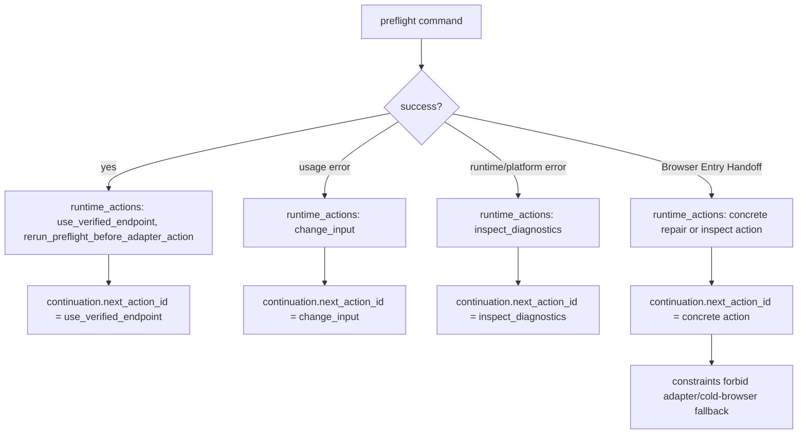

# fix: Apply runtime continuation guidance to Warm Chrome preflight

## Summary

Finish the Warm Chrome preflight migration to the shared ADR-0016 runtime continuation contract. The earlier safety fixes are already present; this plan updates the remaining JSON envelopes, tests, static action vocabulary, and docs so agents read `continuation` as the current-run authority instead of inferring recovery from `runtime_actions` order.

This supersedes the stale continuation parts of `skills/browser-use/docs/plans/2026-06-01-002-fix-browser-use-preflight-agent-feedback-plan.md` without editing that completed plan.

---

## Problem Frame

`browser-use` still emits `runtime_actions` without a `continuation` field and the docs still teach a slot convention: skip `needs_browser_entry` and `do_not_fallback`, then treat the first remaining action as primary. That matched the temporary plan, but PR #74 in `@side-quest/cli-command-facade` made the shared contract stricter: every runtime-contract envelope with `runtime_actions` needs exactly one continuation posture, negative guidance belongs in constraints, and `recoverability: "retry"` must agree with `retryable: true`.

The current Warm Chrome code already validates launch binary inputs before endpoint reuse, rejects non-browser websocket paths, treats empty `--user-data-dir` as missing, and avoids contradictory retry signals. The remaining risk is contract drift: fresh agents still have to infer continuation from action ordering, and a live facade link can reject the envelopes outright.

---

## Requirements

### Facade Contract

- R1. Every JSON success or error envelope that emits `runtime_actions` also emits `continuation`.
- R2. `continuation` sets exactly one posture: `next_action_id` or `requires_operator: true`.
- R3. `continuation.next_action_id` always references a current `runtime_actions[].id`.
- R4. Negative fallback guidance moves to `continuation.constraints`, not fake positive runtime actions.
- R5. `StructuredRuntimeError.failure_domain` uses package-owned lower_snake_case labels where it improves routing.
- R6. `recoverability` and `retryable` keep the new bidirectional retry invariant.

### Warm Chrome Behavior

- R7. Success points at `use_verified_endpoint` as the safe next action.
- R8. Usage failures point at `change_input`.
- R9. Runtime or platform failures point at `inspect_diagnostics`.
- R10. Browser Entry Handoffs use `failure_domain: "browser_entry_handoff"` for classification and point at the concrete repair or inspection action for this run.
- R11. Browser Entry Handoffs forbid adapter fallback and cold-browser fallback through a `no_adapter_fallback` constraint with forbidden action ids, not forbidden side-effect classes.
- R12. Plain output prefixes errors with `failure_domain` and names the same recovery action as `continuation.next_action_id` when that posture exists.
- R13. This patch does not emit `continuation.requires_operator`; all current Warm Chrome cases have a safe `browser-use` continuation.
- R14. `continuation.next_action_id` is the only primary-action source; docs, tests, and plain output do not derive primary recovery from `runtime_actions` order.
- R15. `error.hint.action` stays in the facade-controlled coarse vocabulary; package runtime action ids carry the concrete Warm Chrome action.
- R16. Failure `runtime_actions` stay minimal: one concrete primary action for the run.

### Documentation

- R17. `SKILL.md` teaches agents to read `continuation` first, then `runtime_actions`.
- R18. `references/warm-chrome.md` defines static `actionAffordances` as positive discovery vocabulary only.
- R19. Docs remove the `runtime_actions[0]` / first-non-guard convention and stop advertising `do_not_fallback`.
- R20. The auth/MFA/login-wall boundary remains: downstream auth is not Warm Chrome browser entry.

---

## Scope Boundaries

### In Scope

- Warm Chrome preflight JSON success and error envelopes.
- Runtime continuation and failure-domain tests.
- Warm Chrome static action vocabulary where it conflicts with ADR-0016.
- `browser-use` skill docs and Warm Chrome reference docs.

### Deferred to Follow-Up Work

- Generic facade package changes.
- Warm Chrome port lifecycle / binding work in `skills/browser-use/docs/plans/2026-06-01-003-fix-warm-chrome-port-lifecycle-plan.md`.
- Browser-domain-memory implementation.
- Adapter routing beyond the existing no-fallback constraint.

### Out of Scope

- Reworking the already landed launch binary, websocket, and `--user-data-dir` safety fixes.
- New browser adapters.
- Staging, committing, or PR creation.

---

## Key Technical Decisions

- **Use ADR-0016 as the authority.** `runtime_actions` remains the action catalog for this invocation; `continuation.next_action_id` is the pointer a fresh agent follows. Action order may stay display-friendly but carries no policy authority. Do not emit `requires_operator` in this patch because every planned case has a safe `browser-use` continuation.
- **Model no-fallback as a constraint.** Remove `do_not_fallback` from runtime output and represent it as a `no_adapter_fallback` continuation constraint with package-owned `forbidden_action_ids`: `adapter_fallback` and `cold_browser_fallback`. Do not forbid `browser` or `write` side effects, because valid recovery actions may need them.
- **Use `failure_domain` for domain routing, not exit-code mirroring.** Browser entry is a handoff category, not a fake next action. Use an explicit error-code classifier: `browser_entry_handoff` for Warm Chrome readiness failures, `input` for caller-supplied argument/endpoint/profile problems, and `runtime_diagnostics` for CLI runtime or dependency failures. Do not infer this from exit code, recoverability, or action id alone.
- **Type the domain vocabulary.** Add a local `WarmChromeFailureDomain` union so `failure_domain`, plain prefix output, and tests share one spelling contract.
- **Keep recovery actions positive.** Static `actionAffordances.failure` should list actions an agent could actually take. If an id is only a guard or state label, move it to `failure_domain` or `continuation.constraints`.
- **Keep hints coarse and actions concrete.** `error.hint.action` stays in the facade vocabulary such as `repair_state` or `change_input`; runtime action ids stay package-owned and concrete, such as `launch_warm_chrome`, `repair_profile`, and `inspect_listener`.
- **Classify recovery through one path.** Use one plain-object helper/classifier to derive failure domain, runtime actions, continuation, and plain prefix together. JSON and plain output must not drift.
- **Bound recovery actions tightly.** Use `inspect_listener` for ambiguous listener or CDP weirdness, `launch_warm_chrome` only when no usable endpoint answers, `repair_profile` only for owner/perms proof repair, and `change_input` only for caller-controlled input mistakes.
- **Keep failure action output minimal.** Emit one concrete failure runtime action for the run, then put negative guidance in constraints. Success may keep a secondary preflight rerun action.
- **Mirror failure domain in plain output.** Plain errors should start with the same domain label JSON emits, such as `browser_entry_handoff endpoint_unreachable`, then include the concrete `action=` that matches `continuation.next_action_id`.
- **Keep runtime action summaries non-executable.** Do not add command templates or local file paths to runtime action summaries or docs URLs to runtime actions in this local skill. No stable public-safe docs URL exists for these repo-local docs.
- **Do not add browser-use-only envelope fields.** No top-level `next_action`, `agent_policy`, or custom guard booleans. Use the facade-owned `continuation` shape.
- **Classify input failures as usage.** Preserve success payload shape, plain success output, and redaction posture. Let caller-controlled input failures exit with usage code `2`.
- **Keep same-input retry rare.** Warm Chrome listener and profile failures require inspection, repair, or input changes before rerun. They should not use `recoverability: "retry"` unless `retryable: true` is also correct.
- **Let implementation pressure decide small helper shape.** Rename `runtimeActionsForError` once it owns broader guidance, likely to `guidanceForError`. Keep `primaryRuntimeActionForError` private only while it carries real branch logic. Prefer an explicit `switch` for branchy routing, but allow a tiny typed map when it is plainly clearer.

---

## High-Level Technical Design

---

## Implementation Units

### U1. Runtime Continuation Builder

- **Goal:** Add one shared path that derives a valid `continuation` for success and error envelopes.
- **Requirements:** R1, R2, R3, R4, R7, R8, R9, R10, R11, R12, R13, R14, R15, R16
- **Files:**
  - `skills/browser-use/scripts/preflight-warm-chrome.ts`
  - `skills/browser-use/scripts/preflight-warm-chrome.test.ts`
- **Approach:** Add a local `WarmChromeFailureDomain` union and one plain-object classifier/helper near error normalization and `writeSuccess` that derives failure domain, runtime actions, continuation, and plain prefix together. Success points to `use_verified_endpoint` with no constraints. Usage and diagnostics failures point to their sole action. Browser Entry Handoffs point to one concrete Warm Chrome action and add a `no_adapter_fallback` constraint. Avoid constraints that forbid the primary action's own side effects. Do not emit `requires_operator` in this slice.
- **Test Scenarios:**
  - Success JSON includes `continuation.next_action_id: "use_verified_endpoint"`.
  - Success JSON includes no `continuation.constraints`.
  - Missing endpoint JSON with a profile source includes `continuation.next_action_id: "launch_warm_chrome"`.
  - Missing endpoint JSON without a profile source includes `continuation.next_action_id: "change_input"`.
  - `status --json` uses the same continuation semantics as `check --json`.
  - Listener inspection JSON includes `continuation.next_action_id: "inspect_listener"`.
  - Usage JSON includes `continuation.next_action_id: "change_input"`.
  - Runtime failure JSON includes `continuation.next_action_id: "inspect_diagnostics"`.
  - Every `next_action_id` references an emitted runtime action.
  - Failure JSON emits one concrete runtime action, not a guard/state action list.
  - Browser Entry Handoff continuations include a `no_adapter_fallback` constraint with `forbidden_action_ids: ["adapter_fallback", "cold_browser_fallback"]`.
  - Constraint summaries say not to switch adapters or use a cold browser.
  - Browser Entry Handoff continuations do not forbid the `browser` or `write` side-effect classes.
  - No JSON envelope emits `continuation.requires_operator`.
  - Runtime action summaries contain no executable command templates, local paths, or docs URLs.
  - Plain error output prefix matches `failure_domain` and action matches `continuation.next_action_id`.
- **Implementation discretion:** Rename the existing action helper only if it starts returning the broader guidance object; keep `primaryRuntimeActionForError` private only if it still owns meaningful action routing.
- **Verification:** Focused preflight tests cover every continuation branch.

### U2. Runtime Error Classification

- **Goal:** Add routing-friendly failure domains while preserving retry semantics.
- **Requirements:** R5, R6, R8, R9, R10, R11
- **Files:**
  - `skills/browser-use/scripts/preflight-warm-chrome.ts`
  - `skills/browser-use/scripts/preflight-warm-chrome.test.ts`
- **Approach:** Map normalized errors by explicit error-code groups. Use `browser_entry_handoff` when Warm Chrome is missing, wrong, unattached, or otherwise not ready. Use `input` when the caller must correct arguments, endpoint, port, or supplied profile expectations. Use `runtime_diagnostics` for unsupported platforms and unexpected CLI/runtime failures. Keep `retryable: false` for action-before-rerun cases. If any same-input retry case is introduced later, set both `recoverability: "retry"` and `retryable: true` together.
- **Test Scenarios:**
  - Browser Entry Handoffs carry `failure_domain: "browser_entry_handoff"`.
  - Invalid usage and caller-input correction errors carry `failure_domain: "input"`.
  - `invalid_usage` carries `failure_domain: "input"`.
  - Supplied-profile `profile_missing` and `profile_mismatch` carry `failure_domain: "input"`.
  - Unsafe explicit `--chrome` and `CHROME_BIN` launch inputs carry `failure_domain: "input"` and `continuation.next_action_id: "change_input"`.
  - `non_loopback_endpoint` carries `failure_domain: "input"` and `continuation.next_action_id: "change_input"`.
  - `endpoint_unreachable`, `listener_missing`, `invalid_cdp_version`, `missing_profile`, `default_profile`, `throwaway_profile`, unsafe listener/profile/browser cases, and listener-discovered Chrome-binary failures carry `failure_domain: "browser_entry_handoff"` when they describe failed Warm Chrome readiness.
  - `default_profile` and `throwaway_profile` on discovered candidate state carry `failure_domain: "browser_entry_handoff"`.
  - Listener-discovered `chrome_for_testing` carries `failure_domain: "browser_entry_handoff"`.
  - `non_loopback_websocket` carries `failure_domain: "browser_entry_handoff"` and `continuation.next_action_id: "inspect_listener"`.
  - Listener missing `--user-data-dir` carries `failure_domain: "browser_entry_handoff"`.
  - Ambiguous listener/CDP failures use `inspect_listener`, not `launch_warm_chrome`.
  - Endpoint-missing failures use `launch_warm_chrome` only when no usable endpoint answers and a profile source exists.
  - Endpoint-missing failures without a profile source use `change_input`.
  - `repair_profile` is used only for owner/perms proof repair.
  - `change_input` is used only for caller-controlled input mistakes.
  - Runtime and dependency failures carry `failure_domain: "runtime_diagnostics"`.
  - Unsupported platform and unexpected exceptions carry `failure_domain: "runtime_diagnostics"` and never route to launch or repair.
  - Existing inspect-first failures still have `retryable: false`.
  - No emitted error uses `recoverability: "retry"` with `retryable: false`.
- **Verification:** `validateErrorEnvelopeForTest` returns no facade issues for representative error envelopes. Keep the failure-domain mapping near error normalization, preferably as an explicit switch while the routing remains branchy.

### U3. Static Action Vocabulary Cleanup

- **Goal:** Align static affordances with positive action semantics.
- **Requirements:** R4, R10, R11, R14
- **Files:**
  - `skills/browser-use/scripts/command-contract.ts`
  - `skills/browser-use/scripts/preflight-warm-chrome.test.ts`
- **Approach:** Keep concrete recovery actions in `actionAffordances.failure`: `launch_warm_chrome`, `repair_profile`, `inspect_listener`, `inspect_diagnostics`, and `change_input`. Remove guard/state labels such as `needs_browser_entry` and `do_not_fallback` from static affordances and runtime output. Do not add docs aliases for removed guard ids; the migration context stays in this plan only.
- **Test Scenarios:**
  - Static failure affordances list concrete recovery actions.
  - Static failure affordances do not advertise `do_not_fallback` as a positive next action.
  - Browser Entry Handoff runtime output omits `needs_browser_entry` and `do_not_fallback` from `runtime_actions`.
  - Product docs do not mention `do_not_fallback`.
  - No docs or tests depend on action ordering to discover primary recovery.
- **Verification:** Command-contract tests pass with the cleaned vocabulary.

### U4. Browser-Use Docs Refresh

- **Goal:** Teach the new continuation contract once, without creating a parallel recovery table.
- **Requirements:** R17, R18, R19, R20
- **Files:**
  - `skills/browser-use/SKILL.md`
  - `skills/browser-use/references/warm-chrome.md`
- **Approach:** Replace the first-non-guard runtime action rule with `continuation` guidance. State: parse stdout JSON; follow `continuation.next_action_id`; obey constraints before choosing adapters. Keep action membership owned by `command-contract.ts` and runtime code. Preserve the auth/MFA boundary note. Do not document `requires_operator` as a current Warm Chrome path.
- **Test Scenarios:**
  - Docs mention `continuation.next_action_id`.
  - Docs mention `continuation.constraints`.
  - Docs no longer instruct agents to infer primary action from runtime action order.
  - Docs say adapter stop, not hard stop, for Browser Entry Handoffs.
  - Docs do not describe `requires_operator` as a current Warm Chrome path.
  - Docs still say downstream login/MFA walls are application steps after preflight passes.
  - `SKILL.md` frontmatter remains YAML-parseable.
- **Verification:** Doc scan confirms one precedence rule and no copied recovery table.

### U5. Focused Regression Verification

- **Goal:** Prove the patch is compatible with the live facade and does not disturb existing Warm Chrome safety fixes.
- **Requirements:** R1, R2, R3, R4, R5, R6, R7, R8, R9, R10, R11, R12, R13, R14, R15, R16, R17, R18, R19, R20
- **Files:**
  - `skills/browser-use/scripts/preflight-warm-chrome.test.ts`
  - `skills/browser-use/scripts/preflight-warm-chrome.ts`
  - `skills/browser-use/scripts/command-contract.ts`
  - `skills/browser-use/SKILL.md`
  - `skills/browser-use/references/warm-chrome.md`
- **Approach:** Run the focused preflight test file, the script package type check, and repo lint/format checks. Use MCP runners when available; fall back to the package scripts only if runner tools are unavailable.
- **Test Scenarios:**
  - The focused preflight test file passes.
  - A focused `expectContinuation(envelope, id)` helper asserts `continuation.next_action_id` and that the referenced runtime action exists.
  - Failure-domain assertions use direct field checks unless repetition justifies an `expectFailureDomain` helper that also checks plain-prefix alignment.
  - The scripts type check passes against the linked facade package.
  - Lint/format checks report no issues in touched files.
  - Launch binary validation before reuse remains covered.
  - Browser-level websocket validation remains covered.
  - Empty separate `--user-data-dir` parsing remains covered.
  - Existing exit codes remain unchanged for representative success, input, Browser Entry Handoff, and runtime diagnostics cases.
  - Plain `status` success output remains unchanged.
  - Redaction tests still prove no profile paths, websocket URLs, listener commands, or secrets leak through new continuation fields.
  - Representative success and error envelopes pass facade validation.
  - Tests use field-level assertions rather than broad snapshots unless an individual envelope becomes unwieldy.
- **Verification:** Runner output shows no facade continuation validation failures.

---

## Acceptance Examples

- AE1. Given a healthy Warm Chrome endpoint, when `check --json` succeeds, then stdout includes `runtime_actions` and `continuation.next_action_id: "use_verified_endpoint"`.
- AE2. Given no endpoint answers and a profile source exists, when `check --json` fails, then stdout includes `failure_domain: "browser_entry_handoff"`, `runtime_actions` with `launch_warm_chrome`, and `continuation.next_action_id: "launch_warm_chrome"`.
- AE2b. Given no endpoint answers and no profile source exists, when `check --json` fails, then stdout includes `failure_domain: "input"` and `continuation.next_action_id: "change_input"`.
- AE3. Given `/json/version` returns a page websocket, when `check --json` fails, then stdout includes `continuation.next_action_id: "inspect_listener"` and no `do_not_fallback` runtime action.
- AE4. Given invalid CLI input, when `check --json` fails, then stdout includes `continuation.next_action_id: "change_input"` and no browser-entry repair actions.
- AE5. Given a runtime failure, when JSON is emitted, then `continuation.next_action_id` points at `inspect_diagnostics` and retry fields do not invite same-input retry.
- AE6. Given preflight passes and a portal later asks for MFA, when an agent reads the docs, then it treats that as an application login step, not Warm Chrome browser entry.

---

## System-Wide Impact

- **Agent reliability:** Fresh agents follow one explicit continuation pointer instead of recovering from slot conventions.
- **Facade compatibility:** The output conforms to the merged runtime continuation validator.
- **Docs maintenance:** Action membership stays code-owned; prose explains precedence and boundaries only.
- **Warm Chrome safety:** Existing executable safety fixes remain unchanged.

---

## Risks & Dependencies

- **Compatibility expectations:** Existing tests and docs mention `needs_browser_entry` and `do_not_fallback` as runtime actions. The implementation must move those state/guard ids to `failure_domain` and `continuation.constraints` instead of preserving, aliasing, or documenting them as actions.
- **Constraint overreach:** A forbidden side-effect constraint can accidentally reject the primary action if it forbids `browser` or `write` while `launch_warm_chrome` or `repair_profile` is the next action. Use forbidden action ids for adapter/cold-browser fallback.
- **Facade link drift:** The package dependency is `"*"`, so local linked facade behavior may be stricter than the last committed tests assumed. Validate with the live package before declaring green.
- **Parallel active plan:** `skills/browser-use/docs/plans/2026-06-01-003-fix-warm-chrome-port-lifecycle-plan.md` is active and broader. Keep this patch focused on continuation, not endpoint binding lifecycle.
- **ADR churn:** No new ADR is planned. ADR-0016 plus ADR-0006/0008 already own the durable decisions; this plan applies them to Warm Chrome preflight.

---

## Sources

- `skills/browser-use/docs/plans/2026-06-01-002-fix-browser-use-preflight-agent-feedback-plan.md`
- `skills/cli-author/references/cli-command-facade.md`
- `skills/browser-use/SKILL.md`
- `skills/browser-use/references/warm-chrome.md`
- `skills/browser-use/scripts/command-contract.ts`
- `skills/browser-use/scripts/preflight-warm-chrome.ts`
- `skills/browser-use/scripts/preflight-warm-chrome.test.ts`
- `skills/browser-use/scripts/package.json`
- side-quest-engineering: `docs/adr/0016-runtime-continuation-guidance.md`
- side-quest-engineering: `packages/cli-command-facade/CONTEXT.md`
- side-quest-engineering: `packages/cli-command-facade/src/command-facade.ts`
