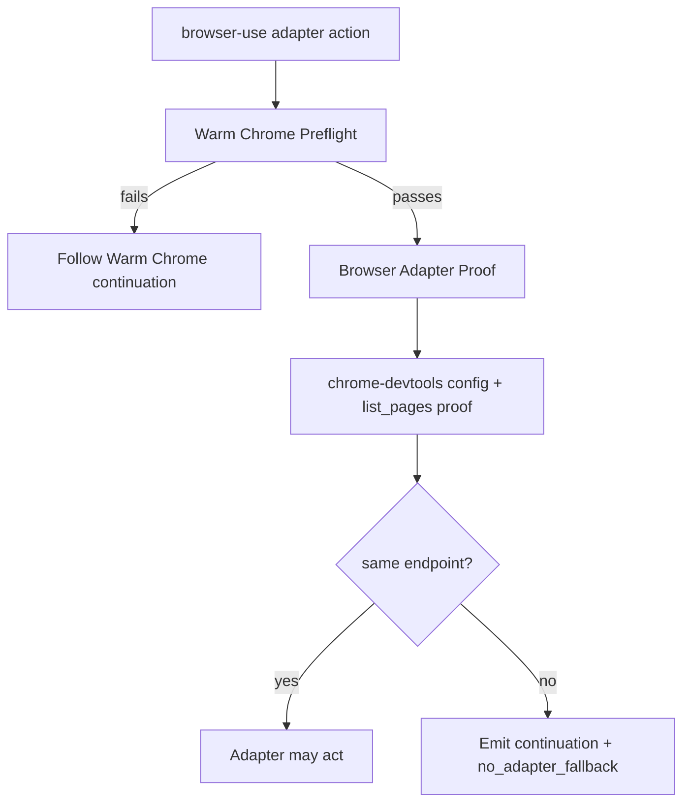

# fix: Add browser-use adapter proof observability

## Summary

Add a Chrome DevTools Browser Adapter Proof layer after Warm Chrome Preflight. Warm Chrome stays simple: fixed CDP convention on `9222`, dedicated profile convention at `~/.agent-warm-profile`, prove reality on each run, then prove `chrome-devtools` is attached to that verified endpoint.

This plan removes the abandoned Warm Chrome Binding direction. No port leases, no durable ownership record, no allocation range, no hidden fallback.

---

## Problem Frame

The current Warm Chrome work makes browser entry observable: real Google Chrome, dedicated profile, loopback CDP, CDP-on hard failure, and continuation guidance. The remaining failure is one layer later: a browser adapter can still point at stale config, a stale `DevToolsActivePort`, `9223`, Chrome for Testing, or a sticky daemon after Warm Chrome itself is healthy.

That is exactly what the handoff incident exposed. Warm Chrome was proven on `9222`, but the Chrome DevTools MCP path still tried `127.0.0.1:9223`. A fresh agent saw adapter failure and had to infer the config problem from symptoms. The right fix is not more lifecycle machinery. It is a read-only proof that the selected Browser Adapter is bound to the verified Warm Chrome endpoint, with enough observability for an agent to repair or stop cleanly.

The repo language also needs cleanup. `CONTEXT.md` and ADR `0008` still describe Warm Chrome Binding as planned work, while the current direction is fixed convention plus runtime proof. Leaving both stories alive will pull future agents back into over-engineering.

---

## Requirements

### Warm Chrome Convention

- R1. Browser-use uses `9222` as the CDP convention for this slice.
- R2. Browser-use uses `~/.agent-warm-profile` as the dedicated profile convention for this slice.
- R3. No implementation writes, reads, or documents a durable Warm Chrome Binding.
- R4. Existing Warm Chrome Preflight remains the browser-entry authority before any adapter action.
- R5. Chrome remote debugging disabled remains a hard browser-entry failure with docs URL and `no_adapter_fallback`.

### Browser Adapter Proof

- R6. A new Browser Adapter Proof command verifies `chrome-devtools` after Warm Chrome Preflight succeeds.
- R7. Current accepted adapter name is `chrome-devtools`.
- R8. `puppeteer-core` is documented as deterministic replay implementation detail, not a public adapter name.
- R9. Adapter proof is read-only by default. It does not navigate, open tabs, mutate adapter config, or edit user config.
- R10. Adapter proof success proves the adapter is bound to the same verified endpoint emitted by Warm Chrome Preflight and can list pages or tabs through that adapter.
- R11. Adapter proof records page and tab observations such as target count and safe URL/title summaries when available.
- R12. Blank-only, empty, or unknown page signals emit diagnostics or warnings, not hard failure, unless endpoint binding fails.
- R13. Adapter proof failures emit structured diagnostics, runtime actions, continuation, and `no_adapter_fallback`.
- R14. Smoke tests may open `https://example.com/`; proof commands do not navigate or require a known warm page.

### Adapter-Specific Behavior

- R15. `chrome-devtools` proof inspects mcporter config plus a bounded allowlist of known native MCP config sources read-only: repo/project `.mcp.json`, Claude Code user/project MCP config, Claude Desktop config, and Codex repo/user `config.toml`.
- R16. `chrome-devtools` accepts `--browserUrl http://127.0.0.1:9222` as the preferred binding.
- R17. `chrome-devtools` accepts `--auto-connect --userDataDir` only when `DevToolsActivePort` resolves to verified Warm Chrome.
- R18. `chrome-devtools` auto-detects binding mode and reports diagnostics; no public `--mode` flag.
- R19. Stale native MCP config is mode-aware: hard fail only when detection proves the selected path would use it; otherwise surface as a warning.
- R20. `agent-browser` proof is deferred outside this PR.
- R21. `playwright-cdp` proof is deferred outside this PR.
- R22. Docs may name future proof constraints, but the CLI contract does not accept future adapter values.

### Documentation And Test Matrix

- R23. `CONTEXT.md` removes `Warm Chrome Binding` and adds `Browser Adapter Proof`.
- R24. ADR `0008` is marked superseded or rejected by the simple convention decision.
- R25. A new ADR records fixed CDP convention plus runtime proof as the current decision.
- R26. `skills/browser-use/SKILL.md`, `references/warm-chrome.md`, `references/browser-adapter-chrome-devtools.md`, and `PROVENANCE.md` use the same terminology.
- R27. `skills/browser-use/TEST_MATRIX.md` is a human/agent runnable case-per-heading checklist covering browser-entry and adapter-proof cases, with `https://example.com/` smoke navigation.

---

## Key Technical Decisions

- **Browser Adapter Proof, not adapter preflight.** Warm Chrome Preflight already means browser-entry readiness. The new term names the second proof: selected adapter attachment to verified Warm Chrome.
- **Convention over binding.** Use `9222` and `~/.agent-warm-profile` as the current simple convention. Detect and explain conflicts instead of allocating or leasing ports.
- **Proof is observational.** The proof command inspects config and runs minimal attach/list checks. Navigation belongs to smoke matrix cases so routine proof stays low impact.
- **One implemented adapter vocabulary.** Public contract value for this PR is Chrome DevTools. agent-browser and Playwright-CDP remain future proof targets. Puppeteer-core remains a replay implementation detail because the public adapter proof must prove the named adapter, not any CDP client.
- **Mode-aware stale config without a mode flag.** Chrome DevTools proof auto-detects mcporter/native MCP binding surfaces and reports observed mode diagnostics. Stale native MCP config should not block a healthy mcporter CLI path, but it must hard fail when detection proves the selected path would use stale native MCP config.
- **Warnings stay diagnostic.** Successful proof keeps `status: "ok"`. Non-blocking findings live under `data.diagnostics.warnings[]` with adapter-specific `docs_url`; they are not runtime actions and do not create a degraded status.
- **Explicit inputs are current-run inputs.** Browser Adapter Proof examples use `--port 9222`, but the command accepts `--port` and `--endpoint` to match Warm Chrome Preflight. Neither creates a durable binding.
- **No silent repair.** Adapter proof may recommend repair with exact observed config source. It must not edit native MCP user config, mcporter config, or agent-browser state by itself.
- **No fallback escape.** If adapter proof fails, the agent must not switch to Chrome for Testing, Codex in-app browser, Playwright launch, AppleScript, GUI scripting, or macOS `open`.

---

## Decision Locks

1. Browser Adapter Proof runs Warm Chrome Preflight internally every time.
2. Browser Adapter Proof is read-only only.
3. Browser Adapter Proof gets a separate CLI.
4. Browser Adapter Proof uses the same facade envelope as Warm Chrome Preflight.
5. Chrome DevTools is one public adapter: `chrome-devtools`.
6. Chrome DevTools mode is diagnostics, not public API.
7. No Chrome DevTools `--mode` flag.
8. Stale native MCP config is a warning when mcporter is healthy.
9. Stale native MCP config is a hard fail when native MCP is the selected or only usable path.
10. Ambiguous Chrome DevTools binding is not silently green.
11. `agent-browser` is a future Browser Adapter Proof target, not an accepted CLI value in this PR.
12. `playwright-cdp` is a future Browser Adapter Proof target, not an accepted CLI value in this PR.
13. `puppeteer-core` is deterministic replay detail, not a public adapter.
14. Future `playwright-cdp` proof tries `playwright` first.
15. Future `playwright-cdp` proof tries `playwright-core` second.
16. Proof stays observational.
17. Proof does not navigate to `example.com`.
18. `example.com` belongs in smoke checklist cases.
19. Future agent-browser proof uses `get cdp-url`.
20. Future agent-browser proof also uses `tab list`.
21. Future agent-browser proof does not use snapshot by default.
22. Chrome DevTools proof uses config inspection.
23. Chrome DevTools proof also uses `list_pages`.
24. Chrome DevTools proof does not navigate.
25. Browser Adapter Proof accepts `--port` and `--endpoint`.
26. `--port` and `--endpoint` are current-run inputs only.
27. Browser Adapter Proof examples use `--port 9222`.
28. Keep one contract owner: `skills/browser-use/scripts/command-contract.ts`.
29. Add Browser Adapter Proof contract beside Warm Chrome contract.
30. Do not split into `adapter-command-contract.ts` in this slice.
31. Warnings live in `data.diagnostics.warnings[]`.
32. No degraded success status.
33. Warning findings are not `runtime_actions`.
34. Each warning may carry adapter-specific `docs_url`.
35. Use stable diagnostic codes.
36. Rename binding mismatch to `adapter_binding_mismatch`.
37. Add `adapter_binding_ambiguous`.
38. Split missing tool/runtime into `adapter_dependency_missing`.
39. Split missing config into `adapter_config_missing`.
40. Never run `mcporter daemon restart` inside proof.
41. Adapter-proof failures use `failure_domain: "browser_adapter_proof"`.
42. Warm Chrome failures stay `failure_domain: "browser_entry_handoff"`, even when surfaced by Browser Adapter Proof.
43. Adapter readiness failures use exit code `20` unless the facade contract establishes a better domain code.
44. Caller input mistakes use exit code `2`.
45. `preflight-browser-adapter.sh status` is a human-readable projection of `check`, not separate logic.
46. Plain output includes the same `continuation.next_action_id` as JSON.
47. Agent examples use `--json`; human examples use `--plain`.
48. Every smoke checklist case includes a `run_id`.
49. Adapter proof never installs dependencies.
50. Future `playwright-cdp` dependency checks use dynamic import only.
51. Adapter proof never launches a browser, including through Playwright defaults.
52. Config-source paths are reported as source labels where possible, not noisy full home paths.
53. Exact bad port values such as `9223` are reported because they are useful and not secret.
54. Websocket debugger URLs are never printed.
55. Full Chrome or adapter command lines are never printed.
56. Native config parse errors become diagnostics, not crashes.
57. Missing optional config files are neutral, not warnings.
58. Ambiguous config fails only when it blocks proving the selected path.
59. Unit tests mock adapter command runners; they do not require installed adapter tools.
60. Live adapter smoke belongs only in `TEST_MATRIX.md`, not CI.
61. The executable remains `preflight-browser-adapter.sh`; the domain term remains Browser Adapter Proof.
62. Browser Adapter Proof success uses `use_verified_browser_adapter`.
63. Adapter config continuations split by side effect: `inspect_adapter_config` for read-only investigation and `update_adapter_config` for external config edits.
64. Do not use `repair_adapter_config`; "repair" implies a proof-command capability this slice forbids.
65. Config source labels are stable contract values owned by `skills/browser-use/scripts/command-contract.ts`.
66. Initial config source labels are `mcporter`, `repo_mcp`, `native_mcp_claude_code`, `native_mcp_claude_desktop`, `native_mcp_codex`, and `native_mcp_unknown`.
67. Scope, path hints, parse status, and binding details are separate diagnostic fields, not encoded into source labels.
68. Adapter proof uses bounded deadline `chrome-devtools` 8000ms.
69. Adapter proof timeout fails with `adapter_proof_timeout`, `failure_domain: "browser_adapter_proof"`, exit code `20`, adapter-specific continuation, and `no_adapter_fallback`.
70. Timeout is never a warning or `adapter_signal_weak`; proof did not complete.
71. Ambiguous Chrome DevTools config fails only when proof cannot identify one proofable selected invocation surface bound to verified Warm Chrome.
72. A proofable selected invocation surface is the concrete adapter path the command can hand off for browser action after it has listed pages or tabs through the verified Warm Chrome endpoint.
73. Adapter proof exposes the internally invoked Warm Chrome Preflight run id.
74. Adapter proof generates a run id when none is supplied.
75. Adapter proof diagnostics include elapsed time per major phase.
76. Adapter command non-zero exit is distinct from timeout.
77. Adapter unparsable output is distinct from command failure.
78. Adapter proof invokes Warm Chrome Preflight in-process through shared runtime helpers, not by shelling to the CLI.
79. Input validation failures do not spawn adapter subprocesses.
80. Config parsers are pure functions with fixture tests.
81. Missing `bunx` or `mcporter` is `adapter_dependency_missing`, not `adapter_config_missing`.
82. Unit and fixture tests do not edit user config files.

---

## High-Level Technical Design

The proof command composes with Warm Chrome Preflight instead of replacing it. Warm Chrome proves the browser environment. Browser Adapter Proof proves adapter attachment to that environment.

Future slices add `agent-browser` and `playwright-cdp` branches after their proof semantics are implemented.

---

## Implementation Units

### U1. Glossary And ADR Cleanup

- **Goal:** Remove the obsolete binding story and install the current language before adding more contract surface.
- **Requirements:** R1, R2, R3, R23, R24, R25
- **Files:**
  - `CONTEXT.md`
  - `docs/adr/0008-browser-use-owns-warm-chrome-binding-lifecycle.md`
  - `docs/adr/0009-browser-use-fixed-cdp-convention-and-runtime-proof.md`
  - `skills/browser-use/docs/plans/2026-06-01-003-fix-warm-chrome-port-lifecycle-plan.md`
- **Approach:** Delete the `Warm Chrome Binding` glossary entry. Add `Browser Adapter Proof` as a glossary term: a read-only `browser-use` proof that a Browser Adapter is attached to verified Warm Chrome. Mark ADR `0008` superseded/rejected and add a short replacement ADR for fixed CDP convention plus runtime proof. Update the active port-lifecycle plan so future readers do not treat binding/allocation as active scope.
- **Test Scenarios:**
  - Search finds no active glossary definition for `Warm Chrome Binding`.
  - Search finds `Browser Adapter Proof` as the canonical second-stage proof term.
  - ADR `0008` status no longer reads `proposed`.
  - New ADR states no durable binding, no leases, no allocation range.
  - No doc says `9444` or `9223` is a live default for this slice.
- **Verification:** Markdown scan for obsolete binding language and candidate-port defaults.

### U2. Browser Adapter Proof Facade Contract

- **Goal:** Add an executable, agent-native contract for adapter proof without duplicating Warm Chrome readiness policy.
- **Requirements:** R4, R6, R7, R8, R9, R10, R11, R12, R13, R14
- **Files:**
  - `skills/browser-use/scripts/command-contract.ts`
  - `skills/browser-use/scripts/preflight-browser-adapter.ts`
  - `skills/browser-use/scripts/preflight-browser-adapter.sh`
  - `skills/browser-use/scripts/preflight-browser-adapter.test.ts`
- **Approach:** Keep `skills/browser-use/scripts/command-contract.ts` as the single public contract owner. Add Browser Adapter Proof constants, types, actions, and `browserAdapterProofContracts` beside `warmChromePreflightContracts`; do not add an index or split contract modules in this slice. Add `check` and `status` command-owned flags `--adapter`, `--port`, `--endpoint`, `--json`, and `--plain`; keep facade-owned diagnostic flags `--debug`, `--quiet`, and `--run-id` out of `CommandFacadeContract.flags`. Do not add a Chrome DevTools `--mode` flag. The proof command runs Warm Chrome Preflight first through existing runtime helpers, then dispatches `chrome-devtools` proof. `status` is a human-readable projection of `check`, not separate proof logic. Success keeps `status: "ok"` and `continuation.next_action_id: "use_verified_browser_adapter"`. Non-blocking findings live in `data.diagnostics.warnings[]` with adapter-specific `docs_url`; blocking adapter findings emit `failure_domain: "browser_adapter_proof"` and an error envelope with `no_adapter_fallback`. Warm Chrome failures surfaced by adapter proof keep `failure_domain: "browser_entry_handoff"`. Plain output must name the same `continuation.next_action_id` as JSON.
- **Runtime Actions:** Add `use_verified_browser_adapter` with summary "Use the selected Browser Adapter against the verified Warm Chrome endpoint." Adapter config continuations split by side effect: `inspect_adapter_config` for read-only investigation and `update_adapter_config` for proven stale or missing config requiring an external config edit. Proof never performs the write.
- **Failure Codes:** Use stable diagnostic codes: `adapter_config_stale`, `adapter_config_missing`, `adapter_dependency_missing`, `adapter_binding_mismatch`, `adapter_binding_ambiguous`, `adapter_signal_weak`, `adapter_chrome_for_testing_risk`, `adapter_auto_launch_risk`, and `adapter_proof_timeout`. Warnings reuse diagnostic codes with `severity: "warning"`; do not create warning-only code variants. Runtime action, not code name, decides continuation.
- **Timeouts:** Adapter proof uses bounded deadline for blocking adapter operations: `chrome-devtools` 8000ms. Deadline expiry fails proof with `adapter_proof_timeout`, `failure_domain: "browser_adapter_proof"`, exit code `20`, adapter-specific continuation, and `no_adapter_fallback`. Warm Chrome timeout remains `failure_domain: "browser_entry_handoff"` when Warm Chrome Preflight fails before adapter dispatch.
- **Runtime Shape:** Invoke Warm Chrome Preflight in-process through shared runtime helpers, not by shelling to the CLI. Adapter proof emits or generates a run id and exposes the internally invoked Warm Chrome Preflight run id. Diagnostics include elapsed time for major phases. Input validation failures stop before adapter subprocesses are spawned.
- **Command Failures:** Classify adapter timeout, non-zero adapter exit, and unparsable adapter output separately. Timeout uses `adapter_proof_timeout`; non-zero exit and unparsable output should be distinct diagnostic codes selected during implementation without collapsing into config stale.
- **Test Scenarios:**
  - Contract validates through `defineCommandFacadeContract`.
  - Missing `--adapter` is an input failure with `change_adapter_input`.
  - Unknown adapter is an input failure with supported adapter values.
  - Warm Chrome failure is surfaced as browser-entry handoff and stops adapter proof.
  - Success emits `continuation.next_action_id: "use_verified_browser_adapter"`.
  - Adapter readiness failures use exit code `20`.
  - Caller input mistakes use exit code `2`.
  - Non-blocking findings appear under `data.diagnostics.warnings[]`, not `runtime_actions`.
  - Adapter failure emits `no_adapter_fallback`.
  - Adapter command timeout fails with `adapter_proof_timeout`, `failure_domain: "browser_adapter_proof"`, exit code `20`, and `no_adapter_fallback`.
  - Adapter command non-zero exit is not classified as timeout.
  - Adapter unparsable output is not classified as command failure.
  - `--port` and `--endpoint` are explicit current-run inputs and create no durable binding.
  - Missing `bunx` or `mcporter` is `adapter_dependency_missing`, not `adapter_config_missing`.
  - Input validation failures do not spawn adapter subprocesses.
  - Debug and quiet modes preserve stdout/stderr discipline.
  - Output includes adapter proof run id, child Warm Chrome Preflight run id, and elapsed phase timings.
  - Diagnostics do not include secrets, full command lines, websocket paths, or profile internals.
  - Websocket debugger URLs and full Chrome/adapter command lines are never printed.
  - Bad port values such as `9223` are reported when they explain the failure.
- **Verification:** Focused adapter proof test file, script type check, and facade validation.

### U3. Chrome DevTools Adapter Proof

- **Goal:** Make stale Chrome DevTools MCP and mcporter bindings obvious before adapter work.
- **Requirements:** R10, R11, R12, R13, R15, R16, R17, R18, R19
- **Files:**
  - `skills/browser-use/scripts/preflight-browser-adapter.ts`
  - `skills/browser-use/scripts/preflight-browser-adapter.test.ts`
  - `skills/browser-use/references/browser-adapter-chrome-devtools.md`
- **Approach:** Add a read-only inspector for `bunx mcporter config get chrome-devtools --json` plus bounded known native MCP config sources. Prefer the proofable mcporter path when it is configured, runnable, and bound to the verified endpoint. Emit Chrome DevTools mode diagnostics with observed config sources, observed mode, and selected binding source. Report config sources with stable labels: `mcporter`, `repo_mcp`, `native_mcp_claude_code`, `native_mcp_claude_desktop`, `native_mcp_codex`, or `native_mcp_unknown`. Use separate fields for scope, safe path hints, parse status, and observed binding. Missing optional config files are neutral. Native config parse errors become diagnostics, not crashes. Accept `--auto-connect --userDataDir` only when the referenced `DevToolsActivePort` resolves to the verified endpoint. Treat selected path as the proofable invocation surface the command can hand off for adapter action. If mcporter is configured, runnable, bound to the verified endpoint, and `list_pages` succeeds through mcporter, mcporter is selected and stale native MCP config is a warning. If native MCP is the only runnable/effective surface, or proof cannot determine whether the next adapter action will use mcporter or native MCP, native MCP ambiguity is blocking. Use `adapter_binding_ambiguous` when conflicting viable surfaces prevent a safe handoff; use warning diagnostics when a non-selected surface is stale or malformed. On `list_pages` failure, do not run `mcporter daemon restart`; report the observed config source, failure class, and explicit repair guidance.
- **Test Scenarios:**
  - mcporter config pinned to `9222` passes.
  - mcporter config pinned to `9223` fails with `adapter_config_stale`.
  - `--auto-connect --userDataDir` with `DevToolsActivePort` resolving to `9222` passes.
  - `DevToolsActivePort` resolving to `9223` fails with `adapter_config_stale`.
  - Native MCP stale plus mcporter healthy emits warning in mcporter mode.
  - Native MCP stale in native mode hard fails.
  - Ambiguous mcporter/native path emits `adapter_binding_ambiguous`.
  - Proven stale or missing adapter config points at `update_adapter_config`, not `repair_adapter_config`.
  - Ambiguous or sticky-daemon cases point at `inspect_adapter_config`.
  - Config source diagnostics use stable labels, with scope/path hints in separate fields.
  - Config parser helpers are pure functions with fixture tests.
  - Missing optional native config file emits no warning.
  - Malformed native config emits diagnostic warning or error, not a thrown exception.
  - Missing mcporter config reports `adapter_config_missing` without `hint.docs_url`.
  - `list_pages` failure reports the observed config source and next action.
  - `list_pages` failure does not invoke `mcporter daemon restart`.
  - Blank-only or empty page list emits `adapter_signal_weak` warning.
- **Verification:** Mocked config-source tests; optional live smoke row for current machine state.

### U4. Deferred agent-browser Adapter Proof

- **Status:** Deferred follow-up, outside this PR.
- **Goal:** Prevent agent-browser from silently using Chrome for Testing, a sticky daemon, or an unpinned CDP connection.
- **Requirements:** R10, R11, R12, R13, R20, R21
- **Files:**
  - `skills/browser-use/scripts/preflight-browser-adapter.ts`
  - `skills/browser-use/scripts/preflight-browser-adapter.test.ts`
  - `skills/browser-use/SKILL.md`
  - `skills/browser-use/references/warm-chrome.md`
- **Approach:** Require `--session` for proof. Run minimal read-only commands with `--session "$S" --headed --cdp "$PORT"`: `get cdp-url` proves endpoint attachment and `tab list` proves the adapter can see Warm Chrome tabs. Treat `connect <port>` alone as insufficient observability. Reject output that indicates Chrome for Testing or an auto-launched profile. Blank-only, empty, or unknown tab signals are warnings unless endpoint binding fails.
- **Test Scenarios:**
  - Missing `--session` fails with `change_adapter_input`.
  - `get cdp-url` containing `9222` passes.
  - `get cdp-url` containing `9223` fails with `adapter_binding_mismatch`.
  - `tab list` succeeds through the same adapter before proof passes.
  - Blank-only or empty tab list emits `adapter_signal_weak` warning.
  - Command output indicating Chrome for Testing fails with `adapter_chrome_for_testing_risk`.
  - Auto-launch or `--profile` guidance fails with `adapter_auto_launch_risk`.
  - Sticky daemon suspicion emits `inspect_adapter_config`.
  - Docs say every proof-grade agent-browser command uses `--cdp "$PORT"`.
- **Verification:** Mocked command-runner tests; live smoke only when agent-browser is installed and a session is available.

### U5. Deferred Playwright CDP Adapter Proof

- **Status:** Deferred follow-up, outside this PR.
- **Goal:** Support Playwright CDP as an attachment path, not a browser launch path.
- **Requirements:** R7, R8, R10, R11, R22
- **Files:**
  - `skills/browser-use/scripts/preflight-browser-adapter.ts`
  - `skills/browser-use/scripts/preflight-browser-adapter.test.ts`
  - `skills/browser-use/SKILL.md`
  - `skills/browser-use/references/warm-chrome.md`
- **Approach:** Model `playwright-cdp` proof as Playwright `connectOverCDP` against the verified endpoint. Resolve the runtime by dynamic-importing `playwright`, then `playwright-core`; either package may satisfy `playwright-cdp` when it exposes `chromium.connectOverCDP` and attaches to Warm Chrome. If neither resolves, fail with `adapter_dependency_missing` and setup guidance rather than adding or installing a dependency in this slice. Do not use `puppeteer-core.connect()` to satisfy `playwright-cdp`; keep `puppeteer-core` documented only as deterministic replay implementation detail against a verified endpoint. The proof must never call Playwright launch APIs or trigger a browser launch.
- **Test Scenarios:**
  - CDP attach to `http://127.0.0.1:9222` passes when runtime is available.
  - Missing Playwright runtime fails with `adapter_dependency_missing`.
  - Dependency checks use dynamic import and do not install packages.
  - Any launch-path config or command is rejected with `adapter_auto_launch_risk`.
  - Proof does not call Playwright launch APIs.
  - A CDP attach target on another port fails with `adapter_binding_mismatch`.
  - Docs do not name `puppeteer-core` as a public adapter.
  - `puppeteer-core.connect()` does not satisfy `playwright-cdp`.
  - Docs still allow `puppeteer-core` only for deterministic replay against verified endpoint.
- **Verification:** Mocked dependency-resolution and attach tests; no package manifest mutation unless separately approved.

### U6. Skill Docs, Provenance, And Test Matrix

- **Goal:** Make the skill, provenance, and repeatable live matrix teach the new two-proof flow.
- **Requirements:** R23, R26, R27
- **Files:**
  - `skills/browser-use/SKILL.md`
  - `skills/browser-use/references/warm-chrome.md`
  - `skills/browser-use/references/browser-adapter-chrome-devtools.md`
  - `skills/browser-use/PROVENANCE.md`
  - `skills/browser-use/TEST_MATRIX.md`
- **Approach:** Update skill docs to say Warm Chrome Preflight first, Browser Adapter Proof second, adapter action third. Keep deterministic contracts in code; docs explain precedence and stop conditions only. Update provenance to list `chrome-devtools` as the current proof adapter and `agent-browser` / `playwright-cdp` as future proof targets. Update `TEST_MATRIX.md` from a table to a case-per-heading checklist. Each case uses stable `case_id`, `kind`, `status`, `run_id`, optional `adapter`, `side_effects`, `requires`, `setup`, `run`, `expect`, `observe`, `record`, and `cleanup` fields. Use checkboxes for human-run steps and key-value metadata for agent parsing. Keep `https://example.com/` navigation only in explicit smoke cases. Use `--json` in agent examples and `--plain` in human examples.
- **Test Scenarios:**
  - Skill frontmatter remains YAML-parseable.
  - Docs contain `Browser Adapter Proof`.
  - Docs do not contain `adapter preflight` as canonical term.
  - Docs do not present `9444` or `9223` as live defaults.
  - Test matrix includes Chrome closed, CDP off, wrong listener, Warm Chrome healthy, Chrome DevTools stale config, agent-browser pinned, agent-browser missing `--cdp`, Playwright-CDP attach, Playwright launch rejected.
  - Smoke cases open `https://example.com/`.
  - Every smoke case includes a `run_id`.
  - Cleanup checklists restore no extra listener/process state.
- **Verification:** Doc scan plus focused markdown/YAML checks.

### U7. Regression Verification

- **Goal:** Prove the change lands without regressing existing Warm Chrome continuation work.
- **Requirements:** R1-R27
- **Files:**
  - `skills/browser-use/scripts/preflight-warm-chrome.test.ts`
  - `skills/browser-use/scripts/preflight-browser-adapter.test.ts`
  - `skills/browser-use/scripts/preflight-warm-chrome.ts`
  - `skills/browser-use/scripts/preflight-browser-adapter.ts`
  - `skills/browser-use/scripts/command-contract.ts`
- **Approach:** Run the focused Warm Chrome tests, focused adapter proof tests, TypeScript check, and Biome lint check. Use MCP runners where available. Keep live smoke matrix separate from unit tests because it touches local Chrome state.
- **Test Scenarios:**
  - Existing Warm Chrome preflight tests stay green.
  - New Browser Adapter Proof tests pass.
  - TypeScript check passes for browser-use scripts.
  - Biome lint check reports no issues.
  - Live smoke matrix can reproduce CDP-off hard fail and stale adapter config observability.
  - User config is not mutated by unit tests.
  - Unit tests mock adapter command runners and do not require installed adapter tools.
  - Unit and fixture tests do not edit user config files.
  - Live adapter smoke stays in `TEST_MATRIX.md`, not CI.
- **Verification:** Runner output plus updated `TEST_MATRIX.md` observations.

---

## Acceptance Examples

- AE1. Given Chrome remote debugging is off, when Warm Chrome Preflight runs, then it fails hard with `enable_remote_debugging`, docs URL, and `no_adapter_fallback`; Browser Adapter Proof does not run.
- AE2. Given Warm Chrome is healthy on `9222` and mcporter points at `9223`, when `chrome-devtools` proof runs, then it fails with `adapter_config_stale`, observed source, no `hint.docs_url`, and `update_adapter_config`.
- AE3. Given Warm Chrome is healthy on `9222`, mcporter is pinned to `9222`, and native MCP config is stale, when the selected path is mcporter, then proof passes with a warning.
- AE4. Given the selected path is native Chrome DevTools MCP and native config points at stale `9223`, when proof runs, then it hard fails.
- AE5. Future: Given agent-browser can report `get cdp-url` for `9222`, when proof runs with `--session`, `--headed`, and `--cdp 9222`, then it passes.
- AE6. Future: Given agent-browser would auto-launch or use Chrome for Testing, when proof runs, then it fails with `adapter_auto_launch_risk` or `adapter_chrome_for_testing_risk`.
- AE7. Future: Given Playwright-CDP proof detects a launch path instead of CDP attach, when proof runs, then it fails and forbids adapter fallback.
- AE8. Given a smoke run is requested, when the matrix case executes, then the adapter opens or navigates to `https://example.com/` and cleanup leaves no extra listener state.

---

## System-Wide Impact

- **Agent reliability:** Fresh agents get a concrete explanation for stale adapter bindings instead of guessing from connection errors.
- **Domain language:** Warm Chrome Binding is retired; Browser Adapter Proof becomes the canonical second-stage term.
- **Browser safety:** The no-fallback guarantee now covers adapter readiness, not only browser-entry readiness.
- **Config safety:** The proof reads user config and recommends repair, but does not mutate config silently.
- **Future browser-domain-memory:** Replay can depend on a verified adapter capability instead of owning browser readiness checks.

---

## Risks & Dependencies

- **Native MCP config shape drift:** Native MCP user config may change shape across hosts. Keep inspector defensive and read-only; emit diagnostics instead of crashing on unknown shapes.
- **agent-browser availability:** Some environments may not have `agent-browser` installed or session registry entries available. Treat that as `adapter_dependency_missing`, not a browser-entry failure.
- **Playwright-CDP dependency boundary:** Do not add Playwright dependencies in this slice without approval. The proof can report missing runtime cleanly.
- **Docs duplication:** Avoid copying action lists into prose. Deterministic action names live in `command-contract.ts` and runtime tests.
- **Live smoke side effects:** Matrix cases that open `https://example.com/` touch real Chrome. Keep them explicit and include cleanup.
- **Dirty worktree:** Existing browser-use files are already modified. Implementation must preserve unrelated user changes.

---

## Sources

- `skills/browser-use/docs/brainstorms/2026-05-30-browse-play-record-replay-requirements.md`
- `skills/browser-use/docs/research/2026-05-30-browser-use-warm-chrome-findings.md`
- `skills/browser-use/docs/plans/2026-06-01-002-fix-browser-use-preflight-agent-feedback-plan.md`
- `skills/browser-use/docs/plans/2026-06-01-003-fix-warm-chrome-port-lifecycle-plan.md`
- `skills/browser-use/docs/plans/2026-06-01-004-fix-warm-chrome-runtime-continuation-plan.md`
- `CONTEXT.md`
- `docs/adr/0006-warm-chrome-via-dedicated-debug-profile.md`
- `docs/adr/0008-browser-use-owns-warm-chrome-binding-lifecycle.md`
- `skills/browser-use/SKILL.md`
- `skills/browser-use/references/warm-chrome.md`
- `skills/browser-use/references/browser-adapter-chrome-devtools.md`
- `skills/browser-use/scripts/command-contract.ts`
- `skills/browser-use/scripts/preflight-warm-chrome.ts`
- `skills/browser-use/scripts/preflight-warm-chrome.test.ts`
