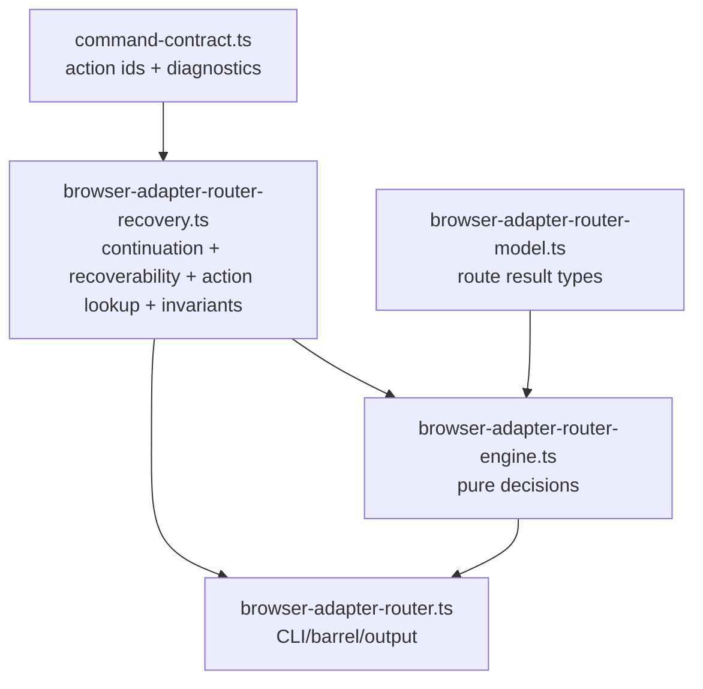

# refactor: Router recovery metadata module

## Summary

Move Browser Adapter Router recovery metadata into one runtime module. Keep routing policy pure, keep CLI output assembly in the CLI barrel, and make continuation, recoverability, runtime action lookup, route-validity constraints, and structured error validation share one owner.

## Problem Frame

Router recovery metadata is split after the engine and model seams:

- `browser-adapter-router-engine.ts` owns `continuationForCode`.
- `browser-adapter-router.ts` owns `recoverabilityForCode`.
- `browser-adapter-router.ts` owns runtime action lookup.
- `browser-adapter-router.ts` owns route validity constraints.
- `browser-adapter-router.ts` owns structured error validation helpers.
- `command-contract.ts` owns action vocabulary.

This is correct today, but the ownership boundary is harder than it needs to be. A new diagnostic code must update continuation, recoverability, action affordances, error envelope invariants, and tests across files. The next refactor should make that one checkable recovery metadata seam.

## Scope

- Create one Router recovery metadata module.
- Move Router continuation mapping into that module.
- Move Router recoverability mapping into that module.
- Move Router runtime action lookup into that module.
- Move route-validity constraint construction into that module.
- Centralize structured Router error invariant validation.
- Preserve `browser-adapter-router.ts` public compatibility exports where they already exist.
- Preserve command-contract action vocabulary in `command-contract.ts`.
- Preserve route evaluation behavior.
- Preserve CLI output shape and exit codes.

## Out Of Scope

- Do not change Warm Chrome Preflight recovery.
- Do not change Browser Adapter Proof recovery.
- Do not rename diagnostic codes.
- Do not change `runtime_actions` ids.
- Do not change `continuation.next_action_id` semantics.
- Do not add a `verify` command.
- Do not move report discovery.
- Do not widen Router policy or degraded-mode behavior.

## Requirements

- R1. Recovery metadata has one Router runtime owner.
- R2. Every Router diagnostic code maps to one continuation action.
- R3. Every Router diagnostic code maps to one structured error recoverability value.
- R4. Route and report failures use the same continuation mapping.
- R5. Runtime action lookup accepts only declared Router action ids.
- R6. JSON failure envelopes include a continuation action that exists in emitted `runtime_actions` unless the path is operator-only.
- R7. Route failure envelopes keep route-validity constraints.
- R8. Usage and runtime CLI errors keep existing facade behavior.
- R9. Compile-time exhaustiveness fails when a new Router diagnostic code lacks recovery metadata.
- R10. Tests prove continuation, recoverability, action lookup, and structured error validation share the same module.

## Key Decisions

- Keep `command-contract.ts` as action vocabulary owner.
- Add `browser-adapter-router-recovery.ts` as metadata and projection owner.
- Keep `browser-adapter-router-engine.ts` responsible for route decisions, not CLI envelope construction.
- Let the engine import only `continuationForCode` from recovery metadata.
- Let the CLI import recovery helpers for JSON/plain projection.
- Keep `StructuredRuntimeError` construction in the CLI unless the helper can reduce duplication without hiding output shape.
- Export focused helpers, not broad objects.

## Target Shape

## Files

- Modify: `skills/browser-use/scripts/browser-adapter-router.ts`
- Modify: `skills/browser-use/scripts/browser-adapter-router-engine.ts`
- Modify: `skills/browser-use/scripts/browser-adapter-router.test.ts`
- Create: `skills/browser-use/scripts/browser-adapter-router-recovery.ts`
- Possibly modify: `skills/browser-use/scripts/browser-adapter-router-model.ts`
- Possibly modify: `skills/browser-use/SKILL.md`
- Do not modify: `skills/browser-use/scripts/command-contract.ts` unless type imports require a harmless export reshuffle.

## Existing Patterns

- `browser-adapter-router-model.ts` owns shared Router shapes and re-exports contract-derived ids.
- `browser-adapter-router-engine.ts` owns pure route evaluation.
- `browser-adapter-router.ts` is CLI, discovery, validation, rendering, and compatibility barrel.
- `command-contract.ts` owns exact action affordances and command facade contracts.
- `validateStructuredRuntimeError` validates facade-shaped errors before output.
- `browser-adapter-router.test.ts` groups recovery tests under `U3 research recovery`.

## Implementation Units

### U1. Add Router Recovery Metadata Module

Goal: Create the recovery seam without changing behavior.

Files:

- Create: `skills/browser-use/scripts/browser-adapter-router-recovery.ts`
- Modify: `skills/browser-use/scripts/browser-adapter-router-engine.ts`
- Modify: `skills/browser-use/scripts/browser-adapter-router.ts`

Approach:

- Move `continuationForCode` from `browser-adapter-router-engine.ts`.
- Move `recoverabilityForCode` from `browser-adapter-router.ts`.
- Keep the exhaustiveness guard in the new module.
- Export `continuationForCode`.
- Export `recoverabilityForCode`.
- Import `continuationForCode` into `browser-adapter-router-engine.ts`.
- Import both helpers into `browser-adapter-router.ts`.
- Preserve existing public re-export from `browser-adapter-router.ts` if tests or callers import `continuationForCode` there.

Test Scenarios:

- New diagnostic code without a mapping fails TypeScript exhaustiveness.
- Existing route failure codes produce unchanged `next_action_id`.
- Existing JSON failure envelopes keep unchanged `error.recoverability`.

Verification:

- `cd skills/browser-use/scripts && bunx --bun tsc --noEmit -p tsconfig.json`
- `cd skills/browser-use/scripts && bun test browser-adapter-router.test.ts`

### U2. Centralize Runtime Action Projection

Goal: Stop rebuilding Router action lookup in the CLI file.

Files:

- Modify: `skills/browser-use/scripts/browser-adapter-router-recovery.ts`
- Modify: `skills/browser-use/scripts/browser-adapter-router.ts`
- Modify: `skills/browser-use/scripts/browser-adapter-router.test.ts`

Approach:

- Move `routerRuntimeActions`, `routerRuntimeActionById`, and `runtimeAction` into the recovery module.
- Export `runtimeActionForId`.
- Accept only `RouterFailureActionId | RouterSuccessActionId`.
- Keep action vocabulary imported from `command-contract.ts`.
- Keep thrown error message stable enough for diagnostics, but do not add user-facing output dependence.

Test Scenarios:

- Success JSON emits `use_selected_browser_adapter` with the same summary and side effects.
- Failure JSON emits exactly one action matching `continuation.next_action_id`.
- Unknown action lookup is impossible at compile time for typed callers.

Verification:

- `cd skills/browser-use/scripts && bun test browser-adapter-router.test.ts`
- `bunx --bun @biomejs/biome check --diagnostic-level=error skills/browser-use/scripts/browser-adapter-router.ts skills/browser-use/scripts/browser-adapter-router-recovery.ts`

### U3. Centralize Shared Structured Error Invariants

Goal: Put Router-specific error envelope invariants next to recovery metadata.

Files:

- Modify: `skills/browser-use/scripts/browser-adapter-router-recovery.ts`
- Modify: `skills/browser-use/scripts/browser-adapter-router.ts`
- Modify: `skills/browser-use/scripts/browser-adapter-router.test.ts`

Approach:

- Move `validateErrorEnvelopeForTest` production equivalent if one exists, or add a production helper that wraps `validateStructuredRuntimeError`.
- Name the helper around Router error validation, not generic facade validation.
- Keep facade package as the source of generic structured error rules.
- Add a Router-specific check that continuation id exists in emitted runtime actions for Router fail-closed JSON envelopes.
- Add a Router-specific check that `routeValidityConstraint` appears on route failure and route success.
- Do not validate plain output through this helper.

Test Scenarios:

- Route failure JSON validates through Router recovery helper.
- Report failure JSON validates through Router recovery helper.
- Usage JSON error keeps a continuation.
- Route failure continuation id is present in `runtime_actions`.
- Route success continuation id is present in `runtime_actions`.
- Route success and route failure keep `route_validity` constraints.

Verification:

- `cd skills/browser-use/scripts && bun test browser-adapter-router.test.ts`
- `cd skills/browser-use/scripts && bun test`

### U4. Preserve CLI Barrel Compatibility

Goal: Keep public imports stable while the owner changes.

Files:

- Modify: `skills/browser-use/scripts/browser-adapter-router.ts`
- Modify: `skills/browser-use/scripts/browser-adapter-router.test.ts`
- Possibly modify: `skills/browser-use/SKILL.md`

Approach:

- Re-export recovery helpers from `browser-adapter-router.ts` only for existing public imports.
- Prefer direct internal imports from `browser-adapter-router-recovery.ts`.
- Update `SKILL.md` owner line only if it currently implies `browser-adapter-router.ts` owns recovery metadata.
- Avoid adding prose contracts for exact mappings.

Test Scenarios:

- Tests importing from `browser-adapter-router.ts` still compile.
- Tests importing directly from `browser-adapter-router-recovery.ts` prove new owner.
- No runtime module imports recovery metadata from the CLI barrel.

Verification:

- `rg -n 'from \"\\./browser-adapter-router\"' skills/browser-use/scripts/browser-adapter-router-engine.ts skills/browser-use/scripts/browser-adapter-router-recovery.ts`
- `cd skills/browser-use/scripts && bunx --bun tsc --noEmit -p tsconfig.json`

## Test Plan

- Run focused TypeScript:
  - `cd skills/browser-use/scripts && bunx --bun tsc --noEmit -p tsconfig.json`
- Run focused Router tests:
  - `cd skills/browser-use/scripts && bun test browser-adapter-router.test.ts`
- Run full browser-use script tests:
  - `cd skills/browser-use/scripts && bun test`
- Run formatting/lint checks:
  - `bunx --bun @biomejs/biome check --diagnostic-level=error skills/browser-use/scripts/browser-adapter-router.ts skills/browser-use/scripts/browser-adapter-router-recovery.ts skills/browser-use/scripts/browser-adapter-router-engine.ts skills/browser-use/scripts/browser-adapter-router.test.ts`
  - `bunx --bun @biomejs/biome lint --diagnostic-level=error .`
- Run diff hygiene:
  - `git diff --check`

## Risks

- Runtime action projection may become too broad if the new module starts constructing full CLI envelopes.
- Engine purity may blur if structured error output moves into the engine.
- Compatibility barrel may hide ownership if internal imports keep using `browser-adapter-router.ts`.
- Tests may only prove output shape, not ownership.

## Guardrails

- Keep recovery metadata module small.
- Keep CLI envelope assembly in `browser-adapter-router.ts`.
- Keep action vocabulary in `command-contract.ts`.
- Add ownership tests or `rg` verification for direct recovery imports.
- Preserve unrelated working-tree changes.
- Do not edit generated outputs.

## Completion Criteria

- One module owns Router recovery metadata.
- Engine imports continuation mapping from recovery metadata.
- CLI imports recoverability, runtime action projection, and invariants from recovery metadata.
- Public imports through `browser-adapter-router.ts` remain compatible.
- Focused and full Router checks pass.
- No unrelated plan or docs changes are staged with implementation.
