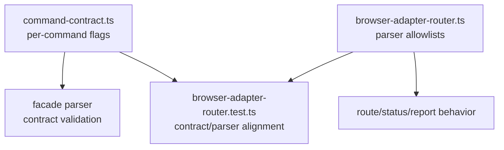

# refactor: Router command discovery flags

## Summary

Narrow Browser Adapter Router command flags per command. Keep `route` and `status`
from advertising report-only flags. Add a contract/parser alignment test so the
facade contract and CLI parser cannot drift silently.

Use `skills/browser-use/docs/plans/2026-06-02-004-design-browser-use-adapter-router-plan.md` as the
retrospective anchor: this slice must narrow discovery metadata without changing
evidence-first routing, report discovery, or envelope input semantics.

---

## Problem Frame

Router command contract currently shares one flag object across all commands:

- `route` publishes `--envelope`, `--adapter`, `--capability`, `--json`, and `--plain`.
- `report` publishes `--envelope`, `--adapter`, `--capability`, `--json`, and `--plain`.
- `status` publishes `--envelope`, `--adapter`, `--capability`, `--json`, and `--plain`.
- Parser accepts `--adapter` and `--capability` only for `report`.
- Parser accepts `--envelope` only for `route` and `status`.

This makes the Router's Command discovery capability wider than runtime
acceptance. Agents reading discovery metadata can attempt flags the parser
rejects.

---

## Scope

- Split Router flags by command.
- Keep shared JSON/plain flags where useful.
- Keep `route` flags to envelope input and output mode.
- Keep `status` flags to envelope input and output mode.
- Keep `report` flags to adapter, optional capability, and output mode.
- Add tests that compare command-contract flags with accepted parser flags.
- Add tests that compare rendered command help with command-specific flags.
- Preserve existing command names.
- Preserve existing output envelopes.
- Preserve existing exit codes.
- Preserve the origin invariant that `report --capability` is report projection, not routable truth.
- Preserve the origin invariant that `route` and `status` consume an evidence envelope by optional path, stdin, or existing runtime input path.

## Out Of Scope

- Do not change route evidence envelope shape.
- Do not make `--envelope` required.
- Do not change report discovery behavior.
- Do not promote `report --capability` output into routing evidence.
- Do not add `prepare`, `verify`, or report execution.
- Do not change Router policy semantics.
- Do not change recovery metadata.
- Do not change Warm Chrome Preflight or Browser Adapter Proof contracts.

### Deferred to Follow-Up Work

- Consider extracting parser allowlists into contract-derived helpers only if future Router commands add more flag combinations.
- Consider broader command facade drift checks across Warm Chrome Preflight and Browser Adapter Proof after this Router-specific contract is proven.

---

## Owners

- Contract owner: `skills/browser-use/scripts/command-contract.ts`
- Parser owner: `skills/browser-use/scripts/browser-adapter-router.ts`
- Test owner: `skills/browser-use/scripts/browser-adapter-router.test.ts`
- Runtime model owner: unchanged, `skills/browser-use/scripts/browser-adapter-router-model.ts`
- Engine owner: unchanged, `skills/browser-use/scripts/browser-adapter-router-engine.ts`
- Discovery owner: unchanged, `skills/browser-use/scripts/browser-adapter-router-discovery.ts`

---

## Requirements

- R1. `route` contract exposes `--envelope`, `--json`, and `--plain` only.
- R2. `status` contract exposes `--envelope`, `--json`, and `--plain` only.
- R3. `report` contract exposes `--adapter`, `--capability`, `--json`, and `--plain` only.
- R4. Parser accepted flags match the command contract for `route`.
- R5. Parser accepted flags match the command contract for `status`.
- R6. Parser accepted flags match the command contract for `report`.
- R7. Unknown flag rejection stays unchanged.
- R8. Existing command facade contract validation still passes.
- R9. Existing Router behavior tests still pass.
- R10. Rendered help for each Router command lists only that command's accepted flags.
- R11. Alignment tests prove both sides: advertised flags are accepted by the public CLI path, and command-specific foreign flags are rejected.

---

## Key Decisions

- **Keep exact flag vocabulary in `command-contract.ts`.** The facade contract feeds the Command discovery capability agents inspect, so each command should own the flag set it advertises.
- **Keep parser allowlists separate from discovery metadata.** The parser owns runtime acceptance through `rejectUnknownFlags`; contract edits must not silently widen accepted inputs.
- **Do not export parser internals only for tests.** Contract/parser alignment should be proven through public CLI behavior plus contract inspection so the test protects the actual Command discovery capability.
- **Treat rendered help as part of the contract.** `renderHelp` reads `browserAdapterRouterContracts`; a contract-only fix is incomplete if command help can still suggest rejected flags.
- **Leave runtime behavior untouched.** Route/status/report evaluation, output envelopes, and exit codes are already covered by existing Router tests and are outside this narrow contract correction.
- **Preserve evidence-first routing.** `report --capability` may project one capability report entry, but `route` still consumes supplied evidence and decides routability.
- **Preserve envelope input semantics.** Narrowing discovery metadata to `--envelope` does not make the flag mandatory; stdin and existing runtime-provided envelope input remain valid.

---

## Target Shape

---

## Files

- Modify: `skills/browser-use/scripts/command-contract.ts`
- Modify: `skills/browser-use/scripts/browser-adapter-router.test.ts`
- Possibly modify: `skills/browser-use/scripts/browser-adapter-router.ts`
- Do not modify: `skills/browser-use/scripts/browser-adapter-router-engine.ts`
- Do not modify: `skills/browser-use/scripts/browser-adapter-router-model.ts`
- Do not modify: `skills/browser-use/scripts/browser-adapter-router-discovery.ts`

---

## Existing Patterns

- `command-contract.ts` owns command facade metadata.
- `parseCommandFacadeContract` validates facade contract shape.
- `parseRouterArgv` accepts command-specific flags through `rejectUnknownFlags`.
- Existing tests assert route rejects diagnostic-reserved flags.
- Existing hardening tests assert `report` rejects `--envelope`.
- `renderHelp` renders from `browserAdapterRouterContracts`, so help assertions can prove public docs and contract metadata moved together.

---

## System-Wide Impact

- Command discovery capability narrows to the flags each command actually accepts.
- Runtime Router behavior stays unchanged because `parseRouterArgv`, route evaluation, report discovery, and status projection already reject or ignore no additional valid inputs.
- Failure behavior stays unchanged for invalid flags: usage errors continue to return the existing CLI error envelope and exit-code path.
- Help output changes for `route`, `status`, and `report` by removing flags that were never accepted by those commands.
- Capability-specific report output remains advisory report projection until supplied to `route` as validated evidence under the broader Browser Adapter Router plan.

---

## Risks & Dependencies

- **Contract/help mismatch:** Mitigate by asserting both `browserAdapterRouterContracts[command].flags` and command help output for the narrowed flags.
- **Parser drift remains hidden:** Mitigate by exercising invalid foreign flags through `runForTest`, not by testing private parser helpers.
- **Over-broad refactor:** Mitigate by keeping changes to contract definitions and focused tests unless the parser must expose a public behavior to make alignment testable.
- **Test fragility from exact help prose:** Mitigate by asserting presence/absence of flag names, not full rendered help snapshots.

---

## Implementation Units

### U1. Split Router Flag Contracts

**Goal:** Make command contracts describe only accepted flags.

**Requirements:** R1, R2, R3, R8, R10

**Dependencies:** None

**Files:**
- Modify: `skills/browser-use/scripts/command-contract.ts`
- Test: `skills/browser-use/scripts/browser-adapter-router.test.ts`

**Approach:**

- Extract shared output flags.
- Create `routerEnvelopeFlags`.
- Create `routerReportFlags`.
- Assign the same `routerEnvelopeFlags` object explicitly to route and status.
- Assign report flags from adapter, capability, plus output flags.
- Keep flag descriptions stable where possible.
- Do not derive parser allowlists from the contract objects in this refactor.
- Do not change report discovery, report projection, or route evaluation semantics.

**Patterns to follow:**

- Mirror the existing Warm Chrome Preflight split between focused flag objects such as `readFlags` and `writeFlags`.
- Keep the command facade metadata inside `defineCommandFacadeContract`.

**Test Scenarios:**

- Contract validation accepts `route`, `report`, and `status` after the flag split.
- Route contract contains `--envelope`, `--json`, and `--plain`; it omits `--adapter` and `--capability`.
- Status contract contains `--envelope`, `--json`, and `--plain`; it omits `--adapter` and `--capability`.
- Report contract contains `--adapter`, `--capability`, `--json`, and `--plain`; it omits `--envelope`.
- `route --help` and `status --help` show `--envelope` but do not show `--adapter` or `--capability`.
- `report --help` shows `--adapter` and `--capability` but does not show `--envelope`.

**Verification:**

- Focused Router tests pass.
- Command facade contract validation passes.
- Rendered help reflects command-specific flags.

### U2. Add Contract/Parser Alignment Tests

**Goal:** Prove contract flags and parser allowlists stay aligned.

**Requirements:** R4, R5, R6, R7, R8, R9, R10, R11

**Dependencies:** U1

**Files:**
- Modify: `skills/browser-use/scripts/browser-adapter-router.test.ts`
- Possibly modify: `skills/browser-use/scripts/browser-adapter-router.ts`

**Approach:**

- Add test helpers that inspect `browserAdapterRouterContracts[command].flags`.
- Exercise a command with each foreign flag and assert usage failure.
- Exercise a command with its valid required flag shape and assert success or existing fail-closed behavior.
- Treat positive CLI acceptance and negative rejection as the definition of alignment.
- Avoid exporting parser internals unless public-behavior tests become too indirect.
- Keep help tests based on flag-name containment, not full help snapshots.
- Treat mismatches as drift between Command discovery capability and runtime acceptance, not as permission to collapse the two owners.

**Patterns to follow:**

- Use existing `runForTest` CLI coverage for public behavior.
- Use existing `makeRuntime` and fixed evaluation dates for deterministic CLI paths.
- Keep assertions near the current `U0 command contract` and hardening tests.

**Test Scenarios:**

- `route --adapter chrome-devtools --json` returns a usage failure and names `--adapter` as unknown.
- `route --capability snapshot_refs --json` returns a usage failure and names `--capability` as unknown.
- `status --adapter chrome-devtools --plain` returns a usage failure and names `--adapter` as unknown.
- `status --capability snapshot_refs --plain` returns a usage failure and names `--capability` as unknown.
- `report --envelope x.json --json` returns a usage failure and names `--envelope` as unknown.
- Every flag advertised by the route contract reaches the public CLI path without unknown-option rejection when supplied with a valid envelope shape or expected fail-closed route input.
- Every flag advertised by the status contract reaches the public CLI path without unknown-option rejection when supplied with a valid envelope shape or expected fail-closed route input.
- Every flag advertised by the report contract reaches the public CLI path without unknown-option rejection with `--adapter chrome-devtools` and optional `--capability snapshot_refs`.
- `report --capability snapshot_refs --json` remains a capability report projection and is not asserted as route evidence.
- Adding a foreign flag to a command contract without changing the parser causes the alignment test to fail.

**Verification:**

- Focused Router tests pass.
- Unknown-flag failures still use the existing usage-error envelope path.
- No parser internals are exported solely for tests.

### U3. Run Focused Contract Checks

**Goal:** Prove no command surface drift remains.

**Requirements:** R8, R9, R10

**Dependencies:** U1, U2

**Files:**
- Modify only files changed by U1/U2.

**Approach:**

- Run focused Router tests.
- Run TypeScript if available in the scripts package.
- Run Biome on changed files.
- Inspect command help output when useful.

**Test Scenarios:**

- Test expectation: none -- this unit verifies the planned contract changes rather than adding behavior.

**Verification:**

- Focused Router tests pass.
- TypeScript reports no errors for the scripts package.
- Biome reports no diagnostics for the changed files.
- Manual help inspection, if used, matches the same command-specific flag matrix covered by tests.

---

## Acceptance Criteria

- Route command contract no longer advertises report-only flags.
- Status command contract no longer advertises report-only flags.
- Report command contract no longer advertises envelope-only flags.
- Contract/parser alignment tests fail if any command advertises a rejected flag.
- Command help no longer advertises flags rejected by the same command.
- Help tests assert flag names only; prose and layout remain free to evolve.
- Existing Router behavior remains unchanged.
- Focused Router tests pass.
