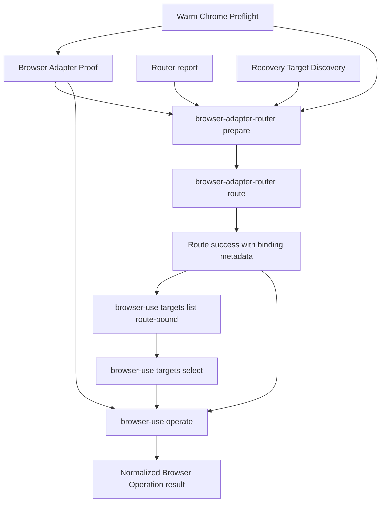

# Implement browser-use prepare and operation front door

## Summary

Add runtime-owned `browser-adapter-router prepare`, then add `browser-use` target and operation surfaces for route-bound browser work. Keep Router responsible for evidence preparation and adapter selection. Keep `browser-use` responsible for Browser Target Discovery, Browser Target Selection, Browser Target Resolution, and Browser Operations.

Ship the work as reviewable milestones. The first milestone can land `prepare`; target selection and operations wait until route/proof binding, command contracts, privacy gates, and `mcporter` transport handling are mechanically checked.

---

## Problem Frame

Current `browser-use` routing is evidence-first but not ergonomic enough. Agents can run `route --envelope`, yet they have to inspect TypeScript model files or old examples to assemble the envelope correctly. The route command stays pure evaluation, but the runtime needs a `prepare` on-ramp that turns existing proof/report envelopes plus task facts into prepared route evidence or structured recovery.

The accepted operation decisions also expose a deeper abstraction leak. The skill driver asks for Browser Operations such as `snapshot`, `screenshot`, and viewport `emulate`; it does not learn raw `mcporter`, adapter page ids, CDP target ids, method names, or support-tool argument shapes.

---

## Requirements

### Route Evidence Preparation

- R1. Add `browser-adapter-router prepare` as a runtime-owned Route Evidence Preparation command.
- R2. Keep `browser-adapter-router route` as pure evaluation of supplied route evidence.
- R3. Let `prepare` read role-specific proof/report envelopes through `--warm-chrome-proof`, `--adapter-proof`, one or more `--report` inputs, and target precondition evidence through `--target-discovery`.
- R4. Let `prepare` receive task and policy facts through explicit flags for mode, adapter, fallback, bundle, required capabilities, auth/session posture, and target origin posture.
- R5. Make `prepare` emit prepared route evidence plus `continuation.next_action_id=route_prepared_evidence` on success.
- R6. Make `prepare` aggregate missing or invalid facts and emit one canonical next action using dependency order: `prove_warm_chrome`, `discover_capability_report`, `prove_adapter_attachment`, `change_prepare_input`.
- R7. Keep `prepare` from running Warm Chrome Preflight, Browser Adapter Proof, Router `report`, or Browser Target Discovery in MVP.

### Route, Proof, Target, Operation Binding

- R8. Define a canonical binding tuple across route success, Adapter Proof, target discovery, selected target state, and Browser Operation execution.
- R9. Make binding checks fail closed on missing, stale, mismatched, or cross-run evidence.
- R10. Authorize each Browser Operation class against route success and route evidence capabilities.
- R11. Add runtime-owned operation capability mapping for `snapshot`, `screenshot`, and viewport `emulate`.
- R12. Reject operation attempts when a route prepared only for one operation class is reused for another unproven class.

### Browser Use CLI

- R13. Add a `browser-use` CLI surface separate from `browser-adapter-router`.
- R14. Expose `browser-use targets list`, `browser-use targets select`, `browser-use targets status`, and `browser-use operate`.
- R15. Build new and changed CLI surfaces through `@side-quest/cli-command-facade` and the repo's `cli-author` contract path.
- R16. Prove command discovery metadata, rendered help, parser acceptance, and runtime semantics cannot drift.
- R17. Cross-link `browser-adapter-router` and `browser-use` through help text and continuation action ids.

### Browser Targets

- R18. Let route-bound Target Discovery require full route success plus fresh Adapter Proof.
- R19. Let recovery Target Discovery require explicit requested adapter plus fresh Adapter Proof.
- R20. Mark recovery candidates as evidence-gathering only and operation-ready candidates as route-bound only.
- R21. Keep candidate ordinals scoped to one target envelope.
- R22. Keep Browser Target Hints semantic: origin, URL substring, and title substring.
- R23. Treat `target_origin` as a route precondition term, not a Browser Target Hint.
- R24. Store Browser Target Selection as run-scoped semantic state with explicit `--state <path>` or deterministic environment-derived path.
- R25. Reject recovery-mode candidates in `targets select` and `operate`.

### Browser Operations

- R26. Add Browser Operations for `snapshot`, `screenshot`, and viewport `emulate`.
- R27. Let `operate --route` consume the full Router success envelope.
- R28. Let `operate --adapter-proof` consume fresh Browser Adapter Proof for the selected adapter.
- R29. Resolve Browser Operation Targets from per-operation hints, selected target state, or exactly-one route-bound candidate fallback.
- R30. Fail ambiguously targeted operations with structured recovery rather than acting on the wrong page.
- R31. Keep `mcporter` behind the Browser Operation Front Door for MVP `chrome-devtools` operations.
- R32. Keep raw adapter method names, page ids, CDP ids, session ids, WebSocket debugger URLs, cookies, headers, query strings, fragments, screenshot bytes, and sensitive path segments out of JSON, logs, and primary diagnostics.

---

## High-Level Technical Design

- `prepare` assembles route evidence and recovery only. It does not probe hidden browser state.
- `route` validates prepared evidence and selects one adapter. It does not run proof or browser operations.
- `targets list` discovers Browser Target Candidates through a proven adapter. Recovery mode can feed `prepare`; route-bound mode can feed selection or operation fallback.
- `targets select` writes run-scoped selected-target state from route-bound candidate envelopes only.
- `operate` validates route/proof/target/operation binding before it calls the selected adapter.
- `chrome-devtools` MVP operations call `mcporter` through a shared or parity-tested command-vector runner.

Binding tuple:

- `run_id`
- `warm_chrome_run_id`
- `warm_chrome_proof_id`
- `adapter_proof_id`
- `selected_adapter_id`
- `route_success_id_or_hash`
- `route_evidence_hash`
- `target_envelope_id`
- `target_candidate_id`
- `operation_intent_id_or_class`
- `emitted_at`
- `expires_at`

Operation capability mapping:

- `snapshot`: route evidence includes `snapshot_refs`.
- `screenshot`: route evidence includes `screenshot_media`.
- `emulate`: route evidence includes a runtime-owned viewport emulation capability added to `skills/browser-use/scripts/command-contract.ts` and manifests.

---

## Key Technical Decisions

- KTD1. **Prepare owns the on-ramp:** Agents get route evidence from a runtime command, not TypeScript spelunking or copied envelope examples.
- KTD2. **Route stays pure:** `route` consumes supplied evidence and selects. It does not discover proofs, reports, targets, or browser state.
- KTD3. **Router prepares, browser-use operates:** Router surfaces stay under `browser-adapter-router`; live browser targets and operations live under `browser-use`.
- KTD4. **Binding beats filename inference:** Route/proof/target/operation compatibility uses runtime-owned ids, hashes, dates, and expiry, not paths or latest files.
- KTD5. **Recovery is structured:** Every nonzero JSON error emits `error.code`, `runtime_actions[]`, and a matching `continuation.next_action_id`.
- KTD6. **Targets are semantic:** Public target inputs use Browser Target Hints or `browser-use` candidate ordinals. Adapter handles stay internal.
- KTD7. **Privacy ships with MVP:** Browser content is sensitive by default; target display, snapshots, screenshots, diagnostics, and target state get tests before operation execution ships.
- KTD8. **`mcporter` is transport, not interface:** MVP may use `mcporter`, but Browser Operations hide its method names and argument shapes.
- KTD9. **V2 stays gated:** Prepare orchestration, native MCP transport selection, richer operation coverage, reusable targets, and high-risk mutating operations wait for freshness, invalidation, and privacy gates.

---

## Implementation Units

### U1. Prepare Route Evidence On-Ramp

- **Goal:** Add `browser-adapter-router prepare` as the first reviewable milestone.
- **Files:** `skills/browser-use/scripts/command-contract.ts`, `skills/browser-use/scripts/browser-adapter-router.ts`, `skills/browser-use/scripts/browser-adapter-router-model.ts`, `skills/browser-use/scripts/browser-adapter-router-validation.ts`, `skills/browser-use/scripts/browser-adapter-router-recovery.ts`, `skills/browser-use/scripts/browser-adapter-router.test.ts`
- **Patterns:** Follow Router command parsing, output writers, recovery validation, and command surface tests already used for `route`, `report`, and `status`.
- **Test Scenarios:**
  - Command contract exposes `prepare`, `route`, `report`, and `status`.
  - `prepare --help` renders role-specific evidence flags and an Evidence sources block.
  - `route --help` includes a one-line pointer to `prepare --help`.
  - Parser accepts `--warm-chrome-proof`, `--adapter-proof`, `--report`, `--target-discovery`, `--mode`, `--adapter`, `--fallback-allowed`, `--bundle`, `--capability`, `--target-origin`, `--json`, and `--plain` only where the contract declares them.
  - Parser accepts repeated `--report <path>` inputs and emits route evidence with a reports array.
  - Complete valid inputs emit `data.envelope`, `data.route_input_mode`, `data.next_command_intent`, and `continuation.next_action_id=route_prepared_evidence`.
  - The emitted `data.envelope` is accepted by `browser-adapter-router route`.
  - Missing warm Chrome proof emits `prove_warm_chrome`.
  - Missing report emits `discover_capability_report`.
  - Missing adapter proof emits `prove_adapter_attachment`.
  - Invalid policy, unknown bundle, invalid capability, or malformed input envelope emits `change_prepare_input`.
  - Multiple missing facts are all listed in `data.missing_facts[]`.
  - The canonical continuation follows dependency order while `runtime_actions[]` includes every relevant recovery action.
  - `prepare` does not run preflight, proof, report, or target discovery subcommands in MVP.
- **Verification:** `cd skills/browser-use/scripts && bun test browser-adapter-router.test.ts`
- **Scope note (shipped):** U1 shipped parser acceptance for `--target-discovery`, `--target-origin`, and auth/session posture flags, but not success/recovery scenarios that consume target-discovery evidence or enforce auth/session posture in the prepared envelope (R3, R4). U2 owns the downstream `auth_session` and `target_origin` precondition validators that `prepare` output must satisfy; the prepare-side success/recovery coverage for authenticated and target-origin tasks is a tracked follow-up (Deferred to Implementation, below). Do not treat R3/R4 as fully discharged by U1.

### U2. Route And Proof Binding Metadata

- **Goal:** Add route/proof binding fields and validators before any target or operation work ships.
- **Files:** `skills/browser-use/scripts/command-contract.ts`, `skills/browser-use/scripts/browser-adapter-router-model.ts`, `skills/browser-use/scripts/browser-adapter-router-engine.ts`, `skills/browser-use/scripts/browser-adapter-router-validation.ts`, `skills/browser-use/scripts/browser-adapter-router-recovery.ts`, `skills/browser-use/scripts/preflight-browser-adapter.ts`, `skills/browser-use/scripts/preflight-browser-adapter.test.ts`, `skills/browser-use/scripts/browser-adapter-router.test.ts`
- **Patterns:** Extend the existing route evidence freshness and mixed-run checks instead of adding ad hoc operation-time checks.
- **Test Scenarios:**
  - Route success exposes binding metadata required by Browser Operations.
  - Command contract and manifests expose the viewport emulation capability used by `operate emulate`.
  - Adapter Proof output exposes proof id, warm Chrome run id, verified endpoint identity, selected adapter id, emitted time, and expiry.
  - Route validation rejects missing binding fields once operation-capable route evidence is requested.
  - Route validation rejects mismatched warm Chrome run id, proof id, selected adapter id, route evidence hash, emitted time, and expiry.
  - Route success authorizes only capabilities present in route evidence.
  - `snapshot`, `screenshot`, and `emulate` operation classes each fail closed when their required capability was not routed.
  - Error envelopes include binding failure codes and continuation actions owned by runtime contracts.
- **Verification:** `cd skills/browser-use/scripts && bun test browser-adapter-router.test.ts preflight-browser-adapter.test.ts`

### U3. Browser Use CLI Contract Shell

- **Goal:** Add the `browser-use` CLI entrypoint and result contracts before live target or operation logic.
- **Files:** `skills/browser-use/scripts/command-contract.ts`, `skills/browser-use/scripts/browser-use.ts`, `skills/browser-use/scripts/browser-use.sh`, `skills/browser-use/scripts/browser-use.test.ts`, `skills/browser-use/scripts/package.json`, `skills/browser-use/SKILL.md`
- **Patterns:** Use `@side-quest/cli-command-facade` as the command owner. Mirror `browser-adapter-router.ts` test helpers only where they remove real duplication.
- **Test Scenarios:**
  - `browser-use --help` renders `targets` and `operate` families.
  - `browser-use --version --json` emits parseable JSON with name and version.
  - `browser-use targets --help` renders `list`, `select`, and `status`.
  - `browser-use operate --help` renders `snapshot`, `screenshot`, and `emulate`.
  - Command discovery exposes `browser-use.browser-targets` and `browser-use.browser-operation` result contracts with versions.
  - Parser rejects undeclared flags for each subcommand.
  - Dry-run/mock mode can exercise success and failure envelopes without live browser calls.
  - Help points from `browser-use` back to route-bound prerequisites without copying route evidence schemas.
- **Verification:** `cd skills/browser-use/scripts && bun test browser-use.test.ts && bun run typecheck`

### U4. Shared Mcporter Transport Runner

- **Goal:** Make Browser Adapter Proof and Browser Operation execution share `mcporter` command-vector handling, or prove parity if extraction is too risky.
- **Files:** `skills/browser-use/scripts/preflight-browser-adapter.ts`, `skills/browser-use/scripts/browser-use.ts`, `skills/browser-use/scripts/preflight-browser-adapter.test.ts`, `skills/browser-use/scripts/browser-use.test.ts`, `skills/browser-use/scripts/command-contract.ts`
- **Patterns:** Preserve the JSON-array override contract in `BROWSER_USE_MCPORTER_COMMAND_JSON`; avoid shell strings and automatic package-runner fallback.
- **Test Scenarios:**
  - Default operation transport invokes `mcporter`.
  - JSON override `["bunx","mcporter"]` prefixes operation calls the same way Adapter Proof does.
  - JSON override `["npx","-y","mcporter"]` prefixes operation calls the same way Adapter Proof does.
  - Invalid JSON, shell string, empty array, non-string member, and blank member fail with the same override diagnostics as Adapter Proof or a parity-proven operation diagnostic.
  - Missing command emits dependency recovery, not Warm Chrome repair or adapter fallback.
  - Operation execution never shell-evaluates command input.
  - Tests prove Adapter Proof and Browser Operation command-vector behavior stay aligned.
  - Native Chrome DevTools MCP parity checklist is documented for V2 without adding native transport selection in MVP.
- **Verification:** `cd skills/browser-use/scripts && bun test preflight-browser-adapter.test.ts browser-use.test.ts`

### U5. Browser Target Discovery

- **Goal:** Add `browser-use targets list` in recovery and route-bound modes.
- **Files:** `skills/browser-use/scripts/browser-use.ts`, `skills/browser-use/scripts/browser-use.test.ts`, `skills/browser-use/scripts/command-contract.ts`, `skills/browser-use/scripts/browser-adapter-router-model.ts`, `skills/browser-use/SKILL.md`
- **Patterns:** Reuse Browser Adapter Proof output as the attachment owner. Keep display-safe facts separate from machine evidence.
- **Test Scenarios:**
  - Recovery mode requires `--mode recovery`, `--adapter <id>`, and `--adapter-proof <path>`.
  - Recovery mode emits `route_bound=false`, `operation_ready=false`, requested adapter, adapter proof binding, and recovery-safe candidates.
  - Recovery mode output can be consumed by `prepare --target-discovery`.
  - Recovery candidates cannot feed `targets select` or `operate`.
  - Route-bound mode requires `--mode route-bound`, `--route <path>`, and `--adapter-proof <path>`.
  - Route-bound mode emits `route_bound=true`, `operation_ready=true`, route/proof binding, target envelope id, and Browser Target Candidates.
  - Adapter-mismatched proof fails with `supply_adapter_proof` or `refresh_adapter_proof`.
  - Empty candidate set emits structured recovery.
  - `--show-url` displays origin and redacted path shape only.
  - Query strings, fragments, auth-bearing paths, adapter page ids, CDP target ids, and WebSocket debugger URLs never appear in JSON logs or diagnostics.
- **Verification:** `cd skills/browser-use/scripts && bun test browser-use.test.ts browser-adapter-router.test.ts`

### U6. Browser Target Selection And Resolution

- **Goal:** Add run-scoped selected target state and operation-time target resolution.
- **Files:** `skills/browser-use/scripts/browser-use.ts`, `skills/browser-use/scripts/browser-use.test.ts`, `skills/browser-use/scripts/command-contract.ts`
- **Patterns:** Treat selected state as explicit run state, not ambient latest tab state.
- **Test Scenarios:**
  - `targets select` accepts a full route-bound `targets list` success envelope.
  - `targets select` accepts candidate ordinal scoped to the supplied envelope.
  - `targets select` accepts Browser Target Hints for origin, URL substring, and title substring.
  - Candidate ordinal does not count as a Browser Target Hint.
  - Ambiguous hints fail with `refine_target_hint`.
  - Missing `--state` and missing deterministic env state fail clearly.
  - State writes use owner-only permissions, atomic write, short TTL, and conflict rejection.
  - State contains run id, route/proof binding, target envelope id, expiry, selected candidate id, and redacted display facts.
  - `targets status` fails clearly for missing, stale, unreadable, mismatched, or cross-run state.
  - `operate` prefers per-operation hints over selected state.
  - Failed hints do not fall back to selected state.
  - Exactly-one-candidate fallback runs only with route-bound discovery and fresh binding.
- **Verification:** `cd skills/browser-use/scripts && bun test browser-use.test.ts`

### U7. Browser Operation Front Door

- **Goal:** Add `browser-use operate snapshot`, `browser-use operate screenshot`, and `browser-use operate emulate`.
- **Files:** `skills/browser-use/scripts/browser-use.ts`, `skills/browser-use/scripts/browser-use.test.ts`, `skills/browser-use/scripts/command-contract.ts`, `skills/browser-use/SKILL.md`, `skills/browser-use/TEST_MATRIX.md`
- **Patterns:** Normalize Browser Operation results. Keep raw adapter responses bounded, allowlisted, redacted, and non-authoritative.
- **Test Scenarios:**
  - Every operation requires full route success and fresh Adapter Proof.
  - Every operation validates route/proof/target/operation binding before calling transport.
  - `operate snapshot` emits normalized snapshot data to JSON stdout.
  - `operate snapshot` supports `--verbose`.
  - `operate snapshot` enforces default node and byte bounds.
  - `operate snapshot` emits truncation metadata when bounded.
  - `operate snapshot` never brings the page to front in MVP.
  - `operate screenshot` requires `--out <path>`.
  - `operate screenshot` writes under a run-scoped artifact root by default.
  - `operate screenshot` rejects or fails closed on `--out` paths that resolve outside the run-scoped artifact root (absolute or traversal paths) unless an explicit unsafe override is supplied.
  - `operate screenshot` supports `--full-page`.
  - `operate screenshot --bring-to-front` records explicit focus side effect.
  - `operate screenshot` keeps image bytes out of JSON, logs, and diagnostics.
  - `operate emulate` accepts `--width`, `--height`, `--dpr`, `--mobile`, `--touch`, and `--landscape`.
  - `operate emulate` requires a route that proves the viewport emulation capability.
  - `operate emulate --bring-to-front` records explicit focus side effect.
  - Operation success data names operation, adapter, binding summary, target source, and operation-specific facts.
  - Operation diagnostics redact adapter handles, page ids, target ids, session ids, WebSocket debugger URLs, cookies, auth headers, query strings, fragments, and sensitive path segments.
  - Transport failure emits `inspect_operation_diagnostics`.
  - Ambiguous target emits `choose_target_candidate` or `refine_target_hint`.
  - Stale selected state emits `refresh_target_selection`.
  - Stale target envelope emits `rerun_route_bound_target_discovery`.
  - Snapshot overflow emits `rerun_snapshot_with_filter`.
- **Verification:** `cd skills/browser-use/scripts && bun test browser-use.test.ts && bun run typecheck`

### U8. Docs, ADR, And Contract Delivery

- **Goal:** Update source docs and validation matrices after each runtime milestone lands.
- **Files:** `docs/adr/0012-browser-adapter-router-uses-evidence-first-routing.md`, `docs/adr/0013-router-research-recovery-uses-diagnostic-trail.md`, `docs/adr/0014-browser-use-prepare-and-operation-front-door.md`, `CONTEXT.md`, `AGENTS.md`, `scripts/agent-instructions.sh`, `skills/browser-use/SKILL.md`, `skills/browser-use/TEST_MATRIX.md`, `skills/browser-use/PROVENANCE.md`
- **Patterns:** Keep deterministic contracts in runtime code, generated help, or tests. Keep docs focused on rationale, workflow, and owner maps.
- **Test Scenarios:**
  - New ADR records the accepted prepare/route/operate split and binding tuple.
  - `CONTEXT.md` keeps Browser Target and Browser Operation terms aligned with runtime names.
  - `SKILL.md` workflow uses `browser-adapter-router prepare -> route`, then `browser-use targets/operate`.
  - `SKILL.md` does not copy route evidence schemas, target envelope schemas, or operation result schemas.
  - Startup instruction changes stay terse and pass `scripts/agent-instructions.sh check`.
  - `TEST_MATRIX.md` names command-contract, help, parser, runtime semantics, privacy, and transport parity gates.
  - Search confirms no prose examples expose raw adapter page ids, CDP ids, WebSocket debugger URLs, query strings, fragments, screenshot bytes, or `mcporter` method names as public workflow inputs.
- **Verification:** `scripts/agent-instructions.sh check && cd skills/browser-use/scripts && bun test && bun run typecheck`

---

## Deferred to Implementation

- **Prepare auth/session + target-discovery success/recovery (R3, R4):** U1 shipped parser acceptance only. The prepare-side scenarios that consume `--target-discovery` evidence and enforce auth/session and target-origin posture in the prepared envelope are not yet covered by tests. Add explicit success and recovery scenarios (authenticated task, target-origin task, missing/invalid posture) against the unit that next touches `prepare` output, or open a dedicated follow-up unit. Until then, R3/R4 are partially discharged.

## Scope Boundaries

- Do not collapse this plan into one PR.
- Do not put Browser Operations under Browser Adapter Router.
- Do not put Browser Operations under Browser Adapter Map.
- Do not let `prepare` run preflight, proof, report, or target discovery in MVP.
- Do not let `route` read implicit latest files or run hidden probes.
- Do not let recovery-mode Target Discovery authorize Browser Operations.
- Do not let target selection use adapter page ids, CDP ids, or implicit latest list state.
- Do not expose raw adapter ids as public target handles.
- Do not expose raw paths, query strings, fragments, cookies, auth headers, screenshot bytes, or sensitive input values in JSON, logs, or diagnostics.
- Defer native MCP transport selection, Playwright CDP operation adapter, agent-browser operation adapter, navigation, ref action, selector action, text entry, network inspection, console inspection, performance operations, element screenshots, reusable targets, and artifact retention policy.

---

## Acceptance Examples

- AE1. Given valid warm Chrome proof, adapter proof, report, task facts, and policy facts, when `browser-adapter-router prepare --json` runs, then it emits prepared route evidence and `route_prepared_evidence`.
- AE2. Given missing warm Chrome proof and missing report, when `prepare --json` runs, then it lists both missing facts and chooses `prove_warm_chrome` as the canonical continuation.
- AE3. Given `prepare` success, when `browser-adapter-router route` receives `data.envelope`, then route evaluation works without reading TypeScript model files.
- AE4. Given route success and mismatched Adapter Proof, when `browser-use operate snapshot --json` runs, then it fails closed before adapter transport.
- AE5. Given recovery-mode `targets list` output, when `targets select` receives it, then selection fails because the candidates are evidence-gathering only.
- AE6. Given route-bound `targets list` output with two matching tabs and no selected state, when `operate screenshot` runs without hints, then it emits target refinement recovery and does not write an artifact.
- AE7. Given route-bound target state and no operation hints, when `operate snapshot` runs, then it resolves the selected Browser Target and emits normalized snapshot data.
- AE8. Given operation hints that do not match a unique candidate, when selected state exists, then `operate` still fails on the hints and does not fall back.
- AE9. Given `operate screenshot --out <path>`, when the screenshot succeeds, then JSON output contains artifact metadata only and never includes bytes or base64.
- AE10. Given `BROWSER_USE_MCPORTER_COMMAND_JSON='["bunx","mcporter"]'`, when Adapter Proof and Browser Operation execution run in tests, then both use the same command-vector semantics.
- AE11. Given `browser-use targets list --show-url`, when candidates include query strings and fragments, then output strips them and displays only origin plus redacted path shape.
- AE12. Given `operate emulate --width 390 --height 844 --dpr 3 --mobile --touch`, when route/proof/target binding is valid, then the command emits a normalized operation result without exposing `mcporter` method names.

---

## Risks And Dependencies

- `cli-author` contract path is required for new and changed CLI surfaces.
- `@side-quest/cli-command-facade` owns generic envelope mechanics; `browser-use` owns package-specific result contracts, recovery ids, and operation semantics.
- Route success shape changes may require careful migration in existing Router tests.
- Sharing `mcporter` command-vector handling can touch Browser Adapter Proof; parity tests are acceptable if extraction increases risk.
- Browser content privacy is a release gate for target listing, snapshots, screenshots, diagnostics, and target state.
- Existing dirty changes in `AGENTS.md`, `CONTEXT.md`, `scripts/agent-instructions.sh`, and `skills/browser-use/docs/decisions/2026-06-03-browser-use-prepare-operation-decision-log.md` need preservation during implementation.

---

## Sources

- Decision log: `skills/browser-use/docs/decisions/2026-06-03-browser-use-prepare-operation-decision-log.md`
- Prior Router plan: `skills/browser-use/docs/plans/2026-06-02-004-design-browser-use-adapter-router-plan.md`
- Clean Router plan: `skills/browser-use/docs/plans/2026-06-03-004-rewrite-browser-adapter-router-clean-plan.md`
- Mcporter command-resolution plan: `skills/browser-use/docs/plans/2026-06-02-003-fix-browser-use-mcporter-command-resolution-plan.md`
- Glossary: `CONTEXT.md`
- Browser use skill: `skills/browser-use/SKILL.md`
- Command contract: `skills/browser-use/scripts/command-contract.ts`
- Router runtime: `skills/browser-use/scripts/browser-adapter-router.ts`
- Router model: `skills/browser-use/scripts/browser-adapter-router-model.ts`
- Router tests: `skills/browser-use/scripts/browser-adapter-router.test.ts`
- Adapter Proof runtime: `skills/browser-use/scripts/preflight-browser-adapter.ts`
- Adapter Proof tests: `skills/browser-use/scripts/preflight-browser-adapter.test.ts`
