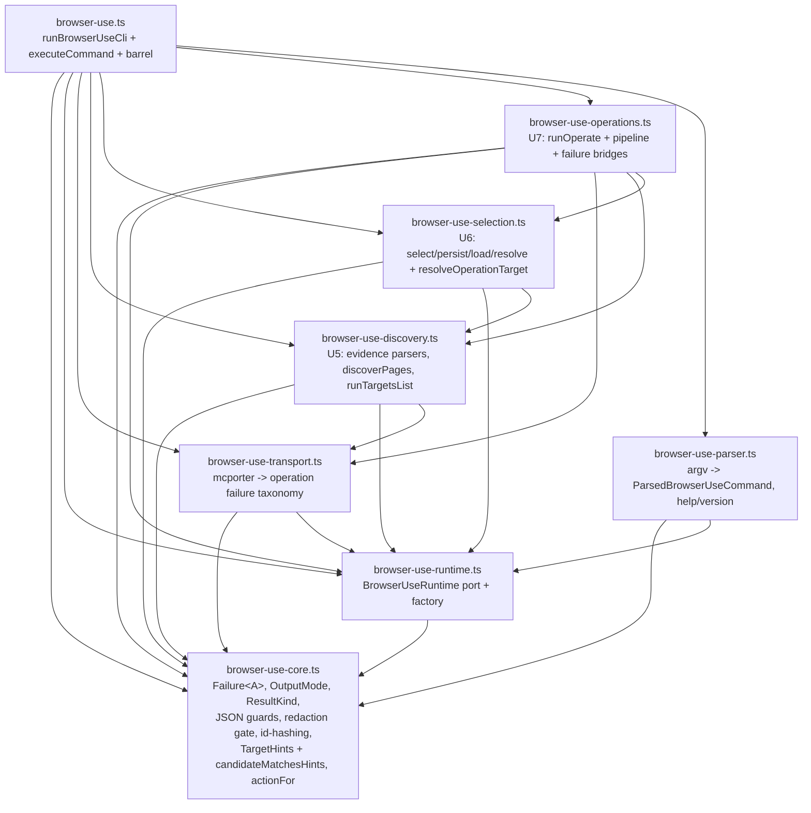

# refactor: Split browser-use.ts into cohesive modules

## Summary

`skills/browser-use/src/browser-use.ts` is 4,449 lines spanning seven distinct
plan-unit regions (runtime port, CLI driver, U5 discovery, U6 selection,
operation-resolve, U7 operations, parser/helpers). An ICA seam swarm
(8 agents, improve-codebase-architecture lens) mapped a strictly-layered,
**acyclic** split into 8 modules once four shared types sink into a common-core
leaf. This plan executes that split plus a mirrored split of the 3,045-line test
suite, preserving behavior and the public import surface.

The split is behavior-preserving: no flag, contract, output envelope, or exit
code changes. Success = every existing test stays green at every step.

---

## Problem Frame

One file owns five workflows (prove Warm Chrome routing is upstream; this file
owns discovery, selection, resolve, operations, parsing, dispatch). Reading any
one concept means scanning thousands of unrelated lines. Two types are
physically mis-housed (`Failure<A>` sits inside the U5 discovery region;
`OutputMode`/`ResultKind` sit in the driver), which would force import cycles on
a naive split. The test file is a parallel 3,045-line monolith.

**Goal:** 8 cohesive modules in a clean dependency layering, the public surface
re-exported from `browser-use.ts` so no external import path changes, and a
per-module test suite that proves equivalent coverage.

---

## Scope Boundaries

**In scope:**
- Split `browser-use.ts` into 8 modules per the ICA map.
- Split `browser-use.test.ts` into per-module suites mirroring the modules.
- Move mis-housed shared types into a new common-core leaf module.

**Out of scope (true non-goals):**
- Merging or changing the 5 sibling CLI entrypoints — this is `browser-use.ts`-internal only.
- Any behavior change: flags, contracts, envelopes, exit codes, redaction stay identical.
- The deeper deepenings (candidate 1 error-block extraction) — separate work.

### Deferred to Follow-Up Work
- Reconcile `preflight-warm-chrome.test.ts` "docs teach continuation precedence" (red from an earlier SKILL.md edit, unrelated to this split).
- Optional: collapse the snapshot-bounding helpers if a later pass finds them shallow.

---

## Key Technical Decisions

**KTD1 — `browser-use.ts` stays as the driver + public barrel.** Rather than
renaming the entry file, the root keeps `runBrowserUseCli` + `executeCommand` +
the mock/not-implemented writers, and re-exports the public surface
(`BrowserUseRuntime`, `createDefaultBrowserUseRuntime`, `decodeStdinChunks`,
`resolveOperationTarget`, `OperationResolutionInput`, `runBrowserUseMcporter`,
`runForTest`). Rationale: `package.json` `bin`/`scripts`, `build-dist.ts`, and
`browser-use.test.ts` all reference `browser-use.ts` by path — keeping it the
entry preserves every external contract with zero wiring changes.

**KTD2 — Four shared types sink into `browser-use-core.ts` (the cycle-break).**
`Failure<A>`, `OutputMode`, `ResultKind` move to the core leaf;
`ParsedBrowserUseCommand` moves to the parser (where it's produced). Each surface
keeps only its `TargetDiscoveryFailure`/`SelectionFailure`/`OperationFailure`
alias. `TargetHints` + `candidateMatchesHints` also sink to core (used by both
the selector and `resolveOperationTarget`). This is what makes the layering
acyclic — every cross-region type edge points down into the leaf.

**KTD3 — `resolveOperationTarget` ships inside `selection`, not `operations`.**
It depends on `loadSelectedState`/`resolveStatePath` (selection-owned) and
`candidateMatchesHints` (core). Operations imports *down* into selection; the
reverse never happens. Stranding it in operations would invert the dependency.

**KTD4 — Test split via duplicate-carve-verify-delete (the safety net), with
honest guards.** Copy `browser-use.test.ts` → `browser-use.full.test.ts` (frozen
oracle). Carve per-module suites out of the original. Delete the oracle only in
the final unit. **What the oracle actually proves (corrected after adversarial
review):** because oracle and carved tests both import through the same barrel
(`./browser-use`), the oracle staying green proves only that *barrel wiring is
intact* — it does NOT prove a carved file contains its assertions (an empty
carved file would still pass the oracle). Therefore the real per-step guard is
**test-count delta at every carve unit**, not oracle greenness: after each carve,
the moved-out block's test count must appear in the new file (count the original
before, the new file after; they must match). Coverage equivalence (U15) is a
backstop, but note line-coverage is driven by the driver-level tests and would
NOT catch a dropped fine-grained *assertion* that hits the same lines — so the
count delta is the primary guard, coverage the secondary. Additionally, carved
files import **directly from their module** (`./browser-use-transport`, etc.) not
the barrel, so coverage attributes to the module under test.

**KTD5 — Shared test helpers extracted before carving.** The test's describe
blocks do NOT map 1:1 to modules at the fixture level: `makeRuntime` (31 uses
across U3/U4/U5/U6), `parseJson` (84 uses across U3/U5/U6/U7), `capturingRuntime`,
`okCommand`, `commandVector`, and the cross-region envelope builders
`routeSuccessEnvelope`/`adapterProofEnvelope` (defined in the U5 region but used
inside U7 blocks) are shared. They must be extracted into a shared test-helper
module (U16) before any carve, or every carved file fails to compile.

---

## High-Level Technical Design

Topological module layering (leaf-first; every arrow points down — proven acyclic):



The mcporter-transport.ts and cli-diagnostics-bootstrap.ts sibling modules
already exist as clean external seams; new modules import them unchanged.

---

## Output Structure

```
skills/browser-use/src/
  browser-use-core.ts          (new — shared substrate leaf)
  browser-use-runtime.ts       (new — I/O port)
  browser-use-transport.ts     (new — mcporter operation wrapper)
  browser-use-discovery.ts     (new — U5)
  browser-use-selection.ts     (new — U6 + resolveOperationTarget)
  browser-use-operations.ts    (new — U7)
  browser-use-parser.ts        (new — argv + help)
  browser-use.ts               (slimmed — driver + barrel)
  browser-use-core.test.ts     (new)
  browser-use-transport.test.ts (new — from U4 blocks)
  browser-use-discovery.test.ts (new — from U5 blocks)
  browser-use-selection.test.ts (new — from U6 blocks)
  browser-use-operations.test.ts (new — from U7 blocks)
  browser-use-parser.test.ts   (new — from U3 blocks)
  browser-use.test.ts          (slimmed — driver/contract + barrel re-export checks)
  # browser-use.full.test.ts   (transient oracle — created U8, deleted U15)
```

---

## Implementation Units

Units are dependency-ordered to match the topological layering. Each source unit
ends green (typecheck + full test suite + biome) before the next begins.
**Execution note for all units: behavior-preserving move-only. After each unit,
the full test suite must stay green — a red test means a symbol moved wrong, not
that behavior should change.**

### U1. Extract `browser-use-transport.ts` (proof-of-concept first split)

**Goal:** Prove the import-order mechanics on the smallest, cleanest unit before
the larger moves.
**Dependencies:** none (the swarm's recommended safest first split).
**Files:** `skills/browser-use/src/browser-use-transport.ts` (new),
`skills/browser-use/src/browser-use.ts` (remove moved symbols, add import).
**Approach:** Move `runBrowserUseMcporter`, `BrowserOperationTransportResult`,
`BrowserOperationTransportFailure`, `dependencyMissingFailure`, and
`OPERATION_TRANSPORT_TIMEOUT_MS` into the new module. It imports `./mcporter-transport`
(existing sibling) and will import `./browser-use-core` once that exists — for
this unit, any core-bound symbols it uses stay imported from `browser-use.ts`
temporarily, or move the 2-3 needed constants alongside. Re-export
`runBrowserUseMcporter` + the two types from `browser-use.ts` (barrel) so the
test's import is unaffected.
**Patterns to follow:** the existing `cli-diagnostics-bootstrap.ts` extraction
(clean leaf module imported by entrypoints).
**Test scenarios:** Test expectation: none — move-only; coverage is the existing
U4 mcporter suite, which must stay green unchanged via the barrel re-export.
**Verification:** typecheck clean; full suite green; `runBrowserUseMcporter`
still importable from `./browser-use`.

### U2. Create `browser-use-core.ts` (the keystone leaf)

**Goal:** House the substrate used by 3+ regions so every later module imports
down into a leaf, never sideways.
**Dependencies:** U1.
**Files:** `skills/browser-use/src/browser-use-core.ts` (new),
`skills/browser-use/src/browser-use.ts` (remove moved symbols, re-export).
**Approach:** Move into core: `Failure<A>` (from its mis-housed spot in the U5
region), `OutputMode`, `ResultKind`, the exit-code constants
(`BINDING_FAIL_CLOSED_EXIT_CODE`, `RUNTIME_FAILURE_EXIT_CODE`, `USAGE_EXIT_CODE`,
`NOT_IMPLEMENTED_EXIT_CODE`, `TARGET_DISCOVERY_EXIT_CODE`,
`TARGET_SELECTION_EXIT_CODE`), the JSON guards (`safeJsonObject`, `isJsonObject`,
`stringField`), the redaction/privacy gate (`redactUnsafeText`, `redactTitle`,
`redactPathShape`, `parseUrlSafe`, `truncateText`, `sanitizeUsageValue`,
`hasSensitiveOptionName`), deterministic-id hashing (`targetEnvelopeIdOf`,
`candidateIdOf`), the `RawPage` shape + `toCandidate` projection (with its helper
`candidateIdentityOf` — `toCandidate` calls it, so it must travel into core or
U2 won't typecheck), `TargetHints` + `candidateMatchesHints`, and the single
`actionFor` registry lookup. The
per-surface `*ActionById` Maps and `*ActionId` unions stay with their owning
surfaces (still in `browser-use.ts` for now). Re-export everything from the
barrel so nothing breaks mid-split.
**Patterns to follow:** the `Failure<A>` generic established in commit `ab524e9`.
**Test scenarios:** Test expectation: none — move-only.
**Verification:** typecheck clean (the `Failure<A>` sink resolves the
discovery↔selection↔operation type-import cycle); full suite green; biome clean.

### U3. Extract `browser-use-runtime.ts` (the I/O port)

**Goal:** Isolate the side-effect seam (referenced 25× across all handlers).
**Dependencies:** U2.
**Files:** `skills/browser-use/src/browser-use-runtime.ts` (new),
`skills/browser-use/src/browser-use.ts`.
**Approach:** Move `BrowserUseRuntime`, `createDefaultBrowserUseRuntime`,
`decodeStdinChunks`, `readAllStdin`, `writeStateFileAtomically`. Imports
`./mcporter-transport` (for `spawnMcporterCommand`) and `./browser-use-core`.
Re-export `BrowserUseRuntime`, `createDefaultBrowserUseRuntime`,
`decodeStdinChunks` from the barrel (test imports all three).
**Test scenarios:** Test expectation: none — move-only; the existing
`decodeStdinChunks` unit tests cover it via the barrel.
**Verification:** typecheck clean; full suite green; the 3 runtime symbols
importable from `./browser-use`.

### U4. Extract `browser-use-discovery.ts` (U5)

**Goal:** One module owns the Target Discovery workflow.
**Dependencies:** U2, U3, U1 (imports transport for `discoverPages`).
**Files:** `skills/browser-use/src/browser-use-discovery.ts` (new),
`skills/browser-use/src/browser-use.ts`.
**Approach:** Move `runTargetsList`, `readAdapterProofFacts`, `readRouteFacts`,
`discoverPages` + raw-page extraction, the discovery candidate projection/id
builders that aren't already in core, the discovery failure builders, the
`TargetDiscoveryActionId` union + `targetDiscoveryActionById` Map +
`targetDiscoveryAction` wrapper, `TargetDiscoveryFailure` alias, and
`emitTargetDiscoverySuccess`/`emitTargetDiscoveryFailure`. Imports core, runtime,
transport. `executeCommand` in the driver now imports `runTargetsList` from here.
**Test scenarios:** Test expectation: none — move-only; the U5 describe blocks
(recovery, route-bound, empty-set/transport, privacy gate) cover it.
**Verification:** typecheck; full suite green; biome.

### U5. Extract `browser-use-selection.ts` (U6 + resolveOperationTarget)

**Goal:** One module owns select→persist→load→resolve, including the exported
`resolveOperationTarget`.
**Dependencies:** U2, U3, U4 (selection cross-checks discovery evidence).
**Files:** `skills/browser-use/src/browser-use-selection.ts` (new),
`skills/browser-use/src/browser-use.ts`.
**Approach:** Move `runTargetsSelect`, `runTargetsStatus`,
`parseSelectionEnvelope`, `crossCheckSelectionEvidence`, the selector +
`resolveSelectionCandidate`, `resolveStatePath`, `runScopedKey`,
`loadSelectedState`, `parseSelectedState`, `SelectedTargetState`,
`resolveOperationTarget` + `OperationTargetHints`/`OperationResolutionInput`/
`OperationResolution`, the `SelectionActionId`/`SelectionFailureActionId` unions +
`selectionActionById` Map + `selectionAction` wrapper, `SelectionFailure` alias,
and **critically** the selection emit helpers currently downfile
(`emitSelectionSuccess`, `emitStatusSuccess`, `emitSelectionFailure`,
`selectionUsageFailure`, `selectedTargetView`) — they must travel with this unit
or selection re-imports its own output (cycle, per swarm). Re-export
`resolveOperationTarget` + `OperationResolutionInput` from the barrel (test imports).
**Test scenarios:** Test expectation: none — move-only; U6 describe blocks
(envelope acceptance, ordinal, hints, state write, status projection,
operation-time resolution) cover it.
**Verification:** typecheck; full suite green; `resolveOperationTarget` importable
from `./browser-use`.

### U6. Extract `browser-use-operations.ts` (U7)

**Goal:** One module owns the operate workflow + failure bridges.
**Dependencies:** U2, U3, U1, U4, U5 (imports down into all of them).
**Files:** `skills/browser-use/src/browser-use-operations.ts` (new),
`skills/browser-use/src/browser-use.ts`.
**Approach:** Move `runOperate` + the ~24 private pipeline steps
(`readOperationInputs`, `loadOperationBinding`, `loadOperationTargetContext`,
`resolveOperationTargetEntry`, `selectOperationPage`, `runOperationTransport`,
`loadOperationSelectedState`), the operation failure builders/bridges
(`operationRouteFailure`, `operationProofInvalidFailure`,
`operationFailureFromSelection`, `operationFailureFromDiscovery`,
`operationFailureFromTransport`, `operationFailureFromResolution`,
`operationTransportExitedFailure`, `dependencyOperationFailure`), snapshot-bounding
(`normalizeSnapshot`, `operationPayload`), the `OperationActionId` union +
`operationActionById` Map + `operationAction` wrapper, `OperationFailure` alias,
and `emitOperationSuccess`/`emitOperationFailure`. Imports core, runtime,
transport, discovery, selection. Driver imports `runOperate` from here.
**Test scenarios:** Test expectation: none — move-only; U7 describe blocks
(operation gates, success and transport) cover it.
**Verification:** typecheck; full suite green; biome.

### U7. Extract `browser-use-parser.ts` and slim the driver

**Goal:** Isolate argv parsing + help; leave `browser-use.ts` as driver + barrel.
**Dependencies:** U2, U3.
**Files:** `skills/browser-use/src/browser-use-parser.ts` (new),
`skills/browser-use/src/browser-use.ts`.
**Approach:** Move `parseBrowserUseArgv`, `ParsedBrowserUseCommand`, `FlagSpec`,
`applyEnvRunId`, `errorOutputMode`, `parsedRunIdFlag`, `outputModeFor`,
`renderHelp`/`renderFamilyHelp`/`renderRootHelp`, `writeVersion`, and the parse
private helpers (`toCommand`, `subcommandsFor`, `isFamily`, `rejectUnknownFlags`,
`collectFlagValues`). Imports core, runtime. The driver retains `runBrowserUseCli`,
`executeCommand`, the mock/not-implemented writers (`emitMockSuccess`,
`emitMockFailure`, `emitNotImplemented`), `runForTest`, and the barrel
re-export block. Verify the barrel still exports the full public surface the test
imports: `BrowserUseRuntime`, `OperationResolutionInput`,
`createDefaultBrowserUseRuntime`, `decodeStdinChunks`, `resolveOperationTarget`,
`runBrowserUseMcporter`, `runForTest`.
**Test scenarios:** Test expectation: none — move-only; U3 describe blocks
(contract, help/version, parser, dry-run) cover it.
**Verification:** typecheck; full suite green; biome. `browser-use.ts` is now
the driver + barrel only (target: well under 600 lines). `build-dist.ts`
entrypoint unchanged (still `browser-use.ts`); confirm `bun run build` +
`bun pm pack --dry-run` emit the same dist payload.

### U8. Duplicate the test suite as a frozen oracle

**Goal:** Create the regression net before carving per-module test files.
**Dependencies:** U7 (source split complete, public surface stable).
**Files:** `skills/browser-use/src/browser-use.full.test.ts` (new — exact copy of
the current `browser-use.test.ts`).
**Approach:** Copy `browser-use.test.ts` verbatim to `browser-use.full.test.ts`.
Both run; this is intentional temporary duplication. The oracle proves no
coverage is lost as later units carve the original into per-module suites.
**Test scenarios:** Test expectation: none — the oracle IS the test asset; it
must run green identically to the original.
**Verification:** full suite green with the duplicated file present (test count
≈ doubles for the carried blocks; that's expected and transient).

### U16. Extract shared test helpers (blocks the carve gap)

**Goal:** Move cross-block test fixtures into a shared module so per-module test
files can compile. Without this, U9–U13 fail to compile (KTD5).
**Dependencies:** U8.
**Files:** `skills/browser-use/src/browser-use-test-helpers.ts` (new),
`skills/browser-use/src/browser-use.test.ts` (replace inline helper defs with
imports), `skills/browser-use/src/browser-use.full.test.ts` (oracle: same import
swap, so it keeps passing).
**Approach:** Extract the top-level shared helpers (`makeRuntime`,
`capturingRuntime`, `parseJson`, `okCommand`, `commandVector`, `commandJsonArgs`,
`stateRunKey`, `contractFlags`, `parsedWrite`, `enoent`) AND the cross-region
envelope builders that the adversarial review found span regions
(`adapterProofEnvelope` def ~677, `routeSuccessEnvelope` def ~701 — both used in
U6/U7 blocks, not just U5). The helper module imports the public barrel +
`command-contract`. Point both `browser-use.test.ts` and the oracle at the new
helper module. This is the prerequisite the original plan missed.
**Test scenarios:** Test expectation: none — helper extraction; both
`browser-use.test.ts` and the oracle must stay green with helpers imported.
**Verification:** full suite green (original + oracle); typecheck; the helper
module exports every fixture the carve units (U9–U13) will need.

### U9. Carve `browser-use-parser.test.ts` (U3 blocks)

**Goal:** Per-module test file for the parser/contract surface.
**Dependencies:** U16 (shared helpers extracted first).
**Files:** `skills/browser-use/src/browser-use-parser.test.ts` (new),
`skills/browser-use/src/browser-use.test.ts` (remove the carved U3 blocks except
the contract + barrel-re-export checks, which stay with the driver test).
**Approach:** Move the `U3 parser`, `U3 help and version`, `U3 dry-run envelopes`
describe blocks out of `browser-use.test.ts` into the new file with the needed
imports. Keep `U3 command contract` and any barrel-re-export assertions in
`browser-use.test.ts` (they test the driver/public surface). The oracle
(`browser-use.full.test.ts`) still holds the full original — if a carved block
loses an assertion, the oracle stays green but the new file is short; cross-check
test counts.
**Test scenarios:** Covers the same parser/help/dry-run cases as the origin U3
blocks — happy-path parse of each family/subcommand, unknown-flag rejection,
help text per surface, version output, dry-run envelope shape.
**Verification:** full suite green; carved file's test count matches the moved
blocks; oracle still green.

### U10. Carve `browser-use-transport.test.ts` (U4 blocks)

**Goal:** Per-module test for the mcporter wrapper.
**Dependencies:** U16.
**Files:** `skills/browser-use/src/browser-use-transport.test.ts` (new),
`skills/browser-use/src/browser-use.test.ts` (remove U4 block).
**Approach:** Move the `U4 mcporter transport` describe block. Import
`runBrowserUseMcporter` **directly from `./browser-use-transport`** (not the
barrel) so coverage attributes to the module under test; import shared fixtures
from `./browser-use-test-helpers`.
**Test scenarios:** Covers mcporter neutral-outcome → operation-failure mapping:
dependency-missing, command-override-invalid, transport-timeout (timeout-before-
missing-command ordering), execution-failed, success passthrough.
**Verification:** full suite green; oracle green (proves barrel wiring only); **test-count delta check — the moved block's test count must now appear in the new carved file** (count original-before vs new-file-after; they must match, catching an empty/short carve the oracle cannot).

### U11. Carve `browser-use-discovery.test.ts` (U5 blocks)

**Goal:** Per-module test for U5.
**Dependencies:** U16.
**Files:** `skills/browser-use/src/browser-use-discovery.test.ts` (new),
`skills/browser-use/src/browser-use.test.ts` (remove U5 blocks).
**Approach:** Move the four `U5 target discovery` describe blocks (recovery,
route-bound, empty-set/transport/envelope, privacy release gate).
**Test scenarios:** Covers recovery-mode listing, route-bound listing with proof,
empty-set envelope, transport-failure mapping, and the R32 privacy redaction gate
(titles/URLs/paths redacted by shape).
**Verification:** full suite green; oracle green (proves barrel wiring only); **test-count delta check — the moved block's test count must now appear in the new carved file** (count original-before vs new-file-after; they must match, catching an empty/short carve the oracle cannot).

### U12. Carve `browser-use-selection.test.ts` (U6 blocks)

**Goal:** Per-module test for U6 + resolveOperationTarget.
**Dependencies:** U16.
**Files:** `skills/browser-use/src/browser-use-selection.test.ts` (new),
`skills/browser-use/src/browser-use.test.ts` (remove U6 blocks).
**Approach:** Move the six `U6` describe blocks (envelope acceptance, candidate
ordinal, hints, state write, status projection, operation-time resolution).
**Test scenarios:** Covers select-envelope acceptance/rejection, ordinal
selection, hint matching, state-file write+read round-trip, status projection of
distinct failures, and the `resolveOperationTarget` precedence matrix
(hints vs selected-state vs single-candidate).
**Verification:** full suite green; oracle green (proves barrel wiring only); **test-count delta check — the moved block's test count must now appear in the new carved file** (count original-before vs new-file-after; they must match, catching an empty/short carve the oracle cannot).

### U13. Carve `browser-use-operations.test.ts` (U7 blocks)

**Goal:** Per-module test for U7.
**Dependencies:** U16.
**Files:** `skills/browser-use/src/browser-use-operations.test.ts` (new),
`skills/browser-use/src/browser-use.test.ts` (remove U7 blocks).
**Approach:** Move the two `U7` describe blocks (operation gates, success and
transport).
**Test scenarios:** Covers operation authorization gates (route binding, proof
mismatch, capability authorization), successful operate transport, and snapshot
normalization/bounding.
**Verification:** full suite green; oracle green (proves barrel wiring only); **test-count delta check — the moved block's test count must now appear in the new carved file** (count original-before vs new-file-after; they must match, catching an empty/short carve the oracle cannot).

### U14. Carve `browser-use-core.test.ts` (substrate coverage)

**Goal:** Direct unit coverage for the shared core (currently only exercised
transitively).
**Dependencies:** U16.
**Files:** `skills/browser-use/src/browser-use-core.test.ts` (new),
`skills/browser-use/src/browser-use.test.ts` (move `decodeStdinChunks` direct
tests here only if they belong to core; otherwise leave the runtime-owned ones).
**Approach:** Pull the substrate-level assertions that the U-blocks made
incidentally — the action-id drift guard (currently `browser-use.test.ts:124`,
asserting `rerun_route_bound_target_discovery` summary parity), any direct
redaction/JSON-guard assertions. New direct tests are optional but the drift
guard MUST land somewhere (it tests `command-contract.ts` arrays, so it can live
in the core test).
**Test scenarios:** Covers the action-id summary drift guard; optionally direct
`redactUnsafeText`/`stringField`/`candidateMatchesHints` cases if the carve
reveals gaps the per-module suites don't reach.
**Verification:** full suite green; oracle green (barrel wiring only); test-count delta check (moved blocks' counts appear in the new file); the drift guard runs in its new home.

### U15. Verify coverage equivalence and delete the oracle

**Goal:** Confirm the per-module suites sum to the original coverage, then remove
the transient duplicate.
**Dependencies:** U9, U10, U11, U12, U13, U14.
**Files:** `skills/browser-use/src/browser-use.full.test.ts` (delete),
`skills/browser-use/src/browser-use.test.ts` (final slim form: driver + contract
+ barrel-re-export checks only).
**Approach:** Sum the test counts of all per-module suites + the slimmed driver
test; compare against the oracle's count. Run coverage
(`bun test --coverage src` via the runner) with the oracle present, record the
numbers, then delete `browser-use.full.test.ts` and re-run — coverage on the
moved modules must not drop. If a gap appears, the missing block goes to the
right per-module file before deletion. Delete the oracle only when counts match.
**Test scenarios:** Test expectation: none — this is the verification gate itself.
**Verification:** with oracle deleted, full suite green; coverage on
`browser-use-*.ts` modules ≥ the pre-split coverage of `browser-use.ts`; biome
clean; `bun run build` + `bun pm pack --dry-run` emit unchanged dist.

---

## Risks & Dependencies

**R1 — Import cycle from a missed shared symbol.** Mitigation: KTD2 sinks the
four known cycle-causing types into core first (U2, before any region module).
The topological import order (U1→U7) means each module only imports already-extracted
leaves. A cycle surfaces immediately as a typecheck error in the unit that
introduces it.

**R2 — Coverage loss during test carving.** Mitigation: KTD4's frozen oracle.
The original full suite runs at every carve step (U9–U14); a lost assertion shows
as a red oracle or a count mismatch at U15. The oracle is deleted only after
explicit count + coverage equivalence.

**R3 — `build-dist.ts` / `package.json` drift.** The 5 `bin` entries and the
build entrypoint list reference files by path. Mitigation: `browser-use.ts` stays
the entry (KTD1), so no `bin`/build/`package.json` change is needed. U7 and U15
both verify `bun run build` + `bun pm pack --dry-run` emit the unchanged dist
payload.

**R4 — Barrel re-export omission.** If the barrel drops a public symbol, the test
import (line 21-29) breaks. Mitigation: each source unit (U1–U7) re-exports its
moved public symbols and verifies the full suite — which imports all 7 — stays green.

**Dependencies:** none external. All work is within `skills/browser-use/src/`.
The sibling modules `mcporter-transport.ts` and `cli-diagnostics-bootstrap.ts`
are imported unchanged.

---

## Verification Strategy

Per-unit gate (run from `skills/browser-use/`, MCP runners disconnected this
session so use the sanctioned wrappers):
- Typecheck: `bunx tsc --noEmit -p tsconfig.json`
- Tests: `bash ../../skills/test-runner/src/test-runner.sh run -- src`
- Lint: `bunx biome check src/`

Whole-refactor gate (U7 and U15): `bun run build` + `bun pm pack --dry-run` emit
the unchanged dist payload (5 files, same names — the `bin` contract).

Known pre-existing red (not caused by this work, do not fix here):
`preflight-warm-chrome.test.ts` "docs teach continuation precedence".

---

## Sources & Research

ICA seam swarm (8 agents, improve-codebase-architecture lens), run
`wf_29e73262-e20`, 2026-06-10: produced the section map, cross-region call graph,
shared-substrate inventory, four cycle-risk findings with breaks, must-stay-together
constraints, and the topological import order this plan executes. The module
boundaries, the `Failure<A>`/`OutputMode`/`ResultKind`/`TargetHints` sink, the
`resolveOperationTarget`-in-selection placement, and the transport-first sequencing
all trace to that synthesis.
