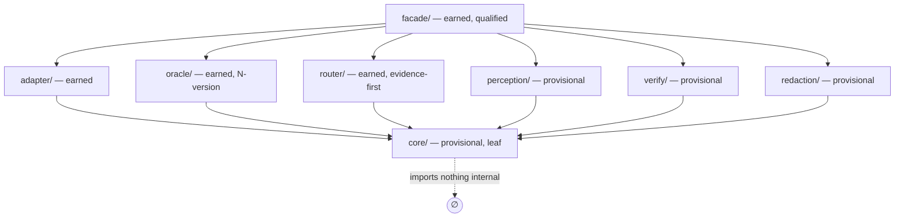

# feat: Seam scaffold + naming convention (Plan 1 of 3)

## Summary

Scaffold the eight seam directories under `skills/browser-use/src/` and the conventions
that make GoF/ICA patterns legible to an LLM: a per-seam promotion marker (earned vs
provisional), a deletion-test header, a one-way acyclic dependency direction, and a
banned-name guard. This is the first of three architecture-legibility plans. It introduces
the tree and the legibility primitives **alongside** the existing flat `src/` files, which
stay working and untouched. It moves no production code (Plan 2) and changes no CLI front
door (Plan 3).

---

## Problem frame

The product behavior is settled (R1–R14, see origin) and the GoF/ICA pattern names are
pressure-earned (`docs/decisions/2026-06-13-001-gof-pattern-naming-decision-log.md`), but
the file tree does not reflect them. Today `src/` is 28+ flat prefix-named files in one
directory; an LLM cannot answer "where is the oracle?" by listing directories, and nothing
stops a future edit from naming the router "Strategy" or the oracle "Facade" (both rejected).
This plan installs the legible target tree and the guards that keep it honest, before any
code moves into it.

---

## Requirements traceability

| Blueprint req | This plan |
|---|---|
| A1 — seam-directory layout | U1 (scaffold the 8 dirs) |
| A2 — promotion marker (earned vs provisional) | U2 (resolve mechanism + STATUS const) |
| A3 — deletion-test header per seam | U2 (header convention) |
| A5 — acyclic one-way dependency direction | U3 (documented direction + guard) |
| A6 — banned-name guard | U4 (test reads CONTEXT.md `_Avoid_`) |
| Success: "ls src/ answers where-is-X" | U1 |
| Success: "no dir claims an unproven pattern is earned" | U2 |
| Success: "no seam named with a rejected pattern" | U4 |

Out of scope here (other plans): moving existing code into seams (Plan 2), collapsing the
CLI to one facade contract (Plan 3).

---

## Key technical decisions

### KTD1 — Promotion marker: machine-checkable `STATUS` const + deletion-test header
The blueprint left header-comment-only vs machine-checkable open (A2). Resolve to **both**:
each seam entry file exports a small `SEAM` metadata object (`{ name, pattern, status:
"earned" | "provisional", deletionTest }`) AND opens with a one-line header comment carrying
the same status + deletion-test. Rationale: the header serves the LLM reading the file; the
const lets U4's guard and any future drift check read status mechanically without parsing
prose. Comment-only would force the guard to regex comments — brittle.

### KTD2 — Seams are scaffolded as marked shells, not stubs of behavior
Each seam directory gets one `index.ts` entry file carrying the `SEAM` const + header and a
re-export surface that is empty for now (the seam owns no code until Plan 2 migrates it in).
No behavioral code, no fake placeholder functions. A shell that compiles and states its own
identity is the deliverable. This keeps the existing flat files authoritative until migration.

### KTD3 — Earned vs provisional assignment follows the decision log verbatim
Status is not invented here. From the GoF decision log: `adapter` = earned, `oracle`
(N-version) = earned, `router` (evidence-first selection) = earned, `facade` = earned
(qualified to the action surface — recorded in the header note). `perception`, `verify`,
`redaction`, `core` = **provisional** (no pressure-earned GoF name yet; they are ICA seams
named for their role, promoted only when a proof gate earns a pattern name). Template Method
and Abstract Factory get NO directory (vertical-slice verdict — absent until a second proof
path earns them).

### KTD4 — Acyclic guard rides the existing `typecheck` + a directed-import test
The dependency direction is `facade → {adapter, oracle, router, perception, verify,
redaction} → core`; `core` imports nothing internal. Enforce two ways: (a) the existing
`tsc --noEmit` already surfaces a cycle as an error (module-split log precedent); (b) a
test asserts the allowed-direction rule against the seam entry files' imports, so a wrong-
direction import fails `bun test` with a named message, not just a cryptic tsc cycle. No new
runner or dependency.

### KTD5 — Banned-name guard reads CONTEXT.md `_Avoid_`, not a hardcoded list
CONTEXT.md already owns the avoid-aliases (router `_Avoid_: Strategy…`, oracle `_Avoid_:
facade…`). U4's guard reads those entries as the source of truth and asserts no seam
entry file's `SEAM.pattern`/header names a rejected pattern for that seam. Single source;
the guard self-updates when CONTEXT.md changes.

---

## Output structure

```
skills/browser-use/src/
  facade/index.ts        # SEAM: facade   | earned (qualified: action surface)
  adapter/index.ts       # SEAM: adapter  | earned
  oracle/index.ts        # SEAM: oracle   | earned (N-version programming)
  router/index.ts        # SEAM: router   | earned (evidence-first selection)
  perception/index.ts    # SEAM: perception | provisional
  verify/index.ts        # SEAM: verify   | provisional
  redaction/index.ts     # SEAM: redaction | provisional
  core/index.ts          # SEAM: core     | provisional (leaf; imports nothing internal)
  seam-contract.ts       # SEAM const type + the SEAM_DIRECTION rule (shared by guards)
  seam-contract.test.ts  # U3 acyclic-direction + U4 banned-name guards
  ...existing flat files unchanged...
  ARCHITECTURE.md        # the seam map + dependency direction, for an LLM placing new code
```

The tree is the scope declaration; per-unit `**Files:**` are authoritative.

---

## Implementation units

### U1. Scaffold the eight seam directories as marked shells
**Goal:** Create the target seam tree alongside the existing flat files, each seam a
compiling shell that states its identity.
**Requirements:** A1; success "ls src/ answers where-is-X".
**Dependencies:** U2 (the `SEAM` const type must exist first — build `seam-contract.ts` in U2,
then U1 consumes it). NOTE: implement U2's `seam-contract.ts` before U1's index files.
**Files:**
- `skills/browser-use/src/facade/index.ts` (create)
- `skills/browser-use/src/adapter/index.ts` (create)
- `skills/browser-use/src/oracle/index.ts` (create)
- `skills/browser-use/src/router/index.ts` (create)
- `skills/browser-use/src/perception/index.ts` (create)
- `skills/browser-use/src/verify/index.ts` (create)
- `skills/browser-use/src/redaction/index.ts` (create)
- `skills/browser-use/src/core/index.ts` (create)
**Approach:** Each `index.ts` exports a `SEAM` const (per U2's type) and opens with the
deletion-test header comment. Re-export surface empty (no behavior). `core/index.ts` imports
nothing internal. Do not touch any existing flat file.
**Patterns to follow:** the header-comment style already used in `src/prototype-playwright-vocab-map/ref-normalizer.ts` (leading block comment stating purpose + key finding); the deletion-test wording from the GoF decision log's `deletion_test` fields.
**Test scenarios:**
- Covers A1. Each of the 8 seam directories exists and its `index.ts` compiles under `tsc --noEmit`.
- `core/index.ts` has zero internal imports (asserted by the U3 direction test, not here).
- Test expectation for behavior: none — these are marked shells, identity-only. Behavioral coverage arrives with Plan 2 migration.
**Verification:** `bun run typecheck` passes with the 8 new index files present; `ls src/` shows the 8 seam directories.

### U2. Define the seam contract: `SEAM` const type, status, deletion-test header
**Goal:** Establish the machine-checkable promotion marker + header convention that U1, U3,
and U4 all consume.
**Requirements:** A2, A3; success "no dir claims an unproven pattern is earned".
**Dependencies:** none (foundational — build first).
**Files:**
- `skills/browser-use/src/seam-contract.ts` (create — the `SEAM` type, the `SeamStatus`
  union, the `SEAM_DIRECTION` allowed-import map, and a `SEAM_NAMES` list)
- `skills/browser-use/src/seam-contract.test.ts` (create — shared by U3/U4; this unit adds
  the status/shape assertions)
**Approach:** Define `type SeamStatus = "earned" | "provisional"` and a `Seam` shape
`{ name, pattern, status, deletionTest }`. `pattern` is the earned GoF name or `null` for
provisional seams. Encode the earned/provisional assignment (KTD3) as the expected baseline
the test asserts. The header-comment convention is documented here (a one-line `// SEAM:
<name> | <status> | deletion-test: <…>` at the top of each seam entry file) and enforced by
U4's reader.
**Patterns to follow:** `command-contract.ts` (existing shared-contract module pattern in
`src/`); fenced-yaml-per-decision verdicts in the GoF decision log for the exact status words.
**Test scenarios:**
- Covers A2. Each seam's `SEAM.status` matches the KTD3 baseline (adapter/oracle/router/facade = earned; perception/verify/redaction/core = provisional).
- Covers A3. Each seam entry file's header comment is present and its stated status equals the `SEAM.status` const (header and const cannot disagree).
- An earned seam has a non-null `pattern`; a provisional seam has `pattern: null`.
- No seam exists for Template Method or Abstract Factory (absent-until-earned).
**Verification:** `bun test seam-contract` passes; status assignment matches the decision log.

### U3. Document and guard the acyclic one-way dependency direction
**Goal:** Make the allowed dependency direction explicit and enforced so new code placement
is unambiguous and a wrong-direction import fails loudly.
**Requirements:** A5; success "core imports nothing internal".
**Dependencies:** U1 (seam dirs exist), U2 (`SEAM_DIRECTION` map).
**Files:**
- `skills/browser-use/src/ARCHITECTURE.md` (create — the seam map + the dependency-direction
  rule in prose + a small mermaid graph, for an LLM placing new code)
- `skills/browser-use/src/seam-contract.test.ts` (modify — add the direction guard)
**Approach:** `SEAM_DIRECTION` declares, per seam, which seams it may import
(`facade → all middle seams → core`; `core → none`; middle seams → `core` only). The guard
test reads each seam `index.ts`'s import specifiers and asserts every internal import obeys
the map. `tsc --noEmit` remains the cycle backstop; the test gives the named-message,
direction-aware failure.
**Patterns to follow:** the module-split decision log's keystone-leaf rule (`core` imported
by all, imports none); mermaid usage in existing `docs/` plans.
**Test scenarios:**
- Covers A5. `core/index.ts` imports zero other seams (fails with a named message if it does).
- A facade→core import passes; a core→facade import fails the direction guard.
- A middle-seam→middle-seam import (e.g. oracle→router) fails (middle seams may import only `core`).
- `ARCHITECTURE.md` lists all 8 seams and the one-way direction.
**Verification:** `bun test seam-contract` passes; deliberately adding a `core`→`facade`
import makes the test fail with a direction message, then is reverted.

### U4. Banned-name guard sourced from CONTEXT.md `_Avoid_`
**Goal:** Prevent rejected pattern names from attaching to a seam (router≠Strategy,
oracle≠Facade), with CONTEXT.md as the single source of truth.
**Requirements:** A6; success "no seam named with a rejected pattern".
**Dependencies:** U1 (seam files), U2 (`SEAM` const to read `pattern`/header).
**Files:**
- `skills/browser-use/src/seam-contract.test.ts` (modify — add the banned-name guard)
**Approach:** The guard parses CONTEXT.md's "Architecture patterns" section for each pattern's
`_Avoid_` list, then asserts no seam's `SEAM.pattern` or header text uses a name that
CONTEXT.md marks as an avoid-alias for a *different* seam — specifically that `router` never
carries "Strategy" and `oracle` never carries "Facade". Reads CONTEXT.md at test time so the
list self-updates.
**Patterns to follow:** existing tests that read sibling docs/fixtures in `src/*.test.ts`;
CONTEXT.md `_Avoid_` line format (`_Avoid_: a, b, c`).
**Test scenarios:**
- Covers A6. No seam entry file names "Strategy" for the router seam.
- No seam entry file names "Facade" for the oracle seam.
- The guard reads CONTEXT.md (not a hardcoded list) — adding a new `_Avoid_` alias there is
  picked up without editing the test (assert by injecting a temp alias in a fixture, or by
  asserting the parse pulls the live CONTEXT.md entries).
- A deliberately mis-named seam header (e.g. oracle header says "Facade") fails the guard.
**Verification:** `bun test seam-contract` passes; renaming the oracle header to "Facade"
makes the guard fail with a banned-name message, then is reverted.

---

## High-level technical design



Two guards keep the tree honest: `tsc --noEmit` (cycle backstop) and `seam-contract.test.ts`
(direction + banned-name + status/header agreement). Directional guidance, not a spec — the
implementer owns exact file contents.

---

## Scope boundaries

### In
- The 8 seam directories as marked shells; the `SEAM` const type + status; the deletion-test
  header convention; `ARCHITECTURE.md`; the acyclic-direction guard; the banned-name guard.

### Deferred to follow-up work (this plan set)
- Plan 2 — non-destructive migration of the existing 28 flat files into the seams.
- Plan 3 — collapse/confirm the CLI to one facade command-contract with flat verbs.

### Deferred for later (from origin)
- Template Method / Abstract Factory directories — absent until a second proof path earns them.
- A second CLI front door — only if a domain becomes independently agent-invoked.
- Per-seam proof gates beyond the adapter lifecycle.

### Outside this product's identity (from origin)
- Nested CLI subcommands per domain (`browser-use oracle diff …`) — violates one-level-deep.
- A directory whose name claims a pattern the code has not earned — the tree must not lie.

---

## Dependencies / assumptions
- `tsc --noEmit -p tsconfig.json` (existing `typecheck` script) is the cycle backstop.
- `bun test` is the runner for `seam-contract.test.ts` (no new dependency).
- CONTEXT.md's "Architecture patterns" section already carries the `_Avoid_` aliases U4 reads
  (verified present this session).
- The existing flat `src/` files keep compiling unchanged; this plan adds files, moves none.

---

## Open questions (execution-time)
- Exact `index.ts` re-export surface shape for an empty seam (named empty namespace vs bare
  file) — resolve when writing U1; both compile, pick the one tsc is happiest with.
- Whether the U4 CONTEXT.md parser keys off the `### <Pattern>` headings or the `_Avoid_`
  lines directly — resolve against the live CONTEXT.md format when writing the guard.

---

## Next step
Implement U2 (seam contract) → U1 (shells) → U3 (direction guard) → U4 (banned-name guard).
Then Plan 2 (migration) consumes this tree. Hand to `ce-work`.
