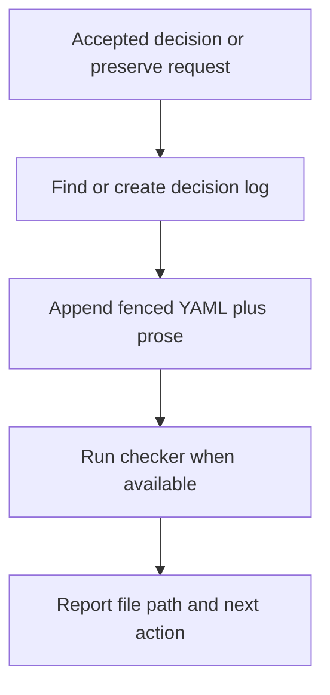
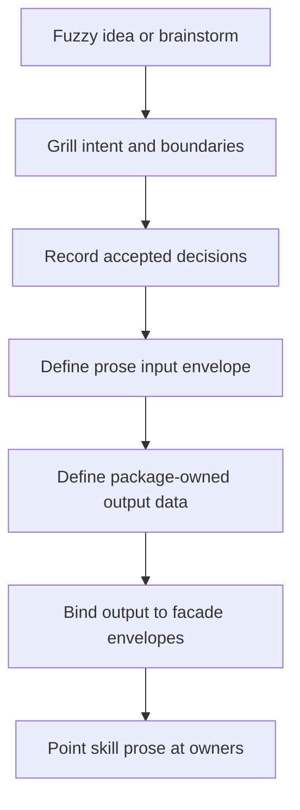

# Record Decision Operating Manual

Source:

- `docs/brainstorms/2026-06-06-decisions-skill-operating-manual.md`.
- `docs/decisions/2026-06-06-001-decisions-skill-decision-log.md`.

## Boundary

- Store accepted decisions in `docs/decisions/`.
- Do not own live decision-making.
- Route unresolved choices to `decision-mode`.
- Return after the user accepts an option or asks to preserve a decision.
- Do not treat decision logs as ADRs.
- Use ADRs only when decisions are hard to reverse, surprising without context, and real trade-offs.

## Decision Surface

- Decision logs belong to a decision surface.
- A decision surface is the smallest stable future lookup surface.
- Use product areas, workflows, skills, implementation slices, operational areas, or long-running systems.
- Treat brainstorms, chats, plans, tags, dates, agents, and people as metadata, not owners.

## Storage Flow



## New Log Frontmatter

```yaml
---
title: Short Human Title
slug: short-log-slug
type: decision-log
status: in-progress
date: "YYYY-MM-DD"
timezone: Australia/Melbourne
owner: decision-surface
source:
  - path-or-chat-label
decision_metadata_format: fenced-yaml-per-decision
---
```

Rules:

- Let filename own date and sequence.
- Let frontmatter `slug` own the decision ID prefix.
- Use status `in-progress` or `complete`.
- Omit frontmatter `updated`.
- Omit frontmatter `tags`.
- Include top-level `Frame`.
- Include top-level `Notes`.

## Decision Entry

````text
## Decision N: Short Name

```yaml
id: short-log-slug-NNN
status: accepted
decided_at: "YYYY-MM-DD"
decision: short accepted decision
owner: decision-surface
source:
  - path-or-chat-label
```

Optional when the decision came from `decision-mode`:

```yaml
decision_mode:
  question: short question
  option: accepted option
  confidence: strong|soft|hold
```

Decision:

- State what was decided.

Rationale:

- State why this option won.

Consequences:

- State what changes for future agents.

Next:

- State the next safe action.

V2 Ideas:

- Preserve follow-up ideas that should not change v1.
````

## YAML Rules

- Required fields:
  - `id`
  - `status`
  - `decided_at`
  - `decision`
  - `owner`
  - `source`
- Optional fields:
  - `decision_mode.question`
  - `decision_mode.option`
  - `decision_mode.confidence`
  - `scope`
  - `superseded_by`
  - `supersedes`
- Match each `id` prefix to the log frontmatter `slug`.
- Keep IDs stable after creation.
- Keep per-decision `owner` scalar.
- Use `scope` only when it narrows `owner`.
- Use `source` as a list of paths or short human labels.
- Use status `accepted` or `superseded`.
- Add `superseded_by` when `status: superseded`.
- Add `supersedes` on the replacing decision when useful.
- Include `decision_mode` only when the decision came from `decision-mode`.
- Reuse `decision-mode` confidence values: `strong`, `soft`, `hold`.

## Rejected Ideas

- Store rejected ideas only when the user asks to preserve them.
- Record an accepted exclusion decision, not `status: rejected`.
- Put rejected option context in `Rationale`, `Consequences`, or top-level `Notes`.
- Use this shape when future agents would otherwise re-suggest the rejected idea.

## Notes

- Use top-level `Notes` for emerging ideas that are not accepted decisions.
- Keep notes short.
- Promote a note to a decision entry only after acceptance.
- Do not create a separate decision queue in v1.

## Brainstorm To Agent-Native I/O

Use this pattern when a skill turns a fuzzy idea into a runtime-backed command.



Rules:

- Start from the brainstorm, not a command shape.
- Grill one decision at a time.
- Record accepted decisions before implementation planning depends on them.
- Put unresolved branches in `Notes`, not runtime contracts.
- Use a prose input envelope when humans or agents supply intent.
- Require explicit fields for side effects, ownership, durability, privacy, or acceptance.
- Reject hidden inference for `owner`, `source`, execute mode, and personal/private scope.
- Define package-owned output data by driver need:
  - success data proves plan or mutation result
  - repair data tells the caller what to change
  - safety data tells the caller what changed and whether retry is safe
- Use facade runtime envelopes for output transport and validation.
- Keep exact flags, schemas, field names, statuses, action names, diagnostics, retry categories, and envelope details in code, help, and tests.
- Keep `SKILL.md` as routing:
  - when to call the command
  - which owner path defines the contract
  - what safety gate applies
  - what next safe action follows
- Name owners before implementation:
  - contract
  - model
  - engine
  - discovery
  - CLI
  - tests
- Use `cli-author` before adding or changing the command surface.
- Prove discovery metadata, rendered help, parser acceptance, and runtime semantics cannot drift.

## Helper Gate

- Dry-run command: `record-decision --input <decision.md> --json`.
- Execute command: `record-decision --input <decision.md> --execute --json`.
- Discovery command: `record-decision commands --json`.
- Run `cli-author` before changing helper CLI behavior.
- Dry-run is default and performs no writes.
- Execute writes require explicit `--execute`.
- Exact parser rules, result shape, diagnostics, and exit codes belong in `skills/record-decision/src/`.

## V2 Record Direction

- Use `record-decision` as the v2 write surface.
- Default record runs to dry-run.
- Require explicit execute mode for writes.
- Accept a prose envelope for intent input.
- Require explicit `decision`, `owner`, `source`, and `accepted: true`.
- Do not infer missing `owner` or `source`.
- Use facade runtime envelopes for CLI output.
- Put package-specific payloads inside facade-owned `data`.
- Keep exact input, output, action, diagnostic, and exit contracts in code, help, and tests.

## Record Success Data

- Describe success as a mutation plan or completed mutation result.
- Dry-run data names the target log, proposed decision identity, planned mutations, and validation summary.
- Execute data names the target log, created decision identity, completed mutations, and validation summary.
- Keep full rendered entries out of primary success data.
- Use rendered Markdown only as preview detail when useful.

## Record Error Data

- Describe missing-input and out-of-scope errors as repair packets.
- Name the failed gate, missing or blocked input, no-mutation evidence, and next repair action.
- Do not echo full input as primary error data.
- Route private or personal decisions away from repo logs.
- Describe duplicate conflict and legacy log shape errors as case-specific repair packets.
- For duplicate conflicts, name the conflict basis, affected target, no-mutation evidence, and next repair action.
- For legacy log shape, name the incompatible target, blocked shape, no-mutation evidence, and next repair action.
- Do not auto-repair, migrate, or rewrite legacy logs while recording a decision.
- Describe filesystem and post-write validation failures as mutation safety packets.
- Name the failed phase, mutation evidence, rollback or partial-write status, retry safety, and next repair action.
- Do not create persisted diagnostic artifacts by default.
- Keep exact privacy codes, field names, action names, and envelope placement in code, help, and tests.

## Supersession Writes

- Treat `supersedes` as a two-sided lifecycle change.
- Dry-run previews the new entry plus old-entry updates.
- Execute appends the replacement and marks safely resolved old entries `superseded`.
- Add `superseded_by` to each updated old entry.
- Block before writing when a superseded target cannot be resolved safely.
- Keep v2 execute supersession same-log only.
- Block cross-log supersession before writing and return repair guidance.

## Execute Writes

- Render full replacement content before writing.
- Validate replacement content before replacing the target.
- Write to a temp file in the target directory.
- Replace the target with an atomic rename.
- Keep dry-run free of temp-file writes.
- Leave temp naming, cleanup, fsync, permission preservation, and platform behavior to code and tests.

## Checker Loop

1. Read one decision-log file.
2. Parse frontmatter.
3. Parse fenced YAML blocks.
4. Check required log sections.
5. Check required decision sections.
6. Emit JSON.
7. Leave the file unchanged.

## Compatibility

- Apply the new decision-log shape to new logs.
- Do not assume historical `docs/decisions/` logs already match the new shape.
- The v1 checker should report legacy-shape mismatches clearly.
- Decide migration separately before running the checker across existing logs.

## Post-Checker Ownership

- Keep this manual prose-owned until the checker exists.
- After the checker exists, move deterministic lists into runtime-owned code, help, tests, or generated output.
- Replace drift-prone field, status, ID, heading, and output lists with owner paths or emitting commands.
