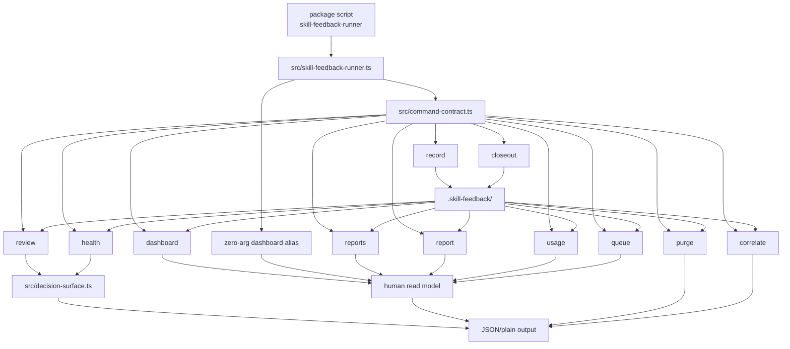
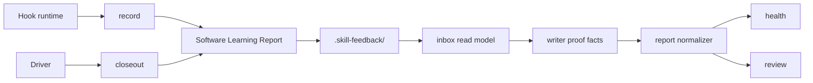
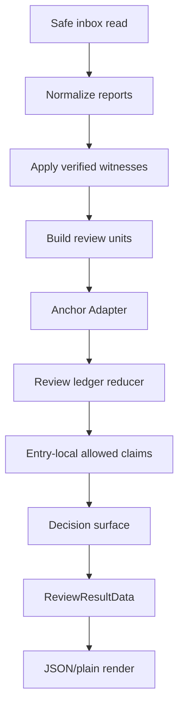
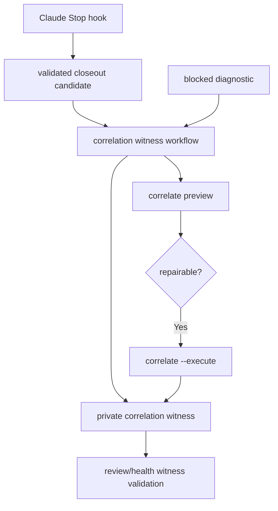
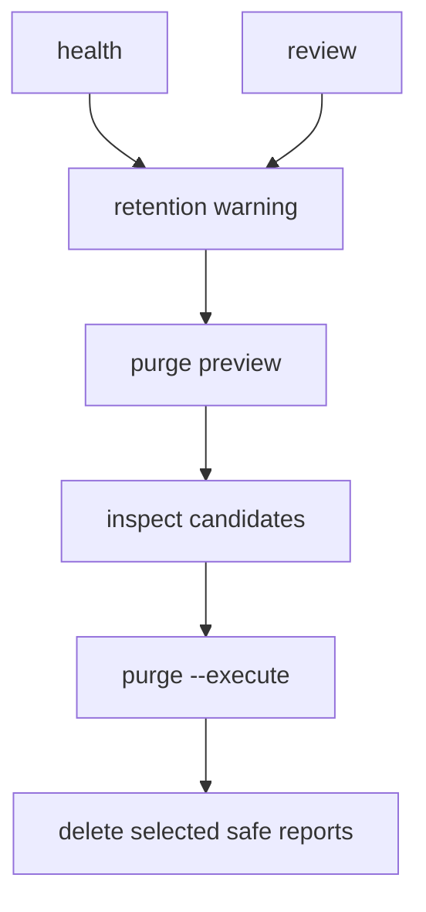

# Skill Feedback Architecture

Package architecture for `skill-feedback-scripts`.

## Shape

`skill-feedback` is a CLI interface over repo-local Software Learning Reports.
It writes private evidence under `.skill-feedback/`, then exposes health,
human observability, review, correlation, and retention commands for agents and
humans.

Its interface is:

- `skill-feedback-runner` package script.
- `src/command-contract.ts` command facade contract.
- JSON result envelopes for machine-readable commands.
- Plain output for `dashboard`, `reports`, `report`, `usage`, `queue`,
  `review`, `health`, and `correlate`.
- Zero-arg dashboard alias over the human dashboard read surface.
- Private repo-local inbox files under `.skill-feedback/`.

The Module Map below is the single per-module owner list. `AGENTS.md` and
`README.md` point here instead of repeating it; `src/docs-drift.test.ts`
keeps the map complete in both directions.

## CLI Entry Flow

The command facade contract is the external seam. Tests cover discovery
metadata, help rendering, parser acceptance, runtime semantics, and branch
station evidence.

## Command Surface

| Command | Posture | Owner |
| --- | --- | --- |
| `record` | Writes hook-owned Software Learning Report; fail-closed on gitignore | `src/skill-feedback-runner.ts`, `src/command-contract.ts` |
| `closeout` | Writes driver closeout from stdin; no argv receipt | `src/skill-feedback-runner.ts`, `references/closeout-receipt.md` |
| `dashboard` | Read-only plain front door for reports, usage, queue, and diagnostics | `src/skill-feedback-runner.ts`, `src/command-contract.ts` |
| `reports` | Read-only report list with stable `report:<id>` continuations | `src/inbox-read-model.ts`, `src/report-normalizer.ts`, `src/skill-feedback-runner.ts`, `src/command-contract.ts` |
| `report` | Read-only detail view with duplicate-ref and low-signal gates | `src/inbox-read-model.ts`, `src/report-normalizer.ts`, `src/skill-feedback-runner.ts`, `src/command-contract.ts` |
| `usage` | Read-only skill usage ranking over primary and low-signal counts | `src/inbox-read-model.ts`, `src/skill-feedback-runner.ts`, `src/command-contract.ts` |
| `queue` | Read-only improvement queue from owner-path evidence with skill fallback | `src/decision-surface.ts`, `src/skill-feedback-runner.ts`, `src/command-contract.ts` |
| `review` | Read-only claim-safe report card | `src/inbox-read-model.ts`, `src/review-ledger-reducer.ts`, `src/decision-surface.ts`, `src/skill-feedback-runner.ts` |
| `health` | Read-only inbox, readiness, warning, next-action summary | `src/inbox-read-model.ts`, `src/decision-surface.ts`, `src/skill-feedback-runner.ts`, `src/command-contract.ts` |
| `purge` | Preview by default; `--execute` deletes selected safe reports | `src/inbox-read-model.ts`, `src/skill-feedback-runner.ts` |
| `correlate` | Preview by default; `--execute` writes private witnesses | `src/correlation-witness-artifacts.ts`, `src/correlation-witness-workflow.ts`, `src/skill-feedback-runner.ts`, `src/command-contract.ts` |

The zero-arg front door aliases the contract-backed `dashboard` renderer.
`dashboard` is plain only; usage errors use `skill-feedback.dashboard`.
`reports`, `report`, `usage`, and `queue` own the human JSON contracts.
`health` remains the diagnostics JSON/plain data contract for scripts and
agents.

## Module Map

- `package.json`: exposes `skill-feedback-runner`, `test`, and `typecheck`.
- `src/command-contract.ts`: contract ids, schema versions, command metadata,
  parsed types, result envelopes, writer proof, and correlation witness
  artifact contracts.
- `src/runtime-contract.ts`: runtime and read-target interfaces shared across
  source owners; runner re-exports keep test and hook compatibility.
- `src/runtime-file-safety.ts`: shared filesystem safety helpers used by
  runner, inbox reads, and correlation artifacts.
- `src/raw-object.ts`: shared raw-object field and duplicate string helpers.
- `src/decision-surface.ts`: review and health `ReviewResultData` /
  `HealthResultData` assembly; consumes safe inbox reads and reducer facts.
- `src/report-normalizer.ts`: persisted report parsing, `normalizeReport`,
  evidence-gap normalization, proof-context application, and cost-unavailable
  projection.
- `src/inbox-read-model.ts`: safe inbox scans, raw JSON reads, normalization
  calls, duplicate report and proof facts, low-signal lane classification,
  health facts, and purge candidate projection.
- `src/correlation-witness-artifacts.ts`: correlation directory reads,
  artifact parsing, witness validation helpers, diagnostic writes, and
  repair-candidate artifact classification.
- `src/correlation-witness-workflow.ts`: finalization, verification overlays,
  repair classification, and execute orchestration.
- `src/skill-feedback-runner.ts`: default runtime implementation, gitignore
  gate, inbox preparation, record and closeout writes, CLI parsing, process
  envelopes, command orchestration, dashboard command rendering, and plain
  rendering.
- `src/review-ledger-reducer.ts`: review unit grouping, trusted run handling,
  ledger entries, evidence tiers, resolution state, entry-local allowed claims.
- `src/ledger-anchor-adapter.ts`: repo-contained owner path canonicalization,
  strong anchor facts, weak anchor reasons.
- `src/capture-adapters.ts`: `CaptureAdapter` seam plus Claude OTel and Codex
  JSON normalization for receipt-shaped input.
- `src/redaction.ts`: redaction for agent-authored report and report-card text.
- `src/report-helpers.ts`: evidence-gap helpers and stable report ids.
- `src/branch-station-catalog.ts`: package-owned station map for public command
  branch coverage.
- `src/branch-station-evidence.ts`: station evidence projection and missing
  station helpers.
- `src/*.test.ts`: one suite per module, plus
  `src/skill-feedback.integration.test.ts` process-boundary stations and
  `src/docs-drift.test.ts` module-map drift.

## Report And Trust Flow

Report trust stance:

- Agent-authored text is evidence-only.
- Writer proof verifies selected writer-owned fields only.
- Trusted skill identity requires engine-owned evidence.
- Trusted run proof requires runtime-owned or correlation-owned provenance.
- `corroborated` requires runtime-owned hook capture plus correlation-owned
  driver closeout in the same trusted review unit.

## Review Ledger Flow

The reducer owns claim derivation. Renderers repeat facts; they do not infer
trust or readiness.
The decision surface assembles review and health results; the runner renders
envelopes and bounded plain output.

## Correlation Flow

Correlation witnesses live under `.skill-feedback/.correlation/`. Diagnostics
carry diagnostics plus optional private repair candidate boundaries. They are
not reports or public closeout input. Public report ids, run ids, proof fields,
trust fields, and closeout receipt fields cannot create a witness.

## Inbox Retention Flow

Purge deletes selected safe report files only. It skips `.trust/`,
`.correlation/`, interrupted temp artifacts, and `pilot_started_at`; those stay
health or source evidence unless a future command contract names them.
