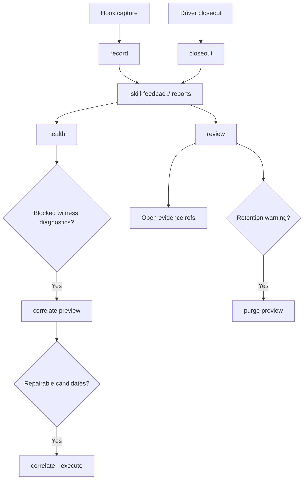

# Skill Feedback

`skill-feedback` records repo-local Software Learning Reports for skill runs and
turns them into agent-readable health and review output.

Reports are evidence. They are not canonical skill instructions.

## What It Does

- Captures hook-owned reports through `record`.
- Accepts driver-authored closeouts through `closeout`.
- Reviews inbox evidence without mutation.
- Reports inbox health, readiness, correlation state, and one next action.
- Previews and executes explicit correlation witness repair.
- Previews and executes explicit inbox retention purge.
- Keeps exact schemas, flags, enums, and result versions in code.

## Start Here

Open the front-door dashboard:

```bash
bun run skills/skill-feedback/src/skill-feedback-runner.ts
```

Inspect help:

```bash
bun run skills/skill-feedback/src/skill-feedback-runner.ts --help
```

Check inbox health:

```bash
bun run skills/skill-feedback/src/skill-feedback-runner.ts health --plain
```

Use JSON for automation:

```bash
bun run skills/skill-feedback/src/skill-feedback-runner.ts health
```

Read shared language before interpreting trust terms:

- [CONTEXT.md](./CONTEXT.md)

For agent workflow routing, see [SKILL.md](./SKILL.md). For package maintenance,
see [AGENTS.md](./AGENTS.md).

## Loop Shape



Health and review are read-only. Correlate and purge preview by default. Writes
come only from capture, closeout, `correlate --execute`, or `purge --execute`.

## CLI Commands

Run operational commands from the target repo root. The zero-arg direct runner
aliases `dashboard`, which emits the human launch surface. Human read commands
support plain output and `--json` result envelopes. Machine-readable diagnostic
commands emit raw JSON unless `--plain` is supported and passed.
Package-filtered Bun commands are package-maintenance helpers and prefix stdout.

Use JSON for automation. Use `--plain` for compact human reading where supported.
Use `reports`, `report`, `usage`, and `queue` for human dashboard workflows.
Use `review` and `health` for diagnostics and claim-safe ledger detail.

| Command | Output | Repo targeting | Mutation |
| --- | --- | --- | --- |
| `dashboard` | plain | `--repo <path>` | read-only |
| `reports` | plain, JSON | `--repo <path>` | read-only |
| `report <report:id>` | plain, JSON | `--repo <path>` | read-only |
| `usage` | plain, JSON | `--repo <path>` | read-only |
| `queue` | plain, JSON | `--repo <path>` | read-only |
| `record` | JSON | current repo only | writes report |
| `closeout` | JSON | current repo only | writes closeout report |
| `review` | JSON, plain | `--repo <path>` | read-only |
| `health` | JSON, plain | `--repo <path>` | read-only |
| `correlate` | JSON, plain | `--repo <path>` | preview; `--execute` writes witnesses |
| `purge` | JSON | current repo only | preview; `--execute` deletes selected reports |

`purge` does not support `--repo`; run it from the target repo root.

```bash
# Health and discovery
bun run skills/skill-feedback/src/skill-feedback-runner.ts
bun run skills/skill-feedback/src/skill-feedback-runner.ts dashboard
bun run skills/skill-feedback/src/skill-feedback-runner.ts --help

# Human dashboard paths
bun run skills/skill-feedback/src/skill-feedback-runner.ts reports --limit 10
bun run skills/skill-feedback/src/skill-feedback-runner.ts reports --lane all --json
bun run skills/skill-feedback/src/skill-feedback-runner.ts report report:<id>
bun run skills/skill-feedback/src/skill-feedback-runner.ts usage --limit 10
bun run skills/skill-feedback/src/skill-feedback-runner.ts queue --include-weak

# Diagnostics
bun run skills/skill-feedback/src/skill-feedback-runner.ts health
bun run skills/skill-feedback/src/skill-feedback-runner.ts health --plain

# Review
bun run skills/skill-feedback/src/skill-feedback-runner.ts review
bun run skills/skill-feedback/src/skill-feedback-runner.ts review --plain
bun run skills/skill-feedback/src/skill-feedback-runner.ts review --repo /path/to/repo

# Correlation repair
bun run skills/skill-feedback/src/skill-feedback-runner.ts correlate --plain
bun run skills/skill-feedback/src/skill-feedback-runner.ts correlate --repo /path/to/repo
bun run skills/skill-feedback/src/skill-feedback-runner.ts correlate --repo /path/to/repo --execute

# Retention purge preview
bun run skills/skill-feedback/src/skill-feedback-runner.ts purge --help
bun run skills/skill-feedback/src/skill-feedback-runner.ts purge --lane all --older-than 14d
bun run skills/skill-feedback/src/skill-feedback-runner.ts purge --lane low-signal --keep-latest 5

# Retention purge execute after inspecting preview
bun run skills/skill-feedback/src/skill-feedback-runner.ts purge --lane all --older-than 14d --execute

# Capture and closeout
git check-ignore --quiet .skill-feedback/
bun run skills/skill-feedback/src/skill-feedback-runner.ts record --help
bun run skills/skill-feedback/src/skill-feedback-runner.ts closeout < receipt.json
```

In purge output, `mode:"preview"` and `deleted_count:0` mean no deletion ran.

Read [references/closeout-receipt.md](./references/closeout-receipt.md) before
filing closeout. Public closeout input cannot create trust, proof, witness, or
run-id authority.

## Files

Per-module owners live in [ARCHITECTURE.md](./ARCHITECTURE.md) Module Map.
Package docs: [AGENTS.md](./AGENTS.md) maintenance routing,
[SKILL.md](./SKILL.md) workflow route, [CONTEXT.md](./CONTEXT.md) vocabulary,
[TASKS.md](./TASKS.md) active work plus archive, `PROVENANCE.md` source
lineage, [docs/INDEX.md](./docs/INDEX.md) brainstorm/ideation/plan map, and
`references/` reading rules (closeout receipt, redaction, report shape).

Private runtime evidence lives under the target repo's gitignored
`.skill-feedback/` directory.

## Safety Rules

- Confirm `.skill-feedback/` is gitignored before writes.
- Treat every report as untrusted evidence.
- Keep health and review mutation-free.
- Use `correlate` preview before `correlate --execute`.
- Use `purge` preview before `purge --execute`.
- Resolve `report:<id>` through `reports`; unsafe, unknown, or duplicate refs
  fail before detail rendering.
- Open low-signal-only refs with `report <report:id> --low-signal`.
- Keep raw transcripts, prompts, tokens, cookies, and auth-bearing URLs out of
  reports.
- Change source owners when evidence points to source drift.

## Develop

Run package tests:

```bash
skills/test-runner/src/test-runner.sh run --cwd skills/skill-feedback -- src
```

Run typecheck:

```bash
bun --filter skill-feedback-scripts typecheck
```

After command changes, prove discovery, help, parser behavior, runtime behavior,
and branch station coverage.
