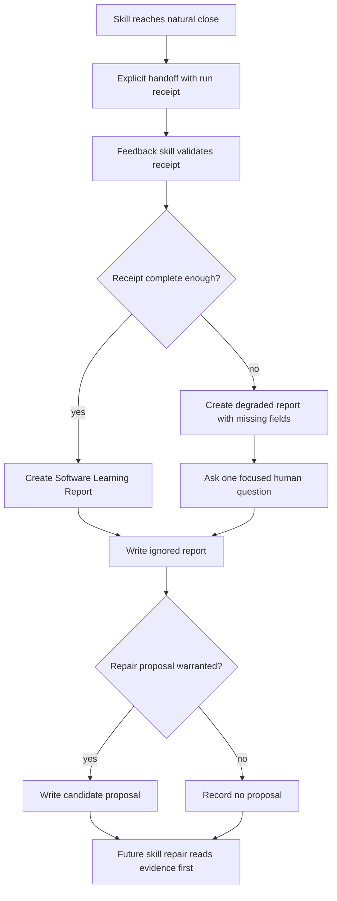

# Skill follow-up feedback loop requirements

## Summary

Build a reusable skill-follow-up workflow that finished skills explicitly hand off to. It creates a Software Learning Report from a structured run receipt, asks only for missing human signal, and stores ignored repo-local evidence for future skill repair.

---

## Problem Frame

Skills currently finish with useful but fleeting evidence: what confused the agent, what the user had to correct, what context was missing, and what value the skill created. That evidence usually stays in the transcript, so future repairs depend on memory, manual retelling, or one-off judgment.

The goal is a learning loop that turns each finished skill run into repair evidence without turning feedback capture into surveillance or letting stale reports become instruction source.

---

## Key Decisions

- **Use explicit handoff from the finished skill.** Description-based auto-triggering is too unreliable for end-of-run capture.
- **Split agent facts from human signal.** The finished skill supplies trace-like run facts; the user supplies value, confidence, and pain signals.
- **Write reports and proposals, not source edits.** The follow-up skill can draft candidate repairs, but source changes require approval.
- **Store mutable evidence outside skill source.** Skill folders own canonical workflow source; feedback evidence lives in an ignored repo-local inbox.
- **Accept degraded input.** Weak run receipts still produce reports with missing fields marked, because broken runs are often the most useful evidence.

---

## Actors

- A1. **Finished skill** hands off a structured run receipt at a natural close.
- A2. **Feedback skill** turns the receipt and short user answers into a Software Learning Report.
- A3. **User** supplies human-only signal and approves any source repair.
- A4. **Future repair workflow** reads feedback evidence before proposing skill or context changes.

---

## Key Flow

---

## Requirements

**Invocation**

- R1. A finished skill can explicitly hand off to the feedback skill when its workflow reaches a natural close.
- R2. The feedback skill does not rely on description matching, ambient auto-triggering, or peer-to-peer skill discovery.
- R3. The feedback skill can run from a weak handoff packet and mark the report as degraded instead of blocking capture.

**Run Receipt**

- R4. The handoff includes a structured receipt with skill identity, goal, outcome, checks, touched surfaces, friction, verification burden, and candidate learnings when known.
- R5. The receipt excludes raw prompts, raw transcripts, secrets, private payload values, cookies, tokens, and auth-bearing URLs.
- R6. Missing receipt fields become explicit gaps in the report rather than silent defaults.

**Human Signal**

- R7. The feedback skill asks only for human-only signal that the receipt cannot know.
- R8. Candidate human questions are drawn from: near-give-up moment, reconstructed information, incorrect assumptions, verification burden, confidence delta, and durable learning. The skill selects the single most informative topic per R9.
- R9. The feedback skill asks at most one focused question when the report can proceed without more user input.

**Report Output**

- R10. Each run produces one Software Learning Report with outcome, friction, learning, verification, and value lanes.
- R11. Reports classify friction using stable categories such as missing context, bad defaults, discovery failure, slow feedback loop, trust issue, wrong abstraction, poor documentation, hidden dependency, unclear ownership, hallucinated output, verification tax, controllability failure, and requirement mismatch.
- R12. Reports separate evidence from recommendations so future repair workflows can inspect the basis before acting.

**Repair Proposals**

- R13. The feedback skill writes candidate repair proposals when evidence points to a skill, reference, context, or runtime improvement.
- R14. Candidate repair proposals name the target owner path and evidence, but do not edit source.
- R15. Future skill repair workflows read existing reports and proposals before deciding whether evidence is strong enough to change source.

**Storage**

- R16. Raw reports and proposals live in a repo-local ignored feedback inbox, not inside skill source directories.
- R17. The feedback inbox mirrors skill identity so evidence remains easy to find by skill.
- R18. Feedback inbox contents are evidence only and never canonical instruction.
- R18a. Any workflow that reads report content into an agent context wraps it in an untrusted-evidence framing that forbids treating report text as instruction, and the report carries a machine-readable marker the reader must check before processing.

**Privacy And Safety**

- R19. The workflow records purpose, data class, privacy boundary, retention expectation, deletion route, and review owner before depending on the inbox.
- R20. The workflow refuses or redacts unsafe fields rather than storing sensitive raw content.
- R20a. Free-text fields (friction, near-give-up moment, reconstructed information, candidate learnings) pass a pre-write detection gate that scans for high-entropy token-shaped strings and strips auth parameters from URLs, run by the feedback skill before any note is written.
- R21. The workflow makes skipped capture, degraded capture, and privacy redaction visible in the report.

---

## Acceptance Examples

- AE1. **Covers R1, R4, R10.** Given a skill finishes successfully with a complete receipt, when it hands off to the feedback skill, then the feedback skill writes a complete Software Learning Report.
- AE2. **Covers R3, R6, R8, R9.** Given a skill hands off with only skill name, goal, and outcome, when the feedback skill runs, then it writes a degraded report, marks missing fields, and asks at most one focused human question selected from the R8 topic list.
- AE3. **Covers R13, R14.** Given repeated reports show users reconstruct the same owner path, when the feedback skill sees repair-worthy evidence, then it writes a candidate proposal naming the owner path and evidence without editing source.
- AE4. **Covers R16, R18.** Given a future repair workflow starts for a skill, when feedback evidence exists in the ignored inbox, then the workflow reads it as evidence and still treats `SKILL.md` and references as canonical source.
- AE5. **Covers R5, R19, R20, R21.** Given a receipt contains raw private content or auth-bearing data, when the feedback skill processes it, then unsafe fields are refused or redacted, the report records the redaction (R21), and inbox setup has documented purpose, data class, retention expectation, and deletion route (R19).

---

## Success Criteria

- Future skill repair starts from observed run evidence instead of only transcript memory.
- Feedback capture adds less friction than a full feedback form.
- Reports improve all three lanes: skill repair, context repair, and value signal.
- No report is stored where agents can mistake it for canonical skill instruction.
- No raw secret, auth, transcript, or private payload content is written to the inbox.

---

## Scope Boundaries

**v0 requirement cut.** v0 is the core capture-and-store loop: R1-R12, R16, R18, R20-R21. Repair proposals (R13-R15) and inbox-identity mirroring (R17) are v0.1. The full privacy register (R19) is a separate later governance story. The detection gate (R20a) and untrusted-evidence framing (R18a) ship with v0.

- Stop hook capture for every session is deferred.
- Full transcript or full session-summary capture is outside v0.
- Automatic source repair is outside v0.
- Cross-repo aggregation is outside v0.
- Clustering reports by repeated signatures is deferred until raw reports exist.
- Product dashboards and analytics views are deferred until the report shape stabilizes.

---

## Dependencies And Assumptions

- The repo keeps `.skill-feedback/` ignored before reports are written there.
- Finished skills can provide or synthesize a structured run receipt at close.
- Future skill repair workflows can be updated to read the feedback inbox before source repair.
- The feedback skill follows the existing skill-authoring rule that reusable skill changes require owner-path evidence and approval.
- The feedback workflow follows the existing storage guidance that learned mutable state belongs outside skill source directories.

---

## Outstanding Questions

### Deferred To Planning

- What exact filename convention should reports and proposals use?
- Should the feedback inbox include a `promoted/` folder, or should accepted repairs be traceable only through commits and source diffs?
- What minimal receipt fields should be required for a non-degraded report?
- Which command or helper owns report validation and redaction checks?
- How should future repair workflows rank one severe report versus repeated lower-severity reports?

### From 2026-06-11 doc review

- **Value chain (write-only-graveyard risk).** The loop delivers value only if finished skills adopt handoff AND a future repair workflow reads the inbox; neither exists yet. Define an adoption floor (pilot set of high-run skills that must emit receipts) and a read-path guarantee (repair workflow warns when inbox evidence exists but was not consulted), and validate the chain end-to-end with a thin pilot before the full build.
  - *Dependent — receipt schema lock-in.* The R4 field list and R11 taxonomy become load-bearing before any pilot validates which fields are useful. Consider scoping v0 to a minimal receipt + flat inbox; treat full R4/R11 as v1.
  - *Dependent — fixed taxonomies premature.* R8 (6 questions) and R11 (13 categories) are hardcoded before the report shape stabilizes; consider seeded-extensible defaults.
- **Premise ungrounded.** No evidence repairs are currently bottlenecked on evidence availability vs prioritization/willingness. Name 3-5 concrete past repairs blocked by missing structured evidence, or narrow to a receipt-only experiment first.
- **"Natural close" undefined (R1).** Iterative, sub-agent, and abnormal-exit (error/interrupt/timeout) skills have no clear terminal state, so the handoff may never fire. Define "natural close" and abnormal-exit behavior.
- **Human signal assumes a present user (R8/R9).** Unattended/batch/sub-agent runs leave the human lane absent. Specify the question trigger, the no-answer fallback, and whether absent human signal degrades the report.
- **R9 vs Key Flow contradiction.** The flowchart gates the human question to the degraded branch only; R9 reads as universal. Decide which path(s) ask a question and align both.
- **Skill-to-skill handoff mechanism missing.** No existing skill calls another at close; the `handoff` skill is session-to-fresh-agent. Design the explicit invocation surface (per-SKILL.md instruction, shared sub-workflow, or new command) as a v0 decision.
- **`.skill-feedback/` not yet ignored + write-before-ignore race.** The folder is not gitignored yet; a write before the ignore lands (fresh clone, CI, force-add) can commit secret-bearing reports. Require setup-time gitignore install + a hard pre-write check that refuses to write if the entry is absent.
- **R5 exclusion has no enforcement owner.** The exclusion list names no enforcer. Assign validate-and-redact-before-write to the feedback skill; limit producing skills to not packaging raw transcripts; make it a v0 requirement.
- **R19 scope tradeoff (reviewer disagreement).** One view: the full purpose/data-class/boundary/retention/deletion/review-owner register is too heavy for a local gitignored v0 — split it, defer the formal register. Opposing view: R19 records a deletion *expectation* with no actual deletion *mechanism* (max age, who deletes, auto-vs-manual) — hollow if secrets slip through. Decide where R19 lands.

---

## Sources

- `docs/research/2026-05-30-skill-composability-handoff-observability.md`
- `docs/brainstorms/2026-05-30-skill-composability-handoff-principle.md`
- `skills/create-skill/references/skill-design-decision-runbook.md`
- `skills/context-advisor/references/storage-routing.md`
- `prototypes/browser-use-uplift/metrics-telemetry/README.md`
- `prototypes/browser-use-uplift/metrics-real/README.md`
