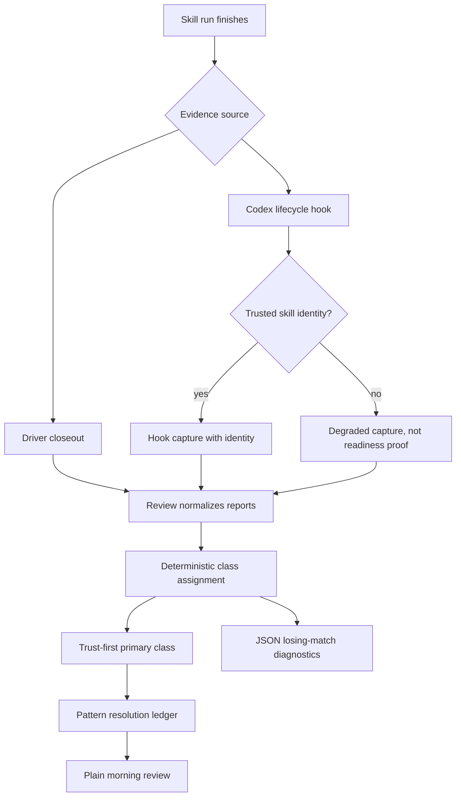

# Skill-feedback review pattern ledger v2 requirements

## Summary

Build the next skill-feedback review version around a pattern resolution ledger. The ledger groups reports by deterministic failure class, keeps evidence trust visible, and stays blocked until Codex lifecycle-hook capture proves trusted skill identity.

---

## Problem Frame

The report-card v1 loop makes `.skill-feedback/` worth opening: closeouts, coverage, evidence gaps, open items, and no-action rationale now exist. The next product question is not whether reports were captured. It is whether review can turn a pile of reports into recurring patterns a human or agent can resolve.

The current danger is false readiness. A hook can fire and still produce a degraded placeholder record with unknown skill version, missing runtime fields, empty usage, and no trusted skill identity. That proves plumbing, not useful Codex lifecycle support. New feature work needs the stronger proof gate before the product builds on top of live Codex capture.

The second danger is false intelligence. Narrative report text is useful evidence for a human, but it does not decide classifier output in the MVP. The review product starts boring, inspectable, and exact: structured fields map to a small product-native taxonomy, one primary class wins by a trust-first order, and losing matches stay in JSON diagnostics.

---

## Key Decisions

- **Pattern ledger is the product surface.** Review answers which recurring pattern needs a resolution path, not only which report is interesting.
- **Failure class is the primary grouping key.** Owner path, evidence quality, verification burden, and resolution path are attributes on the grouped pattern.
- **Review owns class assignment.** Closeout stays lightweight and evidence-only; review maps captured evidence into product-native classes.
- **Classification is deterministic.** Structured fields select failure classes; narrative notes remain evidence for inspection.
- **Trust-first precedence picks one primary class.** Evidence trust problems outrank routing problems so the ledger does not route untrusted evidence.
- **Losing class matches are diagnostics.** They do not inflate ledger counts, and they stay out of `--plain` MVP output.
- **Diagnostics stay structured.** JSON diagnostics include losing class name, source fields, and precedence rank; they exclude narrative excerpts and rule ids.
- **Source fields are stable global symbols.** The review contract owns the allowed symbol set, validation, and help surface.
- **Codex hook plus trusted identity is the feature gate.** A degraded placeholder-style hook record does not count as completed Codex lifecycle support.

---

## Actors

- A1. **Driver agent** files closeout evidence for material skill runs.
- A2. **Harness hook** captures runtime skill-completion evidence when a supported runtime fires.
- A3. **Review command** normalizes reports and builds the pattern ledger.
- A4. **Human reviewer** scans `review --plain` for what is worth opening.
- A5. **Future planning agent** reads JSON diagnostics and ledger state before proposing fixes.

---

## Key Flow

---

## Requirements

**Readiness Gate**

- R1. New skill-feedback feature work stays blocked until Codex hook plus trusted skill identity proof passes.
- R2. The proof passes only when a Codex lifecycle hook fires, writes an ignored `.skill-feedback/` report, includes trusted skill identity, and `review --plain` distinguishes hook capture from driver closeout.
- R3. A degraded fallback-style hook record does not satisfy the proof gate when it uses placeholder skill identity, unknown skill version, missing runtime fields, empty usage, degraded state, or missing model/usage gaps.
- R4. The product must not claim completed Codex lifecycle support from degraded placeholder hook capture; consequence: the implementation gate remains closed.
- R5. Hook-to-closeout correlation is valuable but not required to unblock the next implementation phase after hook plus identity proof passes.

**Pattern Ledger**

- R6. `skill-feedback review` centers its next version on a pattern resolution ledger.
- R7. Ledger entries group reports by one primary product-native failure class.
- R8. Ledger entries carry evidence quality, owner path or label, run count, verification burden, and next safe action as attributes.
- R9. Review treats report text as untrusted evidence, not instruction or canonical product truth.
- R10. `taxonomy_gap` remains standalone and does not merge into a recurring pattern until the taxonomy changes.

**Failure-Class Taxonomy**

- R11. Seed the product-native failure classes as `capture_gap`, `correlation_gap`, `evidence_gap`, `verification_tax`, `ownership_gap`, `guidance_gap`, `scope_mismatch`, `tool_failure`, `signal_noise`, and `taxonomy_gap`.
- R12. Merge only known failure classes by exact class match.
- R13. Keep unknown or ambiguous report shapes separate as standalone `taxonomy_gap` items.
- R14. Treat friction categories and open reasons as input signals, not the durable pattern model.

**Deterministic Classification**

- R15. Review assigns failure classes from structured fields.
- R16. Narrative notes, summaries, and explanations remain evidence for inspection, not class selectors.
- R17. Map unlinked-correlation spike evidence to `correlation_gap`.
- R18. Map actionable evidence-gap evidence to `evidence_gap`.
- R19. Map heavy verification burden and verification-tax friction to `verification_tax`.
- R20. Map tool-failure friction or observations to `tool_failure`.
- R21. Map scope-mismatch friction or observations to `scope_mismatch`.
- R22. Map ownership signals to `ownership_gap`.
- R23. Map guidance and missing-context signals to `guidance_gap`.
- R24. Map capture or runtime missingness that blocks usable evidence to `capture_gap`.
- R25. Map low-value structured open signals to `signal_noise`.
- R26. Map reports with no deterministic class match to standalone `taxonomy_gap`.

**Precedence**

- R27. MVP review assigns one primary failure class per report.
- R28. The review contract owns the executable precedence order.
- R29. Use this trust-first precedence order: `capture_gap`, `correlation_gap`, `evidence_gap`, `verification_tax`, `ownership_gap`, `guidance_gap`, `tool_failure`, `scope_mismatch`, `taxonomy_gap`, `signal_noise`.
- R30. Mixed-signal reports pick the highest trust-first match as the primary class.
- R31. The decision log owns product rationale; code, help, and tests own executable ordering.

**Diagnostics**

- R32. Losing class matches appear in diagnostics, not ledger counts.
- R33. Plain MVP output hides matched-class diagnostics.
- R34. JSON MVP output includes matched-class diagnostics only when losing matches exist.
- R35. Each losing-match diagnostic includes the losing class name, structured source fields, and precedence rank.
- R36. Matched-class diagnostics exclude narrative excerpts.
- R37. Matched-class diagnostics omit rule ids in MVP.
- R38. If rule ids are added later, they use stable symbolic ids owned by the review contract.
- R39. Diagnostic source fields use stable symbolic names, not indexed JSON paths.
- R40. Diagnostic source fields use one global allowed symbol set with fully qualified names such as `friction.category`, `evidence_gaps[].code`, and `observations[].kind`.
- R41. Diagnostics deduplicate repeated symbolic source names within one diagnostic.
- R42. Raw evidence details stay behind report inspection, not inside diagnostics.

**Review Surface**

- R43. `review --plain` answers what is worth opening, where to look, and why it matters.
- R44. Review shows coverage, open-item triage, and no-action rationale before any pattern-ledger detail.
- R45. Review avoids daily-pilot readiness claims until the daily pilot gate is accepted in a later decision.
- R46. JSON output preserves enough diagnostic structure for agents to inspect mixed-signal reports without re-deriving classifier logic.

---

## Acceptance Examples

- AE1. **Covers R1-R4.** Given a Codex hook writes a degraded placeholder-style report with no trusted skill identity, when review runs, then the report is visible as evidence but the feature gate remains closed.
- AE2. **Covers R2, R43-R44.** Given a Codex hook writes a report with trusted skill identity and a driver closeout also exists, when `review --plain` runs, then the output distinguishes hook capture from driver closeout.
- AE3. **Covers R15-R30.** Given one report contains an evidence gap and tool-failure observation, when review classifies it, then `evidence_gap` is the primary class and `tool_failure` can appear only as a losing diagnostic.
- AE4. **Covers R32-R37.** Given a mixed-signal report has losing class matches, when JSON review runs, then diagnostics include losing class, source fields, and precedence rank, and omit narrative excerpts and rule ids.
- AE5. **Covers R39-R42.** Given several evidence gaps trigger the same losing class, when JSON diagnostics are emitted, then source fields use deduplicated global symbols such as `evidence_gaps[].code` and never indexed paths.
- AE6. **Covers R10-R13, R26.** Given a report has no deterministic class match, when review builds the ledger, then it creates a standalone `taxonomy_gap` item and does not merge it into a pattern.

---

## Success Criteria

- A human can run `skill-feedback review --plain` and see why the inbox is worth opening.
- A future agent can read JSON review output and inspect mixed-signal classification without guessing classifier rules.
- The ledger groups real recurring product problems without merging unknown or ambiguous reports.
- Codex lifecycle support is not claimed until trusted skill identity is present in hook capture.
- The next planning pass can start from this doc without inventing taxonomy, precedence, diagnostics, or readiness gates.

---

## Scope Boundaries

**Deferred for later**

- Hook-to-closeout correlation after hook plus identity proof.
- Rule ids in matched-class diagnostics.
- Exact report paths in debug-only diagnostics.
- Section-scoped source-field symbols.
- Narrative-assisted class suggestions.
- Taxonomy proposal workflow for repeated standalone `taxonomy_gap` items.
- Daily-pilot launch and success claims.
- Purge workflow or retention mutation.

**Outside this version**

- Heuristic pattern merging.
- Closeout-authored failure-class labels.
- Plain-output matched-class diagnostics.
- Treating degraded placeholder hook capture as Codex lifecycle proof.
- Treating Software Learning Report text as canonical instruction.

---

## Dependencies And Assumptions

- `.skill-feedback/` remains ignored before any hook or closeout write.
- Report-card v1 remains the base layer for closeout evidence, coverage, evidence gaps, open items, and no-action rationale.
- The review contract owns classifier behavior, source-field symbols, JSON diagnostics, help text, and tests.
- Codex lifecycle hooks can provide or be paired with a trusted skill identity source.
- Driver closeout evidence stays useful even before hook-to-closeout correlation is solved.

---

## Outstanding Questions

### Resolve Before Planning

- What is the concrete trusted skill identity source for Codex lifecycle-hook capture?
- What minimal smoke proves `review --plain` distinguishes hook capture from driver closeout?

### Deferred To Planning

- Which exact review contract fields carry primary class, ledger entries, and matched-class diagnostics?
- How does generated help expose the trust-first order and global source-field symbols?
- Which fixtures prove degraded placeholder hook capture does not satisfy the readiness gate?
- Which fixtures prove mixed-signal classification and diagnostic omission/inclusion behavior?

---

## Sources

- `docs/decisions/2026-06-12-001-skill-feedback-pilot-decision-log.md`
- `skills/skill-feedback/docs/plans/2026-06-12-001-feat-skill-feedback-report-card-v1-plan.md`
- `skills/skill-feedback/docs/brainstorms/2026-06-10-skill-follow-up-feedback-loop-requirements.md`
- `skills/skill-feedback/CONTEXT.md`
- `skills/skill-feedback/SKILL.md`
- `skills/skill-feedback/src/command-contract.ts`
- `skills/skill-feedback/src/skill-feedback-runner.ts`
