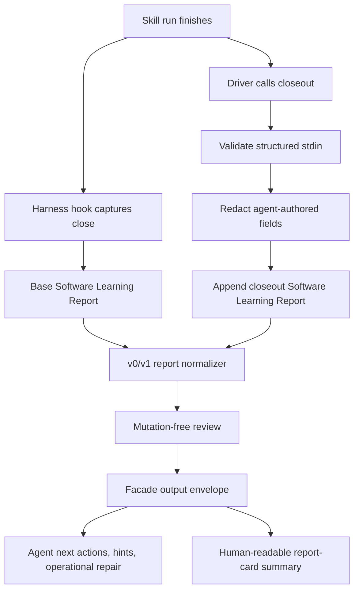

# feat: Skill-feedback report-card v1

## Summary

Build the v1 report-card layer on top of the v0 skill-feedback skeleton. v1 makes Software Learning Reports worth opening by adding safe driver closeout, typed evidence gaps, v0/v1 normalization, and a facade-backed review envelope with agent observability, hints, operational repair guidance, and next actions.

The CLI command facade output is a first-class agent interface. The report-card domain remains the product: evidence about skill runs, verification burden, friction, observations, and what to inspect next.

---

## Problem Frame

v0 proves the capture pipe: a harness hook can detect a skill close and write a safe, gitignored, untrusted report. The current inbox is still mostly proof-of-close. Live capture can populate `model`; `usage` stays an explicit v0 gap because transcript-line summing is not a real per-skill cost source.

The dream product is not a generic CLI envelope or a nicer counter over records. The dream is software-engineering report cards for skills: after a material skill run, the driver agent can file structured evidence about what happened, what was hard, what needed checking, and what may need improvement. Humans review the filed reports later; they are not part of closeout capture.

The facade-backed output envelope turns that report card into an agent-native surface. Agents get a stable run id, diagnostic trail, hints, operational repair guidance, continuation, and next actions. Humans get a compact review that answers why to open the inbox.

The target runtimes are Claude, Codex, and Cloud. V1 supports them through shared report-card and facade contracts, not through vague runtime agnosticism or guessed identity.

---

## Requirements

**Prerequisite**

- R1. Start v1 only after v0 live capture writes at least one real skill record with populated `model`; `usage` may remain an explicit gap.
- R2. Keep hook-only capture as fallback when the driver does not submit a closeout receipt.
- R3. Remove v0 transcript-derived usage parsing; do not leave dormant usage plumbing.
- R4. Read existing v0 records through a normalizer so review handles v0 and v1 reports together.

**Closeout Receipt**

- R5. Let a driver agent submit a structured closeout receipt through a dedicated `closeout` command without invoking another skill.
- R6. Accept closeout receipt input through stdin or another non-argv structured channel; do not put narrated receipt JSON in shell arguments.
- R7. Capture goal, outcome, friction, verification burden, touched surfaces, and optional observations.
- R8. Treat skill, outcome, goal, friction, and verification burden as the closeout core for a non-gap closeout.
- R9. Store verification burden as `none`, `light`, `moderate`, or `heavy` plus a redacted note.
- R10. Store friction as one seeded category plus a redacted note. Seeded categories are `none`, `missing_context`, `unclear_ownership`, `tool_failure`, `verification_tax`, `bad_guidance`, `scope_mismatch`, and `other`.
- R11. Store touched surfaces as optional owner paths or labels, capped at 5 per closeout. Absence means no touched surface captured, not an evidence gap.
- R12. Store observations as optional, capped, evidence-only driver notes. Absence means no observation captured, not an evidence gap.
- R12a. Cap observations at 3 per closeout.
- R12b. Store each observation with `kind`, optional target, redacted summary, and structured evidence basis. Observation target paths are repo-relative owner paths; target labels are redaction-gated agent-authored strings.
- R12c. Do not accept driver-supplied confidence, severity, free-form next action, or repair instruction on observations.
- R13. Make closeout best-effort for material skill runs: runs that shaped the plan, commands, checks, files, or decision path.
- R13a. Design closeout for a 60-second target. Treat the target as schema and guidance pressure, not a runtime timer.
- R14. Write unlinked closeout receipts as evidence with their own closeout record id and `correlation_status: unlinked`.
- R15. Convert missing or weak closeout evidence into typed evidence gaps or absent lanes, never silent defaults.

**Report Output**

- R16. Separate evidence source, runtime telemetry, agent-authored evidence, typed gaps, correlation status, and report-card data.
- R17. Persist schema version and report id on every v1 Software Learning Report.
- R18. Treat `skill_run_id` as optional in v1. Coalesce by it only when explicitly available; do not guess from "latest" in v1.
- R19. Record unavailable cost as a typed evidence gap in v1. Defer native OTel cost ingestion to follow-up work unless a trusted source already exists.
- R20. Keep model, git SHA, skill version, timestamps, and trusted runtime identity outside agent-authored input.
- R20a. Support Claude, Codex, and Cloud by accepting shared report-card records with explicit or unlinked correlation.

**Facade Output**

- R21. Emit `closeout` and `review` results through the CLI command facade envelope.
- R22. Include facade run correlation id, package-owned report ids, diagnostic trail, hints, operational repair guidance, and continuation in command output where useful.
- R23. Keep exact envelope schema in `@side-quest/cli-command-facade`; keep `skill-feedback` result vocabulary in the `skill-feedback` command contract.
- R24. Make error envelopes useful to agents: name failure domain, recoverability, safe next action, and redacted operational repair hint.
- R25. Prove discovery metadata, rendered help, parser acceptance, and runtime semantics cannot drift.

**Review**

- R26. Add a mutation-free `review` command that answers "what is worth opening?" rather than dumping files.
- R27. Lead review with coverage: closeout rate, capture-only count, unlinked count, evidence-gap count, and low-coverage warning.
- R28. Suppress target-skill quality conclusions when coverage is low or evidence is unlinked.
- R29. Open items only when high signal appears: high verification burden, repeated friction, evidence gaps, unlinked correlation spike, or owner-path observation.
- R29a. For each open item, include `open_reason`, evidence, owner path or label, severity, and next action.
- R30. Include no-action cases so an empty or healthy inbox returns a successful, useful envelope.
- R31. Surface observations and touched surfaces as evidence; do not derive repair candidates or write proposal files in v1.
- R32. Keep review separate from purge. Emit retention age/count and a future purge action hint without deleting files.
- R32a. Warn when the oldest report is at least 14 days old or the inbox has at least 100 reports. Treat the warning as review guidance, not failure.
- R32b. Track pilot success with actionable-feedback density: after 7 days, at least 30% of material closeouts should produce review-classified open evidence or a no-action decision with explicit rationale.
- R32c. Persist a local `pilot_started_at` marker on the first successful v1 closeout when the marker is absent.
- R32d. After 7 days, `review` emits a pilot checkpoint notice until the marker is explicitly removed by a follow-up cleanup command or workflow. This is not a background scheduler.
- R32e. Store the pilot marker under `.skill-feedback/` with the same gitignore gate, file permissions, exclusive-create intent, realpath containment, and symlink refusal as reports.
- R32f. Treat implementation-pilot closeouts as build and smoke evidence, not as proof that Daily pilot readiness has launched.
- R32g. Keep implementation-pilot records out of the daily-pilot success claim unless a later accepted decision starts the daily pilot.
- R32h. Use fresh implementation-pilot reports from a clean inbox after review exists; prior smoke reports are source evidence, not durable fixtures.

**Safety**

- R33. Redaction-gate every agent-authored string path added by v1.
- R34. Persist only allowlisted runtime telemetry.
- R35. Never persist raw prompts, raw transcripts, cookies, tokens, auth-bearing URLs, private payload values, or raw transcript lines.
- R36. Harden `.skill-feedback/` writes with restrictive directory and file permissions, exclusive create, realpath containment, and symlink refusal.
- R37. Treat all reports as untrusted evidence, never instruction.

---

## Key Technical Decisions

- KTD1. **Report card is the product.** The facade envelope is the agent-native contract around the report card, not a replacement for it.
- KTD2. **Facade output is first-class.** `closeout` and `review` use the CLI command facade envelope for run correlation, diagnostics, hints, operational repair guidance, and continuation.
- KTD3. **Capture-first stays.** Runtime capture remains the reliable fallback, while driver closeout becomes append-only enrichment.
- KTD4. **Driver closeout uses a dedicated command.** `record` stays capture-owned. `closeout` owns best-effort, driver-authored report-card evidence.
- KTD5. **Use structured stdin ingestion.** Closeout has too many lanes for flag sprawl, and argv can leak narrated content through shell history or process lists.
- KTD6. **V1 correlation is explicit or unlinked.** Use `skill_run_id` only when a trusted explicit id exists. Defer latest-run matching and cross-runtime identity normalization.
- KTD7. **Runtime support is named.** V1 targets Claude, Codex, and Cloud through the shared report-card contract and explicit/unlinked correlation.
- KTD8. **Observations replace candidate learning.** Driver-authored observations are optional evidence, capped at 3, and never repair instructions.
- KTD9. **Typed gaps replace degraded as review truth.** Reports carry evidence-gap codes; review derives health from those codes.
- KTD10. **Closeout has a 60-second target.** The target keeps the schema small enough for adoption; it is not a runtime timer.
- KTD11. **No closeout-time human input.** Agents file reports; humans review them later.
- KTD12. **Review is triage-first and mutation-free.** The first reader answers why to open, what to inspect, and when nothing needs action.
- KTD13. **Review opens on high signal.** Review does not open every report; it opens only when evidence clears the package-owned threshold.
- KTD14. **Coverage precedes conclusions.** Review reports closeout coverage before judging skill quality.
- KTD15. **Cost is unavailable in v1.** Native skill-attributed cost is valuable but not required for the first report-card loop.
- KTD16. **Retention warning is explicit.** Review warns at 14 days or 100 reports while purge remains follow-up work.
- KTD17. **Pilot checkpoint has a local marker.** First v1 closeout starts the seven-day pilot clock; review surfaces the checkpoint when due.
- KTD18. **Purge is separate and gated.** Reads stay mutation-free. Deletion needs its own later command or workflow.
- KTD19. **Implementation pilot is not daily pilot.** Implementation-pilot closeouts are useful build evidence while daily-pilot use stays gated behind review/correlation and true Codex end-to-end proof.
- KTD20. **Pilot mode stays out of v1 schema.** The phase split lives in glossary and decision logs until review needs different runtime behavior.

---

## High-Level Technical Design



Runtime capture writes the fallback record. Driver closeout writes append-only report-card evidence when available. Review normalizes v0 and v1 records, coalesces by explicit `skill_run_id` when present, separates unlinked evidence when not present, and emits a facade-backed decision surface.

---

## Implementation Units

### U0. v0 model-only closure gate

**Goal:** Start v1 only after v0 proves real model capture and leaves usage as an explicit gap.

**Requirements:** R1, R2, R3, R19, R20.

**Dependencies:** v0 closeout work.

**Files:**

- `hooks/skill-feedback-stop.ts`
- `hooks/skill-feedback-runtime.ts`
- `skills/skill-feedback/src/skill-feedback-runner.ts`
- `skills/skill-feedback/src/skill-feedback.test.ts`
- `hooks/skill-feedback-hooks.test.ts`

**Approach:** Keep the stdin telemetry channel only for allowlisted engine-read fields such as `model`. Remove transcript usage summing and dormant usage parsing from the v0 change. Leave usage and cost unavailable as typed evidence gaps until a trusted cost source lands in follow-up work.

**Test scenarios:**

- Real or fixture-backed Claude skill close populates `model`.
- Transcript prose is not extracted into telemetry.
- Usage remains absent rather than transcript-derived.
- Redaction tests still prove agent-authored lanes are scrubbed and `model` is trusted telemetry.

**Verification:** Focused hook and skill-feedback suites pass through repo runners.

### U1. Report-card contract and normalizer

**Goal:** Define the v1 report shape and normalize v0/v1 records into one review model.

**Requirements:** R4, R7, R8, R9, R10, R11, R12, R12a, R12b, R12c, R14, R15, R16, R17, R18, R19, R20, R20a, R33, R34, R35.

**Dependencies:** U0.

**Files:**

- `skills/skill-feedback/src/command-contract.ts`
- `skills/skill-feedback/src/command-contract.test.ts`
- `skills/skill-feedback/references/report-shape.md`
- `skills/skill-feedback/CONTEXT.md`

**Approach:** Add v1 lanes for schema version, report id, optional `skill_run_id`, evidence source, correlation status, typed evidence gaps, friction signal, verification burden, touched surfaces, optional observations, and cost-unavailable stance. Add `normalizeReport(raw)` or equivalent read-side owner that maps v0 records into the v1 review model. Map v0 usage absence to unavailable cost plus a typed evidence gap. Filter v0 placeholder friction so review does not treat skeleton text as signal.

Observation shape:

```ts
observations?: Array<{
  kind:
    | "friction"
    | "verification_gap"
    | "missing_context"
    | "ownership_gap"
    | "tool_failure"
    | "bad_guidance"
    | "scope_mismatch"
    | "runtime_signal"
    | "product_signal"
    | "other";
  target?: { type: "path" | "label"; value: string };
  summary: string;
  evidence_basis:
    | "driver_observed"
    | "verification_step"
    | "tool_result"
    | "missing_source"
    | "other";
}>;
```

Do not let observations carry confidence, severity, free-form next action, or repair instructions. Review owns severity and next action after normalization, coverage, and correlation checks.

Validate observation target paths as repo-relative owner paths. Treat target labels as agent-authored strings. Keep evidence basis as structured categories, not raw transcript excerpts.

Keep runtime telemetry behind an allowlist. Name every agent-authored string path in a single owner constant and redaction-gate those paths before write.

**Execution note:** Start with contract tests for v0 normalization, complete v1 records, partial v1 records, and unsafe agent-authored fields.

**Patterns to follow:** v0 `Receipt` and `SoftwareLearningReport` in `skills/skill-feedback/src/command-contract.ts`; report vocabulary in `skills/skill-feedback/CONTEXT.md`; facade boundary rule in `skills/cli-author/references/cli-command-facade.md`.

**Test scenarios:**

- Complete v1 record parses into a normalized review model.
- Existing v0 records normalize without throwing.
- v0 usage absence becomes unavailable cost plus a typed evidence gap.
- v0 placeholder friction is filtered from review signal.
- Missing closeout core evidence is listed in gaps.
- Omitted observations do not create evidence gaps.
- Omitted touched surfaces do not create evidence gaps.
- More than 5 touched surfaces are rejected.
- More than 3 observations are rejected.
- Observation confidence, severity, next action, and repair-instruction fields are rejected.
- Observation target paths reject absolute paths, parent traversal, and symlink escapes.
- Observation target labels are redacted as agent-authored strings.
- Unlinked closeout writes with `correlation_status: unlinked`.
- Unknown v1 fields are rejected, not silently stored.
- Telemetry fields cannot be supplied through public agent-authored input.
- Every added agent-authored string path is included in the redaction boundary.

**Verification:** Contract suite proves v1 lanes, backward readability, typed gaps, redaction ownership, and allowlisted telemetry invariants.

### U2. Facade-backed closeout command

**Goal:** Give driver agents a stable, non-interactive way to submit report-card evidence.

**Requirements:** R5, R6, R7, R8, R9, R10, R11, R12, R12a, R12b, R12c, R13, R13a, R14, R15, R20a, R21, R22, R23, R24, R25, R32c, R32e, R33, R35, R36.

**Dependencies:** U1.

**Files:**

- `skills/skill-feedback/src/command-contract.ts`
- `skills/skill-feedback/src/skill-feedback-runner.ts`
- `skills/skill-feedback/src/skill-feedback.test.ts`
- `skills/skill-feedback/package.json`
- `skills/skill-feedback/SKILL.md`

**Approach:** Use `cli-author`'s facade-backed lane before changing the public command surface. Add a dedicated `closeout` command that reads one structured receipt from stdin, validates it, writes a v1 closeout report, starts the pilot marker when absent, and emits a facade success or error envelope. Keep `record` capture-owned and exclude engine-read telemetry flags from public closeout input.

Package-owned `data` names the report-card result: report id, optional `skill_run_id`, correlation status, evidence gaps, redaction count, written path, and closeout coverage contribution. The facade envelope carries run correlation, diagnostics, hints, continuation, and operational repair guidance.

**Execution note:** Treat the Command Surface Alignment Proof as a ship gate.

**Patterns to follow:** `skills/cli-author/references/cli-command-facade.md`; `runtime/cli-command-facade/src/`; facade command tests in `skills/fallow/src/command-contract.ts`; public argv tests in `skills/skill-feedback/src/skill-feedback.test.ts`.

**Test scenarios:**

- Help advertises stdin receipt ingestion and excludes engine-read telemetry flags.
- Public argv accepts mode and attach target flags only; narrated receipt content comes from stdin.
- Valid closeout stdin writes a v1 report and returns a facade success envelope.
- Malformed, empty, or oversized stdin returns a facade error envelope with redacted operational repair guidance.
- Runtime errors return JSON envelopes with no raw narrated secrets.
- `closeout` is separate from `record`.
- First successful v1 closeout creates `pilot_started_at` when absent.
- Later closeouts leave the existing pilot marker unchanged.
- Pilot marker writes use the same storage hardening as reports.
- Pilot marker symlink paths are refused.
- Discovery metadata, rendered help, parser behavior, and runtime semantics agree.
- A successful closeout writes with restrictive file permissions and refuses symlink paths.

**Verification:** `skill-feedback` passes the facade proof and `cli-execution-auditor` for the updated surface.

### U3. Driver closeout guidance map

**Goal:** Tell driver agents what to report after a material skill run without making every skill self-report.

**Requirements:** R5, R7, R8, R13, R13a, R32, R37.

**Dependencies:** U1, U2.

**Files:**

- `skills/skill-feedback/SKILL.md`
- `skills/skill-feedback/references/closeout-receipt.md`
- `skills/skill-feedback/PROVENANCE.md`
- `skills/skill-feedback/CONTEXT.md`

**Approach:** Add a terse closeout map that names the lanes, examples, forbidden content, material-use threshold, 60-second target, and first safe action. Keep the workflow thin: read the map, file closeout when the skill shaped the plan, commands, checks, files, or decision path, and call the owning command. Do not add fleet-wide close instructions to every skill in v1. Do not ask a human question at closeout time.

**Execution note:** Read `skills/create-skill/references/skill-design-decision-runbook.md` before editing `SKILL.md`.

**Patterns to follow:** `skills/skill-feedback/SKILL.md` owner-path style; `skills/skill-feedback/references/report-shape.md`; `skills/cli-author/references/agent-native-cli-design.md`.

**Test scenarios:**

- `SKILL.md` frontmatter remains valid YAML.
- Closeout guidance forbids raw transcript, prompt, secret, and auth-bearing content.
- Closeout guidance names the driver as caller and avoids skill-to-skill handoff.
- Closeout guidance states that v1 closeout is best-effort.
- Closeout guidance defines the material-use threshold.
- Closeout guidance names the 60-second target without adding a runtime timer.
- Closeout guidance states that human review happens later.
- Owner paths resolve to existing files.

**Verification:** Skill docs parse, owner paths resolve, and the closeout map gives a fresh driver enough context to submit a valid receipt.

### U4. Facade-backed review decision surface

**Goal:** Make `.skill-feedback/` worth opening by returning a report-card decision surface for agents and humans.

**Requirements:** R12c, R20a, R21, R22, R23, R24, R25, R26, R27, R28, R29, R29a, R30, R31, R32, R32b, R32d, R32e, R37.

**Dependencies:** U1, U2.

**Files:**

- `skills/skill-feedback/src/command-contract.ts`
- `skills/skill-feedback/src/skill-feedback-runner.ts`
- `skills/skill-feedback/src/skill-feedback.test.ts`
- `skills/skill-feedback/references/report-shape.md`
- `skills/skill-feedback/SKILL.md`

**Approach:** Add a mutation-free `review` command that reads normalized reports by local day or review window and emits both package-owned report-card data and facade envelope guidance. Lead with coverage. Open items only when high signal appears: high verification burden, repeated friction, evidence gaps, unlinked correlation spike, or owner-path observation. Then show open items with `open_reason`, evidence, owner path or label, severity, and next action. Include no-action cases. Treat unlinked and low-coverage evidence as correlation-health signal before target-skill quality signal. Include pilot checkpoint data when `pilot_started_at` is at least 7 days old, reporting counts and density as advisory review data rather than an automated pass/fail. Treat implementation-pilot records as build evidence for review design, not as Daily pilot readiness evidence.

Review surfaces observations and touched surfaces as evidence. It does not derive repair candidates, write proposal files, delete reports, or promote report text into instructions.

**Execution note:** Implement review before cost ingestion or latest-run reconciliation. The first useful read surface prevents a write-only inbox.

**Patterns to follow:** Facade read-only command metadata in `runtime/cli-command-facade/tests/command-discovery.test.ts`; v0 deterministic timestamp rule in `skills/skill-feedback/docs/plans/2026-06-11-002-feat-skill-feedback-loop-v0-pilot-plan.md`.

**Test scenarios:**

- Empty inbox returns a successful no-records envelope with a no-action continuation.
- Mixed v0 and v1 records summarize without treating v0 placeholders as friction signal.
- Review leads with closeout coverage, capture-only count, unlinked count, and evidence-gap count.
- Low coverage suppresses target-skill quality conclusions.
- Low-signal reports produce no-action output rather than open items.
- Missing pilot marker emits no pilot checkpoint.
- Review emits no pilot checkpoint before 7 days.
- Review emits a pilot checkpoint after 7 days.
- Pilot checkpoint reports actionable-feedback numerator, denominator, and density.
- Pilot checkpoint is advisory and does not mutate or clear the marker.
- Implementation-pilot records do not claim Daily pilot readiness.
- Fresh implementation-pilot reports can exercise review after the inbox is cleared.
- High verification burden opens an item.
- Repeated friction opens an item.
- Evidence gaps open an item.
- Unlinked correlation spike opens a correlation-health item.
- Owner-path observation opens an item.
- Unlinked closeout evidence appears separately with correlation status and a next action for `skill-feedback` or runtime adapter inspection.
- Repeated friction groups by normalized category without storing new canonical instruction.
- Observations and touched surfaces appear as evidence, not derived repair candidates.
- Output can be emitted as JSON for agents.
- Plain output fits a human morning review without raw JSON noise.
- Review command does not delete or mutate any inbox file.

**Verification:** The reader makes the current write-only inbox inspectable and explains evidence gaps separately from skill performance.

### U5. Retention and purge-ready boundary

**Goal:** Make the transient-data promise honest without making deletion part of v1 review.

**Requirements:** R32, R32a, R36.

**Dependencies:** U4.

**Files:**

- `skills/skill-feedback/references/redaction.md`
- `skills/skill-feedback/references/report-shape.md`
- `skills/skill-feedback/SKILL.md`

**Approach:** Document the purge contract as follow-up work: review first, then a separate gated purge operation. Review emits report count, oldest age, and a future purge action hint when records exceed 14 days old or 100 reports. Do not claim v1 automatically purges reviewed reports.

**Test scenarios:**

- Documentation states that review is mutation-free.
- Documentation states that purge is a separate gated operation.
- Review output includes retention age/count when records are present.
- Review output warns at 14 days old or 100 reports.
- No v1 review command advertises deletion side effects.

**Verification:** A future purge plan can be written from named constraints, while v1 readers remain safe to run repeatedly.

---

## Acceptance Examples

- AE1. Given v0 capture has closed with a populated model and explicit usage gap, when v1 starts, then transcript-derived usage parsing is absent from the baseline.
- AE2. Given a driver submits a closeout receipt on stdin, when `skill-feedback closeout` writes, then it returns a facade success envelope with run id, report id, correlation status, continuation, and no raw narrated secrets.
- AE3. Given a driver submits closeout without a linkable `skill_run_id`, when `skill-feedback closeout` writes, then the record carries `correlation_status: unlinked`, its own closeout record id, and a typed evidence gap.
- AE4. Given mixed v0 and v1 records, when review runs, then records normalize into one report-card view without treating v0 placeholder friction as signal.
- AE5. Given only capture fires and no driver closeout arrives, when the inbox is reviewed, then the record is shown as thin capture rather than evidence that the skill had no friction.
- AE6. Given low closeout coverage, when review runs, then it reports coverage risk and avoids target-skill quality conclusions.
- AE7. Given repeated reports point to the same owner path and friction theme, when review runs, then it shows captured evidence and next action but writes no proposal file.
- AE8. Given agent-authored fields contain token-shaped or auth-bearing text, when a v1 report is written, then unsafe text is absent on disk and redactions are counted.
- AE9. Given a review command runs over the inbox, when it completes, then no report file is deleted or mutated.
- AE10. Given an invalid closeout receipt, when the command fails, then the error envelope includes recoverability, failure domain, and a redacted operational repair hint.
- AE11. Given a valid closeout omits observations, when `skill-feedback closeout` writes, then no observation evidence gap is recorded.
- AE12. Given a closeout includes more than 3 observations or an observation with driver confidence, severity, next action, or repair instruction, when validation runs, then the command rejects it with a redacted repair hint.
- AE13. Given reports have no high verification burden, repeated friction, evidence gaps, unlinked spike, or owner-path observation, when review runs, then it returns no-action output rather than opening every report.
- AE14. Given the first successful v1 closeout writes, when no pilot marker exists, then `pilot_started_at` is saved.
- AE15. Given `pilot_started_at` is at least 7 days old, when review runs, then it emits a pilot checkpoint with actionable-feedback numerator, denominator, density, and a next action to run the future cleanup command or workflow.
- AE16. Given no pilot marker exists, when review runs, then it emits no pilot checkpoint.
- AE17. Given closeouts were generated during implementation pilot, when review summarizes them, then the output treats them as build evidence and does not claim the daily pilot has launched.
- AE18. Given the inbox has been cleared before a new smoke, when fresh closeouts are generated after review exists, then those reports become the smoke evidence for U4 rather than older local artifacts.

---

## Scope Boundaries

### In Scope

- Driver-agent closeout receipt.
- Structured stdin closeout ingestion.
- V1 report-card lanes.
- v0/v1 report normalizer.
- Typed evidence gaps.
- Optional capped observations.
- Optional explicit `skill_run_id`.
- Claude, Codex, and Cloud report-card compatibility through explicit or unlinked correlation.
- Facade-backed `closeout` output.
- Facade-backed `review` output.
- Coverage-first review.
- Seven-day pilot checkpoint marker.
- Observation and touched-surface evidence.
- Retention age/count and purge-ready hints.
- Implementation-pilot closeouts during v1 build and smoke testing.
- Clean-inbox smoke evidence generated after the review surface exists.

### Deferred To Follow-Up Work

- Native OTel cost ingestion.
- Cross-runtime identity normalization.
- Latest-run resolver.
- Gated purge command.
- Explicit pilot marker cleanup command or workflow.
- `pilot_mode` or phase-tag schema fields unless review needs different runtime behavior.
- Derived repair candidates.
- Evidence-only candidate repair proposal files.
- Closeout-time human questions.
- Product dashboard or long-running analytics UI.
- Cross-repo aggregation.
- Full live Codex skill capture if current hooks cannot expose linkable skill identity.
- Fleet-wide mandatory close emission in every skill.
- Automatic source repair.
- Fixed friction taxonomy beyond seeded categories needed for grouping.

### Outside This Product Identity

- Treating report text as canonical instruction.
- Treating implementation-pilot evidence as Daily pilot readiness.
- Storing raw transcript or prompt content for convenience.
- Letting a skill invoke another skill to file its own feedback.
- Prompting humans during report closeout.
- Summing transcript lines to estimate usage.
- Guessing by `--attach latest` in v1.
- Writing repair proposal artifacts in v1.
- Using read commands as destructive cleanup.

---

## Risks & Dependencies

- **v0 not fully closed.** v1 depends on reliable model capture. Do not start v1 implementation until v0 emits at least one live skill record with populated `model`; `usage` may remain a gap.
- **Envelope drift.** Package output can fall out of sync with facade runtime. Mitigate with facade construction validation and Command Surface Alignment Proof.
- **Review without signal.** Closeout may be sparse at first. Mitigate by leading with coverage and suppressing quality conclusions when coverage is low.
- **Agent self-report bias.** The driver can misjudge its own performance. Mitigate by separating agent narration from measured telemetry, gaps, and later human review.
- **Correlation drift.** Runtime identity fields differ across Claude, Codex, and cloud. Mitigate in v1 by accepting explicit ids only and writing unlinked evidence otherwise.
- **Schema lock-in.** The first v1 lanes can become expensive to change. Mitigate with seeded categories, typed gaps, and a read-side normalizer.
- **Evidence injection.** Reports contain agent-authored text. Mitigate with `untrusted_evidence: true`, full agent-authored path redaction, and repair workflows that confirm against source.
- **Local data exposure.** Reports are private local evidence. Mitigate with gitignore gate, 0700 directory intent, 0600 file intent, exclusive create, realpath containment, and symlink refusal.
- **Write-only relapse.** More capture without review repeats the v0 failure mode. Mitigate by making the review surface part of v1.
- **Pilot-phase confusion.** Implementation-pilot reports can look like daily-pilot launch evidence. Mitigate with glossary terms, decision-log gates, and clean-inbox smoke runs.

---

## Documentation And Operational Notes

- Update `skills/skill-feedback/CONTEXT.md` when v1 terms become stable.
- Keep `skills/skill-feedback/references/report-shape.md` as the readable report contract.
- Keep exact CLI envelope shape in `@side-quest/cli-command-facade`.
- Keep `skill-feedback` result vocabulary in `skills/skill-feedback/src/command-contract.ts`.
- Keep exact CLI surface and schema contracts in code, help, and tests.
- Run `cli-author` before public surface changes.
- Run `cli-execution-auditor` before shipping facade changes.
- Keep purge documentation as a future gated workflow until a purge command exists.
- Keep implementation-pilot and daily-pilot language aligned with `skills/skill-feedback/CONTEXT.md` and the pilot decision log.
- Generate fresh smoke reports after U4 review exists; do not preserve old local `.skill-feedback/` reports as fixtures.

---

## Reviewer Swarm Synthesis

- Keep v1 narrow enough to prove the report-card loop.
- Promote facade envelope output from implementation detail to contract spine.
- Defer native cost until a buildable telemetry ingestion path exists.
- Defer cross-runtime identity normalization and latest-run matching.
- Treat unlinked closeout as evidence, not failure.
- Treat implementation-pilot closeout as build evidence, not Daily pilot readiness.
- Lead review with coverage before conclusions.
- Treat driver closeout as useful but uncalibrated self-report.
- Redact every agent-authored string path, not just the old v0 fields.
- Keep derived repair candidates out of v1; surface captured evidence instead.
- Make retention honest while deletion remains gated follow-up work.

---

## Sources & Research

- `skills/skill-feedback/docs/brainstorms/2026-06-10-skill-follow-up-feedback-loop-requirements.md`
- `skills/skill-feedback/docs/plans/2026-06-11-002-feat-skill-feedback-loop-v0-pilot-plan.md`
- `docs/adr/0014-skill-feedback-fires-on-harness-hooks-not-agent-recall.md`
- `docs/decisions/2026-06-12-001-skill-feedback-pilot-decision-log.md`
- `/tmp/handoff-skill-feedback-v0-telemetry-closeout.md`
- Claude Code monitoring docs: `https://code.claude.com/docs/en/monitoring-usage`
- Codex hooks docs: `https://developers.openai.com/codex/hooks`
- `skills/skill-feedback/CONTEXT.md`
- `skills/skill-feedback/SKILL.md`
- `skills/skill-feedback/references/report-shape.md`
- `skills/skill-feedback/references/redaction.md`
- `skills/context-advisor/references/storage-routing.md`
- `skills/cli-author/references/cli-command-facade.md`
- `skills/cli-author/references/agent-native-cli-design.md`
- `runtime/cli-command-facade/src/`
- `skills/fallow/src/command-contract.ts`
- `skills/cli-execution-auditor/src/command-contract.ts`
