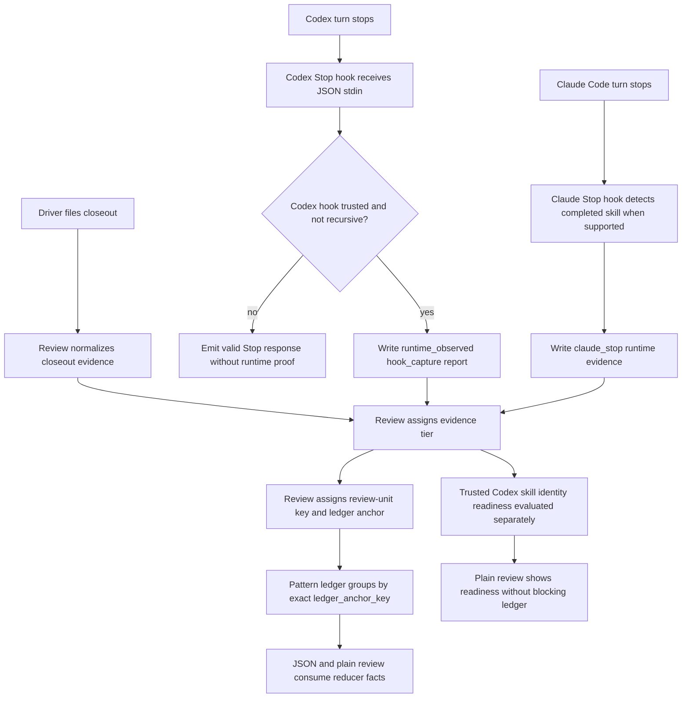
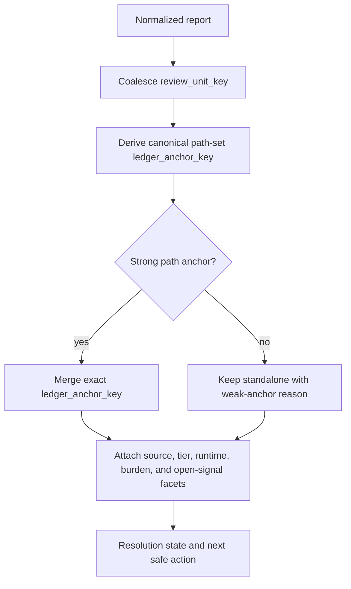

# feat: Skill-feedback pattern ledger v2

> Superseded on 2026-06-13 by `skills/skill-feedback/docs/plans/2026-06-13-001-feat-skill-feedback-claim-safe-review-result-v2-plan.md`. Keep this file as historical context for the generic anchor-ledger plan. Use the replacement plan for active v2 work.

## Summary

Build the v2 `skill-feedback review` surface around a pattern resolution ledger. V2 keeps the v1 report-card review intact, groups recurring evidence by stable review anchors, and labels each ledger entry by evidence tier.

Driver closeouts are valid LLM evidence for the ledger. Codex lifecycle hooks are runtime evidence. Trusted Codex skill identity remains a separate readiness claim until Codex exposes engine-owned skill invocation evidence.

Decision 20 supersedes the origin brainstorm where the origin describes product-category grouping, ordering ladders, or a trusted-identity-first implementation gate. Use this plan as historical context only; use the replacement claim-safe `ReviewResultData` plan for active v2 work.

---

## Problem Frame

V1 made skill-feedback reports useful by adding closeout receipts, typed evidence gaps, normalized reports, and a command-envelope review surface. The next review shape should help humans and agents resolve recurring patterns, not inspect one report at a time.

The unresolved edge is Codex capture trust. Older repo notes treated Codex `notify` as the only available hook-like surface, but current Codex documentation supports lifecycle hooks, including `Stop`. The plan updates the feature path to use Codex lifecycle hooks as runtime evidence while keeping trusted Codex skill identity as a separate blocked claim when no engine-owned skill identity source exists.

The product should not wait for perfect runtime identity before improving review value. Driver closeouts already preserve material skill-run context, friction, verification burden, and observations. V2 uses those closeouts for a closeout-first ledger and makes trust tier visible instead of pretending all evidence has the same provenance.

---

## Requirements

**Evidence Trust And Codex Capture**

- R1. Allow ledger implementation from driver closeout evidence when review labels the evidence tier.
- R2. Require the runtime-capture smoke to show `review --plain` distinguishing hook capture from driver closeout.
- R3. Treat degraded placeholder reports, notify-only records, and assistant-authored skill labels as evidence that does not pass Trusted Codex skill identity readiness.
- R4. Record Codex hook reports under `.skill-feedback/` with the existing gitignore, permission, containment, exclusive-create, and symlink safety rules.
- R5. Read Codex hook input from lifecycle hook JSON on stdin and persist only allowlisted runtime fields.
- R5a. Persist hook capture provenance as `capture_runtime`, with values that distinguish `claude_stop`, `codex_stop`, and `codex_notify`.
- R5b. Persist skill identity provenance so review can tell which engine-owned source proved the skill identity.
- R5c. Normalize legacy hook reports as non-ready for Codex runtime-capture readiness.
- R5d. Preserve the Claude Code Stop branch as a runtime evidence source. When Claude Stop plus supported completed-skill evidence names a skill run, render it as Stop-detected skill; when it does not, render it as turn-level runtime evidence.
- R6. Preserve a Codex `Stop` recursion guard so hook handling cannot trigger another feedback capture loop.
- R7. Keep Trusted Codex skill identity readiness blocked if the current Codex hook payload cannot expose or correlate to structured, engine-owned skill identity.
- R7a. Continue closeout-first ledger units when Trusted Codex skill identity readiness is blocked.
- R7b. Treat Claude Code Stop-detected skill as stronger than Codex Stop-detected turn, but still weaker than Trusted skill identity.
- R8. Treat `transcript_path` as an opportunistic inspection aid, not a stable Trusted skill identity contract.
- R8a. Allow production Codex Stop to read `transcript_path` only through the safe optional-read path: canonicalize, containment-check, reject symlinks and out-of-allowlist paths, cap read size, redact inspection output, and never persist the raw path or contents.
- R8b. Use transcript reads only as corroboration or diagnostics; transcript evidence alone never proves Trusted skill identity.
- R9. Ensure notifier-era capture cannot satisfy Codex runtime-capture or Trusted skill identity readiness.
- R9a. Trust repo-local hook config only when the command matches the exact allowlisted repo-contained handler path and fixed args, uses no hook-payload-derived shell arguments, rejects symlinked or out-of-repo targets, and U0 records the observable Codex approval-state shape.
- R9b. Generate or probe the exact hook command allowlist from code/config during implementation; do not copy command text into prose docs.
- R9c. If Codex approval state is manual-only, allow runtime-capture readiness to pass with exact hook command allowlist plus recorded manual approval attestation; keep Daily pilot readiness blocked until approval is machine-observable.
- R9d. Record the active Codex Stop hook source set and approval state in the smoke artifact before runtime-capture readiness can pass.

**Pattern Ledger**

- R10. Keep review mutation-free.
- R11. Keep coverage, low-signal, open-item, and no-action review output before ledger detail.
- R11a. Send only high-signal review units into the ledger; keep low-signal evidence in coverage and no-action summaries.
- R12. Coalesce reports into review units before ledger aggregation. Use explicit trusted `skill_run_id` only for same-run coalescing; use one report per review unit when no trusted run id exists.
- R13. Add a pattern resolution ledger that groups review units by exact `ledger_anchor_key`.
- R13a. Derive `ledger_anchor_key` only from anchor identity fields: canonical repo-contained path sets from `touched_surfaces` path targets first, then observation target paths.
- R13b. Sort and de-duplicate anchor paths before key serialization.
- R13c. Exclude `skill_run_id`, `evidence_source`, `capture_runtime`, `evidence_tier`, `correlation_status`, `verification_burden`, friction category, observation kind, open reason, timestamps, and report ids from `ledger_anchor_key`.
- R14. Keep missing, label-only, out-of-repo, or unverifiable anchors standalone until review can name a strong path anchor.
- R14a. Render a weak-anchor reason for every standalone ledger entry.
- R14b. Emit anchor-miss telemetry for standalone entries by weak-anchor reason, open reason, friction category, and observation kind; do not merge from that telemetry.
- R15. Include resolution state, best supported evidence tier, evidence tier mix, evidence quality, evidence source mix, run count, anchor provenance, anchor strength, owner path or label, verification burden, and next safe action on each ledger entry.
- R16. Keep evidence tier and evidence quality visible as attributes, not the top-level review grouping key.
- R16a. Support these evidence tiers: `driver_declared`, `runtime_observed`, `corroborated`, and `trusted_engine_identity`.
- R16b. Build the first ledger from `driver_declared` closeout evidence and upgrade entries only when runtime evidence corroborates the unit.
- R16c. Treat `corroborated` as requiring a shared trusted `skill_run_id` or later accepted correlation proof; same `ledger_anchor_key` alone never upgrades evidence to `corroborated`.

**Review Contract And Output**

- R17. Extend the existing review contract with runtime-capture readiness, Trusted skill identity readiness, evidence tier, pattern ledger entries, ledger anchor data, and evidence-source summaries.
- R18. Keep `review --plain` readable by appending ledger detail after existing triage.
- R19. Preserve command-envelope JSON output and generated help/discovery alignment.
- R20. Preserve v0/v1 normalization and correlation health semantics.
- R21. Redaction-gate every agent-authored string added by ledger output.
- R21a. Sanitize untrusted review strings before JSON or plain rendering: strip control characters, bound length, normalize multiline content, and render labels so they cannot spoof sections.
- R22. Update docs and decision artifacts that still describe Codex notify as the live capture route.

---

## Key Technical Decisions

- KTD1. **Codex lifecycle hooks are the runtime evidence path.** Current Codex docs support lifecycle hooks and `Stop`; notifier-era capture is legacy context.
- KTD2. **Use repo-local hook config for the smoke.** Put new Codex hook wiring in `.codex/hooks.json` so the proof can be reviewed, trusted, and reproduced with the repo. Keep `.codex/config.toml` for MCP config and stale `notify` cleanup.
- KTD3. **Gate Trusted skill identity claims, not ledger work.** Codex identity proof is audited first, but a missing Codex-owned skill identity source does not block the closeout-first ledger.
- KTD4. **Trusted skill identity is engine-owned.** Accept structured hook or engine evidence for skill identity; reject assistant prose, placeholder labels, and inferred latest-run matching.
- KTD5. **Transcript access is optional and corroborating.** Codex docs describe `transcript_path` as convenience data, so identity proof cannot depend on transcript format as a stable contract. Production reads are allowed only behind containment, symlink, size, redaction, and non-persistence checks. Transcript evidence can corroborate a separate engine-owned identity source but cannot prove identity by itself.
- KTD6. **Review owns ledger anchoring.** Reports carry evidence; review assigns review-unit keys, ledger anchor keys, anchor strength, ledger grouping, and source summaries.
- KTD7. **Ledger contracts live in code.** Evidence tier enums, anchor fields, aggregation shape, and renderer vocabulary belong in the command contract and tests.
- KTD8. **The ledger extends v1 review.** Coverage, low-signal, open-item, and no-action decisions remain first; the closeout-first pattern ledger adds resolution structure after triage.
- KTD9. **No seeded failure model in v2.** V2 avoids product-native failure categories until review evidence proves a category model earns its keep.
- KTD10. **Notify cleanup is explicit.** Code and docs that imply Codex notify is the live path need retirement or compatibility language after the lifecycle hook proof lands.
- KTD11. **Readiness predicates are explicit.** Codex runtime-capture readiness requires `capture_runtime: codex_stop` and trusted repo hook config. Claude Stop-detected skill requires `capture_runtime: claude_stop` plus supported completed-skill evidence. Trusted Codex skill identity readiness additionally requires engine-owned skill identity, non-empty model, and non-placeholder skill/version data. Missing usage stays an evidence gap and does not block readiness.
- KTD12. **Review-unit keys and ledger keys are separate.** Treat explicit trusted `skill_run_id` groups as one review unit, treat unlinked reports as single-report units, and group recurring review units only by `ledger_anchor_key`.
- KTD13. **Hook config trust is mechanical.** Trust review checks an exact command allowlist, no shell interpolation from hook payload, and no symlinked targets before a smoke can pass. U0 discovers the Codex approval-state proof shape before the plan treats approval as machine-verifiable.
- KTD13a. **Hook command text is not prose-owned.** Docs name the invariant; code, config, and tests own the exact allowlisted command.
- KTD13b. **Runtime-capture readiness and Daily pilot readiness split on approval evidence.** Manual approval attestation can unlock runtime-capture readiness when approval state is manual-only; Daily pilot still requires machine-observable approval.
- KTD14. **Renderer safety is structural.** Redaction handles sensitive values; renderer sanitization protects plain review structure and agent-readable JSON from untrusted report strings.
- KTD15. **Evidence tiers are first-class.** Driver closeout evidence starts as `driver_declared`, Codex Stop hook evidence starts as `runtime_observed`, matching closeout/runtime units can become `corroborated`, and only engine-owned skill identity can produce `trusted_engine_identity`.
- KTD16. **Facets never form the ledger key.** Evidence source, capture runtime, evidence tier, correlation status, verification burden, friction category, observation kind, open reason, timestamps, and report ids stay rendered facets.
- KTD17. **Anchor strength gates merging.** Repo-contained path anchors can merge after canonicalization; labels, missing paths, out-of-repo paths, and unverifiable strings remain standalone with a weak-anchor reason.
- KTD18. **Anchor misses are telemetry, not grouping input.** Repeated weak anchors can trigger a future category proposal, but they do not merge entries in v2.
- KTD19. **Runtime branches share ledger rules.** Codex Stop-detected turn, Claude Stop-detected skill, and driver closeout evidence all use the same `review_unit_key`, `ledger_anchor_key`, evidence-tier, and no-shared-link rules.

---

## High-Level Technical Design

---

## Implementation Tracks

- Track A: Build the closeout-first anchor ledger from existing review evidence. Ship U2 through U5 without waiting for Trusted Codex skill identity, transcript diagnostics, or hook approval automation.
- Track B: Add Codex runtime evidence through U0 and U1. Runtime evidence can add `runtime_observed` facets, but it cannot change `ledger_anchor_key` rules or produce `corroborated` without an explicit trusted link.
- Track C: Preserve the Claude Code runtime branch through U1a. Claude Code evidence can reach Stop-detected skill, but it still cannot loosen Codex readiness or ledger key rules.
- Track D: Update docs through U6 after the active review contract is stable.

---

## Implementation Units

### U0. Codex skill identity capability audit

**Goal:** Find whether an engine-owned Codex skill identity source exists, and record the readiness state without blocking closeout-first ledger work.

**Requirements:** R1, R3, R5, R5b, R7, R7a, R8, R8a, R8b, R9a, R9c, R9d.

**Files:**

- `.codex/hooks.json`
- `hooks/fixtures/skill-feedback/`
- `hooks/skill-feedback-hooks.test.ts`
- `skills/skill-feedback/src/command-contract.ts`

**Approach:** Inspect the current Codex lifecycle `Stop` payload, any hook-accessible engine sidecar or event stream, the active Stop hook source set, and the observable shape of Codex hook approval state. Name the exact field, API, event, or sidecar that proves skill identity, plus nil, empty, and error behavior. Record whether approval evidence is machine-observable, manual-only, or unavailable. If approval is manual-only, define the manual attestation shape and keep Daily pilot readiness blocked. Production may inspect `transcript_path` only through the safe optional-read path. Fixtures support parser tests only. If no structured engine-owned skill identity source exists, record Trusted Codex skill identity as blocked and continue Track A under the evidence-tier model.

**Test scenarios:**

- A live Codex Stop smoke either names the exact trusted skill identity source or records that no engine-owned source is available.
- U0 records the active Stop hook source set used during the smoke.
- U0 records whether Codex hook approval state is machine-observable, manual-only, or unavailable.
- Manual-only approval can pass runtime-capture readiness only when the recorded attestation shape is present.
- Manual-only approval keeps Daily pilot readiness blocked.
- A fixture using that source proves parser behavior without opening readiness by itself.
- Missing, empty, placeholder, or assistant-authored identity keeps Trusted Codex skill identity readiness blocked.
- Transcript-only identity evidence keeps Trusted Codex skill identity readiness blocked.
- Transcript evidence corroborates a separate Trusted skill identity source without replacing it.
- Hostile `transcript_path` values do not read or persist out-of-scope local content.
- Safe optional reads redact inspection output and never persist raw transcript path or contents.
- A blocked trusted-identity state does not block ledger implementation.

**Verification:**

- Run focused hook fixture tests.
- Produce a gate decision that either names the trusted source, or records Trusted Codex skill identity as blocked while allowing closeout-first ledger work.

### U1. Codex Stop lifecycle runtime evidence

**Goal:** Prove Codex lifecycle hook capture can produce runtime-observed skill-feedback evidence without using notifier dispatch.

**Requirements:** R1, R2, R3, R4, R5, R5a, R5b, R5c, R6, R7, R8, R8a, R9, R9a, R9b, R9c, R9d.

**Dependencies:** U0.

**Files:**

- `.codex/hooks.json`
- `.codex/config.toml`
- `hooks/skill-feedback-codex-stop.ts`
- `hooks/skill-feedback-runtime.ts`
- `hooks/skill-feedback-hooks.test.ts`
- `hooks/fixtures/skill-feedback/`

**Approach:** Add a Codex `Stop` hook handler that reads JSON stdin, resolves the repo root from hook context, preserves the existing `.skill-feedback/` write safety rules, and shares the hook runtime writer. Wire it through `.codex/hooks.json`; keep `.codex/config.toml` out of the hook proof except for removing stale project-local `notify`. Capture a real Stop payload for runtime-capture proof. Use fixtures only for parser and regression tests. Persist `capture_runtime: codex_stop`, identity provenance, active hook source set, and approval-state evidence in the smoke artifact. Trust the hook config only when it matches the exact allowlisted repo-contained handler path and fixed args, uses no hook-payload-derived shell arguments, rejects symlinked or out-of-repo targets, and uses the approval-state proof shape discovered by U0. If approval is manual-only, require the U0 manual attestation shape before runtime-capture readiness can pass, and keep Daily pilot readiness blocked. Generate or probe the exact allowlist from code/config during implementation. If the payload cannot prove skill identity, write evidence-only runtime capture and keep Trusted Codex skill identity readiness blocked. Leave any compatibility handler unable to satisfy Trusted skill identity readiness.

**Test scenarios:**

- Trusted Codex Stop payload writes a `hook_capture` report with real skill identity, non-empty model, and non-placeholder skill version.
- Trusted Codex Stop payload with missing usage writes a typed usage/cost gap and can still pass Trusted skill identity readiness.
- Missing or placeholder identity writes visible runtime evidence but does not pass Trusted skill identity readiness.
- Fixture-backed payloads never open Trusted skill identity readiness without a live Codex Stop smoke.
- Notify-only capture does not pass runtime-capture or Trusted skill identity readiness.
- Untrusted repo-local hook config fails closed before the smoke is accepted.
- Missing active hook source-set evidence blocks runtime-capture readiness.
- Manual-only approval plus recorded attestation can pass runtime-capture readiness but not Daily pilot readiness.
- Out-of-repo command paths, symlink targets, changed hook wiring, non-allowlisted args, and hook-payload-derived command arguments fail closed.
- Tests derive the expected allowlist from code/config rather than copied prose.
- Hostile `transcript_path` values such as absolute paths, `..`, symlinks, auth-bearing URLs, and oversized files do not leak.
- `stop_hook_active` or equivalent recursive Stop state does not write another report.
- Hook command emits valid Codex Stop hook output and does not leak raw transcripts, prompts, cookies, tokens, or auth-bearing URLs.

**Verification:**

- Run focused hook tests.
- Run a local smoke that starts from an empty `.skill-feedback/` inbox, triggers the Codex Stop hook path, adds one driver closeout, and confirms `review --plain` distinguishes Evidence source lanes.

### U1a. Claude Code Stop runtime branch

**Goal:** Preserve Claude Code Stop evidence as a parallel runtime branch without changing Codex readiness or ledger grouping rules.

**Requirements:** R1, R2, R5a, R5d, R7b, R10, R11, R12, R13c, R16a, R16b, R16c, R17, R18, R19, R20.

**Dependencies:** U3 for the shared review-unit and ledger-anchor contract.

**Files:**

- `hooks/skill-feedback-stop.ts`
- `hooks/skill-feedback-runtime.ts`
- `hooks/skill-feedback-hooks.test.ts`
- `skills/skill-feedback/src/command-contract.ts`
- `skills/skill-feedback/src/skill-feedback-runner.ts`

**Approach:** Keep `capture_runtime: claude_stop` as a first-class runtime branch. If Claude Stop plus supported completed-skill evidence names a skill run, label the source state as Stop-detected skill. If Claude Stop lacks supported skill evidence, keep it as turn-level runtime evidence. Both states render as runtime evidence facets and use the same `review_unit_key`, `ledger_anchor_key`, weak-anchor, evidence-tier, and no-shared-link rules as Codex and closeout evidence. Claude Code evidence can make a linked closeout/runtime unit `corroborated` only when a shared trusted `skill_run_id` exists. It never proves Codex Trusted skill identity.

**Test scenarios:**

- Claude Stop-detected skill renders with `capture_runtime: claude_stop` and source-state labeling.
- Claude Stop without supported completed-skill evidence stays turn-level runtime evidence.
- Claude Code runtime evidence does not change Codex runtime-capture readiness or Trusted Codex skill identity readiness.
- Claude Code runtime evidence follows the same `ledger_anchor_key` exclusion rules as Codex and closeout evidence.
- Claude Code plus driver closeout with shared trusted `skill_run_id` can render `corroborated`.
- Claude Code plus driver closeout with the same `ledger_anchor_key` but no shared trusted `skill_run_id` does not render `corroborated`.

**Verification:**

- Run focused hook tests for `claude_stop` normalization and source-state rendering.
- Run runner tests that mix Claude Code, Codex Stop, and driver closeout evidence in the same ledger.

### U2. Review readiness and source separation

**Goal:** Make review expose evidence tiers, Codex runtime-capture readiness, and Trusted Codex skill identity readiness.

**Requirements:** R1, R2, R3, R5a, R5b, R5c, R9, R10, R11, R17, R18, R19, R20.

**Files:**

- `skills/skill-feedback/src/command-contract.ts`
- `skills/skill-feedback/src/skill-feedback-runner.ts`
- `skills/skill-feedback/src/command-contract.test.ts`
- `skills/skill-feedback/src/skill-feedback.test.ts`
- `skills/skill-feedback/references/report-shape.md`

**Approach:** Extend the review result contract with a contract-owned `readiness` object that separates `runtime_capture`, `trusted_identity`, and `daily_pilot`. Each readiness child carries status, reason ids, plain label text, and evidence pointers owned by `command-contract.ts`. Runtime-capture readiness cites Codex Stop provenance, trusted hook command evidence, active hook source-set evidence, and approval evidence. Trusted skill identity readiness cites only engine-owned skill identity evidence. Plain output should show source separation before ledger detail; JSON should expose enough state for an agent to decide which evidence tier a ledger entry can claim. Legacy v0 hook reports normalize as non-ready for Codex runtime capture until they carry `codex_stop` provenance.

**Test scenarios:**

- Empty inbox returns blocked runtime and identity readiness with useful no-action output.
- Degraded Codex hook evidence is counted as evidence and rejected as Trusted skill identity proof.
- Legacy `hook_capture` reports without `capture_runtime: codex_stop` are counted as evidence and rejected as Codex runtime-capture proof.
- One Codex Stop capture plus one driver closeout passes the source-distinction smoke even when Trusted skill identity stays blocked.
- Runtime-capture readiness stays blocked when active hook source-set evidence is missing.
- Driver closeout evidence receives `driver_declared` tier.
- Codex Stop hook evidence receives `runtime_observed` tier.
- Existing low-coverage and no-action behavior remains first in plain output.

**Verification:**

- Run skill-feedback contract and runner tests through the repo runner.
- Assert generated help, parser acceptance, command envelope, and plain output stay aligned.

### U3. Ledger anchor contract

**Goal:** Add review-unit keys, ledger anchor keys, anchor strength, evidence-source summaries, and aggregation facts as contract-owned runtime facts.

**Requirements:** R11a, R12, R13, R13a, R13b, R13c, R14, R14a, R14b, R15, R16, R16a, R16b, R16c, R17, R19, R21.

**Files:**

- `skills/skill-feedback/src/command-contract.ts`
- `skills/skill-feedback/src/command-contract.test.ts`
- `skills/skill-feedback/src/skill-feedback-runner.ts`
- `skills/skill-feedback/src/skill-feedback.test.ts`
- `skills/skill-feedback/CONTEXT.md`

**Approach:** Define `review_unit_key`, `ledger_anchor_key`, `anchor_provenance`, `anchor_strength`, weak-anchor reasons, and exact-key aggregation in the command contract. Derive `review_unit_key` from trusted `skill_run_id`; otherwise use report id so one unlinked report becomes one review unit. Derive `ledger_anchor_key` from canonical repo-contained path sets only: first `touched_surfaces` path targets, then observation target paths. Sort and de-duplicate paths before serialization. Exclude source, runtime, tier, correlation, burden, friction, observation kind, open reason, timestamps, and report ids from the ledger key. Treat labels, missing paths, out-of-repo paths, and unverifiable driver strings as weak anchors. Keep weak anchors standalone and emit anchor-miss telemetry without merging it.

**Test scenarios:**

- Every review-unit and ledger-anchor field has at least one known-good fixture.
- Explicit `skill_run_id` groups produce one review unit.
- Unlinked reports produce single-report units.
- Path anchors canonicalize, sort, and de-duplicate before key serialization.
- Label-only anchors stay standalone with a weak-anchor reason.
- Out-of-repo and missing paths stay standalone with weak-anchor reasons.
- Source, runtime, tier, correlation, burden, friction, observation kind, open reason, timestamp, and report id changes do not change `ledger_anchor_key`.
- Missing or weak anchor keys keep ledger entries standalone.
- Repeated exact anchor keys merge deterministically.
- Evidence-tier and evidence-source summaries remain attributes, not grouping keys.
- Same ledger anchor without shared trusted `skill_run_id` does not produce `corroborated`.

**Verification:**

- Run contract tests for type guards, parser behavior, normalized field mappings, and anchor-key derivation.
- Run runner tests for review-unit anchoring behavior.

### U4. Pattern resolution ledger engine

**Goal:** Build the ledger aggregation layer downstream of existing v1 review triage.

**Requirements:** R10, R11, R11a, R12, R13, R13a, R13b, R13c, R14, R14a, R14b, R15, R16, R16a, R16b, R16c, R17, R20, R21, R21a.

**Files:**

- `skills/skill-feedback/src/skill-feedback-runner.ts`
- `skills/skill-feedback/src/skill-feedback.test.ts`
- `skills/skill-feedback/src/command-contract.ts`
- `skills/skill-feedback/src/redaction.ts`
- `skills/skill-feedback/references/report-shape.md`
- `skills/skill-feedback/CONTEXT.md`

**Approach:** Convert only high-signal review units into pattern ledger entries. Treat explicit trusted `skill_run_id` groups as one review unit and unlinked reports as single-report units. Build `ledger_anchor_key` from canonical path-set anchors after review-unit coalescing. Aggregate only exact `ledger_anchor_key` matches, keep weak anchors standalone, and attach best supported evidence tier, evidence tier mix, evidence-source mix, evidence quality, run count, anchor provenance, anchor strength, owner path or label, verification burden, resolution state, and next safe action. Start driver closeouts as `driver_declared`, Codex Stop hook reports as `runtime_observed`, linked closeout plus runtime units as `corroborated`, and reserve `trusted_engine_identity` for engine-owned skill identity. Same ledger anchor without shared trusted `skill_run_id` can show mixed source evidence, but cannot claim `corroborated`. Redact and sanitize normalized agent-authored strings again before ledger output. Preserve the existing open-item and no-action paths rather than replacing them.

**Test scenarios:**

- Repeated exact-anchor review units merge into one ledger entry.
- Low-signal review units do not create ledger entries.
- Driver closeout-only entries render with `driver_declared` tier.
- Codex hook-only entries render with `runtime_observed` tier.
- A linked hook capture plus driver closeout counts as one run with two Evidence source values and `corroborated` tier.
- Hook and closeout units with the same ledger anchor but no shared trusted `skill_run_id` do not render as `corroborated`.
- `trusted_engine_identity` appears only when engine-owned skill identity exists.
- Missing or weak anchor keys remain standalone.
- Standalone weak anchors contribute anchor-miss telemetry without merging entries.
- Unlinked evidence affects correlation health before target-skill quality.
- Evidence quality is visible without becoming the top-level grouping key.
- Ledger entries provide next safe action without accepting driver-authored repair instructions.

**Verification:**

- Run runner review tests with mixed capture, closeout, unlinked, degraded, and healthy inbox fixtures.

### U5. JSON/plain renderer and CLI contract alignment

**Goal:** Render the ledger through the existing command-envelope review interface without breaking agent or human consumers.

**Requirements:** R2, R11, R11a, R13, R13a, R13b, R13c, R14a, R14b, R16a, R16b, R16c, R17, R18, R19, R21, R21a.

**Files:**

- `skills/skill-feedback/src/command-contract.ts`
- `skills/skill-feedback/src/skill-feedback-runner.ts`
- `skills/skill-feedback/src/redaction.ts`
- `skills/skill-feedback/src/command-contract.test.ts`
- `skills/skill-feedback/src/skill-feedback.test.ts`

**Approach:** Extend JSON review output with runtime-capture readiness, Trusted skill identity readiness, evidence tiers, ledger entries, `ledger_anchor_key`, anchor strength, weak-anchor reasons, anchor-miss telemetry, and Evidence source summaries. Append plain ledger detail after the existing coverage, low-signal, open-item, and no-action sections. Redact and sanitize every normalized agent-authored string before JSON or plain rendering. Produce JSON only through the command envelope serializer. Strip ANSI/control characters, bound untrusted string length, normalize multiline strings, and render labels so they cannot create fake sections. Use the CLI command facade contract as the single source for discovery metadata, help, parser acceptance, output vocabulary, and runtime semantics.

**Test scenarios:**

- `review --plain` leads with coverage, low-signal, no-action, and open triage before ledger detail.
- `review --plain` distinguishes hook capture from driver closeout.
- `review --plain` distinguishes `driver_declared`, `runtime_observed`, `corroborated`, and `trusted_engine_identity` tiers.
- JSON includes `ledger_anchor_key`, anchor strength, and evidence-source summaries for each ledger entry.
- Standalone entries render with an explicit weak-anchor reason.
- Anchor-miss telemetry appears outside merged ledger counts.
- Manually edited inbox data with unredacted agent-authored strings is scrubbed before rendering.
- Plain output strips control characters and prevents untrusted labels from spoofing sections.
- Generated help and command discovery mention the new review vocabulary without drifting from parser behavior.
- Unknown flags still produce useful command-envelope errors.

**Verification:**

- Run command-contract tests.
- Run skill-feedback runner tests.
- Run direct CLI help and review probes instead of relying on Bun wrapper output.

### U6. Documentation and notify-era cleanup

**Goal:** Align repo documentation, skill guidance, and decision artifacts with Codex lifecycle hooks and the v2 ledger model.

**Requirements:** R22.

**Files:**

- `docs/adr/0014-skill-feedback-fires-on-harness-hooks-not-agent-recall.md`
- `docs/decisions/2026-06-12-001-skill-feedback-pilot-decision-log.md`
- `skills/skill-feedback/CONTEXT.md`
- `skills/skill-feedback/SKILL.md`
- `skills/skill-feedback/references/report-shape.md`
- `skills/skill-feedback/references/closeout-receipt.md`

**Approach:** Update stale language that says Codex only has notify-style dispatch. Keep the historical decision visible, but mark lifecycle `Stop` hooks as the accepted v2 runtime evidence path. Document ledger anchors, readiness behavior, evidence tiers, and the distinction between hook capture and driver closeout. Keep workflow details thin and point to the contract owners instead of copying schemas into prose.

**Test scenarios:**

- YAML frontmatter in edited skill files parses.
- Skill references name owners and do not copy runtime contracts.
- Docs state that notifier-era evidence cannot pass readiness.

**Verification:**

- Parse edited YAML frontmatter.
- Run targeted docs checks available in the repo.
- Run the skill-feedback test suite after docs-owned contract examples are updated.

---

## Scope Boundaries

- Include Codex lifecycle `Stop` runtime evidence, Claude Code Stop runtime evidence, Trusted skill identity readiness state, evidence tiers, review-unit key contract, ledger anchor contract, pattern ledger aggregation, JSON/plain review output, and stale notify-language cleanup.
- Include closeout-first ledger behavior from driver closeout evidence.
- Defer automatic hook-to-closeout correlation beyond explicit `skill_run_id` links. If a trusted `skill_run_id` source exists, store it as inert evidence for later correlation work unless v1 review already links it.
- Defer native per-skill cost or token attribution.
- Defer purge, Daily pilot automation, and external dashboards.
- Exclude assistant-prose skill identity, inferred latest-run matching, and raw transcript parsing as trusted contracts.
- Exclude source, runtime, tier, burden, friction, observation kind, open reason, timestamp, report id, and `skill_run_id` from `ledger_anchor_key`.
- Exclude claiming trusted Codex skill identity from driver closeout evidence alone.
- Exclude claiming trusted Codex skill identity from Claude Code Stop evidence.
- Exclude broad refactors outside `skill-feedback`, hook wiring, and directly owning docs.

---

## Acceptance Examples

- AE1. Given an empty `.skill-feedback/` inbox, when a Codex `Stop` hook captures runtime evidence and a driver closeout is added, then `review --plain` shows hook capture and driver closeout as distinct Evidence source lanes.
- AE2. Given only a placeholder or degraded Codex hook smoke record, when review runs, then the record is visible and Trusted Codex skill identity readiness remains blocked.
- AE3. Given a notifier-era Codex record, when review evaluates readiness, then the record cannot satisfy the Codex lifecycle proof.
- AE4. Given repeated high-signal review units with the same strong `ledger_anchor_key`, when review builds the ledger, then the units merge into one ledger entry.
- AE5. Given missing or weak anchor keys, when review builds the ledger, then those entries remain standalone and show a weak-anchor reason.
- AE6. Given any inbox, when `review --plain` renders, then coverage, low-signal, no-action, and open-item triage appear before ledger detail.
- AE7. Given a crafted report with control characters, multiline labels, or section-like text, when review renders JSON or plain output, then output structure stays intact and untrusted strings are sanitized.
- AE8. Given a driver closeout-only review unit, when the ledger renders, then the ledger entry has `driver_declared` evidence tier.
- AE9. Given a Codex Stop hook-only review unit, when the ledger renders, then the ledger entry has `runtime_observed` evidence tier.
- AE10. Given a linked driver closeout plus Codex Stop hook unit, when the ledger renders, then the ledger entry has `corroborated` evidence tier.
- AE11. Given no engine-owned Codex skill identity source, when the ledger renders, then no entry claims `trusted_engine_identity`.
- AE12. Given driver closeout and Codex Stop units with the same `ledger_anchor_key` but no shared trusted `skill_run_id`, when the ledger renders, then the entry shows mixed sources without claiming `corroborated`.
- AE13. Given low-signal review units, when the ledger builds, then they stay in coverage/no-action output and do not create ledger entries.
- AE14. Given a Codex Stop smoke without active hook source-set evidence, when readiness evaluates, then runtime-capture readiness remains blocked.
- AE15. Given Claude Code Stop-detected skill evidence, when review renders, then the entry shows `claude_stop` runtime evidence without changing Codex Trusted skill identity readiness.
- AE16. Given Claude Code and driver closeout units with the same `ledger_anchor_key` but no shared trusted `skill_run_id`, when the ledger renders, then the entry shows mixed sources without claiming `corroborated`.

---

## System-Wide Impact

- Hook behavior changes from notify-era dispatch to lifecycle `Stop` capture for Codex runtime evidence.
- Claude Code Stop evidence remains a parallel runtime branch under the same ledger contract.
- Review JSON gains new fields that downstream agents may consume.
- Plain review becomes the human smoke surface for hook capture versus driver closeout.
- Pattern ledger work can proceed from closeout evidence while Trusted Codex skill identity remains blocked.
- Skill docs and decision artifacts need a one-time correction so future agents do not reintroduce notify as the proof path.

---

## Risks & Dependencies

- **Codex hook payload may not expose Trusted skill identity.** Mitigation: keep Trusted Codex skill identity readiness blocked, label hook output as runtime evidence, and continue closeout-first ledger work.
- **Project hook trust may require manual approval.** Mitigation: make hook trust criteria part of the smoke, let U0 discover whether Codex approval state is machine-observable, manual-only, or unavailable, and split runtime-capture readiness from Daily pilot readiness when approval is manual-only.
- **Transcript convenience fields may change or be hostile.** Mitigation: use `transcript_path` only for opportunistic inspection, and apply containment, symlink, size, redaction, and persistence limits before production reads.
- **Closeout evidence can look more authoritative than it is.** Mitigation: label closeout-derived entries as `driver_declared`, keep agent-authored strings untrusted, and require corroboration before raising the evidence tier.
- **Anchor keys can fragment or over-merge.** Mitigation: split `review_unit_key` from `ledger_anchor_key`, use canonical repo-contained path sets only, keep facets out of the key, and test weak-anchor reasons.
- **Anchor misses can hide repeated problems.** Mitigation: keep weak entries standalone while emitting anchor-miss telemetry for future category proposals.
- **Review contract drift can confuse agents.** Mitigation: keep ledger anchors, evidence tiers, help, parser acceptance, JSON output, and plain output under contract tests.
- **Plain review can become noisy or spoofable.** Mitigation: keep coverage and no-action triage first, append ledger detail after existing review sections, and sanitize untrusted strings structurally.

---

## Documentation / Operational Notes

- Run the Codex hook smoke from a clean or isolated `.skill-feedback/` inbox so degraded historical smoke does not obscure runtime-capture readiness.
- Keep `.skill-feedback/` ignored and treat all reports as untrusted evidence.
- Treat driver closeouts as useful LLM evidence, not trusted engine identity.
- Use the repo runner guidance in `context/bun-runner.md` for Bun tests.
- Use the `cli-author` contract path when changing review CLI help, parser behavior, discovery metadata, or command-envelope output.
- Read `skills/create-skill/references/skill-design-decision-runbook.md` before editing `SKILL.md` or skill references.

---

## Sources / Research

- `skills/skill-feedback/docs/brainstorms/2026-06-12-skill-feedback-review-pattern-ledger-v2-requirements.md` (origin; superseded by Decision 20 where it conflicts)
- `docs/research/2026-06-13-codex-stop-hooks-skill-observability-community-signal.md`
- `skills/skill-feedback/docs/plans/2026-06-12-001-feat-skill-feedback-report-card-v1-plan.md`
- `docs/decisions/2026-06-12-001-skill-feedback-pilot-decision-log.md`
- `docs/adr/0014-skill-feedback-fires-on-harness-hooks-not-agent-recall.md`
- `skills/skill-feedback/CONTEXT.md`
- `skills/skill-feedback/SKILL.md`
- `skills/skill-feedback/references/report-shape.md`
- `skills/skill-feedback/references/closeout-receipt.md`
- `skills/skill-feedback/src/command-contract.ts`
- `skills/skill-feedback/src/skill-feedback-runner.ts`
- `hooks/skill-feedback-runtime.ts`
- `hooks/skill-feedback-stop.ts`
- `hooks/codex-notify-dispatcher.ts`
- `.codex/config.toml`
- `context/code-style.md`
- `context/bun-runner.md`
- [OpenAI Codex hooks](https://developers.openai.com/codex/hooks)
- [OpenAI Codex advanced configuration](https://developers.openai.com/codex/config-advanced)
- [OpenAI Codex configuration reference](https://developers.openai.com/codex/config-reference)
