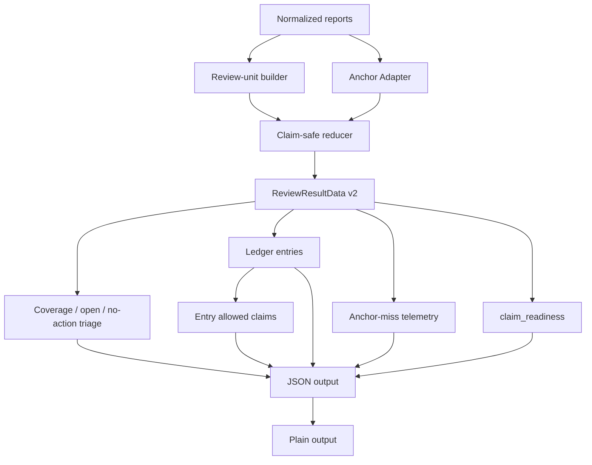
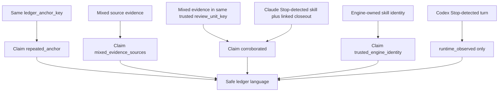

# feat: Skill-feedback claim-safe ReviewResultData v2

## Summary

Build v2 `skill-feedback review` around a full claim-safe `ReviewResultData` contract. The reducer owns review-unit keys, ledger anchors, evidence tiers, allowed claims, split readiness, anchor-miss telemetry, and preserved v1 triage output.

This supersedes the generic anchor-ledger v2 plan. The anchor Adapter stays, but it becomes an internal input to the reducer rather than the active product contract.

---

## Problem Frame

The old v2 plan was directionally right after Decision 20: closeout-first ledger work can proceed while Trusted skill identity stays blocked, and stable anchors are safer than taxonomy-first grouping. The prototype showed the plan still underspecified the reducer Seam.

Two thinner shapes failed the claim-safety bar. A minimal two-key reducer leaked false corroboration and weak-anchor merging. A reducer plus anchor Adapter fixed merge safety, but still left readiness and claim language outside the Interface.

The winning shape is wider for a reason. Full claim-safe `ReviewResultData` keeps runtime capture, Trusted skill identity, Daily pilot readiness, evidence tiers, entry-local allowed claims, and anchor facts in one contract-owned result. Renderers and future agents consume those facts instead of reconstructing them from partial state.

---

## Requirements

**Contract And Claims**

- R1. Extend `ReviewResultData` with `review_units`, `ledger_entries`, `anchor_miss_telemetry`, evidence tiers, entry-local `allowed_claims`, `claim_readiness`, open actions, and no-action reason.
- R2. Keep coverage, low-signal, open-item, and no-action review output ahead of ledger detail.
- R3. Expose `review_unit_key`, `anchor_strength`, and `weak_anchor_reason` on reducer-owned data; expose `ledger_anchor_key` only for strong-path anchors.
- R4. Expose stable anchor facts, source review-unit facts, evidence tier, source mix, weak-anchor quarantine, allowed claims, resolution state, verification burden, and next safe action on each ledger entry.
- R5. Use `driver_declared`, `runtime_observed`, `corroborated`, and `trusted_engine_identity` as the v2 evidence tiers.
- R6. Use allowed claims to name what downstream agents can safely repeat: repeated anchor, mixed Evidence source values, same trusted run, corroborated, and trusted engine identity.

**Review Units And Anchors**

- R7. Derive `review_unit_key` from trusted `skill_run_id`; otherwise derive it from report id.
- R7a. Treat `trusted_run` as same-run correlation proof, not Trusted skill identity.
- R7b. Treat raw or report-authored `skill_run_id` values as untrusted unless runtime-owned or correlation-owned provenance proves the link.
- R8. Do not coalesce reports that only share an untrusted or missing `skill_run_id`.
- R9. Derive `ledger_anchor_key` from canonical repo-contained path sets only.
- R10. Prefer `touched_surfaces` path targets before observation target paths when deriving anchors.
- R11. Sort and de-duplicate path anchors before key serialization.
- R12. Exclude evidence source, capture runtime, evidence tier, correlation status, verification burden, friction category, observation kind, open reason, timestamps, report ids, and `skill_run_id` from `ledger_anchor_key`.
- R13. Keep missing, label-only, out-of-repo, and unverifiable anchors standalone.
- R14. Emit anchor-miss telemetry for weak anchors without using that telemetry for grouping.

**Readiness And Evidence Safety**

- R15. Claim `corroborated` only when mixed evidence shares one trusted review unit.
- R16. Allow same-anchor mixed evidence to claim repeated anchor and mixed sources without claiming `corroborated`.
- R17. Reserve `trusted_engine_identity` for engine-owned identity evidence.
- R18. Treat Codex Stop-detected turn evidence as `runtime_observed` only until Trusted skill identity exists.
- R19. Preserve Claude Code Stop-detected skill as runtime-specific evidence that can claim `corroborated` only when mixed Evidence source values share the same trusted `review_unit_key`; it does not prove Codex identity.
- R20. Replace collapsed `capture_readiness` with `claim_readiness.runtime_capture`, `claim_readiness.trusted_skill_identity`, and `claim_readiness.daily_pilot`.
- R21. Keep Daily pilot readiness blocked until the accepted pilot gate passes; machine-observable approval and Trusted skill identity evidence are required inputs.
- R21a. Track readiness as separate facts, not independent gates; runtime capture may become ready while Daily pilot remains blocked on its dependencies.

**Renderer And Documentation**

- R22. Render JSON and plain output from reducer-owned fields; renderers own wording and layout only.
- R23. Sanitize untrusted strings before JSON and plain rendering so labels cannot spoof sections.
- R24. Align `skills/skill-feedback/CONTEXT.md`, `skills/skill-feedback/references/report-shape.md`, and the old v2 plan with Decisions 21 and 22; preserve Decision 23 implementation-order sequencing.
- R25. Delete the throwaway prototype only after its winning scenarios are absorbed into contract or runner tests.

---

## Decision 22 Contract Rules

- Feed the reducer normalized reports, review units, and anchor Adapter facts.
- Keep raw report parsing, path weirdness, and untrusted text shaping upstream of the reducer.
- Carry ledger-entry facts plus entry-local allowed claims in `ReviewResultData`.
- Keep renderers as consumers of allowed claims and readiness facts.
- Allow renderers to format, filter, order, and choose wording.
- Block renderers from inferring readiness, corroboration, merge safety, trust, or new claim language.
- Track readiness by claim, not as one global boolean.
- Keep allowed claims next to the ledger-entry evidence they qualify; do not expose top-level `allowed_claims` in v2.
- Keep weak anchors standalone with weak-anchor reason, attempted target context, and anchor-miss telemetry.
- Keep a v2 field only when it prevents false merge, false corroboration, weak-anchor merge, renderer overclaim, false readiness, or unsafe next action.

---

## Decisions 24-28 Grill Closure

- Use seven golden vectors as the minimum contract gate:
  same anchor without trusted run, weak label repeats, Codex Stop-detected turn, Claude linked skill evidence, renderer overclaim prevention, per-claim readiness, and v1 triage preservation.
- Freeze claim-safety field names only.
- Keep v1 fields `coverage`, `open_items`, `no_action`, `retention`, and `pilot_checkpoint`.
- Add top-level `review_units`, `ledger_entries`, `anchor_miss_telemetry`, and `claim_readiness`.
- Keep `allowed_claims` entry-local on ledger entries; do not add global `allowed_claims`.
- Use `claim_readiness.runtime_capture`, `claim_readiness.trusted_skill_identity`, and `claim_readiness.daily_pilot`; each carries `status`, `reason_ids`, and `evidence_refs`.
- Use readiness statuses `ready`, `blocked`, and `evidence_only`.
- A review unit exposes `review_unit_key`, `report_ids`, `trusted_run`, and optional `trusted_skill_run_id`.
- A ledger entry exposes `ledger_entry_key`, `review_unit_keys`, `ledger_anchor_key`, `anchor_strength`, `weak_anchor_reason`, `attempted_targets`, `owner_paths`, `evidence_tier`, `source_mix`, `capture_runtime_mix`, `allowed_claims`, `resolution_state`, `verification_burden`, and `next_safe_action`.
- Use evidence tiers `driver_declared`, `runtime_observed`, `corroborated`, and `trusted_engine_identity`.
- Use allowed claims `repeated_anchor`, `mixed_evidence_sources`, `same_trusted_run`, `corroborated`, and `trusted_engine_identity`.
- Use anchor strengths `strong_path` and `weak`.
- Use weak-anchor reasons `label_only`, `missing_anchor`, `out_of_repo`, and `unverifiable`.
- Leave exact key serialization, `reason_ids` catalogue, `evidence_refs` shape, `resolution_state` values, renderer labels, section headings, and helper/module names to implementation tests and command-contract code.
- Migrate JSON and plain output as claim consumers only; do not keep `capture_readiness` as a v2 compatibility alias.
- Implement serially: U1 contract, U2 trusted review units, U3 anchor Adapter, U4 reducer golden vectors, U5 split readiness, U6 renderers, U7 docs and prototype cleanup.
- Delete prototype files only after their winning scenarios and Decision 24 vectors live in normal tests.

---

## Key Technical Decisions

- KTD1. **`ReviewResultData` is the Interface at the reducer Seam.** The result contract carries the facts and claims that review, JSON, plain output, and future agents consume; callers cross this Seam instead of reading reducer internals.
- KTD2. **The anchor Adapter is internal.** It canonicalizes path-set facts before reduction, but it does not own product claim language.
- KTD3. **Two keys mean two claims.** `review_unit_key` means same trusted run; `ledger_anchor_key` means same stable surface.
- KTD4. **Weak anchors are quarantined.** Labels, missing paths, out-of-repo paths, and unverifiable strings stay standalone while telemetry accumulates.
- KTD5. **Evidence tiers are data; allowed claims are repeatable language.** Tiers explain provenance strength, and allowed claims prevent overstatement in renderer text.
- KTD6. **Corroboration needs a trusted review unit.** Same `ledger_anchor_key` alone can show recurrence and mixed sources, not corroboration.
- KTD7. **Readiness is split by claim.** Runtime capture, Trusted skill identity, and Daily pilot readiness are tracked separately; Daily pilot readiness depends on the accepted pilot gate, machine-observable approval, and Trusted skill identity evidence.
- KTD8. **Runtime branches share ledger rules.** Codex Stop, Claude Stop, and driver closeout evidence all pass through the same review-unit, anchor, evidence-tier, and claim checks.
- KTD9. **Prototype evidence gets absorbed, then removed.** Keep prototype files only until their scenarios live in regular tests.
- KTD10. **Pattern names require pressure.** Use GoF names only where a concrete claim-safety pressure has already named a Seam.

## Pressure Pattern Lens

- **ReviewResultData Facade:** `ReviewResultData` is the public review Interface. JSON, plain output, docs, and future agents consume its facts instead of reconstructing reducer logic.
- **Anchor Adapter:** The anchor Adapter turns messy target evidence into canonical anchor facts before reduction. Filesystem and path weirdness stay outside claim derivation.
- **Claim derivation rules:** Claim derivation stays reducer-owned over evidence tier, source mix, trusted review-unit state, and readiness facts. Renderers do not invent claim language; do not add a Strategy module before tests prove multiple current claim-rule consumers or variation points.
- **Reducer flow:** The review flow is stable: normalized reports, review units, anchor facts, ledger entries, allowed claims, readiness, renderer. Preserve Locality by keeping claim derivation and verification in the reducer; vary internal helpers only when tests need it.
- **Builder:** Defer. Add a builder only if assembling `ReviewResultData` becomes the dominant pain after the contract exists.

Do not use these for v2:

- **Observer:** invites dashboard or Stop-observability scope before the contract is safe.
- **Abstract Factory:** adds product-family machinery before there is a second product family.
- **Decorator:** misframes evidence tiers as wrappers instead of reducer facts.
- **Chain of Responsibility:** hides claim-promotion order and makes readiness harder to audit.

---

## High-Level Technical Design

## ce-work Execution Posture

- Use this plan as the ce-work input document.
- Execute serially because U1-U6 share `command-contract.ts`, `skill-feedback-runner.ts`, and runner tests.
- Start with U1 contract tests and v2 type definitions.
- Keep plan progress out of this file during ce-work; use git diff, tests, and commits as execution state.
- Treat prototype files as source evidence to absorb, not production patterns to preserve.
- Do not delete prototype files until U4, U5, and U6 tests cover the seven golden vectors.

## Source Ownership Map

During v2 implementation, keep `skills/skill-feedback/src/` flat. Use file names to expose ownership; do not add `patterns/`, `gof/`, abstraction folders, or pattern-name directory structure.

Until the new v2 reducer files exist, current v1 review orchestration remains in `skill-feedback-runner.ts`.

- `command-contract.ts`: owns the `ReviewResultData` Facade, contract ids, schema/version markers, enums, exported result shape, and command discovery metadata.
- `skill-feedback-runner.ts`: owns CLI/runtime orchestration, inbox reads, command envelopes, render dispatch, and glue code only.
- `review-ledger-reducer.ts`: owns reducer flow: review units, ledger entries, evidence tiers, entry-local allowed claims, and readiness facts.
- `ledger-anchor-adapter.ts`: owns the Anchor Adapter: repo-contained path canonicalization, anchor strength, weak-anchor reasons, and strong-only `ledger_anchor_key` facts.
- `redaction.ts`: owns agent-authored string safety before JSON and plain rendering.
- `report-helpers.ts`: owns small shared report helpers only.
- `capture-adapters.ts`: owns runtime capture adapter lanes that already exist.

Pattern naming guardrail:

- Keep `ReviewResultData Facade`, `Anchor Adapter`, and reducer flow as pressure-earned names.
- Keep claim derivation rules inside `review-ledger-reducer.ts`.
- Do not add a standalone Strategy interface or module unless implementation tests reveal multiple current claim-rule consumers or variation points.

---

## Implementation Units

### U1. Contract-owned ReviewResultData v2 shape

**Goal:** Extend the review result contract so claim-safe data has one owner.

**Requirements:** R1, R3, R4, R5, R6, R20, R22.

**Dependencies:** None.

**Files:**

- `skills/skill-feedback/src/command-contract.ts`
- `skills/skill-feedback/src/command-contract.test.ts`
- `skills/skill-feedback/references/report-shape.md`
- `skills/skill-feedback/CONTEXT.md`

**Approach:** Add v2 review result types for review units, ledger entries, anchor facts, evidence tiers, entry-local allowed claims, claim readiness facts, open actions, no-action reason, and anchor-miss telemetry. Introduce a review-specific v2 schema/version path so removing `capture_readiness` does not silently break v1 review consumers. Keep exact enum values and parser behavior in `command-contract.ts`. Keep docs thin and point to the contract owner.

**Patterns to follow:** Existing command contract constants in `skills/skill-feedback/src/command-contract.ts`; exported TypeScript JSDoc rules in `context/code-style.md`.

**Test scenarios:**

- A minimal valid v2 review result carries coverage, readiness, open actions, no-action reason, ledger entries, and anchor-miss telemetry.
- Unknown evidence tier values fail contract validation.
- Unknown allowed-claim values fail contract validation.
- Unknown readiness status values fail contract validation.
- Unknown anchor strength values fail contract validation.
- Unknown weak-anchor reason values fail contract validation.
- Strong-path ledger entries expose `review_unit_keys`, `ledger_anchor_key`, anchor strength, source mix, weak-anchor quarantine, evidence tier, allowed claims, resolution state, verification burden, and next safe action.
- Weak ledger entries expose `review_unit_keys`, `weak_anchor_reason`, `attempted_targets`, and `ledger_entry_key` without a mergeable `ledger_anchor_key`.
- Top-level data exposes review units, ledger entries, anchor-miss telemetry, readiness by claim, open actions, and no-action reason.
- Top-level data does not expose global `allowed_claims`; claims stay on ledger entries.
- `capture_readiness` is absent from v2 review output.
- V2 review output carries a review-specific v2 schema/version marker.
- A no-ledger review still returns valid v2 coverage and no-action data.

**Verification:** Contract tests prove the exported data vocabulary, contract result id, review-specific v2 schema/version, generated help references, and JSON shape agree.

### U2. Trusted review-unit key semantics

**Goal:** Coalesce reports only when the same trusted skill run is proven.

**Requirements:** R7, R8, R15, R16, R19.

**Dependencies:** U1.

**Files:**

- `skills/skill-feedback/src/skill-feedback-runner.ts`
- `skills/skill-feedback/src/skill-feedback.test.ts`
- `skills/skill-feedback/src/command-contract.ts`
- `skills/skill-feedback/src/command-contract.test.ts`

**Approach:** Replace the current "any `skill_run_id` links" review-unit behavior with trusted-run semantics. A trusted `skill_run_id` produces a run-prefixed `review_unit_key` only when runtime-owned or correlation-owned provenance proves same-run linkage. Missing, report-authored, untrusted, or placeholder run ids produce report-local review units. `trusted_run` can support `same_trusted_run` and `corroborated`; it does not prove `trusted_engine_identity`.

**Patterns to follow:** Existing `coalesceReviewUnits` flow in `skills/skill-feedback/src/skill-feedback-runner.ts`; prototype scenarios in `skills/skill-feedback/prototypes/review-result-contract-contenders.logic.ts`.

**Test scenarios:**

- Two reports with the same trusted `skill_run_id` produce one review unit.
- Two reports with the same untrusted `skill_run_id` produce separate review units.
- Two reports with the same raw report-authored `skill_run_id` produce separate review units unless trusted provenance is present.
- Spoofed `trusted_run` or `trusted_skill_run_id` values in input reports do not create a trusted review unit.
- A trusted review unit can allow `same_trusted_run` and `corroborated` without allowing `trusted_engine_identity`.
- Two reports with no `skill_run_id` produce separate report-local review units.
- Same-anchor mixed evidence without a shared trusted review unit does not claim `corroborated`.
- Claude Stop-detected skill plus linked closeout with a shared trusted run can claim `corroborated`.

**Verification:** Runner tests prove review-unit identity is independent of anchor identity and evidence source.

### U3. Anchor Adapter and canonical path-set facts

**Goal:** Isolate anchor derivation before the reducer and keep weak anchors standalone.

**Requirements:** R9, R10, R11, R12, R13, R14.

**Dependencies:** U1.

**Files:**

- `skills/skill-feedback/src/ledger-anchor-adapter.ts`
- `skills/skill-feedback/src/ledger-anchor-adapter.test.ts`
- `skills/skill-feedback/src/skill-feedback-runner.ts`
- `skills/skill-feedback/src/skill-feedback.test.ts`
- `skills/skill-feedback/src/command-contract.ts`

**Approach:** Add a small pure internal Adapter that accepts normalized report surface facts and emits canonical anchor facts for the reducer. Strong anchors come from repo-contained paths only. Weak anchors carry a reason and attempted target context but no mergeable key.

**Patterns to follow:** Pure helper style in `skills/skill-feedback/src/report-helpers.ts`; safety language from `skills/skill-feedback/references/report-shape.md`.

**Test scenarios:**

- Path anchors canonicalize, sort, and de-duplicate before key serialization.
- `touched_surfaces` path targets win before observation target paths.
- Label-only anchors stay standalone with `weak_anchor_reason: label_only`.
- Missing anchors stay standalone with `weak_anchor_reason: missing_anchor`.
- Out-of-repo paths stay standalone with `weak_anchor_reason: out_of_repo`.
- Strong path anchors carry `ledger_anchor_key`; weak anchors carry no mergeable `ledger_anchor_key`.
- Evidence source, capture runtime, evidence tier, correlation status, verification burden, friction category, observation kind, open reason, timestamp, report id, and `skill_run_id` changes do not change `ledger_anchor_key`.

**Verification:** Adapter tests prove canonicalization and weak-anchor quarantine before reducer tests depend on it.

### U4. Pattern ledger reducer and golden vectors

**Goal:** Build the replayable reducer that produces ledger entries, source mixes, tiers, and anchor telemetry.

**Requirements:** R1, R2, R4, R5, R6, R13, R14, R15, R16.

**Dependencies:** U1, U2, U3.

**Files:**

- `skills/skill-feedback/src/review-ledger-reducer.ts`
- `skills/skill-feedback/src/review-ledger-reducer.test.ts`
- `skills/skill-feedback/src/skill-feedback-runner.ts`
- `skills/skill-feedback/src/skill-feedback.test.ts`
- `skills/skill-feedback/prototypes/review-result-contract-contenders.logic.ts`

**Approach:** Implement a pure reducer over normalized reports, review units, and anchor Adapter facts. Preserve v1 coverage and open/no-action triage before ledger detail. Use Decision 24 golden vectors from the prototype before deleting the prototype.

**Patterns to follow:** Prototype guard scenarios in `skills/skill-feedback/prototypes/NOTES.md`; existing review signal derivation in `skills/skill-feedback/src/skill-feedback-runner.ts`.

**Test scenarios:**

- Golden vector: same-anchor driver and runtime evidence without a shared trusted review unit allows `repeated_anchor` and `mixed_evidence_sources` without `corroborated`.
- Golden vector: repeated weak label-only anchors stay standalone.
- Golden vector: Codex Stop-detected turn gives runtime evidence without Trusted skill identity or Daily pilot readiness.
- Golden vector: linked Claude Stop-detected skill plus driver closeout evidence with a shared trusted review unit allows `same_trusted_run` and `corroborated`.
- Golden vector: readiness advances per claim, not globally.
- Golden vector: v1 coverage, open-item, and no-action triage survive when ledger data exists.
- Repeated strong-anchor review units merge into one ledger entry.
- Low-signal review units stay in coverage/no-action output and do not create ledger entries.
- Anchor-miss telemetry counts weak-anchor reasons without affecting ledger counts.
- Driver closeout-only entries render as `driver_declared`.
- Codex Stop-only entries render as `runtime_observed`.
- Reducer ignores renderer wording when deriving evidence tier and allowed claims.

**Verification:** Reducer tests prove the Decision 24 golden vectors for false merge, false corroboration, weak-anchor merge, false readiness, and v1 triage preservation in permanent test coverage.

### U5. Split readiness and allowed-claims facts

**Goal:** Make readiness and claim safety explicit runtime facts, not renderer inference.

**Requirements:** R6, R15, R16, R17, R18, R19, R20, R21.

**Dependencies:** U1, U2, U4.

**Files:**

- `skills/skill-feedback/src/command-contract.ts`
- `skills/skill-feedback/src/command-contract.test.ts`
- `skills/skill-feedback/src/skill-feedback-runner.ts`
- `skills/skill-feedback/src/skill-feedback.test.ts`
- `hooks/skill-feedback-runtime.ts`
- `hooks/skill-feedback-hooks.test.ts`

**Approach:** Replace the current collapsed `capture_readiness` output with `claim_readiness`. Runtime capture can become ready from trusted hook configuration and Stop evidence. Trusted skill identity remains blocked without engine-owned identity evidence. Daily pilot remains blocked until the accepted pilot gate, machine-observable approval, and Trusted skill identity evidence are all present. Each readiness fact carries `status`, `reason_ids`, and `evidence_refs`.

**Patterns to follow:** Current `codexCaptureReadiness` logic in `skills/skill-feedback/src/skill-feedback-runner.ts`; Codex Stop research in `docs/research/2026-06-13-codex-stop-hooks-skill-observability-community-signal.md`.

**Test scenarios:**

- Codex Stop-detected turn evidence produces runtime evidence but blocks Trusted skill identity.
- Codex Stop without machine-observable approval blocks Daily pilot readiness.
- Notify-era capture cannot satisfy Codex runtime capture readiness.
- Claude Stop-detected skill does not change Codex Trusted skill identity readiness.
- Engine-owned skill identity is the only path to `trusted_engine_identity`.
- Allowed claims omit `corroborated` unless same trusted run evidence exists.
- Runtime capture can become ready while Trusted skill identity and Daily pilot readiness remain blocked.
- Daily pilot readiness becomes ready only when the accepted pilot gate, machine-observable approval, and Trusted skill identity evidence are present.
- A readiness status carries reason ids and evidence pointers for the claim it describes.
- No v2 code reads or writes `capture_readiness` as an alias for `claim_readiness`.

**Verification:** Runner and hook tests prove every readiness status has reason ids and evidence pointers.

### U6. JSON/plain renderer alignment

**Goal:** Render v2 review through the existing command-contract Interface without weakening claim safety.

**Requirements:** R2, R4, R6, R22, R23.

**Dependencies:** U1, U4, U5.

**Files:**

- `skills/skill-feedback/src/skill-feedback-runner.ts`
- `skills/skill-feedback/src/skill-feedback.test.ts`
- `skills/skill-feedback/src/command-contract.ts`
- `skills/skill-feedback/src/command-contract.test.ts`
- `skills/skill-feedback/src/redaction.ts`

**Approach:** Update JSON output to expose reducer-owned ledger entries, entry-local allowed claims, anchor telemetry, and `claim_readiness`. Update plain output to keep coverage, low-signal, no-action, and open triage before ledger detail. Render claim labels from ledger-entry allowed claims only. Keep renderer code free of merge, corroboration, trust, and readiness inference. Add every new v2 agent-authored string path to redaction ownership before rendering. Do not preserve `capture_readiness` as a v2 compatibility alias.

**Patterns to follow:** Existing plain review ordering in `renderPlainReview`; redaction ownership in `AGENT_AUTHORED_STRING_PATHS`.

**Test scenarios:**

- `review --plain` shows coverage, low-signal, no-action, and open triage before ledger detail.
- Plain output distinguishes evidence source, such as hook capture or driver closeout, from capture runtime, such as Codex Stop or Claude Stop.
- Plain output distinguishes `driver_declared`, `runtime_observed`, `corroborated`, and `trusted_engine_identity`.
- JSON includes ledger keys, anchor strength, weak-anchor reasons, source mix, capture runtime mix, evidence tier, allowed claims, and claim readiness.
- Renderer does not recompute `corroborated` from source mix or shared anchor.
- Renderer does not promote `runtime_observed` to `trusted_engine_identity`.
- Golden vector: JSON and plain renderers cannot infer stronger claims than reducer-owned allowed claims.
- Renderer does not infer Daily pilot readiness from runtime capture readiness.
- Renderer never reads `capture_readiness` to format v2 output.
- Control characters, multiline labels, and section-like untrusted text cannot spoof plain sections.
- Secret-shaped values in ledger attempted targets, labels, open actions, no-action reasons, verification-burden notes, and next-safe-action text are redacted before JSON and plain rendering.

**Verification:** JSON and plain renderer tests prove Interface output, help/discovery metadata, parser acceptance, and the Decision 24 renderer-overclaim vector stay aligned.

### U7. Docs, old-plan supersession, and prototype cleanup

**Goal:** Align durable docs with Decision 21 and remove throwaway prototype scaffolding after absorption.

**Requirements:** R24, R25.

**Dependencies:** U1, U4, U6.

**Files:**

- `skills/skill-feedback/docs/plans/2026-06-12-002-feat-skill-feedback-pattern-ledger-v2-plan.md`
- `skills/skill-feedback/CONTEXT.md`
- `skills/skill-feedback/references/report-shape.md`
- `skills/skill-feedback/prototypes/NOTES.md`
- `skills/skill-feedback/prototypes/review-result-contract-contenders.logic.ts`
- `skills/skill-feedback/prototypes/review-result-contract-contenders.ts`
- `skills/skill-feedback/package.json`

**Approach:** Mark the old v2 plan as historical context. Keep Decisions 21-32 as accepted sources for claim-safe reducer scope, contract rules, golden vectors, field names, renderer migration, implementation order, and prototype absorption. Treat this active plan and the decision log as read-only sources during U7 unless a separate accepted decision requires an append-only update. Update glossary and report-shape prose to name review units, anchor Adapter facts, allowed claims, and claim readiness. Delete prototype files and package scripts only after their scenarios are represented in normal tests.

**Patterns to follow:** Work-style rules in `AGENTS.md`; skill-doc ownership rules for thin prose and owner paths.

**Test scenarios:**

- Edited Markdown frontmatter parses.
- Old plan points to this replacement plan without rewriting its historical content.
- Skill references name contract owners instead of copying schemas.
- Prototype scripts disappear only after permanent tests cover `same-anchor-no-trusted-run`, `weak-label-repeat`, `codex-stop-no-identity`, `claude-linked-skill`, renderer overclaim prevention, per-claim readiness, and v1 triage preservation.

**Verification:** Documentation checks confirm frontmatter shape and source links; skill-feedback tests still cover absorbed prototype behavior.

---

## Scope Boundaries

**In scope**

- Claim-safe `ReviewResultData` v2 shape.
- Internal anchor Adapter.
- Trusted review-unit key semantics.
- Pattern ledger reducer.
- Evidence tiers and allowed claims.
- Split readiness for runtime capture, Trusted skill identity, and Daily pilot.
- JSON and plain renderer alignment.
- Docs and old-plan supersession.
- Prototype cleanup after absorption.

**Deferred to Follow-Up Work**

- Product-native taxonomy.
- Category-pressure review section.
- Stop observability dashboard.
- Native per-skill cost attribution.
- Automatic hook-to-closeout correlation beyond trusted `skill_run_id`.
- Timestamp-based candidate correlation between driver closeouts and Stop-detected turns.
- Daily-pilot launch automation.
- Purge workflow.

**Outside This Version**

- Badge enum as durable vocabulary.
- Trusted Codex skill identity without engine-owned evidence.
- Corroboration from shared `ledger_anchor_key` alone.
- Weak-anchor merging.
- Assistant-prose skill identity.
- Raw transcript parsing as a trusted contract.
- `review_unit_key`, `ledger_anchor_key`, `same_trusted_run`, `corroborated`, `trusted_engine_identity`, or readiness from timestamp proximity alone.

---

## Acceptance Examples

- AE1. Given driver and Codex Stop evidence share one strong anchor but no trusted run id, when review builds the ledger, then the entry can show repeated anchor and mixed sources but not `corroborated`.
- AE2. Given repeated label-only anchors, when review builds the ledger, then each entry stays standalone and anchor-miss telemetry counts `label_only`.
- AE3. Given Codex Stop-detected turn evidence without skill identity, when review evaluates readiness, then runtime evidence is visible and Trusted skill identity remains blocked.
- AE4. Given Claude Stop-detected skill evidence and a linked closeout share one trusted run id, when review builds the ledger, then the entry can claim `corroborated` without changing Codex Trusted skill identity readiness.
- AE5. Given path anchors with duplicates, dot segments, and different order, when the anchor Adapter runs, then the serialized key uses sorted canonical repo-contained paths.
- AE6. Given out-of-repo or symlink-like path targets, when the anchor Adapter runs, then the report stays standalone with a weak-anchor reason.
- AE7. Given low-signal evidence, when review renders plain output, then coverage and no-action triage appear before any ledger detail.
- AE8. Given untrusted labels containing headings or control characters, when review renders JSON and plain output, then output structure stays intact.

---

## System-Wide Impact

- Review JSON grows from v1 report-card output into a contract-owned reducer result.
- Plain review gets a ledger section but keeps v1 triage first.
- Hook runtime evidence becomes useful without implying Trusted skill identity.
- Claude Code and Codex runtime branches share ledger rules while keeping Trusted skill identity claims separate.
- Future agents get an inspectable claim budget instead of inferring safe language from tiers.

---

## Risks & Dependencies

- **Contract width can sprawl.** Mitigation: keep exact enums and result fields in `command-contract.ts`, and delete renderer-only fields that do not protect a claim.
- **Anchor rules can over-merge.** Mitigation: derive keys only from canonical repo-contained path sets and keep weak anchors standalone.
- **Anchor rules can under-group.** Mitigation: emit anchor-miss telemetry for later category or anchor-source proposals.
- **Renderer language can overclaim.** Mitigation: render from allowed claims only and test same-anchor/no-trusted-run scenarios.
- **Codex readiness can collapse again.** Mitigation: keep runtime capture, Trusted skill identity, and Daily pilot readiness as separate result fields.
- **Prototype cleanup can lose evidence.** Mitigation: delete prototype files only after golden vectors live in permanent tests.

---

## Documentation / Operational Notes

- Keep `skills/skill-feedback/src/command-contract.ts` as the source owner for result fields, enum values, reason ids, and contract output.
- Keep `skills/skill-feedback/src/skill-feedback-runner.ts` or extracted pure modules as the reducer owner.
- Keep `skills/skill-feedback/references/report-shape.md` as a thin field-ownership map, not a copied schema.
- Use `cli-author` if review CLI flags, help, discovery metadata, or command envelope semantics change.
- Read `skills/create-skill/references/skill-design-decision-runbook.md` before editing `skills/skill-feedback/SKILL.md` or skill references.

---

## Sources / Research

- `skills/skill-feedback/prototypes/NOTES.md`
- `skills/skill-feedback/prototypes/review-result-contract-contenders.logic.ts`
- `skills/skill-feedback/docs/ideation/2026-06-13-skill-feedback-review-pivot-ideation.html`
- `docs/research/2026-06-13-codex-stop-hooks-skill-observability-community-signal.md`
- `skills/skill-feedback/docs/plans/2026-06-12-002-feat-skill-feedback-pattern-ledger-v2-plan.md`
- `docs/decisions/2026-06-12-001-skill-feedback-pilot-decision-log.md`
- `skills/skill-feedback/CONTEXT.md`
- `skills/skill-feedback/references/report-shape.md`
- `skills/skill-feedback/src/command-contract.ts`
- `skills/skill-feedback/src/skill-feedback-runner.ts`
