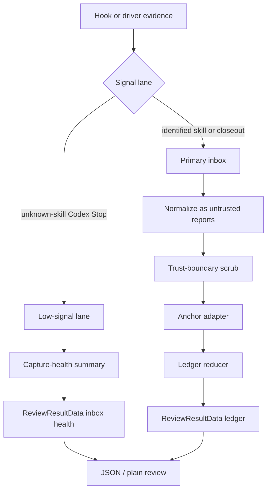
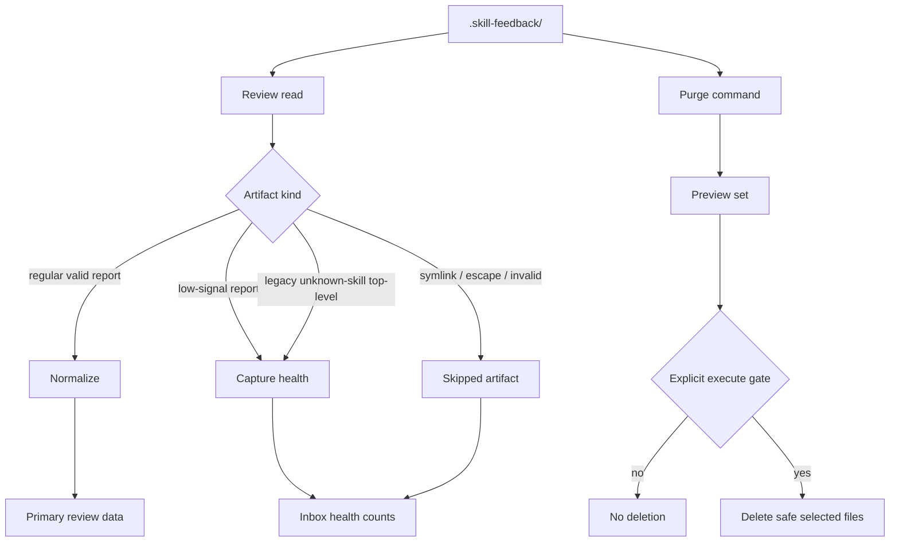

# fix: Skill-feedback review merge-readiness hardening

## Summary

Harden `skill-feedback review` v2 for merge by closing trusted-boundary gaps, separating low-signal Codex Stop capture from primary ledger claims, adding a gated purge path, and proving the missing cross-lane capture review path.

This follow-on plan keeps the claim-safe v2 contract shape from `skills/skill-feedback/docs/plans/2026-06-13-001-feat-skill-feedback-claim-safe-review-result-v2-plan.md`, but treats the current implementation as not merge-ready until public input, raw inbox JSON, and live low-signal capture cannot manufacture review claims.

## Execution Progress

- [x] U1. Seal public capture telemetry and raw provenance
- [x] U2. Quarantine redacted and unverifiable anchors
- [x] U3. Add the low-signal capture lane
- [x] U4. Harden inbox reads and add gated purge
- [x] U5. Stabilize review actions and renderer claims
- [x] U6. Make writes and subprocesses failure-contained
- [x] U7. Prove cross-lane behavior and update references

---

## Problem Frame

The v2 smoke tests prove the honest path works. A single closeout produces schema v2 output, same-anchor untrusted reports do not claim `corroborated`, plain output preserves section structure, and `capture_readiness` is absent.

The review and live inbox evidence expose the remaining risk. Public `record` stdin can carry trusted-looking telemetry, raw inbox JSON can mint trusted-run provenance, redacted path placeholders can become strong anchors, and the live inbox is already dominated by `unknown-skill` Codex Stop reports. The product works, but its input trust boundary and evidence lifecycle are not safe enough for merge.

This plan repairs merge blockers without reopening the broader taxonomy plan. Failure-class taxonomy, dashboarding, Daily pilot launch, and Trusted Codex skill identity stay out of scope until engine-owned identity evidence exists.

---

## Requirements

**Trusted Boundary**

- R1. Public `record` input cannot create trusted telemetry, trusted run proof, or unredacted trusted-side text.
- R2. Hook-capture telemetry may remain evidence, but persisted public input cannot promote `model`, `capture_runtime`, `skill_identity_provenance`, or `skill_run_id_provenance` into trusted claims.
- R3. Raw inbox JSON cannot mint `same_trusted_run`, `corroborated`, or `trusted_engine_identity` by setting provenance fields.
- R4. Trusted run proof is accepted only from a writer-owned correlation source; until that source exists, live review keeps hook-plus-closeout evidence below `corroborated`.
- R5. Redacted path targets cannot produce strong ledger anchors or repeated-anchor claims.

**Low-Signal Capture Lane**

- R6. New Codex Stop captures with `unknown-skill` and no trusted skill identity go to a low-signal lane.
- R7. Review classifies both low-signal lane reports and legacy top-level `unknown-skill` Codex Stop reports as low-signal by content.
- R8. Review still reports low-signal capture health counts so hook observability is not lost.
- R9. Low-signal lane data stays under `.skill-feedback/` and remains gitignored, private, and purgeable.

**Review Contract And Agent Actions**

- R10. Low-signal reports remain visible in coverage or inbox health, but do not create ledger entries when no open signal exists.
- R11. `open_actions.action_key` is stable across inbox file ordering.
- R12. `open_actions.evidence_refs` contains stable report, review-unit, ledger, or inbox-health refs, never display prose.
- R13. `resolution_state` is derived from review facts or removed from active output; it cannot be hard-coded as `open`.
- R14. JSON and plain output preserve section structure when untrusted strings contain control characters or section-like text.
- R15. Plain review shows capture runtime mix when ledger entries include hook evidence.
- R16. Review error envelopes use the review result schema version.

**Inbox Lifecycle And Robustness**

- R17. Review refuses to follow symlinked or out-of-repo inbox entries.
- R18. Invalid or unsafe inbox artifacts are reported as inbox health, not allowed to poison the entire review when valid reports remain.
- R19. Report writes use temp-file plus atomic rename or an equivalent crash-safe write path.
- R20. Record and closeout write failures return facade error envelopes with accurate `changed_state`.
- R21. Git and filesystem subprocess calls have bounded timeouts.
- R22. Purge is a separate mutation-gated command; `review` remains mutation-free.
- R23. Purge can preview and execute age/count retention across primary and low-signal lanes without deleting unsafe paths.

**Verification**

- R24. The command surface alignment proof covers discovery metadata, rendered help, public argv acceptance, and runtime semantics for every changed command.
- R25. The cross-lane e2e proves the live hook-capture plus driver-closeout path cannot overclaim; true `corroborated` remains blocked until a writer-owned correlation source exists.

---

## Key Technical Decisions

- KTD1. **Low-signal lane, not primary reports.** Unknown-skill Codex Stop capture is useful hook-health evidence, but it is not skill evidence. Store it in a low-signal lane and summarize it separately.
- KTD2. **Trusted run proof needs a writer owner.** Persisted JSON is evidence, not proof. Review cannot trust `runtime_owned` or `correlation_owned` values just because a file contains them.
- KTD3. **No current live path to `corroborated` unless correlation is writer-owned.** Reducer golden vectors may keep synthetic trusted-run coverage, but real inbox review stays below `corroborated` until a correlation owner writes the proof.
- KTD4. **Redacted paths are weak anchors.** Any path target that has been replaced by a redaction marker is unverifiable and cannot merge.
- KTD5. **Review owns inbox health; purge owns deletion.** Review reports valid, low-signal, skipped, invalid, and unsafe artifact counts. Purge deletes only through an explicit mutation command.
- KTD6. **Open actions are addressable objects.** Agents act on stable refs, not on prose copied from plain output.
- KTD7. **Facade-backed CLI proof stays mandatory.** Adding `purge` and changing review output require command metadata, help, parser, and runtime proof to move together.

---

## High-Level Technical Design

---

## Owner Map

- Contract owner: `skills/skill-feedback/src/command-contract.ts`.
- Engine owner: `skills/skill-feedback/src/skill-feedback-runner.ts`.
- Reducer owner: `skills/skill-feedback/src/review-ledger-reducer.ts`.
- Anchor owner: `skills/skill-feedback/src/ledger-anchor-adapter.ts`.
- Redaction owner: `skills/skill-feedback/src/redaction.ts`.
- Hook owners: `hooks/skill-feedback-codex-stop.ts`, `hooks/skill-feedback-runtime.ts`, and `hooks/skill-feedback-stop.ts`.
- CLI proof owners: `skills/skill-feedback/src/command-contract.test.ts`, `skills/skill-feedback/src/skill-feedback.test.ts`, and `scripts/check-workspace-facade-invariants.ts`.
- Reference owners: `skills/skill-feedback/references/report-shape.md`, `skills/skill-feedback/references/redaction.md`, and `skills/skill-feedback/CONTEXT.md`.

---

## Implementation Units

### U1. Seal public capture telemetry and raw provenance

**Goal:** Prevent public input and raw inbox JSON from creating trusted review facts.

**Requirements:** R1, R2, R3, R4, R16, R24.

**Dependencies:** None.

**Files:**

- `skills/skill-feedback/src/command-contract.ts`
- `skills/skill-feedback/src/command-contract.test.ts`
- `skills/skill-feedback/src/skill-feedback-runner.ts`
- `skills/skill-feedback/src/skill-feedback.test.ts`
- `skills/skill-feedback/src/review-ledger-reducer.ts`
- `skills/skill-feedback/src/review-ledger-reducer.test.ts`
- `hooks/skill-feedback-runtime.ts`
- `hooks/skill-feedback-hooks.test.ts`
- `skills/skill-feedback/references/report-shape.md`

**Approach:** Split agent-authored receipt data from adapter-owned telemetry at the review trust boundary. Public stdin telemetry remains capture evidence only and is redaction-gated where it can carry arbitrary strings. `normalizeReport` must not accept persisted trusted-run provenance as proof unless a writer-owned source marks it as such. Review error envelopes use `SKILL_FEEDBACK_REVIEW_RESULT_SCHEMA_VERSION`.

**Execution note:** Start with failing forged-input tests before changing reducer logic.

**Patterns to follow:** Existing facade-backed contract tests in `command-contract.test.ts`; existing capture telemetry tests in `skill-feedback.test.ts`; cli-author facade proof rules in `skills/cli-author/references/cli-command-facade.md`.

**Test scenarios:**

- Public `record` stdin containing a secret-shaped `model` does not write the secret unredacted.
- Public `record` stdin containing `capture_runtime: codex_stop` and trusted-looking `skill_identity_provenance` produces evidence-only review data.
- A raw inbox report with `skill_run_id_provenance: runtime_owned` does not coalesce review units unless writer-owned proof is present.
- A raw inbox report with forged mixed `hook_capture` and `driver_closeout` provenance does not claim `same_trusted_run` or `corroborated`.
- Review error output for a review failure carries the review contract id and review schema version.
- Discovery metadata still advertises `record`, `closeout`, and `review` with correct result contracts.

**Verification:** Contract tests, runner tests, reducer tests, hook tests, and workspace facade checks prove public input cannot mint trusted facts.

### U2. Quarantine redacted and unverifiable anchors

**Goal:** Keep redacted path strings out of strong anchor grouping.

**Requirements:** R5, R14.

**Dependencies:** U1.

**Files:**

- `skills/skill-feedback/src/redaction.ts`
- `skills/skill-feedback/src/ledger-anchor-adapter.ts`
- `skills/skill-feedback/src/ledger-anchor-adapter.test.ts`
- `skills/skill-feedback/src/review-ledger-reducer.test.ts`
- `skills/skill-feedback/src/skill-feedback.test.ts`
- `skills/skill-feedback/references/redaction.md`
- `skills/skill-feedback/references/report-shape.md`

**Approach:** Treat path targets containing redaction markers as weak `unverifiable` anchors. Keep redaction ownership in `redaction.ts`; keep anchor safety in `ledger-anchor-adapter.ts`. Do not preserve a hidden merge key for redacted paths because the hidden value would reintroduce secret-bearing state.

**Test scenarios:**

- A touched-surface path redacted to a marker becomes a weak unverifiable anchor.
- Two distinct redacted path targets do not merge into one repeated-anchor entry.
- Redacted observation target paths are weak even when no touched surface exists.
- Plain output and JSON retain valid structure when attempted targets contain control characters.
- Anchor-miss telemetry counts redacted paths as unverifiable without creating ledger grouping.

**Verification:** Adapter and reducer tests prove redaction cannot collapse unrelated paths into one strong anchor.

### U3. Add the low-signal capture lane

**Goal:** Preserve unknown-skill Codex Stop observability without polluting primary review claims.

**Requirements:** R6, R7, R8, R9, R10, R24.

**Dependencies:** U1.

**Files:**

- `hooks/skill-feedback-codex-stop.ts`
- `hooks/skill-feedback-runtime.ts`
- `hooks/skill-feedback-hooks.test.ts`
- `skills/skill-feedback/src/command-contract.ts`
- `skills/skill-feedback/src/command-contract.test.ts`
- `skills/skill-feedback/src/skill-feedback-runner.ts`
- `skills/skill-feedback/src/skill-feedback.test.ts`
- `skills/skill-feedback/references/report-shape.md`
- `skills/skill-feedback/CONTEXT.md`

**Approach:** Route new Codex Stop captures with `skill: unknown-skill` and no trusted identity into `.skill-feedback/low-signal/`. During review, classify both that lane and legacy top-level `unknown-skill` Codex Stop reports as low-signal by content before ledger reduction. Review includes a compact inbox-health summary with low-signal count, newest timestamp, and reason ids. Keep the low-signal lane inside `.skill-feedback/` so existing ignore and privacy gates apply.

**Patterns to follow:** Current Codex Stop hook tests in `hooks/skill-feedback-hooks.test.ts`; current retention count output in `skill-feedback-runner.ts`.

**Test scenarios:**

- Codex Stop payload with no trusted skill identity writes a low-signal record.
- Codex Stop payload with no trusted skill identity does not increase primary ledger entries.
- Legacy top-level `unknown-skill` Codex Stop report is counted as low-signal and does not increase primary ledger entries.
- Primary review JSON includes low-signal capture health counts.
- Plain review summarizes low-signal capture health without opening ledger entries.
- A valid identified Claude Stop capture remains in the primary lane.
- `.gitignore` gating still refuses both primary and low-signal writes when `.skill-feedback/` is not ignored.

**Verification:** Hook and runner tests prove live `unknown-skill` volume is observable but no longer dominates primary review.

### U4. Harden inbox reads and add gated purge

**Goal:** Make the inbox lifecycle safe once hooks are continuously writing reports.

**Requirements:** R7, R10, R17, R18, R22, R23, R24.

**Dependencies:** U3.

**Files:**

- `skills/skill-feedback/src/command-contract.ts`
- `skills/skill-feedback/src/command-contract.test.ts`
- `skills/skill-feedback/src/skill-feedback-runner.ts`
- `skills/skill-feedback/src/skill-feedback.test.ts`
- `skills/skill-feedback/references/report-shape.md`
- `skills/skill-feedback/references/redaction.md`
- `skills/skill-feedback/SKILL.md`

**Approach:** Add an inbox scanner that classifies primary reports, low-signal reports, legacy low-signal top-level reports, skipped unsafe artifacts, and invalid artifacts before normalization. Review never follows symlinks and continues over valid reports when unsafe or invalid artifacts are present. Add a facade-backed `purge` command with preview-first semantics and explicit execute gating. Purge deletes only safe regular files inside `.skill-feedback/` and reports skipped paths without following them.

**Command surface:** `skill-feedback purge [--lane primary|low-signal|all] (--older-than DURATION | --keep-latest COUNT) [--execute]`. Default is preview and deletes nothing. `--execute` without one retention selector returns an error envelope with a repair hint. `--lane` defaults to `all`.

**Patterns to follow:** Existing inbox directory safety in `prepareSkillFeedbackInbox`; cli-author safety gates for destructive commands; current retention warnings in `retentionSummary`.

**Test scenarios:**

- Review skips a symlinked `.json` file without reading the target.
- Review reports invalid JSON as inbox health while still reviewing valid reports.
- Review reports low-signal lane count and skipped artifact count in JSON.
- Review classifies legacy top-level `unknown-skill` Codex Stop reports as purge candidates under the low-signal reason.
- Plain review includes a compact inbox health line when artifacts were skipped.
- Purge preview reports candidate counts and deletes nothing.
- Purge execute requires an explicit gate and deletes only selected safe files.
- Purge rejects `--execute` without `--older-than` or `--keep-latest`.
- Purge refuses symlinked files, non-files, and out-of-repo realpaths.
- Purge handles primary and low-signal lanes with the same containment checks.
- Help and discovery metadata advertise purge as a write command with preview and execute modes.

**Verification:** Runner tests and command contract tests prove review stays mutation-free and purge is the only deletion path.

### U5. Stabilize review actions and renderer claims

**Goal:** Make agent-facing review output claim-safe, addressable, and reorder-stable.

**Requirements:** R11, R12, R13, R14, R15, R16, R24.

**Dependencies:** U1, U2, U3, U4.

**Files:**

- `skills/skill-feedback/src/command-contract.ts`
- `skills/skill-feedback/src/command-contract.test.ts`
- `skills/skill-feedback/src/skill-feedback-runner.ts`
- `skills/skill-feedback/src/skill-feedback.test.ts`
- `skills/skill-feedback/src/review-ledger-reducer.ts`
- `skills/skill-feedback/src/review-ledger-reducer.test.ts`
- `skills/skill-feedback/src/redaction.ts`
- `skills/skill-feedback/references/report-shape.md`

**Approach:** Carry source refs through open item derivation, then derive `action_key` from stable refs plus reason and target. Replace prose `evidence_refs` with stable refs. Derive `resolution_state` from review facts or drop it from the active contract. Extend renderer tests so every untrusted string rendered in plain output passes through `plainSafe`. Show `capture_runtime_mix` in plain ledger lines when present.

**Patterns to follow:** Existing `ReviewResultData` parser validation in `command-contract.ts`; existing AE8 plain-renderer test in `skill-feedback.test.ts`.

**Test scenarios:**

- Reordering inbox files does not change action keys for the same open evidence.
- `open_actions.evidence_refs` uses stable report, review unit, ledger, or inbox-health refs.
- `open_actions.evidence_refs` never copies human-readable evidence prose.
- Low-signal no-action input does not emit ledger entries.
- Derived `resolution_state` is `open` only for actionable ledger entries.
- No-action review output does not hard-code ledger entries as open.
- Plain output includes capture runtime mix for hook-backed ledger entries.
- JSON-side control-character fixtures parse intact and cannot create extra structural keys.
- Plain output sanitizes attempted targets, action evidence, no-action reasons, retention warnings, and ledger labels.

**Verification:** Parser, runner, and reducer tests prove agent actions are stable and renderer output cannot overclaim.

### U6. Make writes and subprocesses failure-contained

**Goal:** Prevent partial artifacts, hung subprocesses, and write failures from breaking review or hiding state changes.

**Requirements:** R19, R20, R21, R24.

**Dependencies:** U1, U4.

**Files:**

- `skills/skill-feedback/src/skill-feedback-runner.ts`
- `skills/skill-feedback/src/skill-feedback.test.ts`
- `hooks/skill-feedback-runtime.ts`
- `hooks/skill-feedback-hooks.test.ts`
- `skills/skill-feedback/references/report-shape.md`

**Approach:** Replace direct final-path writes with a crash-safe write helper. Wrap record and closeout writes in facade error envelopes that distinguish no change from partial change. Add timeouts to runner subprocess calls, including git calls used for SHA and ignore checks. Keep hook subprocess timeout behavior aligned with runner behavior.

**Patterns to follow:** Current hook `runBufferedProcess` timeout; closeout rollback handling for pilot marker failures.

**Test scenarios:**

- Record write failure returns a JSON error envelope and no stack trace.
- Closeout report write failure returns a JSON error envelope and accurate `changed_state`.
- A simulated partial write does not leave an invalid final `.json` file.
- Review skips a partial temp file and reports it as inbox health.
- Git SHA subprocess timeout degrades the report instead of hanging.
- Git ignore subprocess timeout blocks writes with a repair-state envelope.
- Hook runtime still exits bounded when the runner subprocess times out.

**Verification:** Runtime tests prove all write and subprocess failures are bounded, structured, and retry-safe.

### U7. Prove cross-lane behavior and update references

**Goal:** Close the smoke-test gap and align durable docs with the hardened contract.

**Requirements:** R4, R8, R22, R23, R25.

**Dependencies:** U1, U2, U3, U4, U5, U6.

**Files:**

- `hooks/fixtures/skill-feedback/fallow-close.jsonl`
- `hooks/skill-feedback-hooks.test.ts`
- `skills/skill-feedback/src/skill-feedback.test.ts`
- `skills/skill-feedback/src/review-ledger-reducer.test.ts`
- `skills/skill-feedback/references/report-shape.md`
- `skills/skill-feedback/references/redaction.md`
- `skills/skill-feedback/CONTEXT.md`
- `skills/skill-feedback/SKILL.md`

**Approach:** Build an integration fixture that runs hook capture and driver closeout through the real runner in an isolated gitignored repo. The current expected behavior is conservative: mixed evidence is visible, low-signal capture is summarized, and no live path claims `corroborated` unless a writer-owned trusted-run proof is introduced in this plan. Update references to name the low-signal lane, inbox health, purge, and trusted-run limitation.

**Test scenarios:**

- Hook capture followed by driver closeout with no writer-owned trusted run does not claim `corroborated`.
- Hook capture and closeout with the same strong anchor can claim repeated anchor and mixed sources when both are primary-lane reports.
- Unknown-skill Codex Stop plus closeout does not create a primary ledger entry for the unknown capture.
- Claude Stop fixture still detects a named skill and stays primary-lane evidence.
- End-to-end review of a temp repo with primary and low-signal lanes returns schema v2 and inbox health.
- Docs mention purge as a separate gated workflow and keep review mutation-free.
- Skill guidance points drivers to review and purge owners without copying command schemas.

**Verification:** End-to-end tests, hook tests, markdown frontmatter checks, and owner-path checks prove the follow-on contract is represented in code and docs.

---

## Scope Boundaries

### In Scope

- Public input trust-boundary fixes.
- Raw inbox provenance downgrade.
- Redacted path weak-anchor handling.
- Low-signal lane for unknown-skill Codex Stop capture.
- Inbox health summary.
- Mutation-gated purge command.
- Stable open-action refs.
- Derived or removed `resolution_state`.
- Renderer control-character and runtime-mix hardening.
- Write failure envelopes and subprocess timeouts.
- Cross-lane e2e for current claim boundary.

### Deferred To Follow-Up Work

- Engine-owned Trusted Codex skill identity.
- Writer-owned hook-to-closeout correlation beyond this merge gate.
- Daily pilot launch readiness.
- Product-native failure-class taxonomy.
- Dashboard or observability UI.
- Native per-skill cost attribution.
- Rule ids for diagnostics.

### Outside This Version

- Treating placeholder `unknown-skill` capture as skill evidence.
- Treating raw inbox JSON as trusted provenance.
- Treating shared anchor alone as `corroborated`.
- Fuzzy matching labels into recurring patterns.
- Deleting files from `review`.
- Trusting assistant prose as skill identity.

---

## Acceptance Examples

- AE1. Given public `record` stdin contains trusted-looking telemetry and a secret-shaped model value, when the report is written and reviewed, then no secret is written unredacted and no trusted claim is produced.
- AE2. Given a raw inbox JSON file sets `skill_run_id_provenance: runtime_owned`, when review runs, then reports do not coalesce into a trusted review unit without writer-owned proof.
- AE3. Given a Codex Stop payload has `unknown-skill` and no trusted identity, when the hook writes evidence, then the report lands in the low-signal lane and primary review summarizes it as capture health. Given an equivalent legacy top-level report already exists, review classifies it as low-signal by content.
- AE4. Given a redacted path target appears in touched surfaces, when the anchor Adapter runs, then the target is weak and cannot produce `repeated_anchor`.
- AE5. Given the inbox contains one valid report, one symlinked `.json`, and one invalid `.json`, when review runs, then the valid report is reviewed and the unsafe artifacts are reported as inbox health.
- AE6. Given purge runs in preview mode, when candidates are older than the retention threshold, then output lists candidates and deletes nothing.
- AE7. Given purge runs with the explicit execute gate, when candidates are safe regular files inside `.skill-feedback/`, then only those files are deleted and the result reports counts.
- AE8. Given the same open evidence appears after inbox file order changes, when review runs twice, then `open_actions.action_key` and `evidence_refs` stay stable.
- AE9. Given untrusted fields contain newlines and fake headings, when JSON and plain review render, then JSON parses and plain output contains only real section headings.
- AE10. Given hook capture and driver closeout share one strong anchor but no writer-owned trusted run, when review runs end-to-end, then mixed evidence is visible and `corroborated` is absent.

---

## Command Surface Alignment Proof

- Discovery metadata: `skills/skill-feedback/src/command-contract.test.ts` proves `record`, `closeout`, `review`, and `purge` contracts, result versions, side effects, and output modes.
- Rendered help: `skills/skill-feedback/src/skill-feedback.test.ts` proves each command help surface includes advertised flags and omits foreign flags.
- Parser acceptance: `skills/skill-feedback/src/skill-feedback.test.ts` proves public argv accepts supported review and purge modes and rejects unsafe combinations.
- Runtime semantics: `skills/skill-feedback/src/skill-feedback.test.ts` proves record, closeout, review, and purge produce facade envelopes, side-effect stance, and mutation behavior matching command metadata.
- Workspace proof: `scripts/check-workspace-facade-invariants.ts` proves facade discovery cannot drift from workspace rules.

---

## System-Wide Impact

- Continuous Codex Stop capture no longer floods primary review with unknown-skill ledger units.
- Review becomes an inbox-health surface as well as a claim-safe ledger surface.
- Purge introduces the first mutation command for `.skill-feedback/`; review stays read-only.
- Agents get stable action refs for safe follow-up work.
- True `corroborated` becomes stricter in live review until a writer-owned correlation source lands.

---

## Risks & Dependencies

- **Trusted-run claims may become rarer.** Mitigation: prefer underclaiming until writer-owned correlation exists.
- **Low-signal lane may hide useful hook evidence.** Mitigation: review reports capture-health counts and purge treats the lane explicitly.
- **Purge can delete useful evidence.** Mitigation: preview-first output, explicit execute gate, containment checks, and no symlink following.
- **Contract changes can drift from help.** Mitigation: command surface alignment proof across metadata, help, parser, and runtime semantics.
- **Inbox health can become a dumping ground.** Mitigation: keep categories small: valid primary, valid low-signal, skipped unsafe, invalid, purged candidates.
- **Write-hardening can complicate tests.** Mitigation: keep the crash-safe write helper small and test through public command paths.

---

## Sources And Research

- Origin requirements: `skills/skill-feedback/docs/brainstorms/2026-06-12-skill-feedback-review-pattern-ledger-v2-requirements.md`.
- Current v2 plan: `skills/skill-feedback/docs/plans/2026-06-13-001-feat-skill-feedback-claim-safe-review-result-v2-plan.md`.
- Report shape owner: `skills/skill-feedback/references/report-shape.md`.
- Skill vocabulary: `skills/skill-feedback/CONTEXT.md`.
- Runner owner: `skills/skill-feedback/src/skill-feedback-runner.ts`.
- Contract owner: `skills/skill-feedback/src/command-contract.ts`.
- Reducer owner: `skills/skill-feedback/src/review-ledger-reducer.ts`.
- Anchor owner: `skills/skill-feedback/src/ledger-anchor-adapter.ts`.
- Redaction owner: `skills/skill-feedback/src/redaction.ts`.
- Hook owners: `hooks/skill-feedback-codex-stop.ts`, `hooks/skill-feedback-runtime.ts`, and `hooks/skill-feedback-stop.ts`.
- CLI design references: `skills/cli-author/references/agent-native-cli-design.md` and `skills/cli-author/references/cli-command-facade.md`.
- Staff evidence: current-session smoke handoff and current-session Tier 2 code review.
