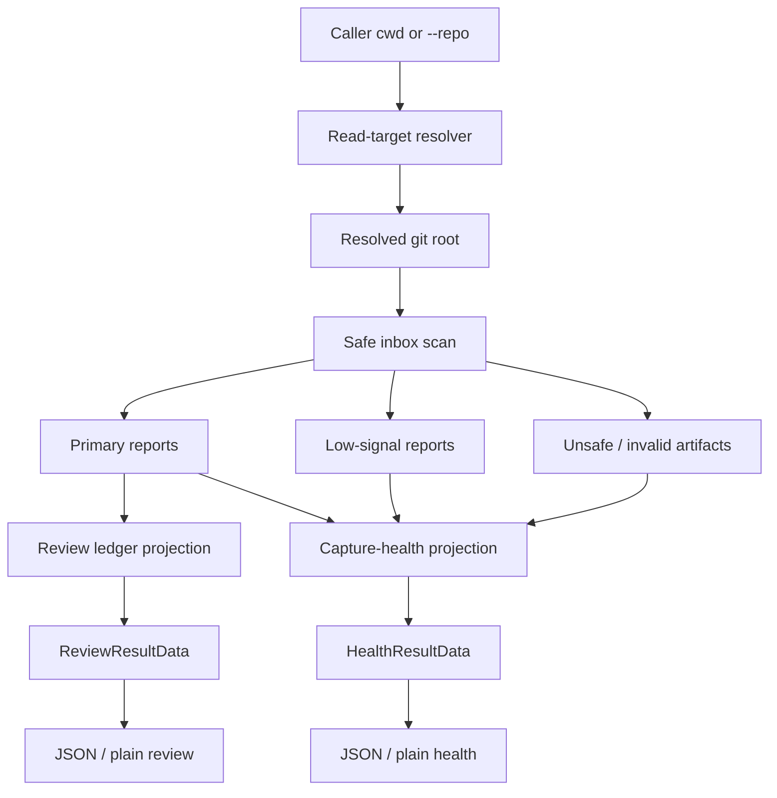
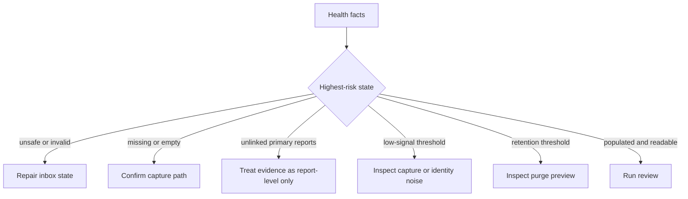

# feat: Add skill-feedback health command

## Summary

Add a read-only `skill-feedback health` command and shared read-command root resolution so agents can inspect inbox storage/readability, claim readiness, correlation health, warnings, and the next safe action before running the richer review ledger.

---

## Problem Frame

`skill-feedback review` already emits useful evidence, but command trust breaks when one invocation path can see a populated inbox and another reports no evidence. That is a false-empty failure, not a missing dashboard.

Root cause: read commands currently derive their scan root from process cwd through `repoRoot: () => process.cwd()`. Package or workspace invocation can therefore scan the skill package cwd while the intended `.skill-feedback/` inbox lives at the caller's git root. Linked worktrees are first-class targets: git-root discovery resolves the active worktree top-level, not the main checkout.

This slice makes the read surface truthful before adding review intelligence. Health answers the operability question compactly; review remains the evidence inspection surface.

---

## Requirements

### Inbox Resolution

- R1. `review` and `health` resolve the same repo root for the same user intent.
- R2. `review` and `health` default to the caller's git root and expose `--repo` as an explicit override.
- R3. Health reports whether the inbox is missing, empty, populated, unsafe, or partially readable.
- R4. Health reports primary report count, low-signal count, invalid count, and skipped-unsafe count.
- R5. Health reports newest primary and low-signal timestamps when present.

### Health Surface

- R6. Add `skill-feedback health` as a read-only facade-backed command with JSON output and `--plain`.
- R7. Health classifies low-signal reports as capture-health evidence, not primary learning evidence.
- R8. Health summarizes runtime capture, Trusted skill identity, and Daily pilot readiness separately.
- R9. Health summarizes correlation state, including unlinked primary report count.
- R10. Health returns one recommended next action based on the highest-risk health problem.
- R11. Health output stays compact enough to read before `review`.

### Review Usability

- R12. `review` warns loudly when the resolved root or inbox state can make evidence appear absent.
- R13. `review --plain` keeps the rich evidence view but puts health-critical warnings before ledger detail.
- R14. Open actions are ranked by severity, recurrence, owner clarity, and next-action clarity.

### Retention And Repair

- R15. Health warns when low-signal count reaches the package-owned threshold.
- R16. Health warns when primary report age or count reaches the existing retention thresholds.
- R17. Health never deletes or mutates inbox files.
- R18. Health points deletion work to `purge`, not inline cleanup.

### Command Contract

- R19. `health` is facade-backed with discovery metadata, rendered help, argv acceptance tests, and runtime semantics tests.
- R20. Package-owned constants define health contract id, schema version, inbox statuses, reason ids, and next-action ids.
- R21. Existing `review` and `purge` command contracts continue to align with discovery metadata and rendered help.

---

## Flows

Carried from the origin brainstorm so unit `F`-refs resolve without opening it.

- **F1. Health check before review.** Agent runs `skill-feedback health`; runtime resolves the owning repo; command scans primary and low-signal lanes; output returns state, counts, blockers, and one next action. Outcome: agent knows whether `review` is safe to trust. Covered by R1-R5.
- **F2. False-empty prevention.** Runtime resolves the intended repo root before scanning; if the command would scan a different root, output exposes the resolved root and inbox path. Outcome: reports on disk cannot be hidden by package working-directory drift. Covered by R1, R2, R12.
- **F3. Noisy capture triage.** Health reports low-signal count, newest low-signal timestamp, dominant reason ids, and capture-readiness implication. Outcome: unknown-skill noise becomes a hook identity repair signal. Covered by R6, R7, R8.

---

## Key Technical Decisions

- KTD1. **One async read-target resolver.** Add `runtime.resolveReadTarget(targetPath?: string): Promise<ReadTargetResolution>` and use it only for read commands. `review` and `health` call it before scanning; `record`, `closeout`, and `purge` keep the existing synchronous `repoRoot()` behavior in this slice. Default resolution asks git for the process cwd's top-level repo. Explicit `--repo <path>` resolves that target to its containing git root and never falls back to process cwd on failure. A non-git target returns a repair-state envelope. Both commands expose the resolved root and inbox path in result data only for diagnostic states so package-cwd and direct-runner paths cannot hide drift.
- KTD2. **Health is a separate diagnostic contract, not a required gate.** Add `skill-feedback.health` rather than treating health as a plain shortcut over review. The health contract owns compact operability facts for the agent-native diagnostic capability; review owns evidence detail and remains safe to run directly because U4 embeds minimal health warnings before ledger conclusions. Its top-level `inbox_status` classifies storage and readability only.
- KTD3. **Shared scan facts, different projections.** Reuse one inbox scan and readiness derivation path for health and review. Health projects `inbox_status`, counts, warnings, claim readiness, correlation health, and next action; review projects coverage, ledger, open actions, and evidence detail.
- KTD4. **Thresholds stay package-owned.** Reuse existing retention warning thresholds for primary report age and count: oldest primary report at least 14 days old, or at least 100 primary reports. Add a low-signal warning threshold of 10 reports as a package-owned operational smoke alarm for capture or identity noise, not a quality judgment or cleanup trigger.
- KTD5. **Next action follows highest risk.** Rank health next actions as unsafe or invalid inbox state, missing or empty inbox, unlinked primary reports, low-signal threshold, retention warning, then healthy review. Missing or empty inbox points agents to confirm `.skill-feedback/` is gitignored before invoking capture. Unlinked primary reports point to correlation repair or report-level-only interpretation; they do not block review.
- KTD6. **Review warnings precede review detail.** Plain review shows minimal health-critical state before ledger sections; JSON review carries resolved target, `inbox_status`, counts, warnings, and next action so agents do not scrape prose. Full readiness and correlation detail remain owned by `skill-feedback health`.

### Resolved Defaults

- `--repo <path>` resolves to the containing git root; outside-git targets return repair-state.
- Read commands never fall back from a failed explicit target to process cwd.
- Writer commands keep current target behavior in this slice.
- `repoRoot()` remains synchronous for writer commands. Read-command git discovery lives behind `resolveReadTarget(targetPath?)` so async process execution does not leak through unrelated record, closeout, or purge call sites.
- Default read resolution uses the process cwd as the user intent seed, then resolves the containing git root. In a linked worktree fixture, that root is the worktree top-level.
- Health JSON uses command-envelope success or error shapes; plain output is presentation only.
- `inbox_status` owns only inbox storage/readability: `missing`, `empty`, `populated`, `unsafe`, or `partially_readable`.
- Invalid JSON or skipped unsafe artifacts produce `partially_readable` when scanning can continue.
- Unsafe inbox paths produce `unsafe` before any report counts are interpreted.
- Partially readable inboxes return exit 0 with degraded facts and warning reason ids.
- Unsafe inbox roots return exit 1 because inspection cannot be trusted.
- Low-signal-only inboxes count as populated capture evidence, not primary learning evidence.
- Missing and empty inboxes share the confirm-gitignore-then-capture next action, but remain distinct statuses.
- Missing or empty inboxes inside a valid target repo return exit 0 with unhealthy facts.
- Target-resolution or inspection failures return exit 1 with repair-state hints.
- Status precedence when conditions co-occur: resolution-failure > unsafe-root > partially_readable > missing/empty > populated. The first matching state sets both `inbox_status` and exit code; unsafe always overrides partial, so a non-git `--repo` target that also resolves to a symlink reports resolution-failure, not unsafe.
- Unknown-skill Codex Stop evidence stays low-signal until Trusted skill identity exists.
- Claim readiness reuses split readiness facts; no global readiness alias.
- Correlation health reports linked and unlinked evidence; it never infers `corroborated` from paths or timestamps.
- Retention warnings reuse existing 14-day and 100-primary-report thresholds.
- Low-signal threshold stays 10 until operator feedback justifies configuration.
- Health next-action ids are package constants, not free-form prose.
- Health warnings are reason-id backed; plain text renders those reasons.
- `health --plain` uses human labels plus sparse stable ids for warning reasons and next action.
- JSON result data includes absolute `repo_root` and `inbox_path` only for diagnostic states (explicit `--repo`, repair-state, unsafe or partial reads, false-empty warnings); the healthy success envelope omits them. The contract types these fields optional/diagnostic-only and a test asserts their absence in healthy output so the path-exposure mitigation cannot silently regress.
- Plain output shows resolved paths only for explicit `--repo`, repair states, unsafe or partial reads, and false-empty warnings.
- Review embeds only minimal health facts, not the full health object.
- `review --plain` renders one compact health-warning block before ledger detail when status or warnings can affect interpretation.
- That block carries inbox status, counts, top warning reason, next action, and target path only when needed.
- Review action ranking sorts without dropping ledger entries or evidence refs.
- Agents may run `review` directly; `health` is the compact diagnostic path for empty or surprising review evidence. Review warnings remain the enforced safety net.
- Purge guidance always points to preview before execute.
- Docs point to `command-contract.ts` for exact field and enum contracts.
- Proof scope is package tests plus workspace facade invariant; do not edit command-entrypoint integration unless implementation proves skill-feedback owns that suite.
- Durable semantics live in the plan handoff, glossary terms, command contracts, and tests; no ADR for this reversible CLI slice.

---

## Command Surface

- **Lane:** Facade-backed CLI.
- **Users:** Agents first; humans inspect `--plain`.
- **Commands:** Add `health [--plain] [--repo <path>]`; extend `review [--plain]` with `--repo <path>`.
- **Output:** JSON by default, `--plain` for compact human output.
- **Side effects:** Read-only for `health` and `review`.
- **Failure style:** Usage errors return exit 2 with change-input hints. Runtime target failures return exit 1 with repair-state hints and no mutation.
- **Proof:** Keep discovery metadata, help, parser acceptance, and runtime semantics aligned through package tests and workspace facade invariant checks.

---

## High-Level Technical Design

---

## Owner Map

- Contract owner: `skills/skill-feedback/src/command-contract.ts`.
- Model owner: `skills/skill-feedback/src/command-contract.ts` for result data types; `skills/skill-feedback/src/skill-feedback-runner.ts` for runtime-internal read-target resolution types.
- Engine owner: `skills/skill-feedback/src/skill-feedback-runner.ts`.
- Reducer owner: `skills/skill-feedback/src/review-ledger-reducer.ts`.
- Discovery owner: `skills/skill-feedback/src/command-contract.ts` via `@side-quest/cli-command-facade`.
- CLI owner: `skills/skill-feedback/package.json#scripts` and `skills/skill-feedback/src/skill-feedback-runner.ts`.
- Test owner: `skills/skill-feedback/src/command-contract.test.ts` and `skills/skill-feedback/src/skill-feedback.test.ts`.
- Reference owner: `skills/skill-feedback/references/report-shape.md` and `skills/skill-feedback/CONTEXT.md`.

---

## Implementation Units

### U0. Skill package test harness hygiene

**Goal:** Remove test-helper bad-practice debt before adding resolver and health coverage.

**Requirements:** Supports R1, R2, R12, R19, R21; AE1, AE6.

**Dependencies:** None.

**Files:**

- `skills/skill-feedback/src/skill-feedback.test.ts`
- `skills/skill-feedback/src/command-contract.test.ts`

**Approach:** Tidy the existing test harness before adding new health tests. Keep `command-contract.test.ts` focused on pure contract and facade metadata checks. In `skill-feedback.test.ts`, keep temp root cleanup, direct-runner execution, and runtime injection, but make subprocess and JSON helpers more explicit so new resolver tests do not copy weak patterns. Introduce a local git-runner test shape matching `worktree` and `agent-worktree`: full argv plus `{ cwd }` returns `{ ok, stdout, stderr, code }`; fake runners key by `args.join(" ")` for semantic branches. Keep production-path tests on real `Bun.spawn` and real temp git repos.

**Patterns to follow:** Existing `makeRoot`, `runCli`, and `collectCliResult`; `skills/worktree/src/worktree.test.ts` fake runtime; `runtime/agent-worktree/src/discovery.ts` `GitRunner`; `runtime/agent-worktree/tests/discovery.test.ts` fake git runner.

**Bad-practice debt to remove:**

- Avoid helpers that discard subprocess stdout and stderr before proving setup succeeded.
- Avoid raw `JSON.parse(stdout)` in assertions without helper context for stdout, stderr, and exit code.
- Avoid spreading repeated `exitCode`/`stderr` assertions across new tests when one helper can express success or expected failure.
- Avoid adding fake git behavior directly inside each test body; use a small local fake runner helper.
- Avoid using real git fixtures for every resolver branch; reserve real repos for production-path regressions.
- Avoid command-contract tests that exercise runner subprocess behavior; keep subprocess tests in runner tests.

**Test scenarios:**

- Existing package tests still pass after helper cleanup.
- A failing setup git command surfaces command, cwd, stdout, stderr, and exit code in the test failure.
- JSON envelope parse helper fails with enough context to diagnose malformed stdout.
- Fake git runner records cwd values so tests can assert resolver cwd propagation.

**Verification:** Run focused skill-feedback tests after helper cleanup before implementing U1.

### U1. Shared read-target resolution

**Goal:** Make `review` and `health` scan the same repo root for the same user intent.

**Requirements:** R1, R2, R12, R19, R21; F2; AE1.

**Dependencies:** U0 recommended first when touching tests.

**Files:**

- `skills/skill-feedback/src/command-contract.ts`
- `skills/skill-feedback/src/command-contract.test.ts`
- `skills/skill-feedback/src/skill-feedback-runner.ts`
- `skills/skill-feedback/src/skill-feedback.test.ts`

**Approach:** Add `resolveReadTarget(targetPath?)` to `SkillFeedbackRuntime`, with the default runtime implemented through `git -C <seed> rev-parse --show-toplevel`. The seed is process cwd when no target is supplied and the explicit `--repo` path otherwise. The resolver returns a typed success with resolved git root plus inbox path, or a typed repair-state failure; callers do not catch a thrown git error and continue with process cwd. Keep `repoRoot()` synchronous and writer-only in this slice. Both read commands carry resolved-root and inbox-path facts in JSON data only when diagnostic state requires them; plain output shows them when state is not healthy or the target was explicit. Use direct runner or package-cwd execution for JSON count assertions; if a package-filter invocation remains documented, cover it with a wrapper-aware smoke because Bun filter output is not a stable CLI surface. Keep writer commands unchanged.

**Execution note:** Start with a failing false-empty regression test that exercises the default runtime resolver, not an injected `repoRoot: () => root` test double. The test should run from a nested package cwd inside a real fixture git repo and prove `review` scans the containing git root.

**Patterns to follow:** Existing runtime injection in `createDefaultSkillFeedbackRuntime`; existing facade parser tests for `review` and `purge`.

**Bun implementation notes:** Use the existing `runProcess`/`Bun.spawn` style for git calls because it preserves `cwd`, stdout, stderr, and exit code without shell string parsing. Avoid Bun's shell `$` helper for resolver internals because non-zero commands throw by default; the resolver needs typed repair-state output for non-git targets. Use direct runner `Bun.spawn` with per-process `cwd` for package-cwd and linked-worktree regressions; do not mutate global process cwd. Keep `bun --filter` coverage as wrapper-aware smoke only, not JSON output assertions.

**Testing notes:** Follow `worktree` and `agent-worktree` patterns: put git subprocess behavior behind an injectable runner that receives full argv plus `{ cwd }` and returns `{ ok, stdout, stderr, code }`, then use fake runners keyed by `args.join(" ")` for resolver semantics, failure states, and cwd propagation. Keep one production-path regression with temp git fixtures built by `mkdtemp` plus `afterEach` cleanup, matching existing `skill-feedback.test.ts` style. Spawn the direct runner with `Bun.spawn([process.execPath, RUNNER_PATH, ...args], { cwd, stdout: "pipe", stderr: "pipe" })`; collect stdout, stderr, and exit code together, parse JSON before asserting the exit code, and keep stderr assertions explicit. For linked-worktree coverage, prefer a fake porcelain fixture for parsing and owner-selection branches, plus one real temp main repo and linked worktree to prove the default runtime resolves the worktree top-level. Do not use global `process.chdir` for resolver tests.

**Test scenarios:**

- Covers AE1. Given a repo with `.skill-feedback/` and the runner invoked from a nested package cwd, `review` scans the git root and reports the existing primary count.
- Covers AE1. Given the same fixture uses `createDefaultSkillFeedbackRuntime` or its real `resolveReadTarget` implementation, the regression test fails before the resolver change and passes after it.
- Covers AE1. Given the repo is a linked worktree, default read resolution returns the worktree top-level and scans the worktree-local `.skill-feedback/` inbox, not the main checkout.
- Covers AE1. Given the documented package-filter path remains documented, a wrapper-aware smoke proves it does not reintroduce a false-empty path; detailed JSON assertions stay on the direct runner or package-cwd path.
- Given the same repo, `health` and `review` expose the same resolved root and inbox path.
- Given `--repo` points inside another gitignored fixture repo, `health` and `review` scan that repo's git root instead of the process cwd.
- Given `--repo` points outside any git repo, the command returns a repair-state envelope without reading arbitrary local paths.
- Given the caller is outside any git repo and no `--repo` is supplied, the command returns a repair-state envelope without reading arbitrary local paths.
- Given explicit `--repo` resolution fails, read commands return the resolver's repair-state envelope and never retry against process cwd.
- Given a healthy populated inbox at the resolved git root and no explicit `--repo`, the `health` and `review` JSON success envelopes omit absolute `repo_root` and `inbox_path`; the fields appear only in diagnostic states.
- Given `review --repo` appears in help, contract metadata and rendered help advertise the same flag.

**Verification:** Runner tests prove default and explicit root resolution; contract tests prove metadata and help cannot drift.

### U2. Health command contract

**Goal:** Add the package-owned `health` command vocabulary and result contract.

**Requirements:** R3, R4, R5, R6, R10, R11, R19, R20, R21; F1; AE2; AE6.

**Dependencies:** U1.

**Files:**

- `skills/skill-feedback/src/command-contract.ts`
- `skills/skill-feedback/src/command-contract.test.ts`
- `skills/skill-feedback/src/skill-feedback-runner.ts`
- `skills/skill-feedback/src/skill-feedback.test.ts`

**Approach:** Define `skill-feedback.health`, a health schema version, `inbox_status` values, warning reason ids, readiness labels, correlation labels, and next-action ids in the command contract. Add `health [--plain] [--repo <path>]` to discovery metadata and runner dispatch. JSON stays the default output mode; `--plain` mirrors review's human-readable option.

**Patterns to follow:** `SKILL_FEEDBACK_REVIEW_CONTRACT_ID`, `SKILL_FEEDBACK_PURGE_CONTRACT_ID`, `skillFeedbackContracts`, and `assertCommandHelpFlagSurface`.

**Test scenarios:**

- Covers AE2. Given the inbox is missing inside a valid repo, `health` reports `inbox_status: "missing"`, zero counts, and a next action to confirm `.skill-feedback/` is gitignored before invoking capture.
- Given the inbox is missing or empty inside a valid repo, `health` returns exit 0 and carries repair in data and continuation.
- Covers AE6. Discovery metadata, result contract id, result schema version, rendered help, and accepted argv all include `health`.
- Given `health --plain`, output fits on the first screen and includes inbox status, counts, warnings, readiness, correlation, and next action.
- Given `health --unknown`, the command returns a usage envelope and writes nothing.
- Given existing `review` and `purge` metadata are inspected after adding `health`, their result contracts, flags, side effects, and help remain aligned.

**Verification:** Contract and runner tests prove `health` is facade-backed and does not disturb existing command contracts.

### U3. Health engine and warning policy

**Goal:** Build compact operability facts from the same safe inbox scan that review uses.

**Requirements:** R3, R4, R5, R7, R8, R9, R10, R11, R15, R16, R17, R18; F1; F3; AE3; AE4; AE5.

**Dependencies:** U1, U2.

**Files:**

- `skills/skill-feedback/src/skill-feedback-runner.ts`
- `skills/skill-feedback/src/skill-feedback.test.ts`
- `skills/skill-feedback/src/command-contract.ts`
- `skills/skill-feedback/src/command-contract.test.ts`
- `skills/skill-feedback/references/report-shape.md`
- `skills/skill-feedback/CONTEXT.md`

**Approach:** Refactor safe inbox scanning into reusable facts: inbox existence, safety, primary reports, low-signal reports, invalid artifacts, skipped unsafe artifacts, newest timestamps, unlinked primary count, readiness facts, retention warning, and health next action. Low-signal reports count as runtime capture evidence only. Health never calls purge or deletion helpers.

**Patterns to follow:** `readReviewInbox`, `deriveInboxHealth`, `deriveClaimReadiness`, `retentionSummary`, and purge's safe path scanning.

**Test scenarios:**

- Covers AE3. Given primary reports exist and all are unlinked, `health` reports unlinked count and chooses the correlation-repair or report-level-only next action without blocking review.
- Covers AE4. Given unknown-skill Codex Stop reports exist, `health` treats them as runtime capture evidence while Trusted skill identity remains blocked.
- Covers AE5. Given low-signal count is at least 10, `health` emits a low-signal operational warning, points first to capture or identity inspection, and deletes nothing.
- Given the oldest primary report is 14 days old, `health` emits the existing retention warning and points deletion work to purge.
- Given primary report count is at least 100, `health` emits the existing count warning and points deletion work to purge.
- Given `.skill-feedback/` is a symlink or non-directory, `health` reports unsafe state without following it.
- Given one valid report plus one invalid artifact, `health` reports partial readability and still includes valid primary counts.
- Given one valid report plus one invalid artifact, `health` returns exit 0 with warning reason ids.
- Given the inbox root is unsafe, `health` returns exit 1 with repair-state hints.
- Given no primary reports but low-signal reports exist, `health` reports populated capture-health evidence without creating primary learning evidence.

**Verification:** Runner tests prove inbox-status classification, warning thresholds, readiness projection, correlation summary, and no-mutation behavior.

### U4. Review warning and action ordering

**Goal:** Prevent false-empty review conclusions and make review's first screen health-aware.

**Requirements:** R1, R2, R12, R13, R14; F2; AE1.

**Dependencies:** U1, U3.

**Files:**

- `skills/skill-feedback/src/command-contract.ts`
- `skills/skill-feedback/src/command-contract.test.ts`
- `skills/skill-feedback/src/skill-feedback-runner.ts`
- `skills/skill-feedback/src/skill-feedback.test.ts`

**Approach:** Thread resolved target and minimal health-critical state into review output. Plain review shows missing, unsafe, partial, and low-signal warnings before coverage and ledger detail. JSON review carries resolved target, `inbox_status`, counts, warnings, and next action in contract-owned fields. It does not embed the full health object; readiness and correlation detail stay in `skill-feedback health`. Rank open actions so high severity, recurring evidence, clear owner paths, and concrete next actions sort ahead of weaker inspection items.

**Patterns to follow:** Existing `renderPlainReview` triage-before-ledger ordering; `deriveOpenActions` stable action keys; reducer-owned claim safety.

**Test scenarios:**

- Covers AE1. Given reports exist at the git root, a package-cwd review reports nonzero counts and does not show the empty-inbox rationale.
- Given `review --plain` sees partial readability, the first health line appears before open items and ledger lines.
- Given `review --plain` sees health warnings, one compact block appears before ledger lines and does not render full readiness or correlation detail.
- Given `review` sees a missing inbox, JSON and plain output name the resolved root and inbox path before no-action rationale.
- Given open actions include heavy verification, repeated friction, owner-path observation, and unlinked correlation, ranked actions put actionable severe items before weaker correlation context.
- Given `review --repo` points at an empty repo while the caller cwd has reports, output exposes the explicit target so the user can spot the override.

**Verification:** Review tests prove root resolution, warning placement, stable action keys, action ranking, and contract validation.

### U5. References and command proof

**Goal:** Update the skill workflow and prove the full command surface stays aligned.

**Requirements:** R6, R17, R18, R19, R20, R21; AE6.

**Dependencies:** U1, U2, U3, U4.

**Files:**

- `skills/skill-feedback/SKILL.md`
- `skills/skill-feedback/CONTEXT.md`
- `skills/skill-feedback/references/report-shape.md`
- `skills/skill-feedback/src/command-contract.test.ts`
- `skills/skill-feedback/src/skill-feedback.test.ts`

**Approach:** Teach the skill workflow to run `health` before trusting review evidence, keep report-shape as a field ownership map, and add glossary terms only for new health concepts with project-specific meaning. Keep deterministic contracts in TypeScript and rendered help, not prose. Run command-surface proof across discovery metadata, help, parser acceptance, runtime semantics, package tests, type checks, and workspace facade invariants. Do not widen unrelated command-entrypoint integration tests unless implementation discovers skill-feedback owns that suite.

**Execution note:** Before editing `skills/skill-feedback/SKILL.md`, read `skills/create-skill/references/skill-design-decision-runbook.md`.

**Patterns to follow:** Existing docs owner checks in `skill-feedback.test.ts`; cli-author facade-backed proof guidance; `skills/skill-feedback/SKILL.md` owner map.

**Test scenarios:**

- Documentation names `health`, inbox health, low-signal capture-health evidence, and purge ownership without copying result schemas.
- Skill frontmatter YAML parses after edits.
- Report-shape reference points to `command-contract.ts` for exact health fields, `inbox_status` values, reason ids, and next-action ids.
- Command surface alignment proof covers `record`, `closeout`, `review`, `health`, and `purge`.
- Package type checks and skill-feedback tests pass after the command and docs changes.
- Workspace facade invariants discover the new command contract without new drift findings.

**Verification:** Docs checks, command-contract tests, runner tests, type checks, and workspace facade invariants prove the command surface and references are aligned.

---

## Acceptance Examples

- AE1. Given `.skill-feedback/` contains safe reports, when the documented package-filter review path remains documented, then wrapper-aware smoke plus direct-runner assertions prove it sees the same nonzero evidence path.
- AE2. Given the inbox is missing, when health runs, then it reports `inbox_status: "missing"` rather than `inbox_status: "healthy"`.
- AE3. Given primary reports exist and all are unlinked, when health runs, then the top next action is to repair correlation or treat evidence as report-level only, while review remains allowed.
- AE4. Given many unknown-skill Codex Stop reports exist, when health runs, then it reports hook firing as runtime capture evidence while keeping Trusted skill identity blocked.
- AE5. Given low-signal count exceeds the threshold, when health runs, then it recommends capture or identity inspection as an operational smoke alarm and deletes nothing.
- AE6. Given `health --help` renders, when command metadata is inspected, then discovery, help, parser, and runtime contract use the same command vocabulary.

---

## Scope Boundaries

### Deferred for Later

- Failure-class taxonomy.
- Narrative-assisted suggestions.
- Daily pilot launch claims.
- Dashboard or browser UI.
- Automatic report repair.
- Trusted skill identity support unless an engine-owned source becomes available.
- User-configurable health thresholds.
- `purge --repo` parity. Revisit only when `health --repo` or `review --repo` emits purge guidance that cannot be executed safely from the target repo root.

### Outside This Slice

- Treating low-signal reports as primary learning evidence.
- Deleting reports during health or review.
- Inferring `corroborated` from shared paths or timestamps.
- Replacing `review` with a dashboard.

---

## System-Wide Impact

- The skill-feedback CLI gains a new read-only command and a new result contract.
- Review read behavior changes because root resolution moves from process cwd to caller git root.
- Existing `.skill-feedback/` file formats stay unchanged; no migration or inbox mutation is planned.
- Agent workflows run health before trusting empty or surprising review evidence.

---

## Risks & Dependencies

- **Root resolution can surprise non-git callers.** Mitigation: return a repair-state envelope when no target git root is available, and expose `--repo` for explicit targets.
- **Health and review can drift if scan logic forks.** Mitigation: share scan facts and prove the same fixture counts through both commands.
- **Threshold warnings can become noisy.** Mitigation: keep thresholds package-owned, small, and tested; defer user config until real operator feedback exists.
- **Resolved paths can expose local machine paths in runtime data.** Mitigation: keep paths out of discovery metadata and agent-facing hints; include them only as command result data needed to diagnose false-empty states.
- **Action ranking can hide evidence.** Mitigation: sort actions without dropping any evidence refs or ledger entries.

## Bad Practices To Avoid

- Do not make `repoRoot()` async or thread async git discovery through writer commands; add the read-target resolver seam instead.
- Do not let a failed explicit `--repo` target fall back to process cwd.
- Do not duplicate inbox scanning for `health` and `review`; share scan facts and project different result data.
- Do not assert command JSON through `bun --filter`; use direct runner execution for output contracts.
- Do not mutate global `process.cwd()` in tests; pass `cwd` through injected runners or `Bun.spawn`.
- Do not use shell-string command construction for git calls; keep argv arrays so paths and flags stay unambiguous.
- Do not use Bun's shell `$` helper for resolver failure paths; non-zero shell commands throw by default and obscure repair-state envelopes.
- Do not add a registry, Strategy, or plugin seam for health policies in this slice; closed package-owned reason ids and simple ranking are enough.
- Do not expose absolute `repo_root` or `inbox_path` in healthy success envelopes.
- Do not embed the full health object in review; carry only minimal warning facts needed to keep direct review safe.
- Do not make `health` delete, repair, or call purge helpers.
- Do not copy exact result schemas into docs; point docs to `command-contract.ts`.
- Do not widen workspace-level command-entrypoint integration tests unless implementation proves skill-feedback owns that suite.

---

## Sources & Research

- Origin requirements: `skills/skill-feedback/docs/brainstorms/2026-06-14-skill-feedback-health-requirements.md`.
- Skill workflow: `skills/skill-feedback/SKILL.md`.
- Domain language: `skills/skill-feedback/CONTEXT.md`.
- Field ownership map: `skills/skill-feedback/references/report-shape.md`.
- Command contract owner: `skills/skill-feedback/src/command-contract.ts`.
- Runner and scan owner: `skills/skill-feedback/src/skill-feedback-runner.ts`.
- Current package tests: `skills/skill-feedback/src/command-contract.test.ts`, `skills/skill-feedback/src/skill-feedback.test.ts`.
- Prior review hardening plan: `skills/skill-feedback/docs/plans/2026-06-13-003-fix-skill-feedback-review-merge-readiness-plan.md`.
- Claim-safe review plan: `skills/skill-feedback/docs/plans/2026-06-13-001-feat-skill-feedback-claim-safe-review-result-v2-plan.md`.
- CLI guidance: `skills/cli-author/references/cli-guidelines.md`, `skills/cli-author/references/agent-native-cli-design.md`, `skills/cli-author/references/cli-command-facade.md`.
- Code-style pressure gate: `context/code-style.md`.
