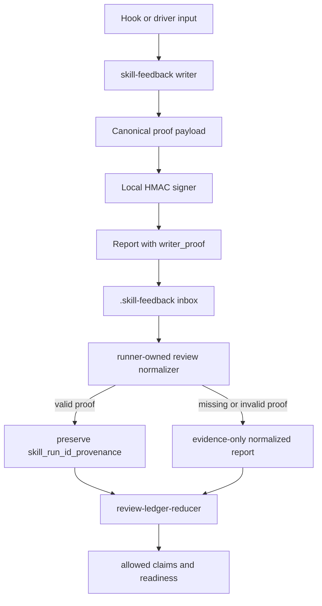
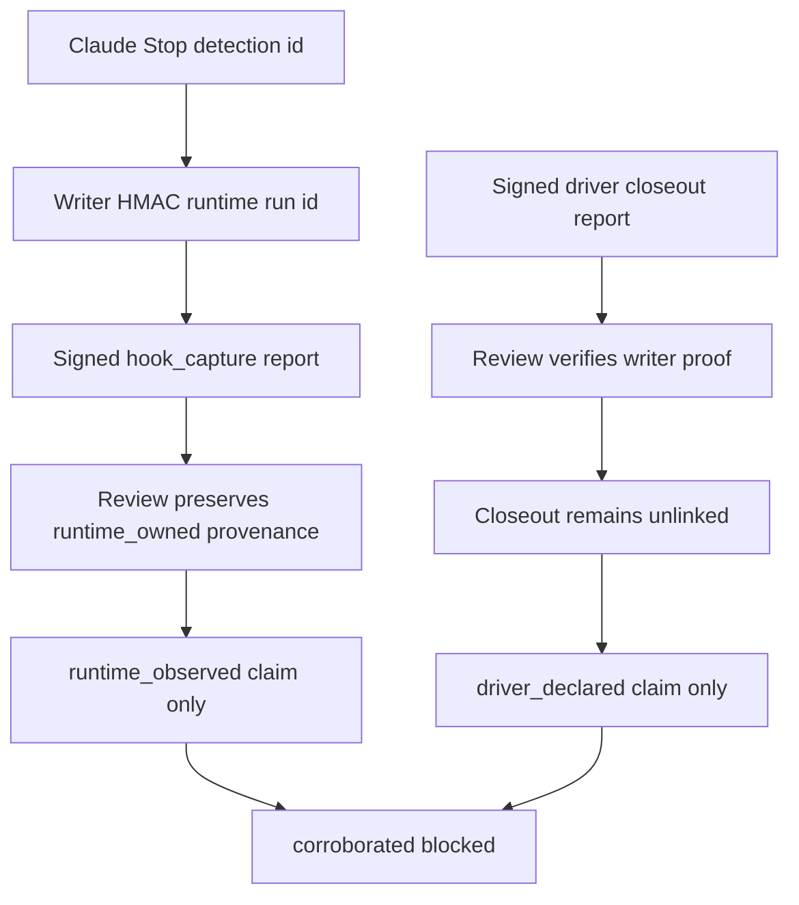

# fix: Skill-feedback writer proof for capture trust

## Summary

Add a local writer-owned proof path so `skill-feedback` can trust writer-owned fields without trusting raw inbox text. Hook capture and driver closeout reports get signed proof from the skill-feedback writer; review verifies proof before preserving trust-bearing fields that are owned by the writer.

Keep Trusted skill identity and hook-to-closeout correlation separate. Local signatures can support verified `runtime_owned` hook evidence from Claude Stop telemetry, but this plan does not implement `correlation_owned`, same-skill candidate matching, or `corroborated`. It cannot open `trusted_engine_identity`, Codex close detection, or Daily pilot readiness.

---

## Problem Frame

The current review ledger is claim-safe but stalled at the trust boundary. It preserves raw `skill_run_id` as inspectable context and strips raw `skill_run_id_provenance`, so forged inbox JSON cannot mint Trusted run proof. That was correct for merge readiness, but it also means writer-owned runtime telemetry cannot be distinguished from report-authored claims.

The immediate fix is not engine-owned Codex skill identity or hook-to-closeout correlation. Official Codex hook and skill surfaces still do not expose a first-class skill invocation span. The fix is narrower: prove that the local skill-feedback writer owned the trust-bearing fields it wrote, then let review preserve verified writer-owned provenance without trusting raw report text.

---

## Requirements

**Trust Boundary**

- R1. Add `writer_proof` to both persisted hook-capture reports and report-card closeout reports as local writer-owned proof over trust-bearing fields.
- R2. Verify `writer_proof` before review-normalized reports preserve `skill_run_id_provenance`.
- R3. Keep raw inbox `skill_run_id_provenance` evidence-only when proof is missing, invalid, copied, mismatched, or scoped to the wrong fields.
- R4. Keep all reports marked `untrusted_evidence: true`; a valid proof authenticates selected fields, not the whole report as instruction.
- R5. Keep old reports readable and reviewable, with no trusted run proof unless a valid writer proof exists.
- R6. Keep `skill_identity_provenance.trusted` as capture-source trust only; do not map it to Trusted skill identity, Trusted run proof, or `trusted_engine_identity`.
- R6a. Treat duplicate `report_id` values or duplicate `writer_proof.nonce` values as replay diagnostics; duplicate verified reports cannot preserve trusted provenance.

**Local Trust Store**

- R7. Store the local signing secret under `.skill-feedback/.trust/` with private permissions and no git exposure.
- R8. Refuse unsafe trust paths, symlinks, non-files, and permission states that could leak or substitute the signing secret.
- R9. Never print the signing secret, derived key material, signature inputs, or trust-store key file path in stdout, stderr, test snapshots, docs, or repair hints; use reason codes instead.
- R10. Initialize the private signing key on the first proof-capable write when the trust store is missing and safe to create.
- R10a. Keep purge and inbox report scanners from treating `.skill-feedback/.trust/` files as reports or deletion candidates; scanners explicitly skip the `.trust/` path prefix.
- R10b. Treat missing, lost, unreadable, corrupt, or wrong-permission trust stores as proof-unavailable during review; existing reports degrade to evidence-only.

**Runtime Proof And Correlation Deferral**

- R11. Give Claude Stop hook captures a stable purpose-separated HMAC `skill_run_id` derived from the existing detection id inside the skill-feedback writer.
- R12. Keep Codex Stop captures in the low-signal lane with no trusted skill id, no trusted run id, and no transcript or `last_assistant_message` inference.
- R13. Do not surface same-skill hook candidates in this plan; candidate diagnostics belong to the follow-up correlation plan.
- R14. Do not mark any closeout run provenance as `correlation_owned` in this plan.
- R15. Do not write, read, or consume correlation witness files in this plan.
- R16. Do not use timestamp proximity, repeated anchors, assistant text, raw report-authored ids, or exact-one same-skill matching as correlation proof.

**Review Claims**

- R17. Let `review-ledger-reducer.ts` keep deriving review units from normalized trusted run ids only.
- R18. Do not allow `corroborated` in this plan; mixed evidence sources remain unlinked even when both reports carry valid writer proof.
- R19. Keep `trusted_engine_identity` unreachable until an engine-owned skill identity source exists.
- R20. Keep renderers as consumers of reducer-owned `allowed_claims`; renderers must not infer proof validity, readiness, corroboration, or trust.
- R21. Expose proof health as review or health diagnostics without mutating inbox files.

**Command Contracts**

- R22. Add no public CLI flags for trust, signing, run id, model, usage, or proof.
- R23. Keep discovery metadata, rendered help, parser acceptance, runtime semantics, and Branch Station evidence aligned if any command contract data changes.
- R24. Keep `record` capture-owned and `closeout` driver-owned; manual public stdin or argv input cannot self-assert proof.
- R25. Enumerate every input path that can reach the signer and test that agent-authored inputs cannot set signed trust-bearing fields.

---

## High-Level Technical Design

The signer is a plain helper module, not a pattern framework. Current pressure is one local HMAC provider plus tests; a Strategy or registry would be premature until a second trust provider exists.

Correlation witnesses are out of scope for this plan. Closeout reports can be signed to prove writer-owned fields, but they do not link to hook captures, do not produce `correlation_owned`, and do not enable `corroborated`.

---

## Key Technical Decisions

- KTD1. **Local writer proof is field ownership proof, not engine identity.** HMAC proves the skill-feedback writer owned selected fields at write time; it cannot prove Codex selected or ran a skill.
- KTD2. **Keep `normalizeReport` pure and evidence-only.** The runner-owned inbox read path performs async proof verification and passes verified proof context into review normalization; raw JSON remains evidence-only anywhere the verifier is absent.
- KTD3. **Sign trust-bearing fields, not prose.** The proof payload covers the exact field set named by RD7 plus a digest of redacted report content needed to detect substitution.
- KTD4. **Use canonical JSON for the proof payload.** Tests pin field order, omitted-field handling, and tamper behavior so signatures cannot drift across writers and verifiers.
- KTD5. **Keep the key repo-local and private.** `.skill-feedback/` is already gitignored and private-write gated; the trust store belongs under that existing runtime evidence root, not in source or generated docs.
- KTD6. **Degrade instead of overclaim.** Invalid, missing, unreadable, stale, or rotated proof removes normalized `skill_run_id_provenance` and surfaces diagnostics; it does not invalidate the entire report unless the storage path itself is unsafe.
- KTD7. **Correlation stays deferred.** Exact-one same-skill hook matching, candidate diagnostics, witness files, `correlation_owned`, and `corroborated` are follow-up work.
- KTD8. **Claude and Codex stay asymmetric.** Claude Stop can supply a writer-HMAC runtime run id from its detection id; Codex Stop remains low-signal until official engine-owned skill identity appears.
- KTD9. **Reducer ownership stays intact.** Signing and normalization preserve verified `skill_run_id_provenance`; `review-ledger-reducer.ts` remains the only owner of review units, evidence tiers, allowed claims, and readiness language.
- KTD10. **No new public trust flags.** Trust metadata is writer-owned internal state. Adding flags would let agent-authored input impersonate runtime evidence.
- KTD11. **Use one persisted proof-bearing report shape.** Hook captures migrate to schema `"2"` persisted Software Learning Reports before they can carry `writer_proof`; the verifier reads raw persisted reports, not a normalizer-built projection.
- KTD12. **Replay detection is current-inbox scoped.** Byte-for-byte report copies, duplicate `writer_proof.nonce` values, and duplicate report ids found in the same review inbox are excluded from trusted provenance preservation before the reducer sees them. This plan does not add a writer-owned manifest or claim protection against copied reports imported into a fresh inbox.

---

## Resolved Design Decisions

Resolved during plan review on 2026-06-24 and 2026-06-25. Each decision names the branch, the accepted option, and the consequence.

### RD1. HMAC Algorithm And Key Size

**Accepted:** HMAC-SHA256 with a 32-byte random key.

SHA256 is standard Node `crypto`, fast, and matches the threat model (tamper-evidence for normal repo artifacts, not protection against a hostile local process). SHA512 adds signature length for no benefit. Ed25519 adds asymmetric complexity when writer and verifier share the same local trust store boundary.

### RD2. Key Generation

**Accepted:** `crypto.randomBytes(32)` — pure random, no derivation.

No seed to derive from. The key is repo-local, never transmitted. Deterministic derivation (HKDF from machine identity) would add a fragile dependency on machine state.

### RD3. Key File Format

**Accepted:** Hex-encoded text file (64 hex characters).

Raw bytes cannot be sanity-checked for truncation. Hex-encoded string lets `lstatPath` plus length check confirm 64 hex chars. Matches the existing pattern where `.skill-feedback/` files are JSON/text, not binary blobs.

### RD4. Trust Store Directory Shape

**Accepted:** `.skill-feedback/.trust/key` — single extensionless key file under a dedicated directory.

One key file is enough now. The extensionless name keeps it outside JSON report naming. The directory gives room for future trust metadata without mixing it into the key namespace. Reuses existing `mkdirPrivate` and `writePrivateFile` patterns.

### RD5. Correlation Witness Scope

**Accepted:** No witness files in this plan.

Hook-to-closeout correlation was deferred by the origin requirements. This plan ships writer proof and proof health only; witness payload design, witness lifecycle, `correlation_owned`, and `corroborated` move to a follow-up correlation plan.

### RD6. Candidate Matching

**Accepted:** No exact-one same-skill candidate matching in this plan.

Candidate matching is useful only as part of a full correlation design. Shipping it without a link primitive would invite agents to treat diagnostics as trust. The follow-up plan can decide whether candidate diagnostics belong before or alongside witness consumption.

### RD7. Signed Field Set

**Accepted:** Sign exactly these persisted report fields: `schema_version`, `evidence_source`, `capture_runtime`, `skill`, `generated_ts`, `report_id`, `writer_proof.nonce`, `skill_run_id`, `skill_run_id_provenance`, `correlation_status`, plus a content digest.

Excludes command-envelope `contract`; it stays a CLI/result identity, not persisted report data. Excludes prose and narrated fields (redacted and mutable). Excludes `untrusted_evidence` (always true, adds nothing). The content digest detects body substitution without signing prose directly.

### RD8. Content Digest Scope

**Accepted:** SHA256 of the canonical JSON of the full report minus `writer_proof` and the signed trust-bearing fields themselves.

Catches body swaps while keeping the signature payload small. The digest input is exactly the report body that the signature does not directly cover; signed fields are not duplicated inside the content digest. Canonical JSON ensures deterministic hashing.

### RD9. Canonical JSON Implementation

**Accepted:** Sorted-keys `JSON.stringify` with a stable replacer — no external dependency.

The canonical input domain is plain JSON values only. Reject `undefined`, functions, symbols, non-finite numbers, sparse arrays, and objects with custom `toJSON`; recursively sort object keys; preserve array order; and treat missing fields as distinct from `null`. The only consumer is this codebase, so a key-sorting replacer plus explicit input rejection is deterministic and testable. Pin the behavior with snapshot tests. No need for `json-canonicalize` or RFC 8785.

### RD10. Writer Proof Persisted Shape

**Accepted:** A nested object: `{ algorithm, nonce, signed_fields, content_digest, signature }` — all hex strings.

`algorithm` future-proofs rotation to SHA512 without migration. `nonce` is the single canonical random per-report proof nonce for replay detection (R6a); do not duplicate it as a top-level report field. `signed_fields` is the sorted list of field names in the payload. `content_digest` is the body hash. `signature` is the HMAC output.

### RD11. Proof Verification Module Location

**Accepted:** A pure function `verifyWriterProof(report, key): VerifyResult` in `command-contract.ts` next to `normalizeReport`.

The runner-owned inbox read path calls `verifyWriterProof` before passing verified context into normalization. `normalizeReport` itself stays pure and unchanged — it receives proof context, not crypto primitives.

### RD12. normalizeReport Proof Context Interface

**Accepted:** Add an optional `proofContext?: { verified: boolean; diagnostics?: string[] }` parameter to `normalizeReport`.

`readReviewInbox` is the injection point: it reads each raw report, loads proof verification context from the trust store when available, calls `verifyWriterProof`, then passes the resulting proof context into `normalizeReport`. When `verified: true`, normalization preserves `skill_run_id_provenance`. Without proof context or with `verified: false`, current behavior holds — provenance is evidence-only. Old callers and old reports pass no proof context and degrade cleanly (R5).

### RD13. Runtime Run Id Derivation

**Accepted:** `HMAC(key, "skill-run:" + detection_id)` — purpose-separated with a fixed prefix.

The `"skill-run:"` prefix prevents domain confusion if the key is ever used for another purpose. The detection id is already stable and deduplicated in Claude Stop. The HMAC output is the persisted `skill_run_id`; the raw detection id never appears in the report.

### RD14. Run Id Computation Boundary

**Accepted:** In `skill-feedback-runner.ts` at write time, not in the hook.

The hook passes the raw detection id as runtime telemetry. The runner's record path HMACs it before persistence. This keeps the signing key out of the hook process boundary and keeps the hook as a thin data shipper.

### RD15. Detection Id Transport

**Accepted:** Add `detection_id` as an optional field to `RecordRequest` telemetry in `skill-feedback-runtime.ts`.

`buildRecordRequest` already assembles runtime telemetry. The runner consumes `detection_id`, HMACs it, and writes the derived `skill_run_id`. The raw detection id is never persisted.

### RD16. Codex Stop Changes

**Accepted:** None. Keep Codex Stop exactly as-is — low-signal lane, no `skill_run_id`, no proof.

KTD8 says Claude and Codex stay asymmetric. R12 says Codex Stop remains low-signal. Zero code changes to `skill-feedback-codex-stop.ts` for this plan.

### RD17. Duplicate And Replay Detection Boundary

**Accepted:** In the runner-owned review read path, not at write time, using a two-pass current-inbox gate.

R6a says duplicates are replay diagnostics. Write time does not refuse a duplicate report — the inbox is append-only evidence. `readReviewInbox` first parses and verifies safe raw reports, then counts duplicate `report_id` and duplicate `writer_proof.nonce` values across the current inbox, then calls `normalizeReport` with `proofContext.verified=false` plus replay diagnostics for every duplicated member. Keeps write simple; makes replay visible in review output without adding a manifest.

### RD18. Implementation Unit Ordering

**Accepted:** U1 → U2 → U3 → U4 → U5, strictly sequential.

U1 (proof contract and verifier) is the foundation everything else imports. U2 (trust store and signing) uses U1's proof shape. U3 (runtime run id) uses U2's signer. U4 (review claims and health projection) uses all prior units. U5 (docs and stations) is the capstone. No parallelism opportunity.

### RD19. Schema Version Bump Strategy

**Accepted:** Bump `SKILL_FEEDBACK_SCHEMA_VERSION` from `"1"` to `"2"` and `SKILL_FEEDBACK_REVIEW_RESULT_SCHEMA_VERSION` from `"4"` to `"5"`.

Adding `writer_proof` to persisted reports is a shape change. Hook capture and driver closeout both write schema `"2"` persisted reports when proof-capable; schema `"1"` and v0 hook reports remain readable as evidence-only. `normalizeReport` dispatches by persisted `schema_version`: schema `"1"` stays on `normalizeV1Report`, v0 stays on `normalizeV0Report`, and schema `"2"` uses a new `normalizeV2Report` path that accepts `writer_proof` and proof context. Adding proof diagnostics to review output bumps the review result schema so consumers detect the new fields.

### RD20. Branch Station Additions

**Accepted:** Add stations for new observable command-level outcomes only — no stations for internal proof module paths.

New stations:
- `record.proof_attached` — success with proof written.
- `record.proof_unavailable` — success but key missing or unreadable, evidence-only.
- `closeout.proof_attached` — closeout success with proof written.
- `closeout.proof_unavailable` — closeout success but proof unavailable, evidence-only.
- `health.proof_diagnostics` — health surfaces proof state.

Do not add stations for internal signing failures, correlation states, witness behavior, or key rotation.

### RD21. Witness Consumption

**Accepted:** Not in this plan.

No code writes, renames, consumes, or deletes witness files in this plan. The follow-up correlation plan owns any atomic-consumption rule and its failure semantics.

### RD22. Proof Nonce Generation

**Accepted:** `crypto.randomBytes(16).toString('hex')` — 32 hex chars.

Same entropy source as the key. Avoids UUID dashes in the canonical payload. 128 bits is sufficient for per-report uniqueness and replay detection.

### RD23. Corrupted Or Wrong-Length Key File

**Accepted:** Treat as proof-unavailable, same as unreadable. Log a diagnostic. Do not auto-repair.

A truncated or corrupted hex file (e.g., 50 chars instead of 64) is distinct from missing. The user may have partially written it. Surface in `health` output with a specific reason code. Review treats existing reports as evidence-only; write paths do not auto-repair an unusable key file.

### RD24. Unknown Writer Proof Algorithm

**Accepted:** Unknown `writer_proof.algorithm` = proof-unavailable, not invalid report.

The report itself stays readable; only the proof is untrusted. This matches KTD6 (degrade instead of overclaim). A future version using SHA512 would produce reports that old code treats as evidence-only — correct behavior.

### RD25. Content Digest Includes Evidence Gaps

**Accepted:** Include `evidence_gaps` in the content digest.

Evidence gaps are derived at write time and are not agent-authored, but they are part of the report body. Tampering with gaps could hide a missing-skill or cost-unavailable signal from review. The content digest covers everything the signature does not directly sign.

### RD26. Witness Write Ordering

**Accepted:** Not in this plan.

No witness write path exists in this plan. The follow-up correlation plan must define orphan-witness behavior if it introduces witness files.

### RD27. Proof Diagnostics In Review JSON

**Accepted:** Both per-entry and top-level.

Per-entry `proof_diagnostics` array on the ledger entry tells the reader why a specific entry is evidence-only. Top-level `proof_health` summary on `ReviewResultData` reports the aggregate state: count of verified, count of evidence-only, replay detections. Renderers consume both without inferring proof validity themselves (R20).

### RD28. Key File Permissions

**Accepted:** 0o600, matching the existing `writePrivateFile` convention.

The threat model does not distinguish between 0o600 and 0o400 since both are owner-only. No special chmod step after creation. Consistency with existing inbox file permissions avoids a one-off pattern.

### RD29. Health Distinguishes Trust Store States

**Accepted:** Yes. Two distinct reason codes: `trust_store_not_initialized` and `trust_store_key_unusable`.

"No key yet" means the first proof-capable write has not happened (benign — the writer initializes the store on the next safe write). "Key exists but proof fails" means something broke (corrupt file, wrong length, permission change). Review degrades existing reports to evidence-only in both states, but the repair action differs and health should surface that.

### RD30. Integration Test Fixture Strategy

**Accepted:** Use the existing `SkillFeedbackRuntime` interface seam to inject trust store presence or absence per scenario.

Integration test fixtures create or remove `.skill-feedback/.trust/` in a temp directory before each scenario. No real filesystem trust store needed in CI. The existing catalog-driven `runCliProcess` pattern extends naturally — new stations get new scenario entries with trust store preconditions.

### RD31. Run Proof Terminology

**Accepted:** Use existing glossary terms only: `skill_run_id_provenance` for the report and normalized field, and Trusted run proof for reducer-earned linkage.

Do not introduce "Trusted run provenance" as a new term. This keeps field preservation separate from the reducer claim that reports belong to the same trusted run.

---

## Implementation Units

### U1. Writer Proof Contract And Verifier

- **Goal:** Add the `writer_proof` report shape, canonical payload builder, verifier, duplicate-proof diagnostics, and negative normalization tests.
- **Files:** `skills/skill-feedback/src/command-contract.ts`, `skills/skill-feedback/src/command-contract.test.ts`, `skills/skill-feedback/references/report-shape.md`.
- **Patterns:** Plain module if helper extraction is needed; no registry until a second proof provider exists. Add a schema `"2"` persisted report field set shared by hook capture and driver closeout. Keep v0 hook and schema `"1"` validation unchanged for compatibility; they stay evidence-only. Enumerate every input path that can reach the signer and mark which fields are writer-owned versus agent-authored.
- **Test Scenarios:** Missing proof keeps run provenance undefined; forged raw provenance stays inert; copied signature over changed payload fails; byte-for-byte duplicate proof is diagnostic-only; proof over the wrong field scope fails; canonical JSON rejects non-JSON inputs, non-finite numbers, sparse arrays, custom `toJSON`, and missing/null drift; public or agent-authored inputs cannot set signed trust-bearing fields; old v0 hook reports and schema `"1"` closeout reports remain readable.
- **Verification:** Run command-contract tests and a focused review-ledger trusted-run test slice.

### U2. Local Trust Store And Write-Path Signing

- **Goal:** Create or load the repo-local private signing key and attach proof to writer-created hook and closeout reports.
- **Files:** `skills/skill-feedback/src/skill-feedback-runner.ts`, optional `skills/skill-feedback/src/writer-proof.ts`, `skills/skill-feedback/src/skill-feedback.test.ts`.
- **Patterns:** Reuse existing `mkdirPrivate`, `writePrivateFile`, `lstatPath`, and unsafe-path repair result vocabulary. Build both hook-capture and closeout persisted reports in schema `"2"` before signing; do not sign normalized projections. Keep the key filename extensionless and make inbox/purge scans skip `.skill-feedback/.trust/` by path prefix.
- **Test Scenarios:** Key file mode is private; symlink trust path is refused; missing key is created privately on the first proof-capable write; review with a missing or unusable key degrades existing reports to evidence-only; unusable key state does not auto-repair; hook captures persist schema `"2"` reports before proof attaches; `.trust/` files are ignored by review and purge scanners; public inputs cannot set signed trust fields; stdout and stderr never expose key material or the trust-store key file path.
- **Verification:** Run writer path tests for `record`, `closeout`, and unsafe inbox/trust states.

### U3. Runtime Run Id For Claude Stop, Codex Blocked

- **Goal:** Add runtime-owned run id telemetry to Claude Stop hook captures and keep Codex Stop proof-ineligible.
- **Files:** `hooks/skill-feedback-stop.ts`, `hooks/skill-feedback-runtime.ts`, `hooks/skill-feedback-hooks.test.ts`.
- **Patterns:** Reuse existing Claude Stop detection id and dedupe path; pass detection id as runtime telemetry and let the writer HMAC it before persistence.
- **Test Scenarios:** Claude Stop emits the same HMAC run id for the same detection id; persisted run id does not expose raw detection-id material; hook capture normalizes to `runtime_owned` only with valid writer proof; Codex Stop remains `unknown-skill`, low-signal, and untrusted even with `turn_id`, `model`, or `last_assistant_message`; `hooks/skill-feedback-codex-stop.ts` stays unchanged.
- **Verification:** Run hook tests plus command-contract normalization tests.

### U4. Review Claims And Health Projection

- **Goal:** Preserve verified `skill_run_id_provenance` through normalization and expose proof health without renderer-side inference.
- **Files:** `skills/skill-feedback/src/command-contract.ts`, `skills/skill-feedback/src/review-ledger-reducer.ts`, `skills/skill-feedback/src/skill-feedback-runner.ts`, related tests.
- **Patterns:** Keep reducer-owned `review_units`, `ledger_entries`, `allowed_claims`, and `claim_readiness` as the only claim source. In `readReviewInbox`, verify raw report proof before calling `normalizeReport`; count duplicate `report_id` and `writer_proof.nonce` values across the current inbox; then pass proof context into normalization instead of moving crypto into the normalizer. Do not add candidate matching, witness reads, manifests, `correlation_owned`, or `corroborated`.
- **Test Scenarios:** Signed Claude Stop hook preserves verified `runtime_owned` provenance; signed closeout remains `driver_declared` or report-authored without a trusted link; unsigned or invalid-proof reports stay evidence-only; mixed hook and closeout evidence never reaches `corroborated`; every member of a same-inbox duplicate `report_id` or `writer_proof.nonce` set loses trusted provenance; imported copied reports are not claimed as prevented; `trusted_engine_identity` remains blocked.
- **Verification:** Run reducer tests, review rendering tests, and health projection tests.

### U5. Contract Proof, Docs, And Branch Stations

- **Goal:** Update docs and deterministic command contract proof without widening the public CLI.
- **Files:** `skills/skill-feedback/CONTEXT.md`, `skills/skill-feedback/references/report-shape.md`, `skills/skill-feedback/references/closeout-receipt.md`, `skills/skill-feedback/src/branch-station-catalog.ts`, `skills/skill-feedback/src/skill-feedback.integration.test.ts`.
- **Patterns:** Docs name owner paths and terms; code/tests own schemas, fields, parser rules, and station ids. Keep runner behavior changes in U4; U5 proves contract alignment after those changes.
- **Test Scenarios:** Discovery metadata, rendered help, parser acceptance, runtime semantics, and Branch Station evidence stay aligned; docs keep Trusted run proof separate from Trusted skill identity.
- **Verification:** Run Branch Station catalog/integration tests and YAML/frontmatter checks for changed docs.

---

## Scope Boundaries

**In Scope**

- Signed local writer proof for skill-feedback reports.
- Private repo-local trust store under `.skill-feedback/.trust/`.
- Claude Stop writer-HMAC runtime run id.
- Review/health visibility for proof state.
- Negative tests for forged raw provenance and overclaim prevention.

**Deferred**

- Engine-owned Codex skill identity.
- Native skill lifecycle hooks such as `PreSkillUse` or `PostSkillUse`.
- Cross-machine trust portability, key rotation UX, and OS keychain migration.
- Timestamp-window or fuzzy correlation.
- Exact-one same-skill candidate diagnostics.
- Driver closeout correlation gate, witness files, `correlation_owned`, and `corroborated`.
- Native skill-attributed token or cost telemetry.
- Daily pilot readiness.

**Never In This Plan**

- Inferring skill identity from assistant prose.
- Parsing Codex transcripts for skill identity.
- Using `last_assistant_message` as proof.
- Trusting raw inbox `skill_run_id_provenance`.
- Claiming `correlation_owned` or `corroborated`.
- Adding public trust or run-id flags.

---

## System-Wide Impact

- `skill-feedback review` gains its first guarded path to preserve writer-owned provenance while keeping `corroborated` and `trusted_engine_identity` blocked.
- `.skill-feedback/` becomes both evidence inbox and local trust root, so unsafe-path checks need to cover `.trust/` as well as primary and low-signal lanes.
- Hook capture, driver closeout, review, health, and Branch Station tests all become part of the trust contract.
- Future agents get stronger review output, which raises the cost of overclaim regressions; allowed claims remain the guardrail.

---

## Risks & Dependencies

- **Local attacker risk:** HMAC is tamper-evidence for normal repo artifacts, not protection against a hostile local process with key access. Mitigation: document the boundary and keep `trusted_engine_identity` blocked.
- **Key lifecycle risk:** Lost or rotated keys can make old reports evidence-only. Mitigation: degrade cleanly and keep old reports readable.
- **Deferred correlation risk:** Real hook-plus-closeout evidence remains below corroboration. Mitigation: keep this explicit in docs and plan a separate correlation design after writer proof lands.
- **Contract drift risk:** Report shape, help, discovery, Branch Stations, review JSON, and plain output can drift. Mitigation: preserve command-surface alignment tests and add branch-station rows only when behavior changes.
- **Terminology collapse risk:** Writer proof, Trusted run proof, and Trusted skill identity are adjacent but distinct. Mitigation: update `CONTEXT.md` terms and docs in U5.

---

## Acceptance Examples

- AE1. Given a raw inbox report with `skill_run_id_provenance: "runtime_owned"` and no valid `writer_proof`, review keeps `skill_run_id` visible but does not create a trusted review unit.
- AE2. Given a signed Claude Stop hook capture and a signed driver closeout for the same skill, review preserves verified hook provenance but keeps the closeout unlinked and does not allow `corroborated`.
- AE3. Given two verified hook captures for the same skill and one closeout with no explicit trusted link, review does not surface candidate matching or `correlation_owned`.
- AE4. Given a Codex Stop payload with `turn_id`, `model`, and `last_assistant_message`, capture stays low-signal and cannot contribute to `same_trusted_run`.
- AE5. Given a copied `writer_proof` attached to a modified report, normalization strips `skill_run_id_provenance` and reports proof diagnostics.
- AE6. Given old reports written before this change, review succeeds and keeps them evidence-only.
- AE7. Given mixed sources on the same anchor but different verified run ids, review may report repeated anchor and mixed sources but cannot report `corroborated`.
- AE8. Given a byte-for-byte copied signed report with the same report id or `writer_proof.nonce`, review surfaces replay diagnostics and excludes the duplicate from trusted provenance preservation.

---

## Sources / Research

- `skills/skill-feedback/docs/brainstorms/2026-06-12-skill-feedback-review-pattern-ledger-v2-requirements.md` set the original trust-first gate and deferred writer-owned hook-to-closeout correlation.
- `skills/skill-feedback/docs/plans/2026-06-13-003-fix-skill-feedback-review-merge-readiness-plan.md` made raw provenance evidence-only and deferred engine-owned identity plus writer-owned correlation.
- `skills/skill-feedback/docs/plans/2026-06-13-001-feat-skill-feedback-claim-safe-review-result-v2-plan.md` established reducer-owned `ReviewResultData`, evidence tiers, and entry-local allowed claims.
- `docs/adr/0014-skill-feedback-fires-on-harness-hooks-not-agent-recall.md` accepted harness hooks as the capture trigger while keeping Codex close detection blocked on Trusted skill identity.
- `docs/research/2026-06-13-codex-stop-hooks-skill-observability-community-signal.md` found Codex Stop support but no mature public pattern for proving Trusted skill identity.
- `skills/skill-feedback/CONTEXT.md` defines Trusted run proof, Trusted skill identity, Review unit, Correlation health, Evidence source, and Low-signal lane.
- `skills/skill-feedback/references/report-shape.md` documents that `normalizeReport` strips raw `skill_run_id_provenance` until writer-owned proof exists.
- Official Codex hooks docs document turn-scoped hook fields and Stop hooks, but not engine-owned skill identity: https://developers.openai.com/codex/hooks.
- Official Codex skills docs document explicit and implicit skill invocation, but not a skill lifecycle event stream: https://developers.openai.com/codex/skills.

---
