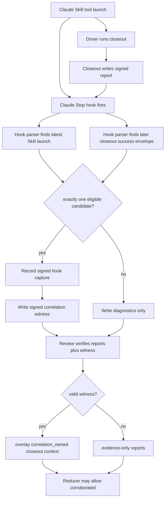
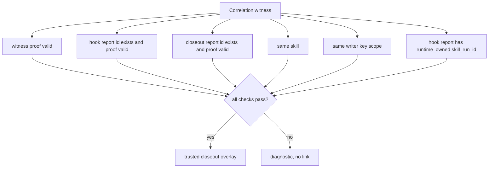

# feat: Skill-feedback correlation witnesses

## Summary

Add a writer-owned correlation witness path that can link a signed driver closeout report to the signed hook capture report for the same Claude Skill-tool run. The link is created by the Stop hook after it sees the structured Skill launch and closeout result in the same transcript, then review verifies the witness before preserving `correlation_owned` provenance or allowing `corroborated`.

Keep Codex engine-owned skill identity out of scope. Codex Stop remains low-signal until Codex exposes a first-class skill lifecycle event or another non-prose skill-run signal.

---

## Problem Frame

The merged writer-proof plan lets review trust writer-owned fields on individual reports. It still cannot prove that a driver closeout and hook capture describe the same skill run.

The unsafe shortcut is same-skill or timestamp matching. A stale closeout report for `ce-plan` could be linked to a later `ce-plan` hook capture and create a false `corroborated` claim. The follow-up needs a stronger link primitive: a signed witness created only when the hook observes both sides of the run in one structured runtime boundary.

---

## Requirements

**Correlation Trust Boundary**

- R1. Add a signed correlation witness artifact that links exactly one driver closeout report id to exactly one hook capture report id.
- R2. Create `correlation_owned` closeout provenance only from a valid witness, valid writer proof on both linked reports, matching skill, matching writer key, and matching hook-derived `skill_run_id`.
- R3. Keep raw report-authored `skill_run_id`, raw `skill_run_id_provenance`, same-skill matches, timestamps, assistant prose, and exact-one candidates evidence-only.
- R4. Preserve report immutability; correlation overlays trusted run context during review instead of rewriting existing report files.
- R5. Fail closed. Missing, invalid, ambiguous, duplicate, stale, unsafe, or unreadable witness state produces diagnostics and no trusted link.

**Claude Runtime Correlation**

- R6. Limit the first correlation path to Claude Stop, because the current hook already has a structured Skill-tool transcript boundary and writer-owned runtime run id.
- R7. Let Claude Stop finalize a witness only when the transcript contains the detected Skill launch and a later closeout success envelope in the same transcript, then the runner validates the linked closeout report skill.
- R8. Require exactly one eligible closeout after report lookup, writer-proof validation, and skill-match checks; zero or multiple candidates produce candidate diagnostics but no witness.
- R8a. Prove the closeout success envelope exists in a sanitized representative Claude transcript fixture before enabling witness finalization; absent proof keeps finalization disabled and diagnostics-only.
- R9. Keep the hook parser on structured fields only: Skill tool launch/result metadata and closeout JSON envelope fields. Do not read assistant prose as evidence.
- R10. Store no raw transcript, prompt, receipt body, command text, auth-bearing path, or private payload value in a witness.

**Codex Boundary**

- R11. Keep Codex Stop captures low-signal for correlation. `turn_id`, `model`, `last_assistant_message`, and transcript paths do not create a trusted skill-run link.
- R12. Add Codex correlation diagnostics only when they explain why correlation is blocked; do not create Codex witnesses.
- R13. Leave engine-owned Codex skill identity and native lifecycle hooks deferred.

**Review And Claims**

- R14. Let `readReviewInbox` verify correlation witnesses before normalization overlays trusted closeout run context.
- R15. Let `review-ledger-reducer.ts` remain the owner of `same_trusted_run`, `corroborated`, evidence tiers, review units, and allowed claims.
- R16. Allow `corroborated` only when a hook capture and driver closeout share a valid correlation-owned trusted review unit.
- R17. Keep `trusted_engine_identity` unreachable.
- R18. Expose witness and candidate diagnostics in review and health output without mutating inbox reports.

**Command Contracts**

- R19. Add no public CLI flags or stdin fields for witness ids, trust, signer state, run ids, or correlation provenance.
- R20. Extend the facade-backed command contracts, rendered help, parser behavior, runtime semantics, and Branch Station catalog only for observable command outcomes.
- R21. Keep purge explicit and safe; correlation witness files are scanned by a dedicated witness reader and skipped by report/purge scanners unless purge intentionally supports them.

---

## High-Level Technical Design

The witness is a separate artifact under `.skill-feedback/.correlation/`. It records only stable ids, a derived `skill_run_id`, skill id, runtime source, non-secret transcript boundary ids, proof metadata, and diagnostics. It does not copy report bodies or transcript content.

---

## Key Technical Decisions

- KTD1. **Use Stop-finalized witnesses, not pending closeout files.** Closeout happens before Stop, but pending files alone can go stale. The hook can safely finalize a witness only when it sees the Skill launch and a closeout success envelope in one structured Claude transcript, then the runner validates the linked report.
- KTD2. **Make the witness the only correlation link primitive.** Reports stay append-only evidence. Review overlays `correlation_owned` only after witness validation.
- KTD3. **Start with Claude-only correlation.** Claude Stop already has a transcript-derived Skill-tool boundary and runtime-owned run id. Codex Stop has `turn_id` but no trusted skill identity, so Codex remains blocked.
- KTD4. **Trust structured runtime fields, not prose.** The parser reads Skill tool metadata and the closeout success envelope. It does not inspect assistant text, prompts, receipt bodies, or `last_assistant_message`.
- KTD5. **Exact-one candidates are not proof by themselves.** Exact-one only allows the hook to write a witness after all other structured checks pass. Candidate diagnostics remain evidence-only when witness creation fails.
- KTD6. **Review owns final trust.** The hook may write a witness, but review revalidates the witness, both linked report proofs, and the reducer-owned claim rules before exposing `corroborated`.
- KTD7. **Use plain modules in the flat skill source.** Add small helpers beside current runner/contract files. Do not introduce a Strategy, registry, or trust-provider abstraction until a second provider exists.
- KTD8. **Bias partial failures toward underclaim.** A written closeout report without a witness, a hook report without a witness, or an orphan witness all stay readable but evidence-only for correlation.
- KTD9. **Bump review/health result schemas, not report schema by default.** Reports already carry writer proof and stable ids. Add witness schemas separately; bump persisted report schema only if implementation adds report fields.
- KTD10. **Keep public command input closed.** Witness data is internal hook/runtime state. Public closeout stdin cannot set correlation fields, witness ids, or `correlation_owned`.
- KTD11. **Gate finalization on a representative transcript fixture.** Synthetic parser tests are not enough to prove the closeout CLI envelope is visible to Claude Stop. U2 starts by adding a sanitized fixture from the real closeout-bearing transcript shape; U3 stays diagnostics-only if that shape is absent.

---

## Implementation Units

### U1. Correlation Witness Contract

- **Goal:** Define the witness artifact shape, proof payload, validation result, diagnostics, and dedicated safe path rules.
- **Files:** `skills/skill-feedback/src/command-contract.ts`, `skills/skill-feedback/src/command-contract.test.ts`, `skills/skill-feedback/references/report-shape.md`, `skills/skill-feedback/CONTEXT.md`.
- **Approach:** Add a `CorrelationWitness` type and verifier next to writer proof types. Sign stable fields only: witness schema, witness id, skill, runtime source, hook report id, closeout report id, derived `skill_run_id`, creation timestamp, and proof nonce. Keep witness proof separate from report `writer_proof`.
- **Test Scenarios:** Valid witness verifies; changed hook id fails; changed closeout id fails; changed skill fails; missing linked report id fails during review validation; unknown witness schema degrades; duplicate witness id is diagnostic-only; unsafe `.correlation/` path is skipped.
- **Verification:** Contract tests cover canonical payload stability, proof tampering, unknown schema handling, and unsafe path diagnostics.

### U2. Claude Transcript Correlation Candidate Parser

- **Goal:** Extend Claude Stop parsing to find a same-transcript closeout success envelope after the detected Skill launch.
- **Files:** `hooks/skill-feedback-stop.ts`, `hooks/skill-feedback-hooks.test.ts`, `hooks/fixtures/skill-feedback/*.jsonl`.
- **Approach:** Start with a sanitized representative fixture that proves Claude Stop can see the closeout CLI success envelope. Build on the existing structured transcript parser only after that fixture exists. Track the detected Skill launch boundary and collect later tool-result payloads that parse as `skill-feedback.closeout` success envelopes with `data.report_id`, `data.written_path`, and `data.proof_status`. Return candidates beside the existing detection; do not persist transcript content.
- **Test Scenarios:** Representative closeout-bearing fixture parses; absent envelope shape keeps finalization disabled; one closeout envelope after the Skill launch becomes a candidate; closeout before the launch is ignored; two closeout envelopes after the launch are passed as ambiguous candidates; envelope payloads missing required fields are ignored; malformed JSON envelope is diagnostic-only; sentinel transcript text never appears in outputs or witness fields.
- **Verification:** Hook tests prove ordering, exact-one behavior, no prose leakage, and backward-compatible detection when no closeout exists.

### U3. Stop-Hook Witness Finalization

- **Goal:** Write a signed witness after Claude Stop records the hook capture and identifies exactly one eligible closeout candidate.
- **Files:** `hooks/skill-feedback-stop.ts`, `hooks/skill-feedback-runtime.ts`, `skills/skill-feedback/src/skill-feedback-runner.ts`, `skills/skill-feedback/src/skill-feedback.test.ts`.
- **Approach:** Parse the `record` result envelope to get the hook report id and derived `skill_run_id`. Pass internal-only correlation candidate data to a runner function that reads the closeout report, validates writer proof, checks skill/runtime compatibility, and writes one witness under `.skill-feedback/.correlation/`.
- **Test Scenarios:** Valid hook plus one valid closeout writes one witness; witness write failure leaves both reports evidence-only; invalid closeout proof blocks witness; hook record failure blocks witness; duplicate candidate blocks witness; candidate with mismatched skill blocks witness; public `record` stdin cannot supply candidate data.
- **Verification:** Runner tests cover report lookup, proof checks, write ordering, rollback/no-rollback behavior, and internal telemetry boundaries.

### U4. Review Overlay And Reducer Promotion

- **Goal:** Let review validate witnesses, overlay trusted closeout run context, and allow reducer-owned `corroborated` only for a valid linked hook/closeout unit.
- **Files:** `skills/skill-feedback/src/skill-feedback-runner.ts`, `skills/skill-feedback/src/review-ledger-reducer.ts`, `skills/skill-feedback/src/skill-feedback.test.ts`, `skills/skill-feedback/src/review-ledger-reducer.test.ts`.
- **Approach:** Add a dedicated witness scan before normalization. Build a verified-correlation map keyed by closeout report id. Pass verified overlay context into `normalizeReport` so the closeout enters the reducer with `skill_run_id_provenance: "correlation_owned"`. Promote `corroborated` only when the reducer sees both `hook_capture` and `driver_closeout` in the same trusted review unit.
- **Test Scenarios:** Valid witness produces `same_trusted_run` and `corroborated`; same skill without witness stays mixed evidence only; invalid witness strips closeout trusted provenance; duplicate witness for one closeout blocks promotion; orphan witness is diagnostic-only; Codex Stop plus closeout never promotes; `trusted_engine_identity` remains absent.
- **Verification:** Review JSON and plain output tests show claim readiness, allowed claims, and diagnostics without renderer inference.

### U5. Health, Purge, And Branch Station Coverage

- **Goal:** Surface correlation health and prove command-surface alignment without broadening public CLI input.
- **Files:** `skills/skill-feedback/src/command-contract.ts`, `skills/skill-feedback/src/skill-feedback-runner.ts`, `skills/skill-feedback/src/branch-station-catalog.ts`, `skills/skill-feedback/src/skill-feedback.integration.test.ts`.
- **Approach:** Add review/health diagnostics for verified witnesses, blocked candidates, orphan witnesses, duplicate witnesses, and Codex correlation-blocked state. Add Branch Station ids only for observable outcomes such as `record.correlation_witness_attached`, `record.correlation_witness_blocked`, and `health.correlation_witness_diagnostics` if those outcomes are returned by command envelopes.
- **Test Scenarios:** Health reports verified/blocked/orphan counts; purge preview ignores `.correlation/` unless an explicit purge lane is added; help/discovery/parser/runtime semantics stay aligned; station catalog rows have process-boundary tests.
- **Verification:** Run Branch Station catalog/integration tests plus targeted health and purge tests.

### U6. Skill Docs And Closeout Guidance

- **Goal:** Update skill-facing docs so future agents understand the new trust boundary and closeout timing.
- **Files:** `skills/skill-feedback/SKILL.md`, `skills/skill-feedback/CONTEXT.md`, `skills/skill-feedback/references/closeout-receipt.md`, `skills/skill-feedback/references/report-shape.md`.
- **Approach:** Keep docs thin and owner-linked. Say driver closeout remains evidence, Stop hook may add a separate witness later, and review decides correlation. Do not copy schemas or field lists that belong in `command-contract.ts`.
- **Test Scenarios:** YAML frontmatter parses; docs contain no public witness/trust input instructions; closeout receipt docs still forbid trust, proof, and correlation fields in stdin.
- **Verification:** Run doc parse checks and grep for banned public trust-field instructions.

---

## Scope Boundaries

**In Scope**

- Claude Stop correlation witnesses for structured Skill-tool runs.
- Witness verification and review overlay for `correlation_owned`.
- Reducer-owned `corroborated` for valid linked hook/closeout units.
- Candidate, witness, and correlation health diagnostics.
- Command-surface alignment proof for changed command envelopes.

**Deferred**

- Engine-owned Codex skill identity.
- Native Codex skill lifecycle hooks such as `PreSkillUse` or `PostSkillUse`.
- Codex correlation witnesses.
- Timestamp-window, fuzzy, or assistant-prose correlation.
- Cross-machine trust portability, key rotation UX, and keychain migration.
- Native skill-attributed token or cost telemetry.
- Daily pilot readiness.

**Never In This Plan**

- Trusting raw inbox `skill_run_id_provenance`.
- Letting closeout stdin set trust, proof, witness, or correlation fields.
- Parsing Codex transcripts for skill identity.
- Using `last_assistant_message` as skill evidence.
- Treating exact-one same-skill candidates as proof.
- Rewriting signed report files to add correlation.

---

## System-Wide Impact

- Hook capture becomes a two-step writer: report first, optional witness second.
- Review reads one more private artifact family under `.skill-feedback/.correlation/`.
- Reducer claims become reachable for `corroborated`, so tests need negative coverage for every false-link path.
- Plain review and health output gain correlation diagnostics; renderers still consume reducer-owned claims.
- Branch Station proof expands only if command envelopes expose new record/health outcomes.

---

## Risks & Dependencies

- **Transcript-shape risk:** Claude transcript structure could change. Mitigation: keep parser narrow, fixture-backed, and fail closed to diagnostics.
- **Closeout-envelope availability risk:** Claude Stop may not expose shell stdout as a parseable success envelope. Mitigation: gate U3 on the representative fixture from U2 and keep witness finalization disabled when the shape is absent.
- **False-link risk:** Same-skill or stale closeout evidence can overclaim. Mitigation: require same-transcript ordering, exact-one eligible closeout, valid report proofs, and review revalidation.
- **Partial-write risk:** Hook report can write while witness write fails. Mitigation: reports remain evidence-only for correlation and health surfaces blocked witness state.
- **Security/privacy risk:** Transcript parsing can accidentally persist sensitive text. Mitigation: persist ids and envelope fields only; tests use sentinels to prove content does not leak.
- **Schema drift risk:** Witness schema, review JSON, health JSON, help, and Branch Stations can diverge. Mitigation: keep schemas in `command-contract.ts` and run command-surface alignment checks.
- **Codex expectation risk:** Codex has `turn_id`, but not skill identity. Mitigation: document Codex as blocked and keep `trusted_engine_identity` absent.

---

## Acceptance Examples

- AE1. Given a signed Claude hook capture and one later closeout success envelope whose linked signed report matches the same Skill launch, Stop writes a correlation witness and review can report `same_trusted_run` plus `corroborated`.
- AE2. Given the same hook capture and closeout reports without a valid witness, review reports mixed evidence only and does not surface `correlation_owned`.
- AE3. Given two eligible signed closeout reports for the same Skill launch, Stop writes no witness and health reports an ambiguous candidate diagnostic.
- AE4. Given a closeout report for the same skill from an earlier turn, Stop writes no witness unless the same transcript contains the later closeout success envelope.
- AE5. Given a valid witness but a tampered closeout report, review strips the closeout trusted overlay and reports witness validation diagnostics.
- AE6. Given a Codex Stop capture with `turn_id`, `model`, transcript path, and `last_assistant_message`, review keeps the capture low-signal and never creates `correlation_owned`.
- AE7. Given a public closeout receipt containing witness or provenance fields, parsing rejects or ignores the fields according to the command contract and no witness is created.
- AE8. Given an orphan witness whose linked report is missing, review remains successful, reports diagnostics, and does not promote any claim.

---

## Sources / Research

- `skills/skill-feedback/docs/plans/2026-06-24-001-fix-skill-feedback-capture-trust-run-correlation-plan.md` shipped writer proof and deferred correlation witnesses, witness lifecycle, candidate diagnostics, `correlation_owned`, and `corroborated`.
- `skills/skill-feedback/docs/brainstorms/2026-06-12-skill-feedback-review-pattern-ledger-v2-requirements.md` set the trust-first gate and separated hook-to-closeout correlation from engine-owned skill identity.
- `skills/skill-feedback/docs/plans/2026-06-13-003-fix-skill-feedback-review-merge-readiness-plan.md` made raw provenance evidence-only and reserved trusted links for writer-owned correlation sources.
- `skills/skill-feedback/docs/plans/2026-06-13-001-feat-skill-feedback-claim-safe-review-result-v2-plan.md` established reducer-owned review units, evidence tiers, allowed claims, and claim readiness.
- `docs/adr/0014-skill-feedback-fires-on-harness-hooks-not-agent-recall.md` accepted harness Stop hooks as capture triggers and rejected driver recall as proof.
- `docs/research/2026-06-13-codex-stop-hooks-skill-observability-community-signal.md` found no mature public Codex skill-identity signal.
- `skills/skill-feedback/CONTEXT.md` defines Trusted run proof, Trusted skill identity, Correlation health, Review unit, Evidence source, and Low-signal lane.
- `skills/skill-feedback/references/report-shape.md` assigns report shape and normalization ownership to `skills/skill-feedback/src/command-contract.ts`.
- `skills/skill-feedback/references/closeout-receipt.md` keeps driver closeout receipt input evidence-only and forbids trust, proof, or correlation fields in stdin.
- `hooks/skill-feedback-stop.ts` already parses Claude Skill-tool transcript structure and derives a detection id for writer-owned runtime run ids.
- `hooks/skill-feedback-codex-stop.ts` records Codex Stop as `unknown-skill` and low-signal.
- Official Codex hooks docs list Stop fields such as `turn_id` but no skill lifecycle event stream: https://developers.openai.com/codex/hooks.
- Official Codex skills docs describe skill invocation and progressive disclosure but no skill run identity event: https://developers.openai.com/codex/skills.
