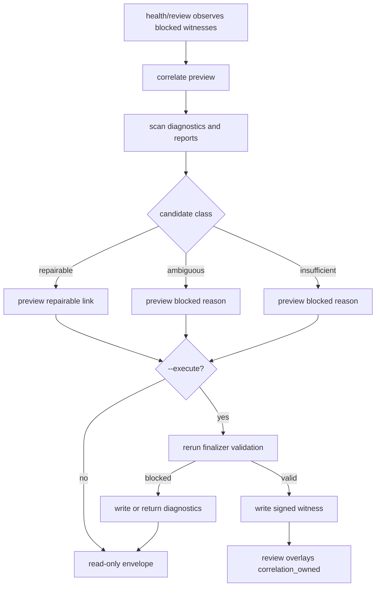
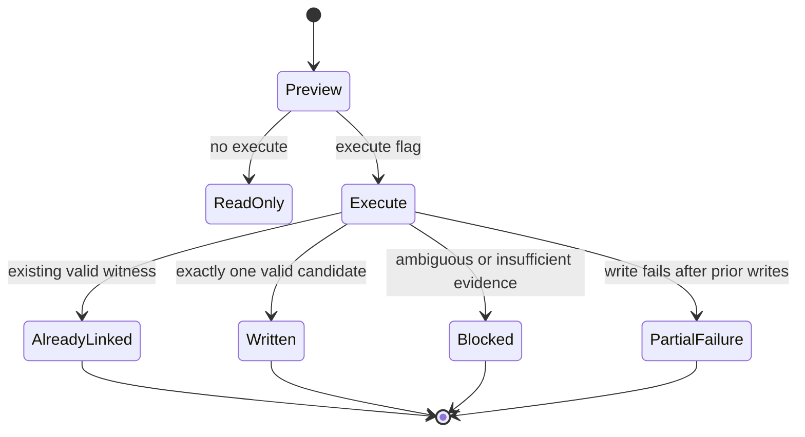

# Skill-feedback Correlation Backfill Repair - Plan

## Goal Capsule

- **Objective:** Add a preview-first repair path for unlinked skill-feedback correlation evidence without weakening witness trust.
- **Authority:** Existing writer-proof and correlation-witness contracts outrank historical repair convenience.
- **Execution profile:** Code implementation in `skills/skill-feedback` and hook tests, using the existing facade-backed CLI surface.
- **Stop conditions:** Stop if the repair path needs timestamp-only, same-skill-only, raw report-authored run ids, assistant prose, or public trust input to write a witness.
- **Tail ownership:** `skill-feedback` owns command contracts, private witness artifacts, review/health diagnostics, and docs; `review-ledger-reducer.ts` remains claim owner.

---

## Product Contract

### Summary

Plan a guarded follow-up to the correlation witness work: inspect blocked witness diagnostics, preview which links are repairable, and write missing witnesses only when existing durable evidence already satisfies the same validation rules as live Stop finalization.

### Problem Frame

Live `skill-feedback health` now reports a populated inbox with all primary reports unlinked and blocked correlation witnesses whose diagnostic is `correlation_candidate_missing`.
Inspection found three Claude Stop hook reports with runtime-owned run ids and sparse diagnostic artifacts.
Two same-skill closeouts exist nearby, but the current artifacts do not prove they were same-run candidates.

The next repair should make this state actionable without creating false `corroborated` claims.
The product value is a command that separates repairable witness gaps from unrecoverable historical gaps, then writes witnesses only for the repairable set.

### Requirements

**Safety and Trust**

- R1. Preserve the existing correlation witness as the only path to `correlation_owned` closeout provenance.
- R2. Keep historical sparse diagnostics evidence-only when they do not name or prove an eligible closeout candidate.
- R3. Reject timestamp-only, same-skill-only, same-git-sha-only, repeated-anchor, assistant-prose, and raw report-authored run-id matching as witness proof.
- R4. Keep existing reports append-only; repair writes only private witness or repair diagnostic artifacts under `.skill-feedback/.correlation/`.
- R5. Reuse current writer-proof, hook-report, closeout-report, skill-match, runtime, duplicate, unsafe-path, and Gitignore gate validation before any repair write.
- R5a. Require any durable repair candidate source to be writer-owned or finalizer-authenticated and to prove the same runtime boundary for hook report id, closeout report id, written path, proof status, skill, and hook run id.
- R6. Keep Codex Stop correlation blocked until engine-owned skill identity exists.

**Backfill Preview**

- R7. Add a read-first correlation repair preview that classifies each blocked hook diagnostic as repairable, ambiguous, invalid, already linked, or insufficient evidence.
- R8. Emit machine-readable repair candidates, blocked reasons, counts, and next actions without mutating inbox files; all-insufficient preview results emit terminal `no_repair_available` instead of an execute action.
- R9. Keep preview output bounded and token-aware for large inboxes.
- R10. Include enough report refs for agents to inspect evidence through existing safe report-id resolution, without exposing filenames as authority.

**Gated Repair**

- R11. Add an explicit execute mode that writes witnesses only for preview candidates that still validate at write time.
- R12. Require execute to recompute candidates from current inbox state instead of trusting stale preview output.
- R13. Treat partial write failure as a structured repair-state error with changed-state context.
- R14. Make repeat execution idempotent: existing valid witnesses count as already linked, not duplicate writes.
- R15. Never accept witness ids, report ids, run ids, proof fields, trust fields, or correlation provenance from public stdin or argv.

**Review and Health**

- R16. Surface the repair preview recommendation from health when blocked witness diagnostics exist as a diagnostic step, without implying execute until preview reports repairable candidates.
- R17. Keep `review` and `health` mutation-free.
- R18. Keep renderer language derived from command data and reducer-owned claims, not from inferred repair confidence.

**Command Contract**

- R19. Add command discovery metadata, rendered help, parser acceptance, runtime semantics, and Branch Station coverage for the repair command.
- R20. Preserve stdout/stderr separation, result contracts, continuation ids, and side-effect stance through the facade.

### Acceptance Examples

- AE1. Given a blocked hook diagnostic with no durable closeout candidate evidence, when repair preview runs, then it reports `insufficient_evidence` and writes nothing.
- AE2. Given one hook report and one durable candidate closeout that pass existing finalizer validation, when repair preview runs, then it reports one repairable candidate and writes nothing.
- AE3. Given the AE2 state, when repair execute runs, then it writes one signed witness and later review reports one linked trusted review unit.
- AE4. Given two eligible closeouts for one hook, when repair preview or execute runs, then it reports ambiguity and writes no witness.
- AE5. Given an existing valid witness for the pair, when repair execute runs, then it reports already linked and writes no duplicate witness.
- AE6. Given an unsafe `.correlation/` path, when repair preview or execute runs, then it fails closed with repair-state diagnostics and no witness write.

### Scope Boundaries

#### In Scope

- Public facade-backed `correlate` command with preview default and explicit execute.
- Internal candidate scanner for existing correlation diagnostics and safe inbox reports.
- Reuse of current correlation finalizer validation and witness writer.
- Health output additions that point agents at correlate preview; review stays mutation-free and reflects validated witnesses after execute.
- Tests for command contract, runner behavior, Branch Station catalog, process integration, and docs.

#### Deferred to Follow-Up Work

- Richer future diagnostic artifacts that persist rejected candidate report ids.
- Manual human attestation witnesses.
- Temp-file garbage collection for interrupted repair writes.
- Purge support for correlation diagnostics or witnesses.
- Codex correlation witnesses.

#### Outside This Product's Identity

- Trusting timestamps, assistant prose, or same-skill proximity as correlation proof.
- Rewriting signed Software Learning Reports to add links.
- Letting public command input mint trust-bearing correlation fields.

---

## Planning Contract

### Key Technical Decisions

- KTD1. **Add `correlate` as the repair command.** `review` and `health` stay read-only; `purge` stays retention-only; a separate facade command gives side effects, help, and Branch Station rows a clear owner.
- KTD2. **Preview is the default mode.** The command writes only with `--execute`, matching the existing purge safety posture for private inbox mutations.
- KTD3. **Recompute on execute.** Preview output is evidence for humans and agents, not an execution token; execute reads current inbox state and reruns validation.
- KTD4. **Reuse witness validation instead of inventing repair heuristics.** A repairable candidate must satisfy current hook, closeout, proof, path, skill, and duplicate checks before write.
- KTD5. **Treat sparse historical diagnostics as mostly unrecoverable.** A diagnostic with only `hook_report_id` and `correlation_candidate_missing` cannot prove which later closeout was same-run.
- KTD6. **Keep the candidate scanner plain.** Pressure gate result: one scanner and one writer path exist; no second adapter is named, so a Strategy or registry would add weight without leverage.
- KTD7. **Keep command input closed.** Public argv can select preview, execute, plain output, and repo target only; it cannot pass report ids or proof fields.
- KTD8. **Expose repairability, not confidence prose.** Result data carries stable counts and reason ids; plain output summarizes them without upgrading claims.
- KTD9. **Add a dedicated result contract.** `skill-feedback.correlate` gets its own schema version because repair preview/write semantics differ from review, health, and purge.

### High-Level Technical Design

### CLI Design Brief

- **Lane:** Facade-backed CLI.
- **Name:** `skill-feedback correlate`.
- **Purpose:** Preview or repair missing correlation witnesses from existing private inbox evidence.
- **Users:** Agents, scripts, and humans maintaining the skill-feedback inbox.
- **Usage:** `correlate [--plain] [--repo <path>] [--execute]`.
- **I/O contract:** JSON envelope by default; `--plain` renders compact human status; diagnostics and usage errors go to stderr through existing facade helpers.
- **Side effects:** Preview is read-only. Execute writes private witness or diagnostic artifacts only under `.skill-feedback/.correlation/`.
- **Exit codes:** `0` for successful preview or completed execute; `1` for repair-state/runtime failure; `2` for usage errors.
- **Safety gates:** No report-id arguments; no stdin; no execute token from preview; execute recomputes and validates.
- **Owners:** Contract and model in `skills/skill-feedback/src/command-contract.ts`; engine and CLI in `skills/skill-feedback/src/skill-feedback-runner.ts`; discovery in facade contract projection; tests in `skills/skill-feedback/src/skill-feedback.test.ts`, `skills/skill-feedback/src/command-contract.test.ts`, and `skills/skill-feedback/src/skill-feedback.integration.test.ts`; station catalog in `skills/skill-feedback/src/branch-station-catalog.ts`.

### Command Surface Alignment Proof

- Discovery metadata includes `correlate`, output modes, side-effect stance, result contract, and continuation ids.
- Rendered help advertises only supported flags and does not expose trust-bearing inputs.
- Parser tests accept preview, plain, repo override, and execute combinations.
- Runtime tests prove preview read-only behavior, execute writes, idempotency, and failure envelopes.
- Branch Station catalog and catalog-driven integration rows cover preview, execute, already-linked, ambiguous, insufficient-evidence, unsafe-inbox, and invalid-usage branches.

### System-Wide Impact

- **Inbox trust model:** Strengthens private correlation repair without changing signed report payloads or reducer claim ownership.
- **CLI surface:** Adds one public facade command; command discovery, help, parser acceptance, runtime semantics, and Branch Station rows become the drift checks.
- **Review semantics:** `review` gains no new mutation path; it only benefits after execute creates a valid witness that existing overlay logic can read.
- **Health semantics:** `health` gains a sharper next action when blocked witnesses exist; it does not classify repairability itself.
- **Hook semantics:** Stop hooks stay unchanged unless implementation discovers a reusable helper should be extracted; live finalization remains the source contract.
- **Privacy posture:** Public output exposes report ids, reason ids, and counts only; full private report bodies stay behind existing safe file resolution.

### Risks & Dependencies

| Risk | Mitigation |
|---|---|
| False witness from weak historical evidence | Keep sparse diagnostics as `insufficient_evidence`; require existing validation before write. |
| Preview and execute drift | Recompute on execute; treat preview as advisory output only. |
| CLI contract drift | Add facade metadata, rendered help, parser, runtime, and Branch Station tests in the first unit. |
| Private-path leakage | Emit report refs and reason ids, not filesystem paths, in public result bodies. |
| Partial write ambiguity | Return changed-state context with written, blocked, and failed counts; make rerun idempotent. |
| Hook and repair paths diverge | Reuse `finalizeSkillFeedbackCorrelationWitness` or extract shared validation helpers instead of duplicating trust logic. |

---

## Implementation Units

### U1. Correlation Repair Result Contract

- **Goal:** Define the `correlate` result vocabulary, candidate classes, reason ids, help metadata, and validation rules.
- **Requirements:** R7, R8, R9, R10, R19, R20.
- **Dependencies:** None.
- **Files:** `skills/skill-feedback/src/command-contract.ts`, `skills/skill-feedback/src/command-contract.test.ts`, `skills/skill-feedback/src/branch-station-catalog.ts`, `skills/skill-feedback/src/skill-feedback.integration.test.ts`.
- **Approach:** Add a dedicated correlate contract and typed result data for preview and execute summaries. Keep repair candidate refs report-id based. Add Station ids for every observable branch before wiring behavior.
- **Patterns to follow:** Existing `health`, `review`, and `purge` result contracts; existing Branch Station catalog rows for purge preview/execute.
- **Test scenarios:**
  - Help renders `correlate` usage with `--plain`, `--repo`, and `--execute`.
  - Contract validation rejects public trust-bearing fields.
  - Discovery projection includes correlate metadata and side-effect stance.
  - Branch Station catalog validates against live command discovery.
- **Verification:** Contract tests and catalog tests prove the command surface exists before runner behavior uses it.

### U2. Repair Candidate Scanner

- **Goal:** Classify blocked correlation diagnostics and report pairs without writing files.
- **Requirements:** R1, R2, R3, R5, R5a, R6, R7, R8, R9, R10.
- **Dependencies:** U1.
- **Files:** `skills/skill-feedback/src/skill-feedback-runner.ts`, `skills/skill-feedback/src/skill-feedback.test.ts`.
- **Approach:** Build a scanner that reads safe inbox reports and `.correlation/diagnostic_*.json` artifacts, indexes verified hook and closeout reports, checks existing witnesses, and returns candidate classes. Treat sparse missing-candidate diagnostics as insufficient evidence unless a durable candidate source names exactly one closeout, is writer-owned or finalizer-authenticated, proves the same runtime boundary, and passes current validation.
- **Execution note:** Add characterization tests around the current sparse diagnostic state before adding new classes.
- **Patterns to follow:** `scanSafeInboxJsonFiles`, `readCorrelationWitnesses`, `selectEligibleCorrelationCandidate`, and purge candidate scanning.
- **Test scenarios:**
  - AE1. Sparse missing-candidate diagnostic returns insufficient evidence.
  - Existing valid witness returns already linked.
  - Missing hook report returns invalid hook reference.
  - Hook report without verified writer proof returns blocked hook proof.
  - Valid hook plus no closeout evidence returns insufficient evidence.
  - Candidate source that names a closeout but lacks writer-owned or finalizer-authenticated same-boundary proof returns insufficient evidence.
  - Candidate source with mismatched hook report id, closeout report id, written path, proof status, skill, or hook run id returns insufficient evidence.
  - Two eligible closeouts return ambiguous and no repairable candidate.
  - Codex Stop hook evidence returns blocked runtime.
  - Unsafe `.correlation/` directory fails closed.
- **Verification:** Scanner tests classify every reason id without creating witness files.

### U3. Correlate CLI Preview

- **Goal:** Expose scanner output through the public facade command in read-only mode.
- **Requirements:** R7, R8, R9, R10, R15, R17, R19, R20.
- **Dependencies:** U1, U2.
- **Files:** `skills/skill-feedback/src/skill-feedback-runner.ts`, `skills/skill-feedback/src/skill-feedback.test.ts`, `skills/skill-feedback/src/skill-feedback.integration.test.ts`.
- **Approach:** Wire `correlate` into the CLI handler with the same read-target resolver as review and health. Default to JSON preview; add plain rendering for compact status. Result actions should point to execute only when repairable candidates exist.
- **Patterns to follow:** `runReadCommandCli`, `parseReadOnlyArgs`, `renderSkillFeedbackHelp`, and plain health/review renderers.
- **Test scenarios:**
  - Preview exits `0`, writes no files, and reports candidate counts.
  - All-insufficient preview exits `0`, writes no files, emits terminal `no_repair_available`, and offers no execute action.
  - `--plain` renders repairable, blocked, already-linked, and insufficient counts.
  - `--repo <path>` resolves the target repo and does not fall back silently on failure.
  - Invalid flags return usage error with correlate contract metadata.
  - Large candidate sets are summarized without dumping every report body.
- **Verification:** Public argv tests and process integration prove stdout/stderr separation and read-only behavior.

### U4. Execute Repair Writer

- **Goal:** Add explicit execute mode that writes missing witnesses for currently valid repair candidates.
- **Requirements:** R4, R5, R5a, R11, R12, R13, R14, R15, R19, R20.
- **Dependencies:** U1, U2, U3.
- **Files:** `skills/skill-feedback/src/skill-feedback-runner.ts`, `skills/skill-feedback/src/skill-feedback.test.ts`, `skills/skill-feedback/src/skill-feedback.integration.test.ts`.
- **Approach:** Recompute scanner output, call the existing witness finalizer only for repairable candidates, and summarize written, already-linked, blocked, and failed counts. Before any write, recheck candidate source authenticity, same-boundary proof, unsafe paths, and the Gitignore gate. Keep partial write errors structured and include changed-state data without dumping private payloads.
- **Patterns to follow:** `finalizeSkillFeedbackCorrelationWitness`, `blockCorrelationWitnessWithDiagnostic`, purge execute handling, and existing writer-proof failure envelopes.
- **Test scenarios:**
  - AE3. Execute writes one witness for one valid durable candidate and later review links the unit.
  - AE4. Ambiguous candidates block without writes.
  - AE5. Existing valid witness is idempotent and not duplicated.
  - A write failure after one successful witness returns partial changed-state context.
  - Execute refuses unsafe inbox or witness directory before writing.
  - Execute refuses when `.skill-feedback/` fails the Gitignore gate before writing witnesses or diagnostics.
  - Execute refuses a candidate source that fails source-authenticity or same-boundary checks before writing.
  - Same preview result becoming stale before execute is recomputed and blocked.
- **Verification:** Runtime and process tests prove execute semantics and idempotency through the public command.

### U5. Review, Health, And Docs

- **Goal:** Point agents from health diagnostics to the repair command and update skill-facing docs while keeping review a passive witness consumer.
- **Requirements:** R16, R17, R18, R19, R20.
- **Dependencies:** U1, U3, U4.
- **Files:** `skills/skill-feedback/src/skill-feedback-runner.ts`, `skills/skill-feedback/src/skill-feedback.test.ts`, `skills/skill-feedback/SKILL.md`, `skills/skill-feedback/CONTEXT.md`, `skills/skill-feedback/references/report-shape.md`, `skills/skill-feedback/references/closeout-receipt.md`.
- **Approach:** Add health next-action routing for blocked witness diagnostics to run correlate preview. Keep review/health mutation-free. Update docs to name correlate as a repair workflow, not a closeout or review side effect.
- **Patterns to follow:** Existing `HEALTH_NEXT_ACTION_RULES`, `correlationWitnessHealth`, and skill docs that keep exact schemas in code.
- **Test scenarios:**
  - Health with blocked missing-candidate diagnostics recommends correlate preview.
  - Health frames correlate preview as a diagnostic step; all-insufficient preview results give agents a terminal no-repair next action.
  - Review and health still write no files.
  - Docs forbid public closeout stdin from setting witness, proof, or correlation fields.
  - YAML frontmatter parses after skill doc edits.
- **Verification:** Runner tests, docs checks, typecheck, and package tests pass.

---

## Verification Contract

| Gate | Scope | Done signal |
|---|---|---|
| `bun --filter skill-feedback-scripts test` | Contract, runner, hook-facing behavior, integration rows | All correlate preview/execute, health routing, and Branch Station tests pass. |
| `bun --filter skill-feedback-scripts typecheck` | TypeScript contracts | No type errors from new result shapes or command handlers. |
| `bun run check:workspace-facade` | Facade and workspace invariants | Command discovery, help, parser, result contract, and Station Map invariants stay aligned. |
| Skill docs parse check | `skills/skill-feedback/SKILL.md` | YAML frontmatter parses and owner paths resolve. |
| Manual smoke | Private temp repo inbox | Preview writes nothing; all-insufficient preview emits terminal `no_repair_available`; execute writes only allowed `.skill-feedback/.correlation/` witness or diagnostic artifacts after Gitignore gate validation; review links only validated witnesses. |

---

## Definition of Done

- `skill-feedback correlate` is discoverable in help and command discovery.
- Preview mode is read-only and classifies repairability with stable reason ids.
- Execute mode writes witnesses only after recomputing and revalidating current evidence.
- Sparse historical diagnostics remain blocked as insufficient evidence unless a durable candidate source exists.
- Review and health remain mutation-free; health routes blocked witness states to correlate preview, and review reflects validated witnesses after execute.
- Branch Station catalog and integration evidence cover the new public command branches.
- Docs explain the repair workflow without copying schemas or allowing public trust input.
- No abandoned prototype code, temp fixtures, or private inbox artifacts remain in the source diff.

---

## Sources & Research

- Existing witness plan: `skills/skill-feedback/docs/plans/2026-06-25-001-feat-skill-feedback-correlation-witnesses-plan.md`.
- Writer proof plan: `skills/skill-feedback/docs/plans/2026-06-24-001-fix-skill-feedback-capture-trust-run-correlation-plan.md`.
- Skill vocabulary: `skills/skill-feedback/CONTEXT.md`.
- Report shape reference: `skills/skill-feedback/references/report-shape.md`.
- Command contract owner: `skills/skill-feedback/src/command-contract.ts`.
- Runner owner: `skills/skill-feedback/src/skill-feedback-runner.ts`.
- Hook runtime owner: `hooks/skill-feedback-runtime.ts`.
- Claude Stop hook owner: `hooks/skill-feedback-stop.ts`.
- Existing proof tests: `skills/skill-feedback/src/skill-feedback.test.ts`, `skills/skill-feedback/src/command-contract.test.ts`, `hooks/skill-feedback-hooks.test.ts`.
- Facade CLI guidance: `skills/cli-author/references/agent-native-cli-design.md`, `skills/cli-author/references/cli-command-facade.md`.

## Deferred / Open Questions

### From 2026-06-29 review

- **Repairable source remains undefined** - Product Contract / U2 (P1, product-lens, feasibility, adversarial, confidence 100)

  Implementers may ship and maintain an execute-capable public repair command that cannot repair the live backlog described by the plan. Decide whether this plan names a writer-owned or finalizer-authenticated durable candidate source for repairable historical links, or narrows execute scope until that source exists.
