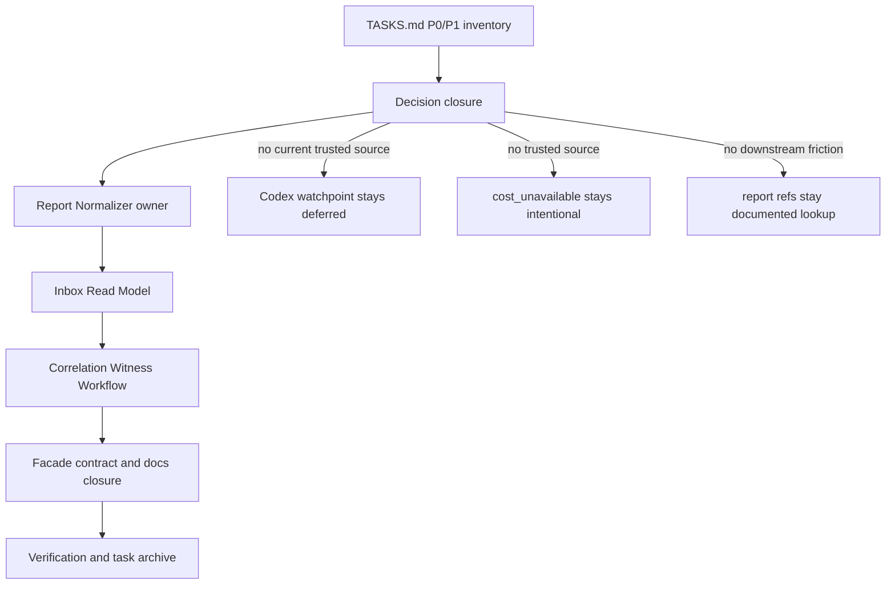
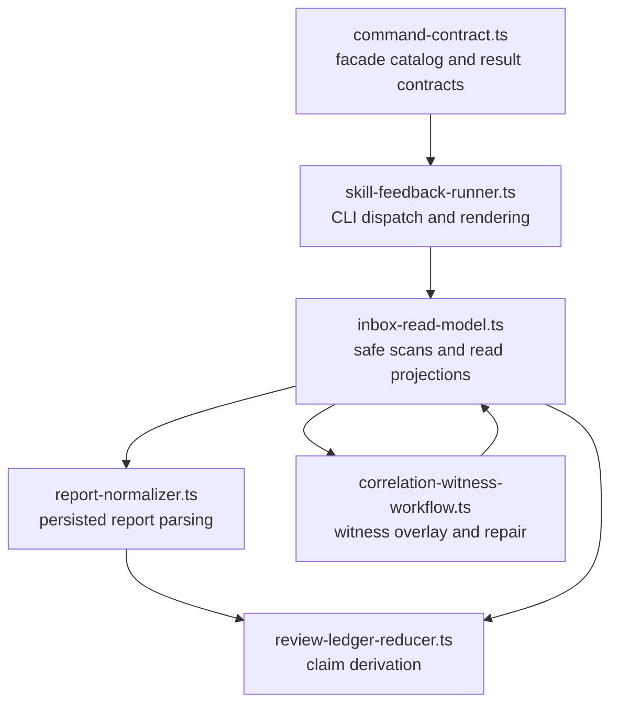

# refactor: Implement Skill Feedback P0/P1 Task List

Status note, 2026-06-30: implemented and closed. Current `TASKS.md` has no
active P1 queue items; planning-time inventory below is historical evidence.

## Goal Capsule

- **Objective:** Implement every open P0 and P1 item in `skills/skill-feedback/TASKS.md` without expanding into the P2 queue.
- **Authority:** `skills/skill-feedback/TASKS.md`, accepted decisions, and source-owner docs outrank speculative architecture names or stale prior plans.
- **Planning-time inventory:** No open P0 items. Six open P1 items: Codex lifecycle watchpoint, native cost attribution decision, `report:<id>` resolver decision, Inbox Read Model, Contract Catalog split, and Correlation Witness Workflow module.
- **Execution profile:** Code and docs work in `skills/skill-feedback`, with facade-backed CLI drift proof where command contracts move.
- **Stop conditions:** Stop if the work needs a Codex engine-owned skill invocation source that current official docs do not expose, a trusted native cost source that cannot be named, public trust-bearing CLI input, or a resolver command without real downstream evidence.
- **Tail ownership:** `skill-feedback` owns the plan, implementation, task-list closure, and verification evidence. Future Codex product change remains a watchpoint, not an active implementation branch.

---

## Product Contract

### Summary

The task list has shifted from feature buildout to architecture deepening and decision closure.
The first three P1s are evidence decisions: keep Codex Trusted skill identity deferred unless current official Codex docs expose an engine-owned skill invocation source, keep native cost unavailable unless a trusted source is named, and keep `report:<id>` lookup documented unless real use justifies a command.
The last three P1s are source-ownership refactors: concentrate inbox reading, separate command catalog ownership from report mechanics, and extract correlation witness workflow behavior from the runner.

### Problem Frame

`skill-feedback` now has a useful daily-pilot path on Claude Code and a large facade-backed CLI surface.
The planning-time risk was ownership depth: `skill-feedback-runner.ts` still carried read-model, correlation, renderer, and command orchestration behavior, while `command-contract.ts` still mixed facade command catalog data with report normalization and proof mechanics.
That shape slows future agents because a small behavior change requires reading thousands of lines and guessing which owner owns the invariant.

### Requirements

**P0/P1 Inventory**

- R1. Treat the 2026-06-29 task-list inventory as authoritative for this plan: no open P0 items and six open P1 items.
- R2. Close or deliberately refresh every P1 item with source evidence, not memory.

**Decision P1s**

- R3. Keep Codex Trusted skill identity deferred unless current official Codex docs expose an engine-owned skill invocation source that can replace the watchpoint.
- R4. Decide native skill-attributed cost from current source evidence: either keep `cost_unavailable` by design, or name a trusted runtime source plus owner tests.
- R5. Decide the `report:<id>` resolver from downstream usage evidence: keep documented JSON lookup when enough, or run `cli-author` before adding a command.

**Architecture P1s**

- R6. Deepen the Inbox Read Model so `review`, `health`, `purge`, and `correlate` consume one owner for safe inbox scans, raw JSON reads, report normalization, proof facts, duplicate facts, low-signal classification, and witness overlays.
- R7. Split the Contract Catalog from report mechanics so command discovery, help, parsers, result contracts, and schema versions stay facade-owned while persisted report normalization, proof parsing, and witness mechanics move to narrower owners.
- R8. Extract the Correlation Witness Workflow so witness read, verification, finalization, repair classification, and execute write behavior have one owner.

**Verification And Closure**

- R9. Preserve public command behavior unless a P1 explicitly changes it.
- R10. Preserve `review` and `health` mutation-free behavior.
- R11. Preserve `correlate` and `purge` preview-first behavior.
- R12. Preserve report trust boundaries: public stdin or argv cannot mint trust, proof, witness, run-id, or provenance authority.
- R13. Update `ARCHITECTURE.md`, `AGENTS.md`, `CONTEXT.md`, `references/report-shape.md`, and `TASKS.md` only where source ownership or accepted language changes.
- R14. Move completed P1 detail into `TASKS.archive.md` and keep `TASKS.md` short after implementation.

### Acceptance Examples

- AE1. Given the planning-time task list is re-read, when implementation begins, then the plan targets zero P0s and exactly the six 2026-06-29 P1s.
- AE2. Given current official Codex docs still list turn/tool/subagent lifecycle hooks but no skill-use lifecycle event, when the Codex watchpoint is closed, then docs keep Codex Trusted skill identity deferred.
- AE3. Given no trusted native skill-attributed cost source is named, when the cost P1 is closed, then `cost_unavailable` remains an intentional report stance and does not create single-report open items.
- AE4. Given no repeated downstream need for raw report lookup exists, when the resolver P1 is closed, then `report:<id>` remains documented lookup through review JSON and no new public command is added.
- AE5. Given the Inbox Read Model refactor lands, when `review`, `health`, `purge`, and `correlate` run against mixed valid, low-signal, invalid, duplicate, and witnessed inbox states, then their counts, diagnostics, and side-effect postures match pre-refactor behavior.
- AE6. Given the Contract Catalog split lands, when discovery metadata, help, parser, result validation, and runtime tests run, then facade-owned command contracts cannot drift from runner behavior.
- AE7. Given the Correlation Witness Workflow extraction lands, when preview, execute, already-linked, ambiguous, insufficient-evidence, unsafe-inbox, and invalid-usage branches run, then branch station evidence stays covered.

### Scope Boundaries

#### In Scope

- P1 decision closure and current-source refresh for Codex lifecycle support, native cost attribution, and `report:<id>` resolver command value.
- Flat `src/` module extraction for report normalization, inbox read model, and correlation witness workflow.
- Focused tests that prove behavior parity and ownership depth.
- Package docs and task tracker updates needed to reflect new owners.

#### Deferred To Follow-Up Work

- P2 Decision Surface Renderer.
- P2 Branch Station Scenario Harness deepening, except focused scenario helper cleanup needed by P1 tests.
- P2 temp artifact garbage collection.
- P2 correlation artifact retention.
- P2 pilot marker cleanup.

#### Outside This Product's Identity

- Trusting assistant prose, transcript proximity, timestamps, same skill name, or raw report-authored ids as Trusted skill identity.
- Adding a public resolver command without the facade-backed CLI contract path.
- Adding native cost attribution from transcript summing or other untrusted estimation.
- Creating pattern-named directories or abstract registries without a second concrete adapter.

---

## Planning Contract

### Key Technical Decisions

- KTD1. **Close decisions before refactors.** Codex lifecycle, cost, and resolver P1s can resolve to documented no-build outcomes; doing that first prevents architecture work from carrying dead branches.
- KTD2. **Codex remains a watchpoint.** The official Codex manual fetched on 2026-06-29 documents skills and hooks, including `Stop`, `PreToolUse`, `PostToolUse`, `UserPromptSubmit`, `SubagentStart`, and `SubagentStop`, but no `PreSkillUse`, `PostSkillUse`, or equivalent engine-owned skill invocation event. Refresh docs and keep the defer decision unless this changes.
- KTD3. **Cost stays unavailable unless a trusted source is named.** Existing docs and code intentionally keep cost as `cost_unavailable`; usage or transcript-derived estimates do not become native skill-attributed cost.
- KTD4. **Resolver command stays deferred unless usage proves it.** Decision 40 already says documented JSON lookup is enough for now. A command is additive only after real downstream friction appears and `cli-author` produces the facade-backed contract.
- KTD5. **Use plain modules, not named patterns.** Pressure gate result: the pressure is duplicate safe-read and witness workflow logic across four commands. The seam is earned by multiple consumers, but no Strategy, Factory, or registry is earned. Use flat modules with exported functions and focused tests.
- KTD6. **Extract report normalization before the read model.** Moving `normalizeReport` and persisted report parsing out of `command-contract.ts` gives the Inbox Read Model a narrow dependency and lets command catalog tests stay facade-focused.
- KTD7. **Make the Inbox Read Model the command read owner.** Route `review`, `health`, `purge`, and `correlate` through projections from one safe read owner rather than repeat raw-read, proof, duplicate, and low-signal logic.
- KTD8. **Extract Correlation Witness Workflow after the read model.** Witness finalization and repair classification need normalized inbox reads; doing this after U2 and U3 avoids duplicating the new owner.
- KTD9. **Keep compatibility exports during extraction.** `hooks/skill-feedback-runtime.ts` imports `finalizeSkillFeedbackCorrelationWitness` from `skill-feedback-runner.ts`; either preserve a runner re-export for one slice or change hook imports in the same unit with tests.

### High-Level Technical Design

### Pressure Gate

- **Pressure source:** Safe inbox scans, raw reads, proof verification, duplicate detection, normalization, low-signal handling, and witness overlays currently require `skill-feedback-runner.ts` plus report mechanics in `command-contract.ts`.
- **Seam:** A flat Inbox Read Model module can expose read projections for review, health, purge, and correlate without each caller knowing raw file, proof, duplicate, or witness details.
- **Deletion-test consequence:** Delete the read model and the complexity reappears across four command paths; delete a speculative registry and nothing useful disappears.
- **Locality gain:** Report-shape bugs, replay diagnostics, and safe-path bugs concentrate in one owner.
- **Second adapter:** The seam is earned by multiple consumers, not by interchangeable adapters. Keep it as a plain module.

### Sequencing

1. Close evidence-decision P1s first.
2. Extract report normalization and proof mechanics out of the command catalog.
3. Build the Inbox Read Model over the new normalizer.
4. Extract correlation witness workflow over the read model.
5. Tighten facade contract tests, docs, and task closure.

---

## Implementation Units

### U1. Decision Closure For Evidence P1s

- **Goal:** Close the Codex lifecycle, cost attribution, and `report:<id>` resolver P1s from current evidence.
- **Requirements:** R1, R2, R3, R4, R5, R13, R14.
- **Dependencies:** None.
- **Files:** `skills/skill-feedback/TASKS.md`, `skills/skill-feedback/TASKS.archive.md`, `docs/decisions/2026-06-12-001-skill-feedback-pilot-decision-log.md`, `skills/skill-feedback/CONTEXT.md`, `skills/skill-feedback/references/report-shape.md`, `docs/research/2026-06-13-codex-stop-hooks-skill-observability-community-signal.md`.
- **Approach:** Refresh official Codex docs before deciding the watchpoint. If no engine-owned skill invocation event exists, record the watchpoint as current and close it as a deferred decision. Re-check cost source owners in `capture-adapters.ts`, report shape docs, and current report normalization; if no trusted native cost source exists, keep `cost_unavailable` by design. Re-check real downstream usage for `report:<id>` raw lookup; if no repeated friction exists, keep Decision 40 and document no command added.
- **Patterns to follow:** Decision 40 and Decision 44 in the skill-feedback pilot decision log; `references/report-shape.md` rules for cost and report refs.
- **Test scenarios:**
  - Given current official Codex hooks docs, confirm supported hook events do not include a skill-use lifecycle event.
  - Given current official Codex skills docs, confirm explicit and implicit skill invocation are documented but not an engine-owned event stream.
  - Given the current source, confirm `cost_unavailable` is still a typed evidence gap and not a readiness blocker.
  - Given review documentation, confirm `report:<id>` resolution still routes through `review_units[*].report_ids` and safe report-id scans only when raw JSON is needed.
- **Verification:** `TASKS.md` no longer carries these three P1s as active implementation tasks unless new evidence contradicts the no-build decision; archive or decision-log entries name the current evidence.

### U2. Report Normalizer Owner

- **Goal:** Move persisted report parsing and normalization out of the command catalog owner.
- **Requirements:** R7, R9, R12, R13.
- **Dependencies:** U1.
- **Files:** `skills/skill-feedback/src/report-normalizer.ts`, `skills/skill-feedback/src/report-normalizer.test.ts`, `skills/skill-feedback/src/command-contract.ts`, `skills/skill-feedback/src/command-contract.test.ts`, `skills/skill-feedback/src/review-ledger-reducer.ts`, `skills/skill-feedback/src/skill-feedback-runner.ts`, `skills/skill-feedback/references/report-shape.md`, `skills/skill-feedback/ARCHITECTURE.md`, `skills/skill-feedback/AGENTS.md`.
- **Approach:** Create a flat report normalizer module that owns `normalizeReport`, v0/v1/v2 persisted report parsing, evidence-gap normalization, cost-unavailable projection, and proof-context application. Leave facade command ids, command metadata, parser types, result contracts, and result data validators in `command-contract.ts`. Re-export only temporarily if the first slice needs to avoid broad import churn, then migrate imports to the new owner.
- **Execution note:** Start with a moved-test slice: copy the current normalization tests to the new test file before moving implementation.
- **Patterns to follow:** Current `normalizeReport` tests in `command-contract.test.ts`; source-layout rule to keep `src/` flat.
- **Test scenarios:**
  - V0 reports normalize with placeholder friction filtered and `cost_unavailable` preserved.
  - Schema 1 reports strip raw `skill_run_id_provenance` even when raw JSON claims `runtime_owned` or `correlation_owned`.
  - Schema 2 reports preserve `runtime_owned` only with verified writer proof and Claude Stop runtime conditions.
  - Malformed schema 2 persisted fields return the same invalid path and reason as before.
  - Duplicate report id and duplicate writer-proof nonce diagnostics still prevent trusted provenance preservation through the read path.
  - Command discovery and result contract tests do not depend on normalizer internals.
- **Verification:** Normalizer tests own persisted report behavior; command-contract tests still prove facade metadata and result validation.

### U3. Inbox Read Model

- **Goal:** Give review, health, purge, and correlate one inbox evidence owner.
- **Requirements:** R6, R9, R10, R11, R12, R13.
- **Dependencies:** U2.
- **Files:** `skills/skill-feedback/src/inbox-read-model.ts`, `skills/skill-feedback/src/skill-feedback-runner.ts`, `skills/skill-feedback/src/skill-feedback.test.ts`, `skills/skill-feedback/src/skill-feedback.integration.test.ts`, `skills/skill-feedback/ARCHITECTURE.md`, `skills/skill-feedback/AGENTS.md`, `skills/skill-feedback/references/report-shape.md`.
- **Approach:** Move safe inbox root checks, JSON file scans, raw report reads, proof-key reads, duplicate fact derivation, normalizer calls, low-signal classification, invalid/skipped counts, and verified witness overlay orchestration behind one read model. Expose command-specific projections instead of one broad mutable state object: review/health summary, purge candidates, and correlation report reads. Keep write behavior in runner or workflow owners.
- **Execution note:** Characterize current review/health/purge/correlate counts before moving callers.
- **Patterns to follow:** Current private helpers `scanSafeInboxJsonFiles`, `readRawInboxReports`, `normalizeRawInboxReports`, `deriveInboxHealth`, and `scanPurgeCandidates`.
- **Test scenarios:**
  - Missing inbox returns empty read facts without creating directories.
  - Unsafe inbox root blocks reads and increments skipped unsafe paths.
  - Primary and `.skill-feedback/low-signal/` reports are counted separately.
  - Legacy unknown-skill Codex Stop reports are low-signal even when top-level.
  - Invalid JSON and invalid normalized reports increment invalid counts consistently for review, health, purge, and correlate.
  - Duplicate report ids and writer proof nonces appear once as replay diagnostics and do not preserve trusted provenance.
  - Verified correlation witnesses overlay closeout reports before review units are reduced.
  - Purge candidate projection skips `.trust/` and `.correlation/` and preserves lane classification.
- **Verification:** `review`, `health`, `purge`, and `correlate` tests pass with callers using the read model instead of private duplicate helpers.

### U4. Correlation Witness Workflow Module

- **Goal:** Extract witness read, verify, finalize, repair classification, and execute behavior from the runner.
- **Requirements:** R8, R9, R10, R11, R12, R13.
- **Dependencies:** U3.
- **Files:** `skills/skill-feedback/src/correlation-witness-workflow.ts`, `skills/skill-feedback/src/correlation-witness-workflow.test.ts`, `skills/skill-feedback/src/skill-feedback-runner.ts`, `hooks/skill-feedback-runtime.ts`, `hooks/skill-feedback-hooks.test.ts`, `skills/skill-feedback/src/skill-feedback.test.ts`, `skills/skill-feedback/src/skill-feedback.integration.test.ts`, `skills/skill-feedback/ARCHITECTURE.md`, `skills/skill-feedback/AGENTS.md`, `skills/skill-feedback/references/report-shape.md`.
- **Approach:** Move correlation directory reads, safe witness/diagnostic artifact parsing, witness verification, finalizer validation, diagnostic artifact writing, repair candidate classification, and execute write orchestration into one workflow module. Keep CLI parsing and envelope rendering in the runner. Preserve `finalizeSkillFeedbackCorrelationWitness` compatibility during the slice, or update hook imports and tests in the same commit.
- **Patterns to follow:** Current `finalizeSkillFeedbackCorrelationWitness`, `readCorrelationRepairArtifacts`, `classifyCorrelationRepairDiagnostic`, `applyVerifiedCorrelationWitnesses`, and correlate Branch Station rows.
- **Test scenarios:**
  - Valid finalization writes one witness and returns the same process result shape as before.
  - Missing hook report writes or returns the same blocked diagnostic reason.
  - Closeout path mismatch, proof unavailable, invalid proof, source mismatch, skill mismatch, and run-id mismatch keep the same reason ids.
  - Preview repairable, execute written, already linked, ambiguous, insufficient evidence, unsafe inbox, and invalid usage branch stations stay covered.
  - Hook runtime wrapper still records capture and finalizes witnesses through the exported workflow.
  - Public CLI input still cannot pass witness ids, report ids, run ids, proof fields, trust fields, or provenance.
- **Verification:** Correlation workflow tests own witness behavior; runner tests own CLI envelopes; hook tests prove import compatibility.

### U5. Contract Catalog And CLI Alignment Cleanup

- **Goal:** Finish the Contract Catalog split and prove facade command surfaces did not drift.
- **Requirements:** R7, R9, R10, R11, R12, R13.
- **Dependencies:** U2, U3, U4.
- **Files:** `skills/skill-feedback/src/command-contract.ts`, `skills/skill-feedback/src/command-contract.test.ts`, `skills/skill-feedback/src/branch-station-catalog.ts`, `skills/skill-feedback/src/branch-station-catalog.test.ts`, `skills/skill-feedback/src/branch-station-evidence.ts`, `skills/skill-feedback/src/skill-feedback.integration.test.ts`, `skills/skill-feedback/SKILL.md`, `skills/skill-feedback/AGENTS.md`, `skills/skill-feedback/ARCHITECTURE.md`, `skills/skill-feedback/references/report-shape.md`.
- **Approach:** Remove remaining report-mechanics exports from the facade owner where callers can import the new owners directly. Keep command discovery metadata, rendered help, parser accept/reject behavior, result contract ids, schema versions, and output modes in `command-contract.ts`. Refresh branch station evidence only for behavior that remains public.
- **Patterns to follow:** `cli-author` facade-backed lane, existing Command Surface Alignment Proof in `SKILL.md`, and current Branch Station catalog tests.
- **Test scenarios:**
  - Discovery metadata still lists record, closeout, review, health, purge, and correlate with correct result contracts.
  - Rendered help stays unchanged except for owner wording if docs moved.
  - Parser tests accept and reject the same argv sets as before.
  - Runtime branch station evidence covers every required station and reports no drift.
  - No command result schema version changes unless output fields actually changed.
- **Verification:** Command contract tests, branch station catalog tests, and process-boundary station tests pass after owner extraction.

### U6. Task Tracker And Architecture Closure

- **Goal:** Close the P1 task list and leave future agents with the new owner map.
- **Requirements:** R1, R2, R13, R14.
- **Dependencies:** U1, U2, U3, U4, U5.
- **Files:** `skills/skill-feedback/TASKS.md`, `skills/skill-feedback/TASKS.archive.md`, `skills/skill-feedback/ARCHITECTURE.md`, `skills/skill-feedback/AGENTS.md`, `skills/skill-feedback/CONTEXT.md`, `skills/skill-feedback/references/report-shape.md`, `skills/skill-feedback/docs/INDEX.md`.
- **Approach:** Move completed P1 detail to the archive, leave only still-open P2 or newer follow-up tasks in `TASKS.md`, and update the architecture module map plus owner docs. Add no new glossary terms unless extraction introduces domain language; source module names alone do not belong in `CONTEXT.md`.
- **Patterns to follow:** Task archive contract and package agent guide task shape.
- **Test scenarios:**
  - `TASKS.md` contains no open P0/P1 items from the original inventory.
  - Archive entries name trust gained and evidence paths without copying schemas.
  - Architecture and agent guide owner paths match actual files.
  - Report-shape reference points to the new source owners without duplicating code contracts.
- **Verification:** Docs checks pass and `rg` over task files confirms original P1 titles are archived or intentionally renamed as lower-priority follow-up work.

---

## Verification Contract

| Gate | Scope | Done Signal |
|---|---|---|
| `git diff --check -- skills/skill-feedback` | Docs and source whitespace | No whitespace errors. |
| `bun run skills/skill-feedback/src/skill-feedback-runner.ts --help` | Public CLI help | Help renders all command surfaces. |
| `bun run skills/skill-feedback/src/skill-feedback-runner.ts health --plain` | Live inbox health | Claude daily pilot and Codex Trusted skill identity render separately; no regression in next action. |
| `bun run skills/skill-feedback/src/skill-feedback-runner.ts review --plain` | Live review read path | Review remains mutation-free and reads current inbox through the new read model. |
| `skills/test-runner/src/test-runner.sh run --cwd skills/skill-feedback -- src` | Package behavior | All package tests pass. |
| `bun --filter skill-feedback-scripts typecheck` | TypeScript contracts | Typecheck passes without broad casts or stale imports. |
| Branch Station integration suite | CLI branch confidence | Every catalog station is covered with no drift. |
| YAML/frontmatter parse | Docs metadata | New or edited markdown frontmatter parses. |

---

## Definition of Done

- Every P0/P1 item present in `skills/skill-feedback/TASKS.md` at plan time is closed, archived, or deliberately transformed into a lower-priority follow-up with source evidence.
- No public command is added for native cost attribution or `report:<id>` resolution unless U1 finds evidence that changes the accepted decision and `cli-author` is run for the new surface.
- `command-contract.ts` reads as the Command facade contract owner, not the persisted report mechanics owner.
- `skill-feedback-runner.ts` keeps CLI dispatch, envelope rendering, and command orchestration while read-model and witness workflow behavior live in narrower modules.
- `review`, `health`, `purge`, and `correlate` consume the same inbox read owner for safe reads and report normalization.
- Correlation witness behavior has a focused workflow owner and keeps hook compatibility.
- Package docs name the new source owners and avoid copied schemas, flags, or result fields.
- Verification gates in this plan pass, or any blocked gate has a concrete failing command, cause, and next repair path.
- Dead-end extraction code, unused compatibility exports, and temporary helper duplication are removed before claiming completion.

---

## Appendix

### Sources And Research

- `skills/skill-feedback/TASKS.md` current P0/P1 inventory.
- `skills/skill-feedback/AGENTS.md` package maintenance route and source owners.
- `skills/skill-feedback/ARCHITECTURE.md` current module map.
- `skills/skill-feedback/CONTEXT.md` vocabulary for trust, capture, read model, cost attribution, report refs, and readiness.
- `skills/skill-feedback/references/report-shape.md` report, review, health, correlate, purge, cost, and report-ref reading rules.
- `docs/decisions/2026-06-12-001-skill-feedback-pilot-decision-log.md` Decisions 40 and 44.
- `docs/research/2026-06-13-codex-stop-hooks-skill-observability-community-signal.md` Codex lifecycle watchpoint baseline.
- Official Codex manual fetched 2026-06-29 via `openai-docs`; source sections: `https://developers.openai.com/codex/hooks` and `https://developers.openai.com/codex/skills`.
- `skills/skill-feedback/src/command-contract.ts` current command catalog, result contracts, report normalization, writer proof, and witness proof mechanics.
- `skills/skill-feedback/src/skill-feedback-runner.ts` current runner, inbox read helpers, health/review/purge/correlate engines, renderers, and witness workflow.
- `skills/skill-feedback/src/branch-station-catalog.ts` and `skills/skill-feedback/src/skill-feedback.integration.test.ts` current branch station coverage.
