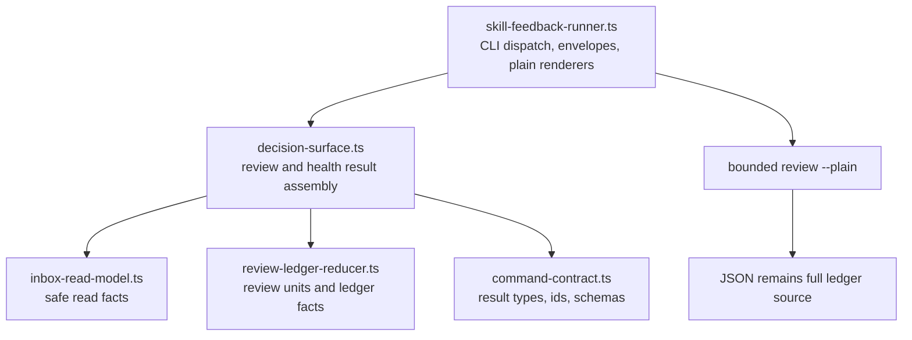
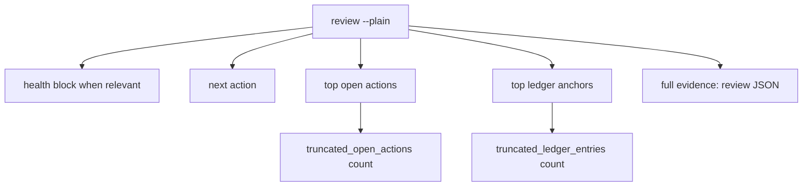

# refactor: Deepen Skill Feedback Decision Surface And Review Plain Output

## Goal Capsule

- **Objective:** Implement the first two ICA candidates for `skills/skill-feedback`: extract review and health decision assembly into one owner module, then bound `review --plain` output around next safe action.
- **Authority:** The 2026-06-30 ICA implementation handoff and baseline commit `a50bbeeb` outrank broader architecture candidates. `skills/skill-feedback/AGENTS.md`, `ARCHITECTURE.md`, `CONTEXT.md`, and `references/report-shape.md` own package rules and vocabulary.
- **Scope:** Candidate 1 and Candidate 2 only. Do not implement maintainer drift gates, purge plain parity, or command-contract splitting.
- **Execution profile:** Standard code and docs refactor inside `skills/skill-feedback`, with agent-native CLI output proof for `review --plain`.
- **Stop conditions:** Stop if implementation would change JSON result fields, schema versions, parser rules, command flags, or mutation posture without a deliberate command-contract update and matching tests.
- **Tail ownership:** `skill-feedback` owns source-owner docs, package tests, typecheck, live read-only smoke commands, and any task tracker closure.

---

## Product Contract

### Summary

This plan deepens the `skill-feedback` review decision surface without widening public command shape.
Review and health result assembly move out of CLI orchestration into a plain decision-surface module.
`review --plain` becomes bounded by default while JSON remains the complete evidence source.

### Problem Frame

`skill-feedback-runner.ts` still owns too much decision data: review result assembly, health result assembly, warning selection, next action, readiness projection, retention summary, pilot checkpoint summary, and read-target diagnostics.
That makes future review and health changes look like CLI orchestration changes and forces maintainers to test behavior through the runner even when the change is pure decision projection.

The current `review --plain` renderer also emits every open item and every ledger entry.
Real inbox output can become hundreds of lines, so agents and humans reach the next safe action only after parsing ledger mass.
The CLI already has a complete JSON mode; plain output should be the bounded decision surface.

### Requirements

**Decision Surface**

- R1. Move review result data assembly and health result data assembly out of `skill-feedback-runner.ts` into a new flat source owner.
- R2. Keep CLI dispatch, default runtime wiring, process envelopes, writes, and plain renderers in `skill-feedback-runner.ts`.
- R3. Keep schemas, enum values, parser rules, result contract ids, result schema versions, and command discovery metadata in `command-contract.ts`.
- R4. Keep review ledger claim derivation in `review-ledger-reducer.ts`; the decision surface consumes reducer facts and does not re-derive allowed claims.
- R5. Keep inbox scanning, safe reads, low-signal classification, proof facts, and correlation witness facts in `inbox-read-model.ts` and its existing collaborators.
- R6. Give tests a focused decision-surface interface for review and health warnings, next action, readiness projection, retention, pilot checkpoint, and read-target diagnostics.

**Bounded Plain Review**

- R7. Preserve complete JSON output for `review`; no evidence is dropped from `ReviewResultData`.
- R8. Bound `review --plain` by default; do not add a new flag unless implementation discovers a current contract that requires opt-in behavior.
- R9. Put health state, top warning, next action, top open actions, top ledger anchors, truncation facts, and `full_evidence=json` before or instead of exhaustive ledger detail.
- R10. Emit stable key-value truncation facts when plain output omits open actions, ledger entries, or per-row evidence refs.
- R11. Keep all untrusted plain text passing through `plainSafe`; do not add mid-line truncation except existing unsafe-field length handling.
- R12. Preserve current plain-output ordering guarantees: triage, top warning, next action, and readiness appear before actions and ledger detail, and injected control characters cannot spoof section headings.
- R13. Use fixed runner-owned plain caps: `REVIEW_PLAIN_OPEN_ACTION_LIMIT = 10`, `REVIEW_PLAIN_LEDGER_ENTRY_LIMIT = 20`, and `REVIEW_PLAIN_EVIDENCE_REF_LIMIT = 3`; do not add user-configurable budget flags in this slice.
- R14. Render plain rows in stable machine-readable shapes: open actions start `- action=<key> next=<text> evidence=<refs>`, ledger anchors start with `- owner=<path|unknown>`, missing owner paths render as `owner=unknown`, and omitted per-row evidence refs render as `evidence_refs_omitted=<count>`.

**Documentation And Verification**

- R15. Update package docs in the same pass when owner paths or output reading rules change.
- R16. Prove discovery metadata, rendered help, parser acceptance, runtime semantics, and branch station evidence do not drift when CLI output-mode behavior changes.
- R17. Preserve review and health mutation-free behavior.

### Acceptance Examples

- AE1. Given a review inbox with high-signal reports, when `review` emits JSON, then `open_items`, `open_actions`, `review_units`, `ledger_entries`, and `anchor_miss_telemetry` remain complete.
- AE2. Given a review inbox with more open actions than the plain cap, when `review --plain` runs, then the plain output lists only the top open actions and emits `truncated_open_actions=<count>`.
- AE3. Given a review inbox with more ledger entries than the plain cap, when `review --plain` runs, then the plain output lists only the top ledger anchors and emits `truncated_ledger_entries=<count>`.
- AE4. Given plain review output is truncated, when an agent needs full evidence, then the output includes `full_evidence=json`.
- AE5. Given no health warnings or degraded inbox state exist, when `review --plain` runs, then the output still surfaces the next safe action before ledger detail.
- AE6. Given an untrusted report label contains control characters and fake headings, when `review --plain` renders it inside a bounded section, then the output contains one real `Readiness:` heading and one real `Ledger:` heading.
- AE7. Given result assembly moves to `decision-surface.ts`, when review and health tests run, then JSON data shape and schema versions stay unchanged.
- AE8. Given an action or ledger row has more than three evidence refs, when `review --plain` renders it, then the row lists three refs and emits `evidence_refs_omitted=<count>`.

### Scope Boundaries

#### In Scope

- New flat decision-surface module under `skills/skill-feedback/src/`.
- Focused decision-surface tests for review and health result projections.
- Runner integration that delegates review and health result assembly.
- Default bounded `review --plain` rendering.
- Docs and task tracker updates required by owner or output behavior changes.

#### Deferred To Follow-Up Work

- Purge plain-output parity from `skills/skill-feedback/TASKS.md`.
- Mechanical maintainer drift gate.
- Splitting `command-contract.ts` because of size alone.
- New `show`, `resolve-ref`, pagination, or output-budget flags.

#### Outside This Product's Identity

- Trusting raw inbox JSON, assistant prose, labels, or timestamps as command authority.
- Dropping JSON evidence to make plain output shorter.
- Moving parser rules, schema versions, or command discovery out of `command-contract.ts`.
- Creating pattern-named directories or registries without a second concrete adapter.

---

## Planning Contract

### Key Technical Decisions

- KTD1. **Use a plain module, not a named pattern.** The pressure gate names real locality pressure but no second adapter. A flat `decision-surface.ts` module earns its keep; Strategy, Factory, registry, or pattern directories do not.
- KTD2. **Decision data moves; CLI rendering stays.** `decision-surface.ts` should return `ReviewResultData` and `HealthResultData` from read-model and reducer facts, including the ranked `open_actions` list. `skill-feedback-runner.ts` should keep command dispatch, process envelopes, default runtime wiring, writes, and plain renderers.
- KTD3. **Bound plain output without changing JSON contracts.** Candidate 2 is an attention-budget fix. JSON remains complete, so result schema versions should not change unless implementation adds or removes JSON fields.
- KTD4. **No new flag by default.** Existing `--plain` already means compact human-readable output. Adding a second budget flag would widen the command surface before evidence shows configurability is needed.
- KTD5. **Use runner-owned fixed plain caps and stable truncation keys.** Keep cap constants near the plain renderers in `skill-feedback-runner.ts`: `REVIEW_PLAIN_OPEN_ACTION_LIMIT = 10`, `REVIEW_PLAIN_LEDGER_ENTRY_LIMIT = 20`, and `REVIEW_PLAIN_EVIDENCE_REF_LIMIT = 3`. Emit omitted counts as machine-readable plain lines: `truncated_open_actions=<n>`, `truncated_ledger_entries=<n>`, and row-local `evidence_refs_omitted=<n>`. This matches the handoff hint for open actions and the existing `correlate --plain` candidate cap precedent.
- KTD6. **Sort before truncating.** The decision surface ranks open actions with the existing open-item ranking before plain rendering applies the cap. Plain rendering displays action keys, next safe actions, and evidence refs ahead of explanatory evidence text. Ledger-entry ranking is renderer-owned for plain output only: it should put open entries before no-action entries, then prefer stronger owner-path anchors, heavier verification burden, richer evidence tiers, and finally the stable ledger key. JSON ledger order stays complete and otherwise unchanged.
- KTD7. **Use stable row shapes for agent scanning.** Open-action rows start `- action=<key> next=<text> evidence=<refs>`. Ledger rows start with `- owner=<path|unknown>` and keep evidence refs visible even when the owner path is missing. The full-evidence pointer is the stable line `full_evidence=json`, not prose.
- KTD8. **Test behavior, not golden snapshots.** Put JSON shape checks in `command-contract.test.ts`, plain line and ordering checks in runner tests, and use targeted assertions rather than broad golden snapshots. Use synthetic fixtures plus one large real-style generated fixture.
- KTD9. **Docs point at owners, not copied schemas.** If owner paths or plain output reading rules change, docs should name source owners and examples. Exact result fields and schema validation stay in code and tests; this slice should only need `references/report-shape.md` for plain-output reading rules unless owner maps change.

### High-Level Technical Design

### Create-CLI Brief

- **Lane:** Agent-native CLI.
- **Name:** `skill-feedback review --plain`.
- **Purpose:** Show a bounded, human-readable review decision surface for the current inbox.
- **Users:** Agents and humans; JSON remains the automation source.
- **Invocation shape:** Existing `review [--plain] [--repo <path>]`; no new flags planned.
- **I/O contract:** Plain primary output to stdout; diagnostics and errors stay in process envelopes or stderr as today.
- **Output modes:** JSON complete by default; plain bounded by default with stable key-value rows.
- **Side-effect stance:** Read-only review. No mutation.
- **Non-interactive behavior:** No prompts.
- **Validation proof:** Keep command discovery, rendered help, parser accept/reject, runtime semantics, and branch station evidence aligned with `skillFeedbackContracts.review`.

### Sequencing

1. Extract and test the decision-surface module.
2. Rewire runner review and health paths to the module.
3. Bound `review --plain` after the decision surface is isolated.
4. Update docs and prove contract alignment.

---

## Implementation Units

### U1. Decision Surface Owner

- **Goal:** Create `decision-surface.ts` as the owner for review and health result assembly.
- **Requirements:** R1, R3, R4, R5, R6, R17.
- **Dependencies:** None.
- **Files:** `skills/skill-feedback/src/decision-surface.ts`, `skills/skill-feedback/src/decision-surface.test.ts`, `skills/skill-feedback/src/skill-feedback-runner.ts`, `skills/skill-feedback/src/command-contract.ts`, `skills/skill-feedback/src/inbox-read-model.ts`, `skills/skill-feedback/src/review-ledger-reducer.ts`.
- **Approach:** Move `buildReviewResultData`, `buildHealthResultData`, `healthInboxStatus`, `healthCounts`, `deriveHealthWarnings`, `deriveHealthNextAction`, `retentionSummary`, `pilotCheckpointSummary`, read-target diagnostic projection, open-action ranking, and decision-only helpers into the new module. Export a small JSDoc-covered interface. Keep reducer-owned claim logic and contract-owned schema literals where they are.
- **Execution note:** Add focused tests before rewiring the runner so parity failures identify extraction mistakes rather than CLI dispatch noise.
- **Patterns to follow:** `review-ledger-reducer.ts` for a deep flat module with exported result type and reducer tests; `inbox-read-model.ts` for read projection ownership.
- **Test scenarios:**
  - Given an empty inbox read, review result assembly returns empty coverage, no-action rationale, missing or empty inbox status, and no ledger entries.
  - Given populated primary and low-signal reports, review result assembly includes low-signal health facts while ledger entries cover primary reports only.
  - Given retention age or count crosses thresholds, both review and health result assembly derive the same retention warning and next action.
  - Given blocked correlation witness diagnostics, both review and health result assembly surface the correlation repair next action.
  - Given a pilot marker older than seven days, review result assembly emits pilot checkpoint density from closeout units and open signals.
  - Given explicit read-target resolution, review and health result assembly expose read-target diagnostics only under the existing visibility rules.
  - Given open actions with different severity, reason, owner, and evidence-ref counts, review result assembly returns them in the shared action order before any plain-output cap applies.
  - Given malformed or edge-case dates, retention and pilot calculations keep current fallback behavior.
- **Verification:** Focused tests prove decision results without invoking the CLI process path, and existing review/health JSON tests still pass.

### U2. Runner Integration And Contract Parity

- **Goal:** Rewire `skill-feedback-runner.ts` so review and health commands use the decision-surface owner.
- **Requirements:** R1, R2, R3, R4, R7, R16, R17.
- **Dependencies:** U1.
- **Files:** `skills/skill-feedback/src/skill-feedback-runner.ts`, `skills/skill-feedback/src/skill-feedback.test.ts`, `skills/skill-feedback/src/command-contract.test.ts`, `skills/skill-feedback/src/branch-station-catalog.test.ts`, `skills/skill-feedback/src/skill-feedback.integration.test.ts`.
- **Approach:** Replace local result assembly calls with decision-surface imports. Leave plain renderers in the runner. Remove dead private helpers only after all callers move. Do not change review or health schema versions when JSON shape is unchanged.
- **Patterns to follow:** Existing runner exports used by tests; current command facade contract tests for review and health output modes.
- **Test scenarios:**
  - `review` JSON still parses with `parseReviewResultData` and reports schema version `7`.
  - `health` JSON still parses with `parseHealthResultData` and reports schema version `4`.
  - Review and health explicit `--repo` target resolution keeps current success and failure behavior.
  - Missing, empty, populated, unsafe, and partially readable inbox states keep current exit codes and envelope contracts.
  - Branch Station integration still covers `review.empty_inbox`, `review.target_resolution_failed`, `health.populated_inbox`, `health.proof_diagnostics`, `health.correlation_witness_diagnostics`, and `health.unsafe_inbox`.
- **Verification:** Runner tests show no JSON contract, parser, help, exit-code, or mutation-posture drift.

### U3. Bounded Review Plain Output

- **Goal:** Make `review --plain` a bounded decision surface while preserving full JSON evidence.
- **Requirements:** R7, R8, R9, R10, R11, R12, R13, R14, R16, R17.
- **Dependencies:** U1, U2.
- **Files:** `skills/skill-feedback/src/skill-feedback-runner.ts`, `skills/skill-feedback/src/skill-feedback.test.ts`, `skills/skill-feedback/src/command-contract.test.ts`, `skills/skill-feedback/references/report-shape.md`.
- **Approach:** Add runner-owned caps near the plain renderers: `REVIEW_PLAIN_OPEN_ACTION_LIMIT`, `REVIEW_PLAIN_LEDGER_ENTRY_LIMIT`, and `REVIEW_PLAIN_EVIDENCE_REF_LIMIT`. Consume the ranked `open_actions` order from `ReviewResultData`; do not re-rank action policy in the renderer. Apply ledger-entry ranking only inside plain rendering so JSON ledger order remains complete and unchanged. Keep the first block focused on health, warning, next action, readiness, and top actionable commands. Render open actions as `- action=<key> next=<text> evidence=<refs>`. Render ledger anchors with owner path first, using `owner=unknown` when missing. Cap per-row evidence refs, keep omitted counts as `evidence_refs_omitted=<count>`, and avoid mid-line truncation except existing `plainSafe` unsafe-field handling. Render top-level truncation facts as stable plain lines when caps omit data. Add `full_evidence=json` so agents know JSON contains the full `open_items`, `open_actions`, and `ledger_entries` arrays. Keep every untrusted field behind `plainSafe`.
- **Patterns to follow:** `renderPlainCorrelate` candidate cap and truncation line; current `plainSafe` section-spoof tests; current `compareReviewOpenItems` ranking; targeted line/order assertions instead of broad golden snapshots.
- **Test scenarios:**
  - Given more open actions than the cap, `review --plain` emits only the capped top actions and `truncated_open_actions=<omitted count>`.
  - Given ranked `open_actions` in JSON, `review --plain` preserves that order while applying the cap.
  - Given more ledger entries than the cap, `review --plain` emits only capped ledger anchors and `truncated_ledger_entries=<omitted count>`.
  - Given open and no-action ledger entries compete for the cap, `review --plain` keeps open entries ahead of no-action entries.
  - Given JSON review output, `ledger_entries` remains complete and does not gain a new ranking contract from the plain-output cap.
  - Given an open action renders, the line starts with `- action=<key> next=<text> evidence=<refs>`.
  - Given a ledger anchor renders, the line starts with `- owner=<path|unknown>`.
  - Given a ledger entry has no owner path, `review --plain` renders `owner=unknown` and still includes available evidence refs.
  - Given a row has more than three evidence refs, `review --plain` emits `evidence_refs_omitted=<omitted count>`.
  - Given the same inbox, `review` JSON still contains every open item, every open action, and every ledger entry after plain truncation is introduced.
  - Given no open items, `review --plain` still emits the no-action rationale and does not emit truncation facts.
  - Given an empty inbox, `review --plain` emits an explicit empty inbox status and no action list.
  - Given exactly the cap count, `review --plain` emits no truncation fact.
  - Given untrusted labels or observation text with control characters, bounded open action and ledger lines cannot create fake `Readiness:` or `Ledger:` headings.
  - Given an untrusted field exceeds the existing `plainSafe` length behavior, only that unsafe field is shortened; stable row keys remain intact.
  - Given health warnings exist, the top warning and next action appear before open actions and ledger anchors.
  - Given only low-signal reports exist, `review --plain` surfaces health facts without inventing ledger anchors.
  - Given a large real-style inbox fixture, total plain output stays within the documented cap shape and includes a JSON-full-ledger pointer.
- **Verification:** Plain output is short enough for agent context, preserves ordering guarantees, and keeps complete data in JSON. Prefer targeted assertions over golden snapshots.

### U4. Docs, Task Tracker, And Owner Proof

- **Goal:** Update source-owner docs and run the package gates that prevent CLI contract drift.
- **Requirements:** R15, R16, R17.
- **Dependencies:** U1, U2, U3.
- **Files:** `skills/skill-feedback/README.md`, `skills/skill-feedback/ARCHITECTURE.md`, `skills/skill-feedback/AGENTS.md`, `skills/skill-feedback/SKILL.md`, `skills/skill-feedback/references/report-shape.md`, `skills/skill-feedback/docs/INDEX.md`, `skills/skill-feedback/TASKS.md`, `skills/skill-feedback/TASKS.archive.md`.
- **Approach:** Add `decision-surface.ts` to module maps and review/health source owners. Update `references/report-shape.md` reading rules so plain review is bounded and JSON is the full evidence source. Close or record the ICA candidate work in `TASKS.md` and archive completed detail if implementation lands. Avoid copying schemas, caps, parser rules, or result fields into docs when code and tests own them.
- **Patterns to follow:** `skills/skill-feedback/AGENTS.md` Source Owners and Doc Drift Gate; `skills/skill-feedback/docs/INDEX.md` placement rule for package plans.
- **Test scenarios:**
  - Source-owner docs name `decision-surface.ts` for review/health result assembly and keep runner ownership for dispatch and plain rendering.
  - Report-shape docs say `review --plain` is bounded and `review` JSON remains complete.
  - README still presents `--plain` as compact human-readable output without adding undocumented flags.
  - Task tracker records this work without reopening unrelated P3 purge plain parity.
  - Owner-path checker accepts edited docs.
- **Verification:** Docs point at current owners and command-contract tests prove public CLI metadata did not drift.

---

## Verification Contract

| Gate | Scope | Done Signal |
|---|---|---|
| `skills/test-runner/src/test-runner.sh run --cwd skills/skill-feedback -- src` | Package behavior | All package tests pass. |
| `bun --filter skill-feedback-scripts typecheck` | TypeScript contracts | Typecheck passes without broad casts or stale imports. |
| `git diff --check -- skills/skill-feedback` | Source and docs whitespace | No whitespace errors. |
| `bun run skills/skill-feedback/src/skill-feedback-runner.ts review --plain` | Live bounded review plain output | Output is bounded, surfaces next action early, and points to JSON for full evidence. |
| `bun run skills/skill-feedback/src/skill-feedback-runner.ts health --plain` | Live health output | Health remains compact and mutation-free. |
| `bun run skills/create-skill/scripts/check-owner-paths.ts --json skills/skill-feedback/README.md skills/skill-feedback/ARCHITECTURE.md skills/skill-feedback/AGENTS.md skills/skill-feedback/SKILL.md skills/skill-feedback/CONTEXT.md skills/skill-feedback/references/report-shape.md skills/skill-feedback/docs/INDEX.md skills/skill-feedback/TASKS.md skills/skill-feedback/TASKS.archive.md` | Docs owner paths | Edited owner docs contain valid repo-relative paths. |

---

## Definition of Done

- `skills/skill-feedback/src/decision-surface.ts` owns review and health result assembly with focused tests.
- `skills/skill-feedback/src/skill-feedback-runner.ts` no longer owns decision assembly helpers, but still owns CLI dispatch, process envelopes, writes, command orchestration, and plain renderers.
- `command-contract.ts` still owns command metadata, parser rules, result contract ids, schema versions, enums, and result validators.
- `review --plain` is bounded by default and emits truncation facts when it omits open actions or ledger entries.
- `review` JSON remains complete and parseable with the existing review result schema version unless a deliberate schema change is made.
- Plain output keeps untrusted text sanitized through `plainSafe`.
- Package docs name the new owner and explain bounded plain review without copying runtime schemas.
- Required verification gates pass, or any blocked gate has a concrete failing command, cause, and next repair path.
- Dead extraction helpers, duplicate result assembly logic, and temporary compatibility exports are removed before claiming completion.

---

## Appendix

### Sources And Research

- 2026-06-30 ICA implementation handoff for candidates 1 and 2.
- 2026-06-30 ICA architecture report at baseline commit `a50bbeeb`.
- `context/code-style.md` pressure gate.
- `skills/cli-author/SKILL.md`, `skills/cli-author/references/cli-guidelines.md`, and `skills/cli-author/references/agent-native-cli-design.md` for the `review --plain` output contract path.
- `skills/skill-feedback/AGENTS.md` package source owners, doc drift gate, and verification commands.
- `skills/skill-feedback/ARCHITECTURE.md` current module map and review ledger flow.
- `skills/skill-feedback/CONTEXT.md` vocabulary for Review decision surface, Command facade contract, ReviewResultData Facade, HealthResultData Interface, and Open signal.
- `skills/skill-feedback/references/report-shape.md` review, health, command envelope, and plain output rules.
- `skills/skill-feedback/src/skill-feedback-runner.ts` current review/health result assembly and plain renderers.
- `skills/skill-feedback/src/command-contract.ts` review and health result contracts, command metadata, and output modes.
- `skills/skill-feedback/src/inbox-read-model.ts` safe read facts consumed by review and health.
- `skills/skill-feedback/src/review-ledger-reducer.ts` reducer-owned ledger and allowed-claim facts.
- `skills/skill-feedback/src/skill-feedback.test.ts`, `skills/skill-feedback/src/command-contract.test.ts`, `skills/skill-feedback/src/branch-station-catalog.test.ts`, and `skills/skill-feedback/src/skill-feedback.integration.test.ts` current behavior and contract proof.
