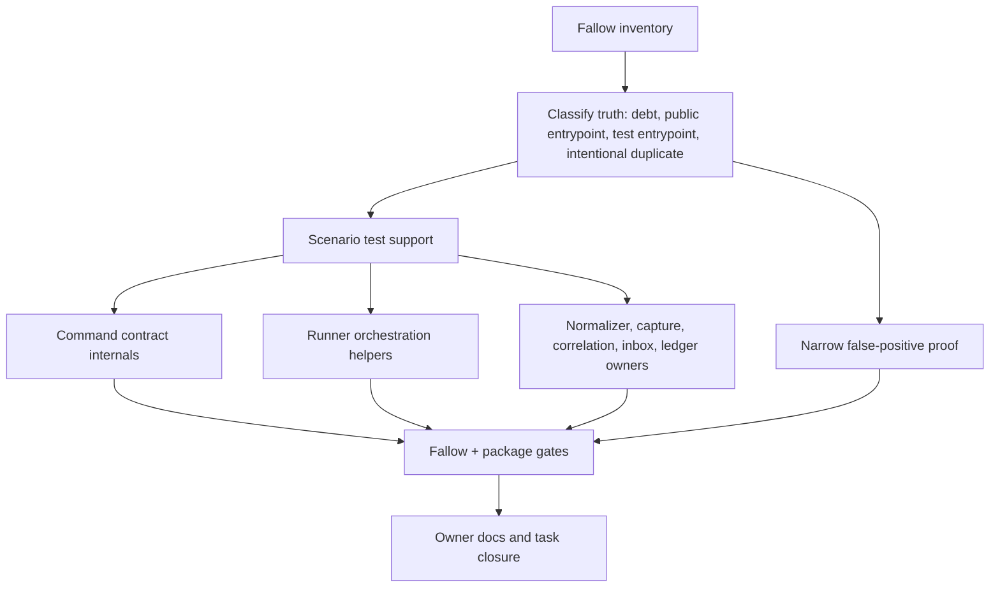

# refactor: Clean Skill Feedback Inherited Fallow Findings

## Goal Capsule

- **Objective:** Clean every inherited Fallow finding in `skills/skill-feedback` by converting analyzer signal into real ownership depth, focused test support, or explicit false-positive proof.
- **Authority:** `skills/skill-feedback/AGENTS.md`, `ARCHITECTURE.md`, `CONTEXT.md`, `references/report-shape.md`, ADR 0004, ADR 0014, the 2026-06-30 Fallow inventory, and the architecture review of the inherited-cleanup plan outrank scanner convenience and broad refactor pressure.
- **Scope:** Work only inside `skills/skill-feedback` and package-local Fallow handling. Ignore unrelated dirty files outside the package.
- **Execution profile:** Deep refactor and test-support cleanup. Start with characterization and analyzer truth before changing production owners.
- **Stop conditions:** Stop if implementation would change JSON result fields, result schema versions, command flags, parser acceptance, help/discovery metadata, public trust posture, or mutation posture without a deliberate command-contract update and matching tests.
- **Tail ownership:** `skill-feedback` owns package tests, typecheck, Fallow gates, live read-only CLI smokes, owner docs, task tracker closure, and a driver closeout.

---

## Product Contract

### Summary

This plan cleans inherited Fallow debt without treating Fallow as the product contract.
The cleanup first separates analyzer truth from real architecture debt, then deepens the high-noise test and command paths in vertical slices.
The desired end state is no inherited Fallow findings, no introduced Fallow findings, no public CLI drift, and no hidden behavior change.

### Problem Frame

The current package snapshot is clean for new work but noisy for inherited work.
`fallow audit --plain --root skills/skill-feedback --base-ref HEAD` reports `introduced=0` and `inherited=93`.
`fallow dead-code` reports `26` findings, including public exports, test entrypoints, and likely analyzer blind spots.
`fallow dupes` reports `102` findings, dominated by `src/skill-feedback.test.ts`.
`fallow health` reports `135` maintainability findings across command contracts, runner orchestration, normalization, capture adapters, correlation witnesses, inbox reads, and ledger reduction.

The first attempted cleanup plan was too metric-driven.
It risked deleting public seams to satisfy dead-code output, suppressing noise before proving reachability, and extracting helpers without improving package ownership.
The better plan treats Fallow as a triage source, then uses source owners and command-contract invariants to decide what changes.

### Requirements

**Analyzer Truth And Scope**

- R1. Classify every current inherited Fallow finding as real code debt, public entrypoint analyzer noise, test-entrypoint analyzer noise, or intentional duplicate evidence.
- R2. End with all inherited Fallow findings resolved in command output, either by refactor, deletion, test-support extraction, supported package-local config, or narrow `fallow-ignore` proof.
- R3. Do not assume root Fallow config applies to the package root; prove package-local config before depending on it.
- R4. Keep suppressions narrow: file-level only for analyzer-known test entrypoints or public entrypoint files, line-level or symbol-level when supported for smaller false positives.

**CLI Contract And Safety**

- R5. Preserve command metadata, rendered help, parser acceptance, result contract ids, result schema versions, enum values, and result validators in `src/command-contract.ts`.
- R6. Preserve review and health mutation-free behavior, correlate and purge preview-first behavior, and `.skill-feedback/` write containment.
- R7. Do not delete Branch Station, station evidence, or capture adapter exports unless reachability proof shows no package tests, docs, command metadata, or downstream planned use depends on them.
- R8. Keep public trust-bearing inputs closed; no report, receipt, proof, witness, or run-id field gains authority from public JSON.

**Architecture Cleanup**

- R9. Reduce test duplication through domain scenario support, not generic fixture soup.
- R10. Reduce `command-contract.ts` health findings with private parsing and validation helpers while keeping the file as the public contract owner.
- R11. Reduce runner health findings by clarifying argument parsing, record and closeout preparation, trust-directory handling, and purge execution boundaries while keeping dispatch, envelopes, writes, and default runtime wiring in `src/skill-feedback-runner.ts`.
- R12. Reduce report-normalizer, capture-adapter, correlation, inbox, ledger, and anchor health findings inside their existing source-owner lanes unless a flat helper module passes the code-style pressure gate.
- R13. Keep review ledger allowed-claim derivation in `src/review-ledger-reducer.ts`; do not introduce a Strategy, registry, or pattern-named directory for analyzer appeasement.

**Verification And Docs**

- R14. Add or retain focused characterization coverage before changing behavior in high-noise parser, runner, normalizer, witness, and reducer code.
- R15. Update source-owner docs only when ownership changes, suppressions become package policy, or new test-support owners are introduced.
- R16. Close or record the inherited-Fallow cleanup in `TASKS.md` and `TASKS.archive.md` only after package gates pass.

### Acceptance Examples

- AE1. Given the current package root, when `fallow audit --plain --root skills/skill-feedback --base-ref HEAD` runs after cleanup, then it reports no introduced findings and no inherited findings.
- AE2. Given the current package root, when `fallow dead-code --plain --root skills/skill-feedback` runs after cleanup, then public Branch Station and capture adapter surfaces are either reachable through tests/imports or narrowly marked as intentional entrypoints.
- AE3. Given duplicated CLI fixture setup in `src/skill-feedback.test.ts`, when tests are refactored, then shared setup expresses domain scenarios such as linked hook plus closeout, blocked witness diagnostics, purge candidates, and bounded review output.
- AE4. Given duplicated report literals across contract and normalizer tests, when tests are refactored, then builders preserve exact persisted report semantics without weakening malformed-input coverage.
- AE5. Given `command-contract.ts` validator complexity, when it is deepened, then review schema version `7`, health schema version `4`, correlate schema version `1`, purge result parsing, and command discovery metadata remain unchanged.
- AE6. Given runner write and purge paths, when helpers move or split, then `record`, `closeout`, `purge`, `correlate`, `review`, and `health` keep current exit codes, envelopes, and mutation posture.
- AE7. Given correlation witness repair candidates, when artifact and workflow helpers are simplified, then public receipts still cannot set witness authority and `correlate --plain` remains preview-first.
- AE8. Given all final suppressions, when a maintainer reads them, then each suppression names an analyzer blind spot or public entrypoint reason that could be mechanically checked.
- AE9. Given unchanged behavior, when package tests and typecheck run, then all pass without broad casts, schema-version bumps, or compatibility exports left behind.

### Scope Boundaries

#### In Scope

- Package-local Fallow cleanup for audit, dead-code, dupes, and health modes.
- Test support extraction for package tests.
- Private helper extraction inside existing source-owner files.
- Flat helper modules only when the code-style pressure gate names a real owner and deletion test passes.
- Docs and task tracker updates required by owner or Fallow policy changes.

#### Deferred To Follow-Up Work

- Changing Fallow itself to understand Bun test entrypoints or public package entrypoints.
- Cross-package Fallow config policy for every skill.
- Splitting `command-contract.ts` only because it is large.
- New CLI flags, output modes, or command-contract migrations unrelated to inherited cleanup.

#### Outside This Product's Identity

- Deleting public command or Branch Station surfaces for scanner score.
- Widening public trust, proof, witness, or run-id authority.
- Rewriting the package architecture around pattern names.
- Cleaning unrelated dirty work outside `skills/skill-feedback`.

---

## Planning Contract

### Key Technical Decisions

- KTD1. **Fallow is evidence, not authority.** A finding starts investigation; source-owner docs, command contracts, tests, and safety posture decide the repair.
- KTD2. **Start with test scenario depth.** The largest duplication cluster sits in `src/skill-feedback.test.ts`, and production refactors need better domain helpers before they can be trusted.
- KTD3. **Apply the deletion test before dead-code deletion.** A supposedly unused export is deleted only when tests, docs, command metadata, task history, and planned public seams do not depend on it.
- KTD4. **Keep command contracts centralized.** `src/command-contract.ts` remains the owner of command metadata, parser rules, result ids, schema versions, enums, and validators; private helpers may make that ownership readable.
- KTD5. **Prefer in-owner helper extraction before new modules.** New modules are allowed only when they gain a clear source-owner name and reduce coupling; analyzer appeasement alone does not pass the pressure gate.
- KTD6. **Use suppressions as proof, not hiding.** A suppression is valid only for a false-positive class with a stable reason, such as Bun test entrypoints or public entrypoint exports that Fallow cannot see.
- KTD7. **Preserve JSON and CLI shape by default.** Any public output or parser drift is out of scope unless the implementer deliberately routes it through command-contract tests and docs.
- KTD8. **Docs follow ownership changes.** Source-owner docs change only when code ownership changes; they do not copy Fallow thresholds, schema fields, or helper internals.

### Current Finding Snapshot

| Fallow mode | Current result | Main clusters | Plan owner |
|---|---:|---|---|
| `audit` | `96` findings, `introduced=0`, `inherited=93` | inherited package noise after current branch cleanup | U1, U9 |
| `dead-code` | `26` findings | public exports, package test entrypoints, adapter seams | U1, U3 |
| `dupes` | `102` findings | `src/skill-feedback.test.ts` plus smaller test/report duplicates | U2, U4, U6 |
| `health` | `135` findings | command contract, runner, normalizer, capture, correlation, inbox, ledger | U4, U5, U6, U7, U8 |

### High-Level Technical Design

### Sequencing

1. Freeze the analyzer inventory and classify each finding before deletion or suppression.
2. Build test scenario support and collapse the largest duplicate clusters.
3. Resolve dead-code truth for public entrypoints and test entrypoints.
4. Deepen `command-contract.ts` internals while preserving public contract shape.
5. Deepen runner parsing and mutation helpers with no behavior drift.
6. Deepen report, capture, correlation, inbox, ledger, and anchor owners.
7. Re-run Fallow and package verification after each vertical slice.
8. Update docs, task tracker, and closeout only after the gates pass.

### Assumptions

- The current Fallow command shape and counts are the planning baseline for this branch.
- Package-local Fallow config may exist only if a smoke proves Fallow reads it for `--root skills/skill-feedback`.
- Some dead-code findings are analyzer reachability gaps because tests and public entrypoint files are invoked by package harnesses rather than imports.

---

## Implementation Units

### U1. Analyzer Truth Map And Fallow Policy

- **Goal:** Convert the inherited finding list into a classified repair map before any deletion, suppression, or module extraction.
- **Requirements:** R1, R2, R3, R4, R7, R14.
- **Dependencies:** None.
- **Files:** `skills/skill-feedback/src`, `skills/skill-feedback/docs/plans/2026-06-30-002-refactor-skill-feedback-inherited-fallow-cleanup-plan.md`, package-local Fallow config only if supported.
- **Approach:** Run Fallow JSON and plain modes for audit, dead-code, dupes, and health. Classify each finding by package owner and repair type. Prove whether package-local config is honored before adding it. Prefer code or test-support repair for real findings; reserve suppressions for analyzer blind spots with written reasons.
- **Execution note:** Do this first and keep the classification local to the implementation branch; do not create a second durable inventory doc unless the classification itself becomes future policy.
- **Patterns to follow:** Existing `// fallow-ignore-file unused-file` comments on Bun test entrypoints; `skills/skill-feedback/AGENTS.md` Source Owners.
- **Test scenarios:**
  - Given package-local config is proposed, when `fallow doctor --plain --root skills/skill-feedback` runs, then it reports config detection before the config becomes authoritative.
  - Given a dead-code export is marked for deletion, when package tests, source docs, and command metadata are searched, then no live owner references the symbol.
  - Given a suppression remains, when a maintainer reads the line or file header, then the reason identifies a stable analyzer blind spot.
- **Verification:** The implementation has a complete classification map, and no production code is changed before the map exists.

### U2. Scenario Test Support And Duplicate Collapse

- **Goal:** Remove the largest duplication cluster by extracting domain scenario helpers that make CLI and review behavior easier to test.
- **Requirements:** R9, R14, AE3, AE4.
- **Dependencies:** U1.
- **Files:** `skills/skill-feedback/src/skill-feedback.test.ts`, `skills/skill-feedback/src/command-contract.test.ts`, `skills/skill-feedback/src/correlation-witness-workflow.test.ts`, `skills/skill-feedback/src/report-normalizer.test.ts`, `skills/skill-feedback/src/review-ledger-reducer.test.ts`, `skills/skill-feedback/src/skill-feedback.integration.test.ts`, plus one new test-support source under `skills/skill-feedback/src` if implementation needs shared helpers across files.
- **Approach:** Extract shared scenario builders for temp repos, safe inbox reports, hook-plus-closeout pairs, blocked witness diagnostics, purge candidates, and CLI envelope parsing. Keep malformed-input tests local when duplication documents separate edge cases. Export only helpers used by multiple tests, with names from `CONTEXT.md`.
- **Execution note:** Characterization-first. Move one duplicated scenario family at a time and run the affected tests before broadening.
- **Patterns to follow:** Existing `writePlainReviewCloseoutReport` helper in `src/skill-feedback.test.ts`; typed parser helpers in `src/command-contract.test.ts`; package source-owner docs for test files.
- **Test scenarios:**
  - Given two tests need a linked hook and closeout unit, when they use the shared builder, then each still asserts its own command-specific output.
  - Given a malformed persisted report fixture, when duplication is tempting, then the malformed literal remains local if sharing would hide the edge case.
  - Given CLI output parsing helpers move, when parser failure occurs, then the assertion still reports the command and output mode that failed.
  - Given `src/skill-feedback.test.ts` duplication is re-measured, then the duplicate count drops without fewer behavior assertions.
- **Verification:** Package tests pass, and `fallow dupes --plain --root skills/skill-feedback` shows the test duplication cluster reduced before production refactors begin.

### U3. Dead-Code Truth For Public Entrypoints

- **Goal:** Resolve dead-code findings without deleting public Branch Station, evidence, or adapter seams by mistake.
- **Requirements:** R1, R2, R4, R7, AE2, AE8.
- **Dependencies:** U1, U2.
- **Files:** `skills/skill-feedback/src/branch-station-catalog.ts`, `skills/skill-feedback/src/branch-station-catalog.test.ts`, `skills/skill-feedback/src/branch-station-evidence.ts`, `skills/skill-feedback/src/capture-adapters.ts`, `skills/skill-feedback/src/capture-adapters.test.ts`, affected test entrypoint files, package-local Fallow config or suppressions if supported.
- **Approach:** For each unused export, prove whether it is a package public seam, a future-facing artifact with tests, or true dead code. Retain live public seams by adding reachability through tests or narrow suppressions. Delete only symbols with no source-owner, test, doc, or command-contract role.
- **Execution note:** Run the deletion test before edits: search imports, docs, command metadata, Branch Station evidence, and task archives.
- **Patterns to follow:** Branch Station catalog tests for drift; capture adapter tests for adapter seam normalization; source-owner docs that name these files as owners.
- **Test scenarios:**
  - Given Branch Station catalog exports remain public, when tests run, then station discovery and drift helpers are exercised directly.
  - Given capture adapter classes remain exported, when adapter tests run, then Claude OTel and Codex JSON seams are constructed through the public exports.
  - Given a test entrypoint is Fallow-unused, when the package test runner runs, then that file executes as a Bun test and the suppression reason matches that entrypoint fact.
  - Given a symbol is deleted, when `rg` scans package docs and source, then no owner path or plan still names it as current API.
- **Verification:** `fallow dead-code --plain --root skills/skill-feedback` has no unclassified public-entrypoint or test-entrypoint findings.

### U4. Command Contract Parser And Validator Deepening

- **Goal:** Reduce `src/command-contract.ts` health findings while preserving it as the command-contract owner.
- **Requirements:** R5, R8, R10, R14, AE5.
- **Dependencies:** U2, U3.
- **Files:** `skills/skill-feedback/src/command-contract.ts`, `skills/skill-feedback/src/command-contract.test.ts`, `skills/skill-feedback/references/report-shape.md` only if public result reading rules change.
- **Approach:** Extract private helper functions inside `command-contract.ts` for repeated object-field reads, enum validation, array validation, receipt parsing, and canonical JSON checks. Keep exported parser names, schema constants, command metadata, and validation entrypoints stable. Remove unused legacy types only after docs and tests prove they are compatibility vocabulary rather than exported API.
- **Execution note:** Characterization-first around validators with the highest health score: review ledger entries, receipts, closeout receipts, observations, open items, and purge results.
- **Patterns to follow:** Existing parser tests in `src/command-contract.test.ts`; `src/raw-object.ts` for unknown-object field helpers; current command facade contract tests.
- **Test scenarios:**
  - Given valid review JSON, when `parseReviewResultData` runs, then schema version `7` and complete arrays parse unchanged.
  - Given valid health JSON, when `parseHealthResultData` runs, then schema version `4` parses unchanged.
  - Given malformed receipt fields, when receipt parsing runs, then errors remain rejected under the same parser path.
  - Given command discovery metadata, when discovery tests run, then help, parser options, output modes, and contract ids remain unchanged.
  - Given legacy type removal is proposed, when TypeScript and docs are scanned, then no current public contract depends on the type name.
- **Verification:** Command-contract tests pass, typecheck passes, and Fallow health for `src/command-contract.ts` is reduced without schema or parser drift.

### U5. Runner Argument, Write, And Purge Deepening

- **Goal:** Reduce runner health findings while keeping CLI dispatch, envelopes, writes, rendering glue, and runtime wiring in the runner lane.
- **Requirements:** R5, R6, R8, R11, R14, AE6.
- **Dependencies:** U2, U4.
- **Files:** `skills/skill-feedback/src/skill-feedback-runner.ts`, `skills/skill-feedback/src/skill-feedback.test.ts`, `skills/skill-feedback/src/skill-feedback.integration.test.ts`, `skills/skill-feedback/src/runtime-file-safety.ts`, `skills/skill-feedback/src/runtime-contract.ts`, new flat helper module only if the pressure gate passes.
- **Approach:** Refactor `parsePurgeArgs`, record and closeout receipt preparation, trust-directory preparation, private subdirectory preparation, and purge execution into smaller runner-owned helpers. Use a flat helper module only for shared filesystem safety or reusable command-local parsing with a clear owner name. Keep public renderers, command dispatch, and process result envelopes in `src/skill-feedback-runner.ts`.
- **Execution note:** Preserve write containment first. Any helper that touches the filesystem needs the same `.skill-feedback/` boundary and gitignore checks as the current runner.
- **Patterns to follow:** `src/runtime-file-safety.ts` for containment and mode helpers; existing parser acceptance tests; `purge` preview and execute tests.
- **Test scenarios:**
  - Given `record` writes a report, when tests inspect the path, then the write remains inside `.skill-feedback/` and fails closed without gitignore.
  - Given `closeout` writes a driver report, when receipt preparation changes, then public receipt input still cannot set trust-only fields.
  - Given `purge` runs without `--execute`, when candidates exist, then no files are deleted and preview output remains current.
  - Given `purge --execute` selects safe reports, when tests run, then only selected safe files are deleted.
  - Given explicit `--repo` works for read commands, when runner helpers change, then review, health, and correlate target resolution keep current success and failure envelopes.
- **Verification:** Runner and integration tests pass; live `review --plain`, `health --plain`, `correlate --plain`, and purge preview remain read-only except explicit tested writes.

### U6. Report Normalizer And Capture Adapter Deepening

- **Goal:** Reduce normalization and adapter health findings without changing persisted report semantics.
- **Requirements:** R8, R12, R14, AE4, AE9.
- **Dependencies:** U2, U4.
- **Files:** `skills/skill-feedback/src/report-normalizer.ts`, `skills/skill-feedback/src/report-normalizer.test.ts`, `skills/skill-feedback/src/capture-adapters.ts`, `skills/skill-feedback/src/capture-adapters.test.ts`, `skills/skill-feedback/src/raw-object.ts`.
- **Approach:** Split v0 and v2 normalization into readable stages for report body, runtime telemetry, skill run links, evidence gaps, and cost-unavailable projection. Reuse shared raw-object helpers for duplicated unknown-object and duplicate-string logic. In capture adapters, isolate source-specific extraction from shared adapter output projection.
- **Execution note:** Keep malformed and partial JSON coverage close to the parser that owns it; do not over-share fixtures when distinct bad inputs prove distinct rejection paths.
- **Patterns to follow:** Current normalizer tests for v0 and v2 persisted reports; adapter tests for Claude OTel and Codex JSON evidence gaps.
- **Test scenarios:**
  - Given a v0 placeholder friction report, when normalized, then review signal remains filtered as before.
  - Given a v2 closeout with runtime fields, when normalized, then trust-only fields remain evidence-only unless proof context permits them.
  - Given native cost is unavailable, when capture adapter output normalizes, then `cost_unavailable` remains the projected fact.
  - Given malformed runtime telemetry, when parsing runs, then the same degraded evidence gaps are emitted.
  - Given duplicate raw-object logic moves, when normalizer and adapter tests run, then duplicate detection behavior remains unchanged.
- **Verification:** Normalizer and capture adapter tests pass; Fallow health for these files drops without persisted schema drift.

### U7. Correlation Witness Artifact And Workflow Deepening

- **Goal:** Reduce correlation artifact and workflow health findings while preserving private witness authority and preview-first repair.
- **Requirements:** R6, R8, R12, R14, AE7.
- **Dependencies:** U2, U4, U6.
- **Files:** `skills/skill-feedback/src/correlation-witness-artifacts.ts`, `skills/skill-feedback/src/correlation-witness-artifacts.test.ts`, `skills/skill-feedback/src/correlation-witness-workflow.ts`, `skills/skill-feedback/src/correlation-witness-workflow.test.ts`, `skills/skill-feedback/src/command-contract.ts`.
- **Approach:** Separate safe correlation directory reads, diagnostic artifact parsing, repair-candidate source parsing, witness link validation, candidate selection, execution orchestration, and verification overlay into owner-local helpers. Keep artifact IO in `correlation-witness-artifacts.ts` and repair decisions in `correlation-witness-workflow.ts`.
- **Execution note:** Preview-first remains an invariant: helper extraction cannot make execute state depend on stale preview output.
- **Patterns to follow:** Current correlation witness tests for private diagnostics, repair candidate classification, and execute writes; `references/report-shape.md` correlation rules.
- **Test scenarios:**
  - Given a blocked witness diagnostic, when correlate preview runs, then repair candidate boundaries are read from private diagnostic artifacts.
  - Given all candidates are insufficient, when correlate preview runs, then output remains terminal for current evidence and does not write.
  - Given correlate execute writes witnesses, when verification overlay runs, then witnesses are recomputed from current private evidence.
  - Given public closeout receipt fields include run ids, when correlation validation runs, then public fields do not gain witness authority.
  - Given malformed correlation artifacts, when safe reads run, then diagnostics surface without unsafe directory traversal.
- **Verification:** Correlation artifact and workflow tests pass; live `correlate --plain` remains compact and preview-first.

### U8. Inbox, Ledger, And Anchor Owner Deepening

- **Goal:** Reduce read-model, ledger, and anchor health findings without moving reducer-owned claim logic.
- **Requirements:** R6, R12, R13, R14, AE9.
- **Dependencies:** U2, U6, U7.
- **Files:** `skills/skill-feedback/src/inbox-read-model.ts`, `skills/skill-feedback/src/review-ledger-reducer.ts`, `skills/skill-feedback/src/review-ledger-reducer.test.ts`, `skills/skill-feedback/src/ledger-anchor-adapter.ts`, `skills/skill-feedback/src/ledger-anchor-adapter.test.ts`, `skills/skill-feedback/src/decision-surface.test.ts`, `skills/skill-feedback/src/skill-feedback.test.ts`.
- **Approach:** Split safe JSON directory scanning, proof health projection, proof context, low-signal scans, purge candidate scans, review-unit accumulation, evidence-tier promotion, verification-burden merging, allowed-claim derivation, and anchor-miss telemetry into owner-local helpers. Keep claim derivation in the reducer and owner path containment in the anchor adapter.
- **Execution note:** Avoid changing JSON ledger order or plain review ranking unless a command-contract update is explicitly added.
- **Patterns to follow:** `src/review-ledger-reducer.ts` reducer tests; `src/ledger-anchor-adapter.ts` containment tests; `src/decision-surface.ts` result assembly tests.
- **Test scenarios:**
  - Given mixed primary and low-signal reports, when inbox reads run, then primary reports feed the ledger and low-signal facts feed health.
  - Given unsafe inbox JSON paths, when safe scans run, then unsafe paths are excluded and diagnostics remain bounded.
  - Given linked hook and closeout reports, when review units build, then trusted run grouping remains unchanged.
  - Given owner paths outside the repo, when anchors derive, then ledger grouping rejects them and anchor-miss telemetry explains the miss.
  - Given reducer allowed claims, when helper extraction completes, then each claim remains entry-local and evidence-tier driven.
- **Verification:** Reducer, anchor, decision-surface, and runner tests pass; Fallow health drops in read and ledger owners without review contract drift.

### U9. Final Fallow Reconciliation, Docs, And Closeout

- **Goal:** Prove all inherited findings are clean, document changed owners, and record completion without reopening unrelated work.
- **Requirements:** R2, R3, R4, R15, R16, AE1, AE8, AE9.
- **Dependencies:** U1, U2, U3, U4, U5, U6, U7, U8.
- **Files:** `skills/skill-feedback/README.md`, `skills/skill-feedback/ARCHITECTURE.md`, `skills/skill-feedback/AGENTS.md`, `skills/skill-feedback/SKILL.md`, `skills/skill-feedback/CONTEXT.md`, `skills/skill-feedback/references/report-shape.md`, `skills/skill-feedback/docs/INDEX.md`, `skills/skill-feedback/TASKS.md`, `skills/skill-feedback/TASKS.archive.md`, any package-local Fallow config or suppressions.
- **Approach:** Re-run Fallow modes and package gates. Update owner maps only for real owner changes or durable Fallow policy. Archive task detail only after the verification gates pass. File a `skill-feedback closeout` because this is material skill-feedback maintenance work.
- **Execution note:** Keep historical plan docs unchanged except the docs index entry for this plan and any current owner map corrections.
- **Patterns to follow:** `skills/skill-feedback/AGENTS.md` Doc Drift Gate; existing task archive entries for completed package work.
- **Test scenarios:**
  - Given new helper owners exist, when source-owner docs are read, then each current owner path is repo-relative and accurate.
  - Given Fallow suppressions remain, when docs are read, then policy is source-owner level and does not copy scanner internals.
  - Given task tracker closure is edited, when `TASKS.md` and `TASKS.archive.md` are scanned, then no completed inherited-cleanup detail remains active.
  - Given package docs are checked, when owner-path checker runs, then all edited owner paths resolve.
- **Verification:** Every command in the Verification Contract passes, or any failure has a concrete command, cause, and next repair path.

---

## Verification Contract

| Gate | Scope | Done Signal |
|---|---|---|
| `bun run skills/fallow/src/fallow-runner.ts audit --plain --root skills/skill-feedback --base-ref HEAD` | Branch-attribution Fallow proof | Reports `introduced=0` and no inherited findings. |
| `bun run skills/fallow/src/fallow-runner.ts dead-code --plain --root skills/skill-feedback` | Dead code and entrypoint proof | Reports no findings, or only supported false-positive suppressions that no longer appear in output. |
| `bun run skills/fallow/src/fallow-runner.ts dupes --plain --root skills/skill-feedback` | Duplicate code proof | Reports no findings after scenario support and intentional duplicate handling. |
| `bun run skills/fallow/src/fallow-runner.ts health --plain --root skills/skill-feedback` | Maintainability proof | Reports no findings after owner-local helper extraction. |
| `skills/test-runner/src/test-runner.sh run --cwd skills/skill-feedback -- src` | Package behavior | All package tests pass. |
| `bun --filter skill-feedback-scripts typecheck` | TypeScript contracts | Typecheck passes without broad casts or stale imports. |
| `git diff --check -- skills/skill-feedback` | Source and docs whitespace | No whitespace errors. |
| `bun run skills/skill-feedback/src/skill-feedback-runner.ts review --plain` | Live read-only review smoke | Output remains bounded, mutation-free, and points to JSON for full evidence. |
| `bun run skills/skill-feedback/src/skill-feedback-runner.ts health --plain` | Live read-only health smoke | Health remains compact and mutation-free. |
| `bun run skills/skill-feedback/src/skill-feedback-runner.ts correlate --plain` | Live preview smoke | Correlate remains preview-first and does not write. |
| `bun run skills/skill-feedback/src/skill-feedback-runner.ts purge --plain` | Live purge preview smoke | Purge remains preview-only without `--execute`. |
| `bun run skills/create-skill/scripts/check-owner-paths.ts --json skills/skill-feedback/README.md skills/skill-feedback/ARCHITECTURE.md skills/skill-feedback/AGENTS.md skills/skill-feedback/SKILL.md skills/skill-feedback/CONTEXT.md skills/skill-feedback/references/report-shape.md skills/skill-feedback/docs/INDEX.md skills/skill-feedback/TASKS.md skills/skill-feedback/TASKS.archive.md` | Docs owner paths | Edited owner docs contain valid repo-relative paths. |

---

## Definition of Done

- Every current inherited Fallow finding is resolved in Fallow command output or converted into a supported, narrow false-positive proof that removes it from output.
- `audit`, `dead-code`, `dupes`, and `health` modes are clean for `skills/skill-feedback`.
- Package tests and typecheck pass.
- Public command metadata, rendered help, parser acceptance, result contract ids, schema versions, enum values, and JSON result shapes remain unchanged unless an explicit command-contract change is added and tested.
- Review and health remain mutation-free.
- Correlate and purge remain preview-first.
- Public input remains closed to trust, proof, witness, and run-id authority.
- Branch Station and capture adapter public seams are retained or removed only with deletion-test proof.
- New helper modules, if any, are flat, source-owned, and documented.
- Source-owner docs and task tracker reflect only current ownership and completed work.
- Dead extraction helpers, unused compatibility exports, abandoned attempts, and temporary suppressions are removed before completion.
- A `skill-feedback closeout` records the material maintenance run.

---

## Appendix

### Sources And Research

- `skills/skill-feedback/AGENTS.md` Source Owners, Change Recipes, Doc Drift Gate, and Safety Invariants.
- `skills/skill-feedback/ARCHITECTURE.md` module map and command posture.
- `skills/skill-feedback/CONTEXT.md` vocabulary for ReviewResultData, Health Check, mutation-free review, correlation witnesses, capture adapters, and owner paths.
- `skills/skill-feedback/references/report-shape.md` review, health, correlate, purge, and trust-boundary reading rules.
- `docs/adr/0004-deterministic-workflow-contracts-live-in-code.md`.
- `docs/adr/0014-skill-feedback-fires-on-harness-hooks-not-agent-recall.md`.
- `docs/decisions/2026-06-12-001-skill-feedback-pilot-decision-log.md`.
- `skills/skill-feedback/docs/plans/2026-06-30-001-refactor-skill-feedback-decision-surface-review-plain-plan.md`.
- Fallow baseline refreshed on 2026-06-30 with `audit`, `dead-code`, `dupes`, and `health` under `--root skills/skill-feedback`.
- Architecture review verdict for the initial inherited-cleanup checklist: plan useful as cleanup sequence, not strong enough as architecture plan; start with scenario depth, deletion tests, and vertical slices.
