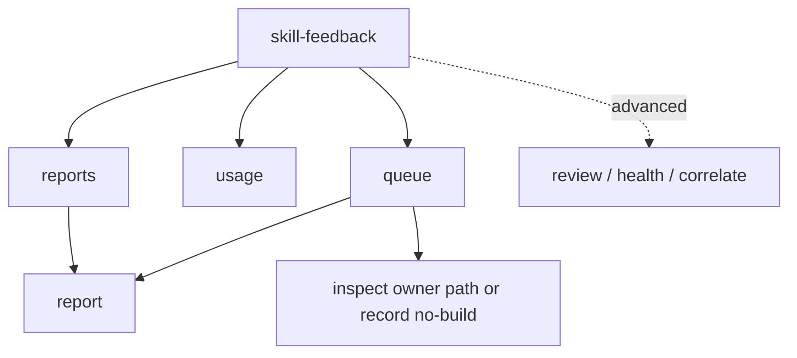

# Skill Feedback Human Skill Dashboard MVP - Plan

## Goal Capsule

- **Objective:** Build a human skill dashboard over the existing Software Learning Report inbox: readable reports, report detail, skill usage, and an improvement queue.
- **Product authority:** The 2026-07-01 MVP ideation artifact, `skills/skill-feedback/TASKS.md`, `skills/skill-feedback/CONTEXT.md`, and `skills/skill-feedback/references/report-shape.md` define the product vocabulary and source boundaries.
- **Open blockers:** No product blockers. Implementation is gated on the CLI authoring contract path because this changes public command surfaces.

---

## Product Contract

### Summary

This MVP turns `skill-feedback` from an internal diagnostics tool into a human skill dashboard.
It adds four dashboard drill-downs, `reports`, `report <id>`, `usage`, and `queue`, then rewrites the default dashboard so the first command teaches those paths before any correlation or purge workflow.

### Problem Frame

`skill-feedback` already captures hundreds of repo-local Software Learning Reports, but humans do not yet have a dashboard for the skill system.
The current front door shows health and correlation repair state first, which is operationally coherent but product-wrong for someone asking which skills ran, what happened, what hurts, and what to improve next.

A read-only check on 2026-07-02 showed `primary=255`, `low-signal=552`, `unlinked=255`, and `next_action=preview-correlation-repair`.
That state proves the inbox has enough evidence to summarize and also proves the default path is aimed at trust machinery rather than human-visible value.

### Key Decisions

- **Reports before repair.** The MVP prioritizes direct report access and improvement signals; correlation repair remains available behind explicit diagnostic commands.
- **Human skill dashboard owns the product decision.** The default `skill-feedback` command should help a maintainer browse reports, inspect usage, and choose improvement work before repair diagnostics.
- **Task-specific commands over a larger review output.** `reports`, `report <id>`, `usage`, and `queue` each answer one human question instead of making `review --plain` carry every use case.
- **Report refs are navigation.** `report:<id>` becomes something a human can open through the CLI, not a JSON lookup ritual or a filename hint.
- **Usage ranks skills only.** Owner-path ranking belongs in the improvement queue so `usage` stays a skill portfolio view.
- **Queue recommends action, not edits.** The improvement queue points to reports, owner paths, and next safe actions; it does not auto-edit skills from evidence.
- **Queue derives from the review ledger first.** The MVP uses existing review ledger evidence before introducing any standalone report-scoring model.
- **Queue groups by owner path first.** Skill rows are fallback rows when the evidence lacks a strong owner path.
- **Queue defaults to stronger evidence.** Weak or sparse evidence stays out of the default queue and appears only through explicit opt-in.
- **Human commands default to plain text.** `reports`, `report`, `usage`, and `queue` default to bounded plain output and keep JSON available for scripts and agents.
- **Dashboard stays plain-only.** `health` remains the machine-readable path for dashboard health facts.
- **Do not fork front-door guidance.** Skill and CLI front-door mechanics stay in `skill-author` and `cli-author`; this plan only names the `skill-feedback` behavior and proof obligations.

### Actors

- A1. Human maintainer: asks what happened, which skills are used, and what deserves improvement next.
- A2. Repair or planning agent: uses human-readable evidence refs and queue rows to inspect source before proposing changes.
- A3. `skill-feedback` CLI: reads the repo-local inbox and renders bounded, mutation-free observability views.

### Human Value Flow



### Product Outcome Sketch

Not CLI help. Not a copied output contract. Use only as a product-facing sketch
of what the first screen should let a maintainer do. For the populated no-arg
dashboard, follow the `skill-author` numbered-router shape by orienting with
`Dashboard paths`, then showing numbered next actions for the current dashboard
station. Do not render the conversational skill-prose escape hatch literally in
CLI output; use command help for non-listed paths.

```text
Skill Feedback

Reports: primary=264 low-signal=586 invalid=0 skipped=0
Newest: primary=2026-07-01T21:26:36Z low-signal=2026-07-01T21:26:46Z
Signal: 264 readable primary reports; low-signal separated; correlation diagnostics available in advanced commands.

Dashboard paths:
- Reports -> browse recent Software Learning Reports and open one detail view.
- Usage -> compare skills by count, outcome, friction, and last seen time.
- Queue -> inspect evidence-backed skill or owner-path improvement candidates.
- Diagnostics -> inspect health, review, correlation, or purge workflows.

Next Safe Actions:
1. **Browse recent reports** - `skill-feedback reports`.
2. Open latest report - `skill-feedback report report:<recent-id>`.
3. Review skill usage - `skill-feedback usage`.
4. Inspect improvement queue - `skill-feedback queue`.
5. Advanced diagnostics - `skill-feedback health` or `skill-feedback review`.

Recent:
  2026-07-01T21:26Z  skill-feedback  confirmed  light     report:<recent-id>
  2026-07-01T21:18Z  fallow          ambiguous  moderate  report:<recent-id>
  2026-07-01T20:55Z  grill-with-docs confirmed  none      report:<recent-id>

Advanced:
  skill-feedback review
  skill-feedback health
  skill-feedback correlate --plain
  skill-feedback purge --help
```

### Requirements

**Default Dashboard**

- R1. The zero-arg `skill-feedback` command renders a human launch surface, not a diagnostics-first repair queue.
- R2. The dashboard shows inbox counts, newest report age or timestamp, and a short signal summary that helps a human choose a next command.
- R3. The dashboard leads to `reports`, `usage`, `queue`, and one concrete `report <id>` drill-down when a recent report id is available.
- R4. The dashboard keeps `review`, `health`, `correlate`, and `purge` available as advanced or diagnostic commands without making them the primary next action.
- R5. The dashboard does not make correlation repair the default recommendation when readable reports and human summaries are available.

**Report List**

- R6. `skill-feedback reports` lists recent reports in a readable table or table-like plain output.
- R7. Each report row shows generated time, skill, outcome, one-line goal, lane, source, and `report:<id>`.
- R8. The report list defaults to recent primary reports and makes low-signal inclusion visible when included.
- R9. The report list supports bounded filtering by skill, lane, source, and limit without requiring schema knowledge.
- R10. The report list avoids filenames and unsafe paths in default plain output.

**Report Detail**

- R11. `skill-feedback report <id>` resolves `report:<id>` as a report id, not as a filename.
- R12. Report detail shows goal, friction, verification burden, touched surfaces, observations, evidence gaps, source, lane, and generated time in readable plain text.
- R13. Report detail distinguishes missing report-card fields from parser failure with a human-readable empty-state line.
- R14. Report detail keeps JSON output available for scripts while plain text is the human default.
- R15. Report detail opens primary reports by default and requires explicit low-signal lane opt-in for low-signal-only refs.
- R15a. Report detail gives clear errors for unknown, duplicate, invalid, unsafe, or low-signal-only report refs without the opt-in.

**Usage**

- R16. `skill-feedback usage` answers which skills are being used and how they are going.
- R17. Usage ranks skills, not owner paths, by report count, outcome mix, closeout or capture coverage, last seen time, and low-signal volume.
- R18. Usage shows common friction and common verification burden per ranked skill when the evidence supports it.
- R19. Usage separates primary reports from low-signal capture so unknown-skill or runtime noise cannot distort the main ranking.
- R20. Usage includes enough report refs for a human to inspect why a skill is ranked without dumping the full report set.

**Improvement Queue**

- R21. `skill-feedback queue` answers what should be improved next.
- R22. Queue rows rank owner-path candidates first from existing review ledger evidence: repeated friction, high verification burden, evidence gaps, repeated observations, and review-surfaced owner signals.
- R22a. Queue uses skill rows only when supporting reports lack a strong owner path.
- R23. Each queue row shows target, reason, evidence strength, supporting `report:<id>` refs, and one next safe action.
- R24. Queue defaults to strong or repeated evidence and excludes weak or sparse evidence unless explicitly included.
- R24a. When weak or sparse evidence is explicitly included, queue labels it weak instead of implying certainty from one noisy report.
- R25. Queue supports narrowing by skill or owner path without changing the underlying evidence stance.
- R26. Queue can recommend no-build when reports do not justify a skill or owner-doc change.

**Cross-Command Behavior**

- R27. All MVP commands are read-only.
- R28. `reports`, `report`, `usage`, and `queue` default to bounded plain output and support JSON output for scripts and agents.
- R28a. Plain output is bounded enough for humans and agents to scan without losing a path to full JSON where JSON exists.
- R28b. `skill-feedback` and `skill-feedback dashboard` remain plain-only; machine-readable health facts stay behind `skill-feedback health`.
- R29. Commands preserve the existing evidence stance: reports are untrusted evidence until source owners confirm them.
- R30. Commands use `report:<id>` refs consistently across list, detail, usage, queue, and review output.
- R31. Commands expose lane and source context wherever a human might otherwise over-trust low-signal or unlinked reports.
- R32. New command help describes the human question each command answers before mentioning internal diagnostics.
- R33. Front-door mechanics are not re-specified in this plan; implementation follows the owning skill-author and cli-author guidance.
- R34. The populated no-arg dashboard uses `Dashboard paths` plus numbered next actions as product orientation; exact interaction, help, and rendering stay in the CLI owners.
- R35. The dashboard does not copy the conversational skill-prose line `Reply with a number, or say what outcome you want.`; CLI output points humans to concrete commands and help.

### Key Flows

- F1. Dashboard launch
  - **Trigger:** A human runs `skill-feedback` with no args.
  - **Actors:** A1, A3
  - **Steps:** The dashboard shows counts, recent evidence, and human commands. The human chooses report browsing, usage, or queue.
  - **Outcome:** The first screen points to useful report value, not correlation repair.

- F2. Report browsing
  - **Trigger:** A human runs `skill-feedback reports`.
  - **Actors:** A1, A3
  - **Steps:** The command lists bounded recent reports with `report:<id>` refs. The human opens one ref with `skill-feedback report <id>`.
  - **Outcome:** The human can inspect actual report evidence without `jq`, filenames, or schema knowledge.

- F3. Usage review
  - **Trigger:** A human asks which skills are being used.
  - **Actors:** A1, A3
  - **Steps:** `usage` ranks skills and shows count, outcome mix, last seen, lane context, and common friction.
  - **Outcome:** The human sees the skill portfolio and can inspect supporting report refs.

- F4. Improvement queue
  - **Trigger:** A human asks what to improve next.
  - **Actors:** A1, A2, A3
  - **Steps:** `queue` ranks owner-path candidates with reasons and refs, falling back to skill rows when no strong owner path exists. The human or agent opens reports and inspects owner paths before editing or recording no-build.
  - **Outcome:** Evidence becomes a prioritized review path without auto-mutating skill source.

### Acceptance Examples

- AE1. Given the inbox has primary and low-signal reports, when a human runs `skill-feedback`, then the dashboard shows report-oriented commands before any correlation repair action.
- AE2. Given the current inbox has unlinked primary reports, when the dashboard renders, then correlation status is available but does not replace `reports`, `usage`, or `queue` as the main path.
- AE3. Given recent primary reports exist, when `reports` runs, then each visible row includes a generated time, skill, outcome, one-line goal, lane, source, and `report:<id>`.
- AE4. Given a visible `report:<id>`, when `report <id>` runs, then the output shows goal, friction, verification burden, touched surfaces, observations, and evidence gaps without exposing the report filename.
- AE5. Given a report lacks a recorded friction note, when `report <id>` renders, then the output says the field was not recorded instead of failing or inventing a value.
- AE6. Given low-signal reports dominate the inbox, when `usage` ranks skills, then primary report counts and low-signal counts are separate.
- AE6a. Given a `report:<id>` exists only in the low-signal lane, when `report <id>` runs without low-signal opt-in, then the command names the low-signal lane and points to the explicit opt-in path instead of rendering the report as primary evidence.
- AE7. Given multiple reports name the same owner path with repeated friction, when `queue` runs, then that owner path appears with supporting report refs and one next safe action.
- AE8. Given one noisy report names an owner path, when `queue` runs by default, then the row is omitted unless other evidence justifies promotion.
- AE8a. Given weak evidence is explicitly included, when `queue` renders a weak row, then the row is labeled weak and does not imply an edit is justified.
- AE9. Given a user wants full machine-readable evidence, when a command supports JSON, then plain output points to JSON without making JSON required for the human path.
- AE10. Given a command is read-only, when it runs against the inbox, then it does not create correlation witnesses, purge reports, or write report files.

### Success Criteria

- A fresh human can run `skill-feedback` and find reports, usage, and queue views from the first screen.
- A human can open at least one actual report by `report:<id>` without reading JSON or filenames.
- A maintainer can answer which skills are used most, which are noisy, and which have recent friction.
- A repair agent can start from a queue row, inspect report refs, inspect owner paths, and avoid editing when evidence is weak.
- Internal trust, correlation, and retention work no longer dominate the default human path.

### Scope Boundaries

#### Deferred For Later

- Correlation witness repair UX beyond keeping diagnostics available behind explicit commands.
- Purge plain-output parity and retention workflow polish.
- Rich web UI, weekly digest, charts, or external publication.
- Auto-editing skills, docs, or prompts from report evidence.
- Codex Trusted skill identity resolution.

#### Outside This MVP's Identity

- A larger `review --plain` that mixes every dashboard, report, usage, queue, health, and correlation concern.
- Treating raw report prose as source truth.
- Hiding low-signal, unlinked, invalid, or evidence-only state to make summaries look cleaner.
- Using report filenames, private proof fields, or correlation artifacts as the human navigation model.

### Dependencies / Assumptions

- Existing normalized report data contains enough goal, friction, verification burden, touched surface, observation, outcome, source, lane, and timestamp fields to power the MVP.
- Missing fields render as missing evidence, not errors.
- `report:<id>` resolution uses safe inbox data and review-unit report ids before any raw file scan.
- `report <id>` detail resolves primary-lane reports by default; low-signal-only detail requires an explicit low-signal lane opt-in.
- Usage rankings are skill-only; owner-path ranking belongs in the improvement queue.
- Queue candidates derive from the existing review ledger first; a standalone report-scoring model is deferred unless ledger evidence cannot answer the queue question.
- Queue groups by owner path first; skill-only rows appear only when evidence lacks a strong owner path.
- Queue defaults to strong or repeated evidence; weak or sparse evidence requires explicit opt-in.
- `reports`, `report`, `usage`, and `queue` default to plain output and support JSON output.
- `dashboard` remains plain-only; `health` remains the machine-readable path for dashboard health facts.
- Exact flag names, output caps, and parser contract details are implementation planning decisions under the CLI authoring path.

### Owner Boundary

- Product surface owner: this plan and `skills/skill-feedback/TASKS.md`.
- Skill no-args shape owner: `skills/skill-author/references/skill-body-shape-gate.md`.
- Skill dashboard orientation owner: `skills/skill-author/references/numbered-router-helper.md`.
- Skill runtime portability owner: `skills/skill-author/references/runtime-portability.md`.
- Skill route owner: `skills/skill-feedback/SKILL.md`.
- CLI design owner: `skills/cli-author/SKILL.md` and its front-door references.
- Runtime contract owner: `skills/skill-feedback/src/command-contract.ts`.
- Rendering owner: `skills/skill-feedback/src/skill-feedback-runner.ts`.
- Proof owner: command-contract tests, Branch Station catalog tests, and process-boundary integration tests.

Implementation consequence:

- Keep `skill-feedback` as one existing facade-backed CLI unless the owner
  guidance gives a stronger reason to split it.
- Put exact help, parser rules, output caps, command metadata, result contracts,
  and dashboard rendering in code and tests.
- Drive new command branches TDD-first: add the failing Branch Station catalog
  test or process-boundary scenario row before adding the matching branch.
- Update `skills/skill-feedback/SKILL.md` after the command surface lands so
  the skill route, branch loading, frontmatter description, and safety notes
  teach `reports`, `report`, `usage`, and `queue`; follow the skill-author
  runbook, no-args shape gate, and numbered-router helper before editing that
  `SKILL.md`.
- Keep this plan at the level of user outcome, command inventory, evidence
  stance, and acceptance examples.
- Use `Dashboard paths` and numbered next actions as dashboard orientation, not as a
  replacement for command discovery, rendered help, or Station Map evidence.
- Use the numbered-router helper as shape guidance only. Do not make the CLI
  claim it can accept arbitrary free-form requests unless a command contract
  implements that input.

### Sources

- `docs/ideation/2026-07-01-skill-feedback-mvp-ideation.html`
- `skills/skill-feedback/TASKS.md`
- `skills/skill-feedback/CONTEXT.md`
- `skills/skill-feedback/ARCHITECTURE.md`
- `skills/skill-feedback/references/report-shape.md`
- `skills/skill-author/references/numbered-router-helper.md`
- `skills/skill-author/references/runtime-portability.md`
- `skills/cli-author/SKILL.md`
- `skills/cli-author/references/agent-native-cli-design.md`
- `skills/cli-author/references/cli-front-door-layouts.md`
- `skills/cli-author/references/cli-command-facade.md`
- Live read-only command output from `bun run skills/skill-feedback/src/skill-feedback-runner.ts`, `health --plain`, and `review --plain` on 2026-07-02.
